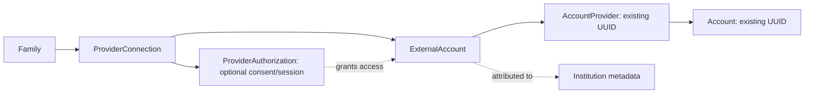
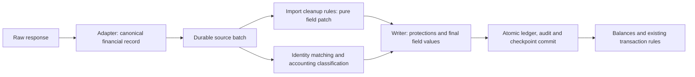

# Account data sources and import cleanup rules

Status: architectural refinement of [the provider proposal](bank-data-providers.md).
This document specifies shared authorization topology and a rules hook. The
authorization schema and source-neutral contracts are now written but unverified;
the hook/UI remains proposed. The canonical generator is `provider:account_data`,
the adapter contract is `Provider::AccountData`, and financial values use
`Ingestion::Record`. Former `bank_data` names remain compatibility aliases.
The [multiple-source and document refinement](multi-source-ingestion.md) extends
the shared ingestion stage to overlapping feeds and uploaded statements.

## One abstraction for institutions and aggregators

Use an **account data source**: an integration that supplies external accounts and
financial records. A direct institution, an aggregator, a brokerage and a wallet
integration all implement the same capability contract. Their authentication and
coverage differ; their records enter the same application pipeline.

The proposed persistence names are `ProviderConnection` and `ExternalAccount`.
`Provider::AccountData` is the recommended neutral name for the adapter contract.
Keep price, exchange-rate, property and LLM concepts in their existing registries.
Changing the contract name does not require changing historical `entries.source`,
external IDs or pending metadata namespaces.

| Integration in this repository | Access context | Institution/authorization topology |
| --- | --- | --- |
| Direct institution, e.g. Up | A family supplies an access token. | Account inventory normally belongs to that institution; no synthetic consent entity is required. |
| SimpleFIN | One family access URL can cover several institutions. | Institution metadata is on `SimplefinAccount#org_data`. An institution failure does not invalidate the bridge credential or every other institution. |
| Lunch Flow | One family API key can cover several institutions. | Institution metadata and the downstream `provider` are account-level. That downstream value is distinct from the integration key `lunchflow`. |
| Enable Banking | Application credentials plus separately authorized ASPSP sessions. | The current create-another-connection flow copies application credentials into another item. Model independently renewable sessions separately from shared credentials. |

Evidence: [SimpleFIN account snapshots](../../app/models/simplefin_account.rb),
[SimpleFIN partial failures](../../app/models/simplefin_item/importer.rb),
[Lunch Flow snapshots](../../app/models/lunchflow_account.rb),
[Enable Banking sessions](../../app/models/enable_banking_item.rb) and its
[authorization controller](../../app/controllers/enable_banking_items_controller.rb).

A connection owns the configured integration relationship and references the
appropriate family or installation credential owner. An optional
`ProviderAuthorization` owns an independently renewable/revocable grant, its
encrypted session credentials, expiry, state and upstream identifiers. Connection
credentials and grant credentials have different lifecycles.

An external account belongs to the connection, not to the lifetime of a consent.
Authorization membership may overlap: use an explicit membership relation when a
source exposes the same account through successive/overlapping grants. Retiring
one grant cannot delete the account, its other grants or its financial history.
Preserve stable account identity and aliases when renewal changes upstream IDs.

Do not invent authorization rows for opaque SimpleFIN/Lunch Flow consent that Sure
cannot manage independently. Account/institution health can still represent their
partial failures. Nor is a global institution directory necessary: keep scoped
upstream identifiers and display metadata, and never merge accounts or institutions
by display name. The same institution reached directly and through an aggregator
has separate source identities until an authorized account link joins them.

This requires more than changing names:

- Separate credential health, consent health and account/stream health. A bank's
  expired authorization inside an aggregator must not stop healthy siblings.
- Scope checkpoints, inventory completeness and removals to the actual connection,
  grant or account/stream/window. One bank's successful empty response cannot clear
  another bank's accounts. A missing grant/institution is not proof of deletion.
- Use a stable identity namespace where upstream IDs are only unique within a
  partition. Keep that namespace across session renewal; it is not a rotating token.
- Keep shared credential rotation serialized across every consumer of the credential
  owner, even when individual connection/authorization syncs have separate leases.

For migration, first preserve one legacy item per connection and its exact IDs/state.
An Enable Banking item can acquire a mapped authorization without merging anything.
Consolidating duplicated credential owners or connections is a later operation,
with explicit account/checkpoint mappings and rollback. Do not deduplicate by secret
equality or silently change identity namespaces during the initial table transfer.

## A shared import cleanup stage

There are two kinds of normalization. The integration implements mandatory API
interpretation: IDs, monetary units/signs, currencies, dates and pending semantics.
Family rules express preferences such as trimming descriptions or recognizing a
merchant label. Put that preference hook in shared ingestion, once for all sources.

The hook receives an immutable canonical record, a pinned ruleset and verified
context: family, target account, origin kind and institution attribution where
known. Provider observations additionally carry integration key, connection,
external account, optional authorization and downstream-source identifiers;
document observations carry import/statement and extraction provenance. Absent
provider fields stay absent for documents. It returns a
validated field patch and the applied rule/revision trace. It does not perform
HTTP, query arbitrary accounts, save records, enqueue jobs or send notifications.

The writer performs matching and accounting classification against the original
canonical values, then applies eligible cleanup fields within the same transaction
as ledger changes and checkpoint advancement or document publication. It must expose the import disposition
and protection decisions; applying a patch blindly to whatever Entry is returned by
`import_transaction` would bypass its early returns for protected entries.

Even renaming needs this separation. The current
[import adapter](../../app/models/account/provider_import_adapter.rb) uses names for
investment activity classification and fuzzy matching. A user stripping `TRANSFER`
from a description must not turn an internal movement into an expense. Matching
must retain canonical descriptions for both incoming records and stored candidates;
persist the necessary source baseline/provenance rather than using previously
cleaned display text as financial evidence. Keep that minimal baseline when raw
payload retention expires.

Start with structured, bounded operations over presentation fields: trim/collapse
whitespace, remove a literal prefix/suffix, replace text, set a display description
or normalize a merchant label/memo. More complex pattern operations need defined
semantics and execution limits. Keep categorization, tags and notifications in the
existing transaction-rule stage initially; additional typed hints can be introduced
without allowing arbitrary writes to the canonical record.

Initial cleanup rules cannot edit connection/account identity, `source`, external
IDs, amount, currency, posting/effective dates, pending/link IDs or FX evidence.
Activity ledger representation, quantities, prices, atomic financial groups and
source-position component membership also remain immutable at this hook.
They cannot delete/drop records, pair transfers or change transaction kinds. Those
operations affect accounting/reconciliation and need their own explicit contracts.
After transformation, validate the patch again; preserve all user locks, exclusions
and import protections, including the existing narrow pending-settlement exceptions.

## Reuse the rule product, with a different execution target

Use the existing `Rule`, `Rule::Condition` and `Rule::Action` authoring model with a
new resource type, for example `import_transaction`, displayed as **Import cleanup**.
Keep `transaction` as the existing saved-transaction rule type. Avoid an independent
rules subsystem and avoid STI; the registry chooses the target and allowed operations.

Existing execution cannot simply be called earlier:

- [`Rule#apply`](../../app/models/rule.rb) computes a persisted matching scope.
- [`TransactionResource`](../../app/models/rule/registry/transaction_resource.rb)
  begins with `family.transactions` and SQL joins/conditions.
- [Condition filters](../../app/models/rule/condition_filter.rb) construct SQL;
  [executors](../../app/models/rule/action_executor.rb) mutate ActiveRecord objects.
- [`Enrichable`](../../app/models/concerns/enrichable.rb) saves immediately; other
  actions can enqueue AI/email work or create counterpart transfers.

Add a registry/evaluator for canonical records and patches. Reuse condition/action
descriptors and form components where semantics agree, but implement in-memory
predicates and pure transformations. Define case, whitespace and null behavior
explicitly and test parity where operations share names with SQL filters.
Provider-specific payload keys should be normalized into documented context fields,
not exposed as arbitrary JSON paths or executable user Ruby.

Before enabling the type, update the registry, per-type condition/action validation,
UI/API accepted resource types, import/export and every automatic/manual dispatcher.
[`Family::Syncer`](../../app/models/family/syncer.rb) currently schedules all active
rules; [`ApplyAllRulesJob`](../../app/jobs/apply_all_rules_job.rb) iterates all rules
and overrides locks. Neither may execute import cleanup rules. Existing rule
behavior stays on its current path; import cleanup always honors locks.

The current scalar `Rule::Action#value` is enough for a fixed replacement but not a
structured transform. Add validated action configuration for pattern/replacement
parameters without changing existing action values. Add explicit rule priority and
action position; permit repeated transform types only in this new registry. Keep
the existing duplicate-action restriction for ordinary rules.

## Determinism, provenance and editing

Compile a family-scoped ruleset once for a logical batch chain. Pin immutable rule
revisions, evaluator version and ordered actions to that chain. Evaluate rules in
priority/UUID order and actions in position/UUID order. Within one evaluation,
later cleanup rules see the current working presentation values; original source
values/context remain separately accessible and immutable.

Retries always begin with the original canonical input and the same pinned ruleset,
never with the previously cleaned output or the latest edited rule. Keep a unique
application identity based on batch, record and ruleset revision. A rule edit applies
to later imports, including refreshed records in an overlap window; it must not
change the middle of an in-flight page chain.

Record baseline/output references, rule revisions and applied/blocked field reasons
with the batch/entry provenance. Reuse `source: "rule"` for enrichment where suitable,
with ingestion stage and revision metadata; source names alone do not implement
precedence. Ordinary transaction rules may subsequently override unlocked display
fields. Account user protections still take precedence. Validate this ordering in
the writer rather than assuming the existing enrichment concern enforces it.

[`RuleRun`](../../app/models/rule_run.rb) can supply the reporting UI, but its current
counts and mutable rule reference are insufficient for replay. Add an ingestion
execution kind and durable revision/application details that survive rule deletion
(current rule deletion cascades to runs). Detailed before/after data is sensitive;
retain it under account authorization and protected storage, with only sanitized
counts/errors in ordinary diagnostics.

A failed rule or invalid patch stops/quarantines that batch without advancing its
checkpoint or publishing the document. Independent healthy streams can continue. Rule failure or a display
filter never establishes source absence and must not authorize account/holding
pruning. Recovery retries the captured input, not another uncontrolled API fetch.

## UI behavior and delivery sequence

In the Rules UI, **Import cleanup** should offer origin/integration/institution/account
conditions, structured transforms, explicit order and a preview showing original
value, proposed value, matched rules and fields blocked by protections. Enabling a
rule affects subsequent imports; historical reprocessing is a separate bounded
preview/apply operation using retained canonical inputs. Do not reconstruct lost
source data from already cleaned descriptions or overwrite protected history.

Preview, authoring and publication must authorize the targeted accounts and
connections or documents where applicable,
not only the family. The current [controller](../../app/controllers/rules_controller.rb)
uses family scoping, while account filter choices alone are not execution access
control. Define a durable owner/family-admin execution grant for background rules
and recheck revoked access. Preview must not expose another member's private accounts.

Implement incrementally:

1. Add the source/authorization topology and typed fetch context to the shared
   architecture; retain the existing one-item-per-connection migration boundaries.
2. Build pure rule evaluation, immutable revisions and preview against sanitized
   recorded canonical inputs, without enabling ledger writes.
3. Integrate patches and provenance into the shared writer, preserving canonical
   matching/classification and all existing protection decisions. Activate only
   after retry, partial-error, cross-family and financial-parity tests pass.
4. Add the UI type and scoped activation. Keep API changes covered by Minitest and
   documentation-only rswag, and use the existing design system for UI work.
5. Add explicitly requested historical reprocessing and richer transforms after
   retained-input and provenance guarantees exist.

The generator remains small: definition, client, adapter and tests/documentation.
Its public namespace is `provider:account_data`, with the existing entry points
as compatibility aliases. Do not generate one
rule hook, rule controller or transformation engine per integration. The shared
runtime owns the hook; integration tests prove records/context conform to it.
