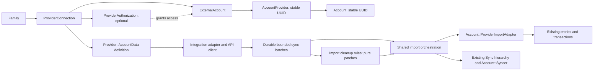

# Account data providers: architecture and incremental migration

Status: runtime implementation in progress. The generator, contracts, additive
schema, shadow copier and first sync engine are implemented but not yet executed
in a Ruby/database environment. No existing provider has been switched to new
tables. See the [implementation status](provider-implementation-status.md) for
completed code and remaining provider/runtime/migration acceptance work.

The [source topology and import cleanup refinement](account-data-and-import-rules.md)
extends this design to explicit aggregator authorizations and UI-managed import
rules. Target persistence now uses `ProviderConnection` / `ExternalAccount` names.
The [multiple-source and statement refinement](multi-source-ingestion.md) adds
explicit source authority, evidence identities and source-neutral ingestion batches.
The canonical generator/classes now use `provider:account_data` and
`Provider::AccountData`; the previous names remain compatibility aliases.

The objective is to make a new integration an upstream client, a small declaration
and a normalization adapter. Adding another source must not require another pair of
database tables, another copy of the sync engine, or edits throughout family and
account presentation. Existing connections must move without reconnecting or
recreating financial history.

## Diagnosis grounded in the current implementation

The repository has useful boundaries worth retaining: `AccountProvider` separates
a financial account from a provider account; `Account::ProviderImportAdapter`
centralizes transaction reconciliation and protection; `Sync` tracks a hierarchy;
and provider clients isolate external APIs. The debt comes from repeated lifecycle
and persistence implementations surrounding those boundaries.

| Existing surface | Cost of another integration | Architectural consequence |
| --- | --- | --- |
| [`provider:family`](../../lib/generators/provider/family/family_generator.rb) and [`provider:global`](../../lib/generators/provider/global/global_generator.rb) | The former scaffold creates item/account tables, models, import/processing/sync classes, jobs, controllers and views, then patches shared files. | A generator reproduces a subsystem instead of extending an interface. The replacement generates integration-owned files only. |
| [`Family`](../../app/models/family.rb) and its `*Connectable` concerns | Every provider adds an association and availability/lifecycle behavior. | Replace these with one connection association and provider declarations. |
| [`Provider::Factory`](../../app/models/provider/factory.rb), [`Provider::Base`](../../app/models/provider/base.rb), adapter classes | Class-name registration combines account wrapping, credentials/configuration and UI route construction. | Separate bank data definitions, API normalization and presentation; retain a compatibility facade during migration. |
| [`Provider::Registry`](../../app/models/provider/registry.rb) | This registry implements exchange-rate, security, LLM and property concepts, not bank connection lifecycle. | Keep these concepts separate. A bank registry must not merge unrelated providers into one universal interface. |
| [`Account::Linkable`](../../app/models/account/linkable.rb), [`Account`](../../app/models/account.rb) | Both polymorphic links and legacy Plaid/SimpleFIN foreign keys remain live; several account constructors and balance paths know provider classes. | Migrate the linkage boundary before removing legacy associations. Keep accounting behavior in the existing domain. |
| [`AccountsController`](../../app/controllers/accounts_controller.rb) | Provider-specific collections, eager loads and sync-stat maps accumulate. | One connection presenter, setup flow and lifecycle controller, with explicit authentication extensions. |
| [`Family::Syncer`](../../app/models/family/syncer.rb), [`Sync`](../../app/models/sync.rb) | Reflection discovers associations ending in `_items`; it would miss `provider_connections`. | Introduce explicit migration-aware traversal rather than relying on another naming convention. |
| [`Account::ProviderImportAdapter`](../../app/models/account/provider_import_adapter.rb) | Already owns identity, user protections, pending settlement, merchant enrichment and goal reconciliation. | Initially reuse it unchanged behind the new adapter contract; do not rewrite financial semantics at the same time as storage. |
| [`SyncCleanerJob`](../../app/jobs/sync_cleaner_job.rb), [`Family::FinancialDataReset`](../../app/models/family/financial_data_reset.rb) | Hard-coded provider model/association lists can lag new integrations. | Shared lifecycle, retention and recovery queries should operate on shared tables. |

The [provider migration matrix](bank-data-provider-migration-matrix.md) inventories
every current connection family, including brokerages and crypto integrations.
They share the connection problem even though they require additional capabilities.
The delivery supplies value shapes for accounts, transactions, holdings and
activities. An investment provider cannot cut over until its security identity,
trade classification, historical-balance semantics and shared writers also exist
and pass parity tests.

## Target boundaries

Use ordinary ActiveRecord models, concerns and nested POROs under `app/models/`.
Do not introduce a service framework, a plugin execution environment, STI per
provider, or a universal schemaless provider row. Relational fields carry identity,
tenancy, relationships and operational state. Versioned JSON carries genuine
provider-specific settings and metadata. Raw responses live separately from the
small rows used by application screens.

A connection represents configured source access and can span many institutions.
External accounts carry institution attribution. Optional authorization children
represent independently renewable consents; accounts survive their replacement.
Keep connection, authorization and account/stream health distinct. The
[refinement](account-data-and-import-rules.md) defines the source-specific mappings
and the shared import cleanup stage without adding per-provider orchestration.

An institution may be available through many integrations, and separate external
accounts may link to the same financial Account. This topology alone does not
deduplicate overlapping feeds or choose authoritative balances. Introduce one
explicit automated provider writer per account/resource initially, with secondary observations and
versioned source handover. Keep current reconciliation behavior during the storage
migration; broader concurrent posting is gated on the shared evidence/matching
work in the [multiple-source refinement](multi-source-ingestion.md).

PDF extraction joins the same canonical ingestion and protected writer after
validation and account authorization. It retains its document review/publication
lifecycle and needs no synthetic provider connection. The neutral value contract
is `Ingestion::Record`; `Provider::BankData::Record` and `Provider::AccountData::Record`
are compatibility aliases. LLM identity belongs to extraction provenance, while the
statement and its issuer identify the financial evidence source.
Authorized document publication may add reviewed missing entries or evidence on
manual or linked accounts without acquiring automated provider authority.

`Provider::AccountData::Definition` describes a stable provider key, credential fields,
configuration scope and supported capabilities. The key is allowlisted and never
constantized from a request. Build a reload-safe registry from explicit definition
files, validate duplicate keys at boot, and keep authentication secrets out of the
declaration. The local registry discovers adapter declarations and honors their
readiness gate. Operational cutover still requires the migration/lifecycle gates;
discovery does not switch existing connections.

`Provider::AccountData::Adapter` translates provider requests and responses into typed
`Record` values and `Page` results. It owns endpoint selection, authentication,
pagination, signs, monetary units, time zones and upstream error interpretation.
It receives credentials and context explicitly. It does not create `Account`, mutate
entries, render views, enqueue application jobs, or decide tenancy. API clients
remain provider-specific and may reuse established SDKs.

Account discovery and transaction pages are separate operations. Capabilities must
be honest: account transactions, investments, webhooks, reauthorization, remote
revocation, refresh requests and historical balances are not universally supported.
Do not generate working-looking empty success responses for unimplemented methods.
The generated adapter must require the implementer to fill them in.

The shared orchestrator owns checkpointing, leases, retries, batch application,
account linking, removal policy and sync statistics. An integration-specific
normalizer should be testable with fixture payloads without a database or network.
The orchestrator should be tested against fake adapters rather than provider SDKs.

Checkpoint scope is an explicit part of that boundary. Ordinary account pages
commit with their own ledger batch. A connection-wide transaction or activity log stages a
complete `ProviderSyncGeneration` before any financial writes, then publishes
bounded account children and promotes its single cursor after all children commit.
The [change-set protocol](connection-change-sets.md) preserves original cursors
through pagination mutations, child failures and resumed jobs. Resume behavior
is declared per protocol: Plaid restarts an incomplete transaction prefix, while
Trade Republic can continue its retained activity prefix within the same Sync.

Use a presentation object for names, connection status, institution summaries and
actions. Generic views use existing `DS::*` components and translations. Provider
authentication that needs OAuth, an embedded bank selector, consent renewal or a
multi-step login supplies a narrowly scoped handler/partial. This is an explicit
extension point, not a second copy of account management.

## Shared relational schema

These are design requirements for additive migrations, not tables shipped by the
generator. Use UUID primary keys, timestamps, real foreign keys, database uniqueness
constraints and the current Rails migration version. Add and validate constraints in
stages; use concurrent indexes where necessary on large existing PostgreSQL tables.

| Table | Required identity and state | Constraints and rationale |
| --- | --- | --- |
| `provider_connections` | `family_id`, `provider_key`, provider/environment/region identity, nullable upstream connection ID, display name, lifecycle state, encrypted connection credentials/reference to credential owner, versioned settings, timestamps | A connection belongs to exactly one family and may span multiple institutions. Keep provider key immutable. Do not require upstream connection IDs from token-only providers. Preserve scheduled-deletion and connection credential health; independent consent expiry/health belongs to authorizations. |
| `provider_authorizations` | Connection/family FKs, stable internal grant identity, optional upstream authorization ID, encrypted session credentials, institution attribution, consent expiry/state/version | Optional independently renewable/revocable access grants; no synthetic rows for opaque bridge consent. Composite FK ensures the same family as the connection. Retain stable grant references and history across session replacement. |
| `provider_authorization_accounts` | Authorization/account/connection/family references and membership state | Unique `(provider_authorization_id, external_account_id)`; composite FKs require both endpoints to belong to the same family and connection. Accounts may have overlapping grants and survive grant retirement. |
| `external_accounts` | `provider_connection_id`, `family_id`, `provider_key`, stable non-null `identity_namespace`, `external_id`, name/type/currency, optional current/available/cash/reserved balances and as-of date, institution metadata, lifecycle state, metadata version | Unique `(provider_connection_id, identity_namespace, external_id)`; use a fixed namespace when IDs are connection-wide. Identity is independent of rotating consent/session IDs. Composite FK `(provider_connection_id, family_id, provider_key)` references a matching unique connection tuple. Preserve decimal precision, null versus zero and unlinked discovered accounts. |
| existing `account_providers` | Add nullable `external_account_id`, `family_id`, `provider_key`; retain `id`, `account_id` and legacy polymorphic fields during coexistence | Unique `external_account_id` when present; unique `(account_id, provider_key)` preserves today's one-link-per-provider rule. Composite FKs to `accounts(id, family_id)` and `external_accounts(id, family_id, provider_key)` reject cross-family and mismatched-provider links. |
| `provider_sync_checkpoints` | `provider_connection_id`, optional authorization/account references, `stream`, non-null `scope_key`, encrypted opaque cursor/state, covered-through boundary, state version, lock version | Unique `(provider_connection_id, stream, scope_key)`. The canonical scope distinguishes connection, grant, account and source partition; nullable FKs alone cannot supply uniqueness. Validate all referenced ownership with composite FKs. |
| `provider_sync_generations` | Connection/family/sync, original and terminal encrypted cursors, captured account/policy/grant bindings, fetching/sealed/applied/abandoned status, bounded page/child counts | One unfinished generation per connection stream. Batches reference the same connection/family and immutable generation. Only an applied generation may supply the connection checkpoint; applied children survive retries. |
| `ingestion_batches` | Family, explicit origin kind, typed connection/sync or Import/AccountStatement references, optional authorization/external account, exact coverage, schema/extraction version, sequence/idempotency key, completeness, protected raw/canonical bounded data, pinned ruleset/source-policy revisions, application/review state | Origin constraints require provider context for syncs and import/document context for file ingestion; enforce tenant consistency. Unique batch identity per logical run; immutable captured input and revisions. Provider cursor state is committed with ledger changes; documents use publication state. Preserve tombstones, partial failures and cleanup provenance. |
| `account_source_policies` | Account/family, resource, authoritative AccountProvider, policy revision and handover state | One current automated provider authority per account/resource initially; selected link must belong to that account/family. Retain immutable revisions referenced by batches. Stale writers cannot post after handover; document publication remains a separately authorized bounded command, valid without a provider link. |
| `source_records` | Family, record kind, exactly one provider external-account or document-origin reference, stable source record key, optional initial provider target-account binding | Provider observations may precede account setup; document sources require a target account. Evidence FKs cannot reference an unbound observation. First publication binds through a current link and captured policy; the financial target then cannot change. Unique source/kind identity survives pending/posted aliases; never use amount/date/name as a unique event identity. |
| `entry_sources` | SourceRecord, Entry, family/account, posting/evidence role, applied revision and match decision | Many observations may reference one Entry; each transaction source record has at most one current Entry mapping. Composite constraints enforce the same family/account and verified binding. Retain mapping history for retarget/revert. Keep document identity separate from legacy provider `entries.external_id`. |
| `provider_migration_controls` | Legacy item type/id, nullable connection FK, state, `writer_epoch`, lease owner/expiry, copy version, high-water mark, audit results | Unique legacy item identity and unique connection when assigned. This row exists before copying starts, so old and new jobs can resolve the same migration and writer ownership. Persisted state is authoritative, not a worker environment variable. |
| `provider_migration_mappings` | Control FK, allowlisted legacy table/type and UUID, mapping role, one connection/authorization/external-account target FK, source version/checksum, copied/verified times | Unique `(legacy_type, legacy_id, role)` and unique target within its kind. Exactly one target FK must match its role. A legacy item split into connection and consent has an explicit mapping per role; source accounts still map once. Retain the inverse map for rollback. |

Do not add a global unique `(provider_key, external_id)` on external accounts: upstream
account IDs are not guaranteed to be global across credentials or tenants. Preserve
existing provider-specific duplicate-connection checks separately, with scoped,
non-reversible credential fingerprints if needed; never make encryption deterministic
merely to obtain a uniqueness key. If a webhook connection ID must be unique inside
an upstream application/region, enforce that particular namespace and report
ambiguous mappings instead of selecting an arbitrary family.

For providers whose source identity is composite (CoinStats wallets, Binance account
types, on-chain assets), the mapper must define an unambiguous reversible encoding
and retain the component fields. Preserve legacy rows with missing upstream IDs as
unresolved identities with their own durable mapping, rather than rejecting the
whole copy or inventing an upstream identifier. A nullable external ID is permitted
for those explicitly marked legacy rows; ordinary new discovered accounts require
a valid identity. Unresolved rows cannot start a new sync or be matched by display
name. Preserve any ingestion namespace embedded in historical entry/holding IDs,
especially the legacy on-chain account UUID, even if the new storage UUID differs.

### The AccountProvider migration trap

Today the database enforces unique `(account_id, provider_type)` and unique
`(provider_type, provider_id)`. Replacing every `provider_type` with `ExternalAccount`
would collide when an account is connected through multiple providers. It would
also invalidate code that filters by names such as `IbkrAccount`.

Prefer an additive direct `external_account_id` on the existing join row. Backfill
`provider_key` using an explicit mapping from legacy classes, add the new unique
index, and update adapters/scopes to consult the new link when its connection is
active. The old polymorphic reference remains on that same join row until rollback
is retired. Both pointers may be populated only when their migration mapping agrees.
Once compatible readers are deployed, make the old polymorphic columns nullable so
native connections can use only the new FK. Add checks that at least one link is
present and that legacy type/id are either both present or both absent. Replace the
old model validations as part of this additive change. Remove the polymorphic
columns only at contraction after all legacy readers are gone. Keep unique ownership
of an upstream account and a real FK to the new account table.

`AccountProvider` IDs must not change: [`Holding`](../../app/models/holding.rb) and
[`DebugLogEntry`](../../app/models/debug_log_entry.rb) refer to them. Account and entry
IDs must not change either. Preserve sharing, goals, transfers, categories, merchant
associations, attachments, user overrides and import protection without copying or
recreating those domain records.

Retain existing source strings independently of the new registry key. Plaid US/EU
remain `source: "plaid"`; a connection's region selects its credentials and endpoints.
Do not rewrite `entries.source`, `entries.external_id`, merchant source or enrichment
source as an incidental part of a table migration. Existing source namespaces are
reconciliation identity, not display labels.

### Credentials and payloads

Separate installation-wide configuration from connection credentials. A global
provider may need shared API credentials plus a family-scoped access token; the
choice is not one exclusive secret container. Reuse the application's encrypted
settings behavior for installation configuration and encrypt connection secrets
through ActiveRecord encryption. Preserve existing environment overrides explicitly.

Copy encrypted fields by reading through the legacy model and writing through the
new model's serializer/encryptor. Do not bulk-copy ciphertext into renamed fields
or merge it into plaintext JSON. Validate decryptability without emitting values.
Account for existing installations that lack encryption configuration: establish
the target encryption precondition before their credential migration rather than
silently downgrading security or claiming the connection has moved.

Copy all retained raw payloads and state, including unlinked account payloads and
incomplete activity imports. The per-provider mapping must enumerate every column
and classify it as relational, encrypted credentials, settings/metadata, checkpoint,
batch payload or intentionally retired. A new or unmapped source column blocks that
provider's cutover. Large transaction/holding arrays should be copied into bounded
batches with resumable ordinals; retain original provenance and a digest so a
partial copy cannot pass verification. Retention pruning starts only after the
rollback window and after required replay/history guarantees are documented.

## Sync execution and accounting invariants

1. Resolve one active writer for the connection from migration state. Claim a lease
   and a monotonically increasing fencing epoch in a short database transaction.
   Ordinary data fetches must not hold a database transaction across an upstream
   request. Single-use credential exchange is a separate serialized operation:
   preserve the existing Questrade/SnapTrade refresh lock through HTTP and successor
   token persistence until an equally safe credential-owner protocol is proven.
   A short-lived data-fetch fence alone does not serialize token consumption.
   A UI spinner timing out after five minutes is not proof that the old job stopped.
2. Fetch one bounded page, recording request boundaries and the returned continuation
   state. Persist the batch before claiming it was imported. On rate limits, persist
   the resume state and schedule the next eligible run instead of blocking a worker.
3. Under the current fence, apply the page idempotently and advance its checkpoint
   in the same transaction. Network success alone never advances the committed
   cursor. Replay after a crash reuses the durable batch and existing entry identity.
4. For multi-page snapshots, final snapshot completion is separate from page
   continuation. Perform absence-based deletion/pruning only after the whole
   authoritative snapshot succeeds, within its explicit account/date coverage.
   A delta, interrupted page chain or partial response cannot establish absence.
5. Apply financial mutations through the existing domain adapter and schedule
   `Account::Syncer` children. Preserve `Family -> connection -> account` completion,
   cancellation, transfer matching and rule ordering. Batch children or durable
   continuations must remain visible to the sync tree until required work completes.

Pages distinguish snapshots and deltas, require an explicit completeness flag, and
carry removals and coverage. An empty array must never silently mean unsupported
data, a partial response and an authoritative empty snapshot. The delivered value
contracts are a starting point: production orchestration must validate coverage
against the requested scope, validate security identities and account/activity
types, and define a request context for date windows and provider budgets before
enabling the affected capability. Pagination continuation and the checkpoint for
the next sync are separate concepts: a completed delta can still return a new
committed checkpoint. Do not equate a generated contract with a working sync engine.

Keep the following domain invariants under regression tests:

- Negative entry amounts are inflows; positive are outflows. Absolute balances are
  a separate concept. Use decimal arithmetic and provider-specific minor-unit and
  currency precision rules; never float conversion or a blanket division by 100.
- Account currency, operation currency, security currency and family reporting
  currency remain distinct. Keep namespaced FX metadata and effective dates.
- User-modified, excluded and import-locked entries retain their protections.
  Pending-to-posted reconciliation preserves existing entry identity and intentional
  protection exceptions. Preserve linking IDs and `auto_claimed_pending_ids`.
- Pending inclusion remains provider-specific until explicitly unified: SimpleFIN,
  Plaid, Lunchflow and Monobank currently resolve different settings and request
  behaviors. See [provider guidance](../llm-guides/providers.md).
- Partial data must not prune a pending hold or erase holdings. Monobank's actual
  statement coverage and changed settlement IDs are required migration cases.
- Linked accounts continue reverse balance materialization, manual accounts forward
  materialization. Investment total/cash balances and IBKR historical overrides
  remain distinct capabilities; neither is a generic transaction import.
- Preserve existing account-level authorization in addition to family tenancy.
  `Current.family` scopes a connection lookup; accessible-account scopes still
  control linking, listing, sync inspection and mutation for the acting user.
- Support incidents use `DebugLogEntry.capture` with provider, family and link context.
  Credentials and raw PII are excluded from ordinary logs. Preserve existing local-only
  guards around raw Up and Monobank payload logging.

## Migration-aware application surfaces

Before the first connection cuts over, introduce a shared resolver used by every
entry point: scheduled family sync, login sync, manual sync, webhook dispatch,
reauthorization, credential rotation, account setup/relink/unlink, deletion, repair
jobs and activity pagination. The resolver chooses legacy or shared storage for a
specific connection. A feature flag by provider alone is insufficient for canaries.

`Family::Syncer` must enumerate unmigrated legacy items plus active new connections,
deduplicated by migration mapping. `Sync.for_family`, latest-sync preloading and UI
status queries must include both during coexistence. Preserve completed sync IDs,
parent IDs, timestamps, errors and statistics. Either migrate their polymorphic
targets under the mapping after jobs drain, or read legacy history through a
compatibility association until contraction; do not fabricate successful new syncs
to make the UI look migrated.

Queued jobs may serialize a legacy record through GlobalID. Keep legacy classes
and rows resolvable throughout the compatibility window, and make their execution
dispatch through the resolver. Check scheduled, retry and dead-job queues as well
as active workers. Never solve this by deleting serialized jobs blindly. A stopped
old process can still have a delayed job, so deployment of compatible workers is
a prerequisite for cutover.

Preserve old URLs and callback endpoints during coexistence. For Plaid, verify the
original raw body/signature with the correct regional configuration before looking
up and routing the item. Derive family context from the verified connection map,
never an untrusted body `family_id`. Add durable event deduplication where upstream
event identity permits it. Do not revoke tokens or register new upstream connections
as a side effect of local table migration.

Copy or repoint ActiveStorage logo attachment ownership through the explicit item
mapping without duplicating blobs or purging the original blob. During rollback,
retain or restore the legacy attachment reference. Account statement and transaction
attachments remain attached to their unchanged financial records.

Audit source enums in `ProviderMerchant`/`DataEnrichment`, `Transaction` pending
namespaces, provider-specific constructors, holdings unlink callbacks, the financial
reset workflow and activity-fetch cleanup. Replace hard-coded cases with capabilities
only after their behavior has contract tests. A shared design that leaves these
lists mandatory would merely move the growth problem.

The current financial export/import preserves domain data, not a portable backup
of provider credentials and upstream sessions. Keep that behavior explicit. Database
backup/restore and family deletion must include the new tables; do not silently add
secrets to user exports as part of this migration.

## Per-connection transfer runbook

The migration is an expand/copy/verify/switch/contract sequence, repeatable for each
provider and each connection. No normal Rails deployment should automatically run
the data transfer. Ship an explicit resumable job/task with dry-run and connection
selection, then run it as a separate operational step.

| State | Active financial writer | Work and exit condition |
| --- | --- | --- |
| `legacy` | Legacy path | Install compatibility routing and map/control rows; record baseline counts and identity/protection checksums. |
| `copying` | Legacy path | Copy credentials, settings, accounts, payload batches and checkpoint state in bounded batches; upsert by durable mapping. Record source row versions. |
| `shadow` | Legacy path | Run the new normalizer against captured payloads and compare canonical outputs without mutating the financial ledger, consuming cursors or making duplicate rate-limited API calls. |
| `quiescing` | No new sync admitted | Pause only this connection; defer incoming requests/events durably. Drain its in-flight work, verify no old writer remains, and take the final consistent delta under the fence. |
| `active` | Shared path | Atomically switch the authoritative state/epoch and link routing, then release queued requests to the new path. Maintain compatibility copies of rotating credentials/state and reverse mapping for rollback. |
| `rollback_pending` | No new sync admitted | Quiesce new work, reverse-copy current resumable state/credentials and any newly discovered accounts, verify legacy readability, then switch epoch and resume legacy. |
| `retired` | Shared path | Remove legacy data/classes only after parity, rollback rehearsal, retention and queue/URL compatibility gates have passed. |

An `updated_at` high-water mark alone does not capture deletes or writes that bypass
timestamp updates. During copying, use a compatibility write journal with tombstones,
or perform a complete final identity reconciliation while quiesced. Choose and
implement one strategy before starting the copy. A repeat run skips verified rows
but recaptures changed rows; failures leave the legacy connection authoritative.

Do not wait for upstream requests while holding the final cutover transaction.
Quiescence is durable application state. Perform final reconciliation, verification
and the pointer/state switch under the required locks after outstanding requests
have stopped. Writes from an obsolete epoch must fail before touching ledger state.

Verification is per connection and includes all source rows, not only linked ones:

1. Every source item has exactly one target per declared mapping role, and every
   source account has one external-account target. No unexplained extra targets,
   orphan links, duplicate upstream identities or cross-family relationships exist.
2. Credentials decrypt and required settings, pending auth/session state, consent
   expiry, environment/region and deletion flags have the same semantics.
3. Raw payload counts/digests, cursor positions, activity windows, snapshots and
   incomplete-chain state match; any intentionally changed representation is
   verified against its canonical form and source provenance.
4. AccountProvider IDs, account IDs, entry IDs and existing transaction/trade/holding
   ownership are unchanged. Compare balances, currencies, entry counts by source,
   pending/protected counts, goal/transfer links and metadata before/after copy.
5. Attachments and sync history remain reachable, queued jobs resolve, old routes
   redirect/dispatch, family deletion removes target rows, and user exports retain
   their documented behavior.
6. The first real new sync and an idempotent replay match expected legacy outcomes;
   no duplicate ledger entries, missing transactions or unexplained balance drift.

Store verification outcomes and nonsecret counts/digests on the control/audit
records. Do not use credential values or reversible secrets as logs/checksums.
An unexplained mismatch blocks cutover for that connection, not other families.

### Rollback has to preserve changes made after cutover

Keeping an old table is not sufficient rollback. Refresh-token rotation can make
the old token invalid immediately; new accounts, deletions, relinking and cursor
advancement also make a stale legacy row unusable. During the rollback window,
translate and transactionally persist credential/state changes to the compatibility
representation or a replayable journal. For tokens returned by remote rotation,
persist recovery state before acknowledging success; document any upstream failure
window that cannot be made atomic with a database commit.

Native new connections must either receive a complete legacy compatibility shadow
during this window or be explicitly excluded from binary rollback. A connection is
eligible for rollback only after reverse-mapping accounts and replay state succeeds.
Otherwise keep the new runtime paused and repair forward; do not restore stale
credentials or roll the database back over unrelated financial changes.

Rollback pauses the connection, drains the new writer, reverses current connection
and provider-account state, preserves the same financial record IDs, switches the
writer epoch and resumes through the old runtime. Do not undo ledger entries that
were correctly imported by the new writer. Replaying legacy input should hit their
unchanged source/external identity. Rehearse this after at least one token rotation,
account discovery, pending settlement and relink before widening the canary.

## Delivery phases and release gates

| Phase | Deliverable | Gate before continuing |
| --- | --- | --- |
| 0: stop multiplying the pattern | Integration-only generator and reusable bank-data value/adapter contracts; this document and provider inventory. | Generator behavior tests, generated Ruby syntax and isolation checks. No claim that generated integrations are live. |
| 1: shared foundations | Additive tables, constraints, encrypted serialization, explicit registry and provider compatibility facade. | Tenancy/identity tests; encryption copy tests; legacy behavior unchanged; schema migration tested on representative sanitized data. |
| 2: orchestration and migration machinery | Durable batches/checkpoints, fencing, routing, resume/retry/cancel, backfill/verify/rollback tasks, shared read/presentation paths. | Failure injection at every persist/apply/checkpoint boundary; concurrent legacy/new jobs; no deletion on partial data; full rollback rehearsal. |
| 3: first bank canary | One simpler token provider selected from the migration matrix; migrate a few opted-in test/owned connections before broad cohorts. | Old/new canonical parity, actual first-sync and replay parity, no reconnect, support observability, operational recovery. |
| 4: other banks using join links | Per-provider mapping and parity fixtures, credentials/auth extensions, bounded cohort rollout for matrix waves 1–2. | Provider-specific pending/FX/auth/rate-limit gates from the matrix; each provider may proceed independently. |
| 5: brokerages and crypto | Complete holdings/trades/securities/activity/history semantics around the initial value shapes, plus shared writers and resumable jobs. | Investment/cash balance parity and provider-specific history/holdings semantics, then each remaining matrix row. |
| 6: older dual-link integrations | SimpleFIN and both Plaid regions, following matrix wave 5 after investment and identity capabilities are ready. | Direct-only, join-only and mixed-link parity; Plaid delta/webhook/region and SimpleFIN pending/holdings gates. |
| 7: contract | Retire legacy models/tables/columns, temporary routing/mirroring and obsolete source lists. The old generator templates are already removed in phase 0. | Every matrix row migrated, no legacy authoritative controls, no old workers/queued jobs, retention elapsed, tested restore and rollback cutoff documented. |

At each implementation PR, follow the repository's
[development verification checklist](../llm-guides/development.md#before-opening-a-pull-request).
Use Minitest behavioral tests and sanitized VCR fixtures. Any API v1 change needs
documentation-only rswag specifications and regenerated OpenAPI output. UI changes
need the existing design system and critical connect/setup/relink/unlink system tests.

The test suite must cover the architecture's failure modes, not only generated file
names: repeated migration with partial failure; source deletion during copy; mapping
collision; two providers on one account; same upstream ID in different families;
worker death after fetch/before commit; duplicate delivery and obsolete epochs;
cursor advancement before complete application; incomplete snapshot pruning;
protected pending settlement; credential rotation followed by rollback; legacy
GlobalID replay; and family sync completion while an activity chain remains active.

## What the rewritten generator delivers

The generator is the development entry point for the new boundary. It emits an
adapter with its definition, a client, behavioral tests and implementation notes,
using the shared `Provider::AccountData` contract. Existing `provider:family` and
`provider:global` entry points remain discoverable as compatibility commands for
credential/configuration scope.

It must not create per-provider persistence, mutate family/account classes or shared
controllers/views, append source enums, run migrations, claim that a placeholder
client authenticates, or activate an unfinished integration. A developer implements
the API mapping and passes contract/fixture tests first. Shared runtime activation
is a separate, reviewable step after the necessary capabilities exist.

This delivery changes how the next integration is authored. Transparent transfer
of existing connections is the objective of the phased runtime and migration work
above, and remains explicitly unexecuted until those gates are implemented and met.
