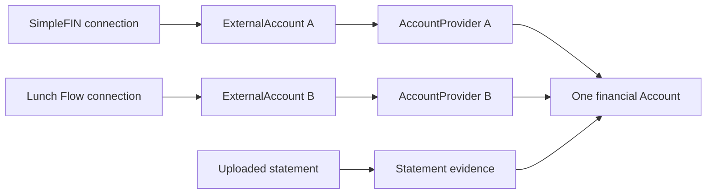
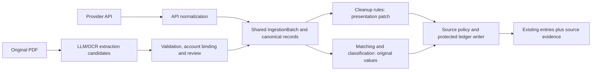

# Multiple providers, statement evidence and shared ingestion

Status: architecture requirements for [account-data ingestion](bank-data-providers.md)
and [import cleanup rules](account-data-and-import-rules.md). Shared ingestion
tables, source policies, transaction/holding evidence and native writers are being
implemented. They have not been activated or verified in this workspace. PDF
publication and cleanup rules remain proposed; consult the [implementation
status](provider-implementation-status.md) before relying on a runtime capability.

## Architecture decision

Treat a financial account as independent of every channel that reports on it.
An institution identifies the account issuer; an integration identifies an access
mechanism; a connection identifies one configured relationship; an observation
identifies a source's assertion about a financial event. Several observations may
support one ledger entry. Institution coverage is many-to-many and must not impose
one-provider ownership on either an institution or a financial account.

The common abstraction for API and document input is **ingestion of account-data
observations**. Banks and aggregators implement the account-data adapter contract.
A statement normalizer produces the same canonical records after extraction and
validation, with document provenance instead of connection credentials. Keep the
acquisition commands separate and share reconciliation, permitted cleanup patches,
evidence persistence and financial publication. This requires architectural changes
to publication and identity handling, beyond renaming `Provider`.

| Scenario | Intended behavior | Current boundary |
| --- | --- | --- |
| One institution available through several providers | Discover it through any supported integration; retain each integration's identifiers. | A canonical institution directory is optional design work, not an account-matching mechanism. |
| One financial account linked through different providers | Keep one Account and several external-account links; explicitly select posting authority per resource. | Shared schema, policies and initial native setup support this shape; legacy setup flows and rollout remain incomplete. |
| Two connections using the same provider for one account | Use distinct connection-scoped identities when this topology is introduced. | Currently rejected by the one-link-per-integration constraint; requires a deliberate migration and reconciliation policy. |
| API data plus a PDF statement for one account | Matched lines add evidence; approved missing lines can create entries without duplicate posting. | File batches and evidence models exist; PDF publication has not converged on the shared writer. |
| Cleanup rules across API and PDF input | Apply the same versioned presentation transforms without changing matching identity or financial amounts. | Shared ingestion hook and Rules UI type remain proposed. |

For example, SimpleFIN may supply transactions for an account while Lunch Flow
collects comparison observations. A statement for that account supplies evidence
of the same events. None of those relationships creates an additional financial
account automatically, and neither the latest sync nor a matching institution name
chooses which source may change the ledger. Disconnecting one connection must also
preserve the other links and historical evidence; it must not silently promote a
replacement transaction writer.

## Institution coverage and financial account identity

An institution may be reached through many integrations. Each integration retains
its own institution identifiers, connection, consent and external account identity.
The same financial account can link to those separate `ExternalAccount` records
through separate `AccountProvider` links. This is already compatible with the
proposed model and existing different-provider link cardinality.

The shared link constraint permits one link per financial account and integration
key; legacy links enforce one per provider class. Each representation supports
SimpleFIN plus Lunch Flow for one account, but not two SimpleFIN connections.
Plaid US/EU also share one integration key. Those separate constraints do not by
themselves prevent a legacy-only link and a native-only link for the same integration
from coexisting. That transitional gap requires migration/link admission checks;
it is not supported overlapping-source behavior. Supporting several connections
of the same integration later requires explicit connection ownership for legacy
identities and a deliberate constraint migration.

Structural link support is not yet a complete connection workflow. The existing
SimpleFIN link controller rejects accounts linked through another integration,
and the Lunch Flow linking flow also restricts accounts with existing provider
links. Supporting overlapping connections in the UI requires updating those
flows alongside explicit source selection and reconciliation; changing the shared
tables alone does not make the feature available to users.

The initial [shared native setup flow](provider-native-account-setup.md) now accepts
a permitted existing account with complete native source policies and keeps those
policies when adding a different provider. Such a secondary link collects observations;
it does not merge historical entries or gain authority by connecting last. Up,
Mercury, Brex and Akahu declare setup types, but Mercury/Brex/Akahu remain behind their native
readiness gates. Tests are written but unrun; this does not enable the legacy
SimpleFIN/Lunch Flow screens or same-provider multiple connections.

If a common institution directory is useful for connection discovery, model
`Institution` with many provider-specific aliases/offerings. That directory serves
presentation and discovery. A matching institution, display name or masked number
does not establish that two external accounts represent the same financial account.
Linking still requires verified identifiers or an authorized user's confirmation,
with family and account permissions preserved.

### Link support and simultaneous-source reconciliation

The [account provider selector](../../app/models/account/linkable.rb) now uses an
active balances source policy when present, retaining the legacy first-link
fallback until a connection is migrated. The
[import adapter](../../app/models/account/provider_import_adapter.rb) deliberately
keeps transaction identity scoped to `(account, source, external_id)` and ordinary
duplicate lookup excludes other providers' entries. Legacy writer fencing is
implemented groundwork; complete lifecycle coverage and execution remain cutover
requirements. Native writes now check an account/resource policy inside
the account lock; secondary feeds retain observations without posting them.
Holding collision guards alone are not a source selection policy.

The initial shared runtime therefore uses explicit **source authority per account
and resource**: transactions, balances, holdings and historical balances may have different
authorities. This is a versioned `Account::SourcePolicy`, persisted in
`account_source_policies`, referencing the existing `AccountProvider` link and the
account/family. Each revision now [retains its original source tuple](provider-source-policy-retention.md)
independently of the live link; existing unknown revisions require disposition.
Validate that the selected link belongs to that account. Use one
active writer per resource initially; secondary connections may collect source
records for comparison without independently posting overlapping ledger entries.

Transaction feeds and investment-activity feeds can both carry the same cash
movement. The initial runtime therefore requires their source selections to agree
when both policies exist; they can be switched together with `select_many!`.
Selection uses its own savepoint: if one resource fails validation or persistence,
all old authorities and revisions survive even when the caller rescues the error
and commits unrelated work. Behavioral regressions are written but unrun. This
atomic metadata change does not itself reconcile overlapping transaction history.
Different sources for balances or holdings remain possible. Separating a pure
trade source from a cash source later requires explicit projection ownership and
cross-feed identity rules, not simply two independently active stream policies.

This policy selects automated provider writers. The proposed document-publication
command is separately authorized: it may attach evidence or create approved missing
entries, including on manual accounts with no provider authority. It does not gain
polling authority, overwrite provider-owned/protected values or prune history.
It must serialize with provider writes and check the current policy. The current
PDF publication path does not yet implement that shared locking boundary.
For accounts already using multiple providers, inventory existing overlaps and
select authority explicitly; never infer it from `account_providers.first` or
silently remove already-posted data when enabling the policy.

Historical backfill or source handover may introduce explicitly bounded authority
windows. Do not rely on priority alone when ranges overlap: either enforce disjoint
windows per resource or require a deterministic, reviewed resolution policy. A
provider outage must not silently promote a secondary writer into an overlapping
date range. Source switches require overlap reconciliation, pending continuity,
user-lock preservation and rollback. Preserve the selected policy revision on each
batch; a stale writer must fail before updating ledger state.

Each account-scoped API page now captures its exact account/link, resource policy,
financial account currency/type and authorization memberships before HTTP. The
writer requires that original binding and rechecks it under ordered locks;
an old page cannot adopt today's link by reconstructing missing context.
Connection-wide transaction children inherit their sealed generation binding.
The separate [request grant](provider-request-grants.md) pins the credentials and
consent used by the adapter. Separate proofs now pin declared factory inputs and
the account Record/window/checkpoint admitted for each request. These checks are
implemented groundwork with tests still unrun; source handover/reconciliation,
realistic inventory performance and the UI for choosing authority remain rollout
work.

## Separate source identity from the financial event

Ingestion receives **observations** of transactions. Several observations can
describe one ledger entry: a primary API transaction, an overlapping aggregator
record and one or more statement lines.

Add durable `SourceRecord` identities and `EntrySource` evidence mappings:

- A provider record is identified by its external account, record kind and stable
  upstream/legacy ingestion ID. Capture changes as immutable revisions in batches;
  pending-to-posted aliases may point to the same resulting Entry.
  An observation may exist before account setup with no financial Account binding.
  It can route later source tombstones but cannot acquire financial evidence links.
  First publication requires the current link and a fresh captured source policy;
  the Account binding then becomes fixed.
- A statement record has its own stable statement/physical-row identity. Store
  extraction version and page/row evidence separately. Two identical purchases are
  two records; do not use amount/date/name as a unique constraint.
- A source record maps to at most one current Entry in the initial transaction contract;
  an Entry may have many source records. Preserve revision/match decisions and
  role (posting source or corroborating evidence). Normalize fees/splits into
  explicitly identified child records before supporting other cardinalities.
- Database constraints must ensure source record, batch, evidence link and Entry
  belong to the same family/account. Source identities cannot be silently rebound
  to another account after publication. Retargeting an uncommitted draft uses the
  reviewed import workflow and records the changed binding. Published imports
  require explicit revert/republication, not rebinding evidence behind an Entry.

Source identity provides retry idempotency; matching observations to an Entry is a
separate reconciliation decision. Shared identifiers and established evidence links
are strongest. Date, amount, currency and description produce candidates, not proof
that two transactions are identical. Ambiguous or conflicting observations need
review, with one-to-one row allocation so repeated legitimate purchases survive.

For example, one checking account may have SimpleFIN and Lunch Flow links plus an
uploaded monthly statement. SimpleFIN can be its selected transaction writer while
Lunch Flow collects comparison observations. A reviewed statement line matching an
existing transaction adds evidence to that Entry; it does not create a third copy.
An approved missing line can create an import-owned Entry. If an API later reports
that event, reconciliation adopts the eligible existing Entry and adds provider
evidence while preserving its UUID and user protections. A second purchase with
the same date, amount and merchant remains a separate event unless its identity or
an explicit match decision establishes otherwise. These document and cross-source
reconciliation behaviors are acceptance requirements, not activated functionality.

Preserve existing `entries.source` and `external_id` as compatibility fields during
migration. Do not rewrite them whenever another observation corroborates the entry.
One source's tombstone removes/retracts that source's assertion; it does not erase
another source's evidence or automatically delete a protected/reconciled Entry.
Balances and holdings also require explicit authority; do not add snapshots from
two providers or let the last completed job determine the account balance.

## PDFs feed the common ingestion kernel

Use the same canonical records, cleanup rules, reconciliation, protections, audit
and ledger writer for APIs, statement PDFs and eventually CSV imports. Keep the
acquisition lifecycles separate: a document import does not need a
`ProviderConnection`, an OAuth grant or a manufactured `AccountProvider` link.
Creating such a link would make a manual account appear linked and change its
balance materialization behavior.

Use source-neutral `ingestion_batches` with an explicit origin kind and typed FKs:
provider batches require connection/sync context; file batches require an `Import`
and, for statement-backed documents, `AccountStatement` context. Enforce valid
combinations and tenant consistency in the database. Live-provider checkpoints
remain provider-specific orchestration state and reference committed batches; a
file import instead has review/publication state and no invented polling cursor.

For the first document rollout, every publishable PDF batch must be backed by an
`AccountStatement`. The batch schema also permits an Import-only file batch, but
`SourceRecord` requires a provider external account or a statement as its durable
origin. Import-only batches are staging groundwork, not permission to publish.
Legacy and assistant-created PDF imports need a statement identity before entering
the shared writer. General CSV publication remains on its current path until its
durable source identity has an explicit migration; do not invent a bank connection
to satisfy this constraint.

`Ingestion::Record` is the neutral shared value contract. The former
`Provider::BankData::Record` name is a compatibility alias. Provider adapters and a `PdfImport` normalizer
can both produce it. Shared rule context includes `origin_kind`, institution and
target account; provider/authorization fields are optional and absent for documents.

The current [`Ingestion::LedgerWriter`](../../app/models/ingestion/ledger_writer.rb)
still requires an `ExternalAccount` and explicitly accepts only provider batches.
File batches and neutral records are therefore groundwork, not a working document
publication path. Convergence requires extracting a shared publication core behind
separate provider-sync and document-publication commands. The provider command
retains its credential, consent, source binding and writer-authority checks; the
document command verifies account access and the exact approved extraction,
corrections and ruleset. Both serialize publication on the financial account and
share reconciliation, protections and evidence persistence. Do not enable files
by simply removing the provider writer's admission checks.

The financial source is the uploaded statement and its issuer. LLM provider, model,
prompt/schema version and extraction run are processing provenance. Switching LLMs
must not create a new financial source, bypass approval or duplicate ledger entries.

### Extraction is a candidate-generation step

Preserve original bytes/content digest, page/row evidence, extraction output/version,
corrections and publication decisions. Deterministically validate dates, currency,
decimal precision, account binding, debit/credit signs and document coverage before
building accepted canonical records. Missing/invalid data stays unresolved; never
coerce it to zero or label a failed parse as a complete empty statement.

Use account-aware statement totals and balance checks where the document supplies
sufficient evidence, alongside row/page coverage checks. A balanced total alone
does not prove every transaction was extracted; offsetting omissions can cancel.
Keep extraction integrity separate from agreement with the current ledger. LLM
confidence is a review signal, not proof or permission to write financial history.
Truncated/partial extraction cannot imply missing-account/transaction deletion.

The review shows extracted and cleaned values plus proposed matches/new entries.
Publish rechecks matches under the account/source-policy lock because a provider
may sync after preview. Accepted new statement entries retain import ownership,
user protections and reconciliation evidence; matches attach evidence to existing
entries without replacing provider identities. Never deduplicate by the cleaned
description. Document text is input data, not authority to execute instructions,
choose another family's account or enable rules.

Repeated publication of an accepted extraction is idempotent. A new extraction of
the same document is a revision requiring alignment with existing row identities,
not permission to insert all rows again. Bind approval to the exact extraction,
corrections, ruleset and target account; a material change invalidates that approval.
Unpublishing/reverting removes only this import's eligible contributions/evidence,
preserving entries that existed before the import and other sources' evidence.

## Existing PDF behavior to preserve or explicitly revise

The current path is [AccountStatement](../../app/models/account_statement.rb) →
[PdfImport](../../app/models/pdf_import.rb) →
[ProcessPdfJob](../../app/jobs/process_pdf_job.rb) → configured LLM extraction →
review rows → publication. `AccountStatement` stores the original file and provides
family-scoped content-hash deduplication and account permissions.

`PdfImport` already reuses the shared duplicate finder, includes provider entries,
matches exact amount/currency within a three-day window, allocates matches once
per statement, and checks again on publication. Those are useful foundations, not
a complete policy for ambiguous cross-source observations. It creates missing
entries with `import_locked: true` and statement reconciliation evidence.
That publication transaction currently does not lock the financial Account before
matching. A concurrent provider insert can therefore commit between the duplicate
query and the document's insertion. The new command must take the shared Account
lock before reading candidates, then revalidate and write under that lock.

The existing single `reconciled_by_statement_id` field is also insufficient for
several statements corroborating one Entry: reconciling another statement replaces
the earlier reference. Retain every statement's evidence through `EntrySource`
while preserving the compatibility field's current meaning during transition.

Current statement balance checks compare manually entered opening/closing balances
with ledger balances; they do not validate LLM-extracted totals. Absent checks are
unavailable, not a successful integrity result.

Crucially, those PDF-created entries currently leave provider `source`/`external_id`
unset. Later provider adoption relies on finding entries with `external_id: nil`.
Putting synthetic PDF row IDs in that column would break adoption. Keep document
idempotency in the separate SourceRecord/EntrySource mapping.

The existing matching policy also depends on arrival order. PDF reconciliation
searches within three days and includes provider entries; provider adoption uses
an exact date, including its native lock-time recheck. A statement using a purchase
date and an API using a later posting date can therefore match when the API arrives
first and duplicate when the statement arrives first. Define one shared candidate
policy and explicit ambiguity handling; widening one query alone does not establish
identity or fix concurrent publication.

Provider adoption currently retains the Entry's `import_id`, while
[`Import#revert`](../../app/models/import.rb) destroys all entries belonging to the
import. Reverting a statement can consequently delete an Entry that a provider has
since adopted. Before convergence, make revert inspect current source contributions
under the same account lock: retract the document's evidence and only delete an
eligible Entry when no surviving source or protection requires it. Neither keeping
the original import ID nor adding another evidence row fixes the existing revert
command by itself.

Current extraction also marks matching entries reconciled before Publish; an
all-matched statement can finish without creating transactions. Distinguish that
behavior from a stricter future review gate. Preserve retarget/revert semantics in
the compatibility path; making preview fully read-only is an explicit behavior
change, with an approval path for evidence-only imports.

Before the new path is activated, address these source-backed gaps:

- [OpenAI extraction](../../app/models/provider/openai/bank_statement_extractor.rb)
  uses floating-point amount parsing, returns an empty transaction list for malformed
  JSON, and has heuristic chunk deduplication that can discard legitimate duplicates.
- [Anthropic extraction](../../app/models/provider/anthropic/bank_statement_extractor.rb)
  also uses floating-point amounts and can report truncation. Current publication
  eligibility does not make extraction completeness an explicit gate.
- Extractor signs are inflows-positive; `Import::Row#signed_amount` reverses them.
  The shared normalizer must convert exactly once into Sure's outflows-positive
  convention, using decimal text and explicit currencies.
- Unmatched review rows are currently renumbered. Their displayed
  `source_row_number` is not a durable original PDF-row identity.
- The [assistant import function](../../app/models/assistant/function/import_bank_statement.rb)
  currently creates a separate CSV `TransactionImport`. Route it through the same
  statement-backed permissions/provenance/review flow instead of adding another
  ingestion path.

## Incremental implementation gates

1. Preserve the current provider migration behavior; add explicit source selection
   before allowing more than one source to post overlapping data to an account.
2. Introduce generic batches and source-record/evidence identities while retaining
   existing ledger IDs and statement/provider compatibility fields.
3. Adapt the current PDF flow to canonical staging with exact decimals, stable
   row identities, extraction validation and the existing permission boundary.
4. Run shared cleanup previews and reconcile accepted documents against live data;
   test API-before-PDF and PDF-before-API with differing purchase/posting dates,
   concurrent publish/sync, repeated uploads, repeated identical purchases, changed
   extraction, partial pages, and revert after provider adoption or another
   statement's corroboration.
5. Add broader concurrent-source reconciliation only with explicit authority,
   conflict review, protected-value parity and source-switch rollback tests.
