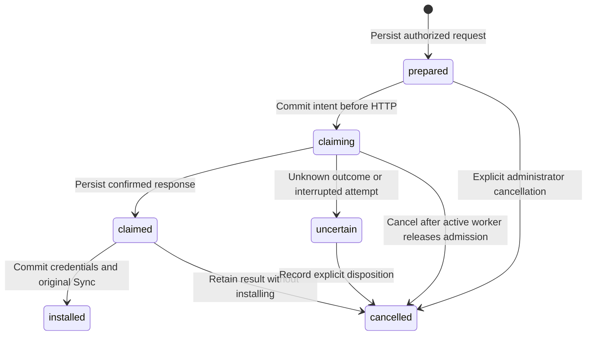

# SimpleFIN durable credential claims

Status: implemented with authored, unrun behavioral tests. The migrations have
not been applied here. No token was claimed, connection migrated or native writer
activated during this work.

## Intent, remote result and installation

[`SimplefinItem::ConnectionUpdate`](../../app/models/simplefin_item/connection_update.rb)
uses [`ProviderCredentialClaim`](../../app/models/provider_credential_claim.rb) for
both initial connection and reconnect. This journal is separate from
`ProviderCredentialReceipt`, which describes ordinary session-cookie rotations
within a native activity generation. The claim journal currently accepts only
SimpleFIN connect/reconnect operations; its name does not imply other integrations
have adopted this protocol.

The controller prepares a reconnect before enqueueing its job. Preparation pins
the original family/item, credential revision and migration writer epoch and
stores the setup token in an encrypted document. Queue arguments contain only
family and claim UUIDs. A new connection reserves its future item UUID without
creating an empty provider item before remote success. The public family creation
and item credential-update methods use the same command.

The confirmed access URL commits to the journal before installation starts.
Installation takes short row locks, rechecks the original credential revision,
family, deletion flag and writer epoch, then atomically saves the credentials,
installed revision and one pending Sync. Neither claim HTTP nor subsequent queue
delivery runs inside that transaction. Existing financial account/provider links
are preserved.

The existing job disables wrapper, HTTP, inherited deadlock and Sidekiq retries.
An explicit retry of a `claimed` record installs its saved response without HTTP;
an `installed` record can enqueue its original pending Sync again. Completed,
failed or cancelled Syncs are not replaced by a fresh run. Missing original Syncs
or changed installed credentials require reconciliation instead of reconstruction.

An abandoned `claiming` record becomes `uncertain` when resumed. It cannot send
another claim request. A crash after remote success but before the response was
persisted is inherently ambiguous: the code requires a new setup token rather
than assuming failure or inventing successful recovery. A confirmed result whose
target subsequently changed remains encrypted and `claimed`; it cannot overwrite
the new target context.

## Existing-connection recovery

The SimpleFIN edit page lists outstanding requests in bounded, cursor-based pages.
It exposes only request UUID, creation time, state and eligible actions. Encrypted
request and response documents never reach the template. Cursors resolve within
the original family/item scope; a foreign request cannot supply a page boundary.

An active family administrator can retry a prepared or confirmed request only
while its original credential revision and writer epoch still match. Installed
requests can retry delivery of their original pending, uncancelled, non-stale Sync.
The web command only enqueues the saved claim ID; remote work stays in the job.
Recovery and original-Sync delivery enqueue after releasing advisory permits, so
an immediate worker can acquire its target; execution revalidates ownership.
Failed, completed, stale or missing Syncs are not replaced by this recovery action.

An administrator can explicitly cancel a prepared, claiming, claimed or uncertain
request. Cancellation takes exclusive migration admission and the credential
target/request locks, so it refuses while a cooperating worker is running. It
changes only the journal and is available even when an older request is stranded
under quiescing or native ownership. It does not restore legacy writer authority.
Commands recheck the actor's current family, active status and administrator role
under a user lock before mutating journal state or admitting retry delivery.

Cancellation retains encrypted input, any confirmed result, actor UUID, time,
previous state and a fixed reason. Model and database guards prevent reversal or
audit alteration. Repeated cancellation preserves the original audit; a delayed
job cannot revive the request, and submitting its token again requires a new token.
Installed requests cannot be cancelled through this command. This is local request
disposition, not a remote credential revocation or reversal of completed work.

Initial-connect requests whose reserved item was never created are not visible on
an existing item's edit page. Their dedicated recovery/disposition interface
remains unfinished; the existing-item controls must not be counted as that path.

## Serialization and credential revision

Reconnect acquires the item's legacy migration permit, then a dedicated credential
session lock, followed by a token-fingerprint session lock. The locks are
nonblocking; exact same-session reentry is allowed, but a caller cannot extend its
lock set inside a row transaction. Each first acquisition requires no open database
transaction. One provider/token fingerprint is unique across families and targets,
so reusing a request cannot consume it for another connection.

The shared SimpleFIN access boundary and full Syncer retain the credential target
lock during ingestion. Credential maintenance tasks use that same lock and reread
the current row before rewriting credentials or cached payloads. This closes the
stale batch-write path without changing other providers' maintenance behavior.

A database trigger advances `SimplefinItem.credential_revision` whenever stored
access URL bytes change, including `update_columns` and direct SQL. A caller cannot
rewind or choose that revision through UPDATE. Changing credentials and then
restoring their old value still invalidates prior prepared claims. Encryption/key
rewrites that change stored bytes conservatively advance the revision as well.
The migration manifest retains this new column as metadata.

Deferred holdings fingerprints now include this revision. A request queued before
reconnect cannot publish old cached holdings after the credential boundary changes,
even when the financial payload itself has not changed yet.

## Storage and rollout

The claim model requires configured Active Record encryption; it has no plaintext
fallback. Request/expected/result documents are bounded. Database constraints and
a transition trigger preserve original ownership, request, confirmed response,
installed revision and original Sync identity. Claim rows retain their target and
Sync UUIDs after those live rows disappear; deleting the owning family cascades its
encrypted journal. Diagnostics record IDs and exception classes, not token values,
returned access URLs or response bodies.

Quiesced copy, preparation and retained verification refuse outstanding `prepared`,
`claiming` or `claimed` records before changing migration ownership. They neither
execute those requests nor infer that a stale baseline means success. Terminal
`uncertain`, `installed` and `cancelled` states pass this claim-only check; all other migration
and queue-disposition checks still apply. Recoverable requests must be settled
before the migration drain. Existing-item requests now have explicit retry and
audited cancellation controls; execution and deployment acceptance remain unverified.

Deploy the additive journal, revision and cancellation migrations before these callers.
The cancellation migration refuses rollback when a cancelled record exists, so
rolling back cannot discard the retained audit. Existing
secret-bearing reconnect jobs lack an original prepared baseline and fail; do not
manufacture a claim from their arguments at execution. Inventory and dispose of
those jobs explicitly. Uncertain token exchanges require a new token. Saved claimed
responses may be resumed by their original family/claim IDs after the underlying
installation failure is resolved.

The [command tests](../../test/models/simplefin_item/connection_update_test.rb),
[journal tests](../../test/models/provider_credential_claim_test.rb),
[recovery command tests](../../test/models/simplefin_item/connection_recovery_test.rb),
[recovery controller tests](../../test/controllers/simplefin_connection_recovery_test.rb),
[job tests](../../test/jobs/simplefin_connection_update_retry_test.rb) and
[maintenance tests](../../test/lib/tasks/simplefin_credential_maintenance_test.rb)
cover real-commit boundaries, saved-response replay, ambiguous interruption,
ownership changes, competing sessions, trigger behavior and sanitized failures.
Existing transactional controller/financial examples substitute only physical
session locks; they do not prove commit durability. Runtime execution, rendered UI,
lifecycle coverage, migration acceptance and initial-connect recovery remain unverified.
