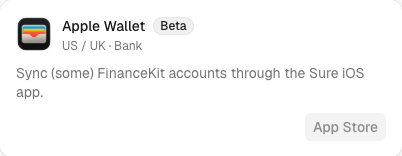
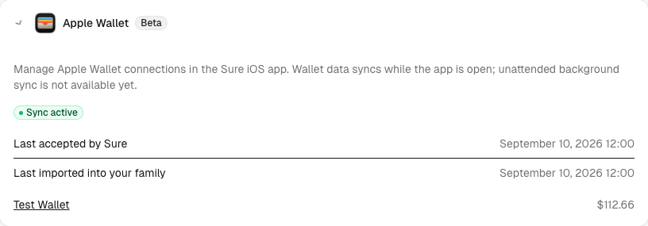

# Operating the FinanceKit device publisher

This guide covers Sure's server-side ingestion of FinanceKit uploads. It applies to foreground "Sync now" in alpha builds and to optional background delivery by the iOS client. Both use the same enrollment, upload, receipt, and repair protocol; background delivery is not required to begin alpha testing.

Sure's server-side worker and scheduled inbox sweep are required for either delivery mode. They apply accepted batches, retry processing, complete downstream account updates, and remove expired payload bytes. These server jobs are separate from the iOS app's ability to run in the background.

FinanceKit is default-off and requires:

- `FINANCEKIT_ENABLED=true`;
- `FINANCEKIT_FAMILY_IDS`, a comma-separated exact family UUID allowlist;
- an active enrolling family administrator with preview features enabled; and
- the scheduled `FinancekitInboxJob` sweep in addition to jobs enqueued when a batch arrives.

No Apple Wallet entitlement, private key, or FinanceKit framework is installed on the server. Sure never receives the user's Apple credentials. The iOS app obtains Wallet authorization directly from Apple and uploads only the accounts the user selected and consented to share.

## Deployment

Deploy the migration, application, worker, and scheduler with the feature flag disabled. The migration introduces publisher connections, stable account lineages, immutable batch receipts, source transaction identities, balance observations, and conflicts.

After deploy:

1. Confirm the high-priority job queue and recurring scheduler are healthy.
2. Enable only a disposable test family.
3. Enroll and activate a synthetic publisher over HTTPS.
4. Upload sequences 2 then 1 and confirm the inbox applies them in order.
5. Retry identical bytes and confirm the receipt is stable and no ledger row duplicates.
6. Rotate the credential and confirm the prior credential cannot upload or call normal APIs.
7. Replace the publisher and confirm the canonical account, source identities, and tombstones are reused.
8. Induce a bad predecessor and confirm the connection enters `repair_required`; repair must create a new generation and stream.
9. Confirm health reports device contact, acceptance, import, and downstream completion separately.
10. Confirm applied, permanently failed, and revoked payload bytes are removed after seven days.

Monitor queue depth, oldest accepted batch age, `repair_required` connections, and downstream lag. Diagnostics may include publisher, batch, sequence, generation, and typed error codes. They must not include credentials, raw request bodies, transaction descriptions, merchant names, amounts, account names, or server authentication headers.

## Transaction dates

`posted_at` is optional, including for booked Apple Card transactions. When
supplied, it must still be a valid timestamp no later than the capture timestamp.
Ledger dates retain their existing precedence: `posted_at`, otherwise the
required `transacted_at`, converted into the mapped account's ledger timezone.

## Wallet in settings

Bank sync lists Apple Wallet as a US / UK bank provider. Its App Store button is
disabled with “Coming soon!” hover help; connections are managed in the iOS app.



Existing connections appear under Your Connections with sync status, acceptance
and import timestamps, and links to accounts the viewer can access. Wallet accounts
also appear in Accounts. This screenshot uses synthetic test data.



## Debugging uploads

Super admins can open `/settings/debug?provider_key=financekit` and filter further
by family, level, or source. Events share `connection_id`, `publisher_id`,
`generation`, `stream_id`, and `next_sequence`. Accepted batches also include
`batch_id`, `capture_id`, sequence/chunk information, payload size, and event count.

- `upload_accepted` means Sure stored the upload; it does not mean ledger import
  has completed. An accepted sequence ahead of `next_sequence` is waiting for its
  predecessor; a multi-chunk capture waits for all its chunks.
- `upload_rejected` records a typed protocol error and HTTP status when an
  authenticated upload fails validation. Identical accepted retries reuse their
  receipt without another acceptance log.
- `capture_imported` records the resulting sync ID and counts, including records
  requiring conflict review.
- `import_retry` includes the attempt count, retry deadline, error code, and
  exception class. `import_failed` means repair is required; `import_blocked`
  covers failures before a batch could be selected.
- `downstream_completed` means account updates and rules were scheduled.
  `downstream_failed` includes the affected account/provider link when available;
  the inbox sweep retries this stage.

These diagnostics deliberately omit exception messages and financial payloads.
Requests rejected before reaching the batch inbox (such as invalid publisher
credentials or content type) do not create these model-level events.

## Local sample accounts

In development/test, the full demo generator includes a synthetic Apple Wallet connection with Apple
Card (`CreditCard`), Apple Cash, and Nancy's Apple Cash (`Depository`, subtype `cash`). It includes a
year of card purchases/payments and cash purchases/top-ups, plus pending activity,
source identities, balance observations, and acceptance/import timestamps.
Apple Cash receives a simulated 1% Daily Cash reward the day after each day's
booked Apple Card purchases (excluding pending charges and payments), categorized
as Cash Back. Six small gifts link the parent's Apple Cash to Nancy's account.
Nancy spends some of each gift on candy, movies, after-school snacks, and ice
cream: a few categorized purchases per month, with a positive running balance.
These additions also populate older demo enrollments in place; stable source IDs
prevent duplicate rewards, gifts, and purchases on reruns.

To add just these accounts to an existing local family without replacing its data:

```sh
FAMILY_ID=<local-family-uuid> bin/rails demo_data:financekit
```

Alternatively use `DEMO_EMAIL=<local-user-email>` (defaults to the configured demo
email). `SEED=42` controls the generated amounts and merchants. Reruns preserve
the existing demo enrollment and transactions, and upgrade older synthetic data
with merchant-specific categories and paired transfers. Apple Card payments and
Apple Cash top-ups come from the demo owner's manual Chase Premier Checking
account; if absent, a funded Wallet Demo Checking account is created. Subsequent
reruns preserve category edits and do not duplicate either transfer leg.
FinanceKit demo generation is restricted to development/test, including when
called by the full generator or sample-data reset flow. It does not enable FinanceKit feature flags or change user
permissions. These records simulate imported data; no iOS device is required.

## Wallet logo

The provider logo is bundled at `app/assets/images/providers/apple-wallet.png`,
using Apple's [256-pixel Wallet icon](https://developer.apple.com/assets/elements/icons/wallet/wallet-128x128_2x.png).
Rails serves this asset locally, so displaying the logo does not depend on Apple
or Brandfetch being available.

## Capacity and retention

Protocol 2 limits each publisher to 20 selected accounts, 500 events per batch, 1 MiB of JSON, and 100 accepted/processing batches. Each capture is limited to 100 chunks so the complete capture fits in the inbox. A client can upload larger histories using multiple consecutive captures.

Exact payload bytes are retained for seven days after apply, permanent failure, or revocation for response-loss recovery and operational investigation. Canonical financial data and source identity records follow Sure's normal family retention and deletion behavior. Family financial-data reset removes FinanceKit connections, lineages, observations, identities, conflicts, and batch receipts for that family.

## Rollback

Disable `FINANCEKIT_ENABLED` first. Existing Sure data remains readable, uploads return a retryable unavailable response, and workers stop applying FinanceKit batches. Do not drop the tables during an application rollback; keep receipts and lineage data until all deployed versions no longer reference them and the retention decision is explicit.
