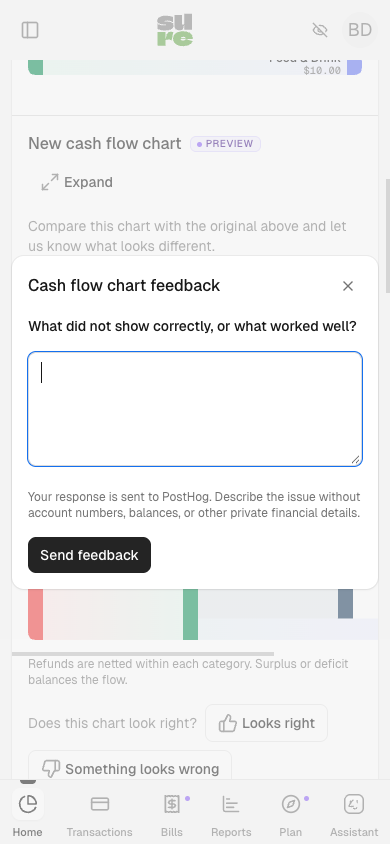

# Sankey preview feedback

The dashboard retains the original Sankey's server calculation, JavaScript
renderer, zoom, expansion and transaction links. A user who enables Settings →
Preferences → Preview features sees an independent API-backed chart immediately
below it. Both charts follow the existing period picker and section visibility.
The preview renderer is deliberately separate while users compare the results.

The API remains available to authenticated native clients regardless of the web
preview preference. The preference gates the extra web chart, not `cash_flow`.

## PostHog survey setup

The app and demo use the project selected by that environment's existing
`POSTHOG_KEY` and `POSTHOG_HOST`. Set `POSTHOG_SANKEY_SURVEY_ID` to the matching
survey below; no browser hostname heuristics choose the project.

| Environment | Project | Active API survey ID |
| --- | --- | --- |
| Sure app | `[app] sure-app` (247266) | [01a0a164-0289-0000-77fe-8038ae279700](https://us.posthog.com/project/247266/surveys/01a0a164-0289-0000-77fe-8038ae279700) |
| Demo | `[app] sure-demo` (294544) | [01a0a164-9673-0000-0916-669967339593](https://us.posthog.com/project/294544/surveys/01a0a164-9673-0000-0916-669967339593) |
| Self-hosted | `[app] self-hosted` (609412) | [01a0a162-73a2-0000-9402-ffab5bc45b4a](https://us.posthog.com/project/609412/surveys/01a0a162-73a2-0000-9402-ffab5bc45b4a) |

These surveys were created and verified active on September 14, 2026. The
managed app and demo still need their matching survey ID configured at deployment.

### Self-hosted feedback works without setup

Self-hosted installations need no PostHog account, key exchange, or environment
variables. When a user enables preview features in a production self-hosted
installation, the preview uses the bundled public project token, ingestion host,
and survey ID for `[app] self-hosted`.

PostHog's [public ingestion API](https://posthog.com/docs/api) requires a project
token to route submissions, but it is not a private authentication credential.
The shared token is intentionally public client configuration; it does not grant
access to analytics results or project administration. No personal or project
secret API key is bundled. Written feedback is sent only when the user submits.

Operators can disable this public connection with:

```dotenv
POSTHOG_FEEDBACK_ENABLED=false
```

Any operator-owned `POSTHOG_KEY`, `POSTHOG_HOST`, and `POSTHOG_SANKEY_SURVEY_ID`
remain independent. In `SELF_HOSTED=true` mode, Sankey events and surveys use a
separate `posthog.sankeyFeedback` client and the fixed public destination. Disabling
feedback does **not** fall back to the operator's private project. The earlier
`POSTHOG_FEEDBACK_KEY` and `POSTHOG_FEEDBACK_HOST` settings are no longer used.
The dedicated client is initialized only on the preview surface in production.
It uses an in-memory anonymous identity, disables automatic tracking and session
recording, and removes URL/referrer/person/device metadata from event properties.
Only preview events and explicit survey lifecycle/response events are allowed.
Opting out of either the existing client or the dedicated client suppresses
feedback capture. The ingestion service still receives the connection's IP;
events disable GeoIP enrichment. No global analytics settings are changed.

### Survey contract

For another project or a replacement survey, create and launch an **API** survey.
Automatic survey popups may stay disabled: PostHog's manual Surveys API remains
available, and Sure renders its own dialog.

- Name: `Cash flow Sankey preview feedback`
- Single choice question: `Does the new cash flow chart look right?`
  Choices: `Looks right`, `Something looks wrong` (keep these wire values).
- Optional open text question: `What did not show correctly, or what worked well?`
- No additional PostHog targeting; the app's per-user preview preference owns access.
- Leave the survey active with no end date. Users may send feedback about more
  than one period; responses are not suppressed after the first submission.

For managed app/demo deployments, set `POSTHOG_SANKEY_SURVEY_ID` to its survey
UUID. This is public configuration, not a personal API key. Never put a PostHog
personal API key in the app.
The client fetches the configured survey with `getSurveys`, validates its shape,
and uses its question UUIDs, so reordering the two questions is safe. Renaming or
adding choices/questions requires updating the client contract at the same time.

The thumbs controls open Sure's accessible dialog. The form uses PostHog's
[custom survey integration](https://posthog.com/docs/surveys/implementing-custom-surveys)
and emits `survey shown`, `survey sent`, and `survey dismissed`. Responses use
`$survey_response_<question UUID>` and `$survey_id`, and appear in PostHog Surveys.
Submitting the form is the only action that sends the written response.

Missing configuration, an unavailable SDK, opted-out capture, an inactive survey,
or an incompatible survey shows an unavailable message rather than claiming a
response was submitted. The charts remain usable.

## Events and counting

`sankey_preview_displayed` is emitted when a loaded result enters the viewport in
a visible document. Its properties are `preview_version: cash_flow_v1`,
`surface: inline | expanded`, and `state: content | empty | error`.

Each page visit, date-range load, or retry can produce an inline impression.
Intersection/resize callbacks and scrolling back over the same rendered result
do not inflate the count. Each explicit expansion produces another impression
with `surface: expanded`. A hidden, collapsed, loading, or off-screen preview does
not count; late SDK initialization can capture an already visible result.

`sankey_preview_feedback_clicked` records `rating: positive | negative` and the
load state. All preview and survey events include `preview_version`. Custom
event properties contain no amounts, category/account names or IDs, date ranges,
or graph payloads. Managed app/demo events retain their existing SDK metadata; the self-hosted
feedback client strips incidental metadata as described above. Preview charts and
the feedback form are excluded from autocapture/session recording; users are
asked not to put private financial details in their voluntary response.

Filter `sankey_preview_displayed` to `surface=inline, state=content` for chart
exposure counts, compare those with feedback clicks, and use the survey results
for positive/negative responses and written reports.


