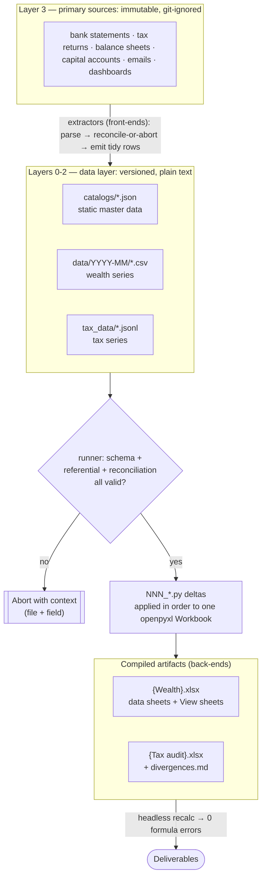
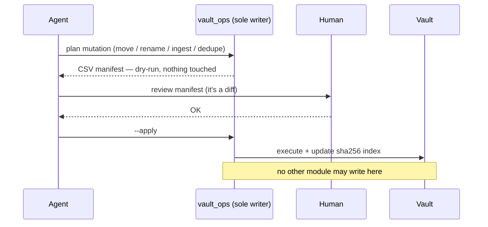
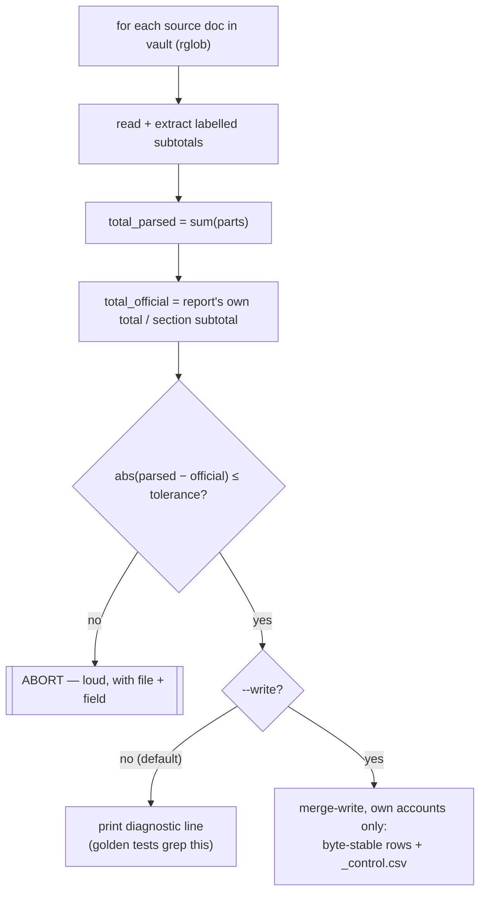
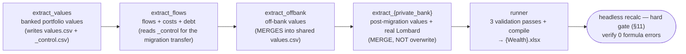

> [!NOTE]
> **This document specifies a system that lives outside Sure.** Sure does not
> implement the pipeline, the numbered deltas, the tax layer or the Excel
> generators described here, and there is no plan to. It is kept in this
> repository because it is the spec an external agent harness implements when it
> uses Sure as its system of record — having it in-repo means an agent with a
> Sure checkout can read the design it is working to.
>
> For how the two halves fit together — which layer Sure owns, which MCP tools
> serve which section, and what the harness must own itself — read
> [the wealth agent harness guide](wealth-agent-harness.md) first.
>
> The document is reproduced verbatim as supplied. It contains no real names,
> institutions, positions, amounts or identifiers.

<!--
  @author        diegomarino
  @license       MIT © 2026 diegomarino
  @last-updated  2026-07-29
-->

# Blueprint: a provenance-first wealth + tax modelling system

> **What this is.** A reusable design document — a "meta-prompt" — for an autonomous agent (or a
> developer) who wants to replicate a system we built: an auditable model of a family's wealth and
> tax position, compiled *entirely* from primary-source documents (bank statements, tax returns,
> company balance sheets, capital accounts, emails) into two deliverables — a **wealth Excel**
> and a **tax audit Excel + divergences report** — where *every single number is traceable back
> to the document it came from*.
>
> **What this is NOT.** It contains no real names, banks, positions, amounts, account numbers, tax
> IDs, ISINs or file paths. Everything identifying is a `{PLACEHOLDER}`. This is the *how* and the
> *why*, stripped of the *what*. See §21 for the placeholder glossary.
>
> **How to use it.** Read it top to bottom once. Then treat §20 (the replication plan) as your
> execution plan: each phase has entry criteria, deliverables, and an acceptance test. Everything
> before §20 is the specification those phases implement. When in doubt, §2 (principles) wins over
> any other section.

---

## Contents

- [0. The one-paragraph domain (anonymized)](#0-the-one-paragraph-domain-anonymized)
- [1. Tech stack & system sizing (calibration)](#1-tech-stack--system-sizing-calibration)
- [2. Non-negotiable principles (the spine)](#2-non-negotiable-principles-the-spine)
- [3. Repository layout](#3-repository-layout)
- [4. The layered architecture](#4-the-layered-architecture)
- [5. The data layer in detail](#5-the-data-layer-in-detail)
- [6. Data dictionary (full column specs)](#6-data-dictionary-full-column-specs)
- [7. Schemas & the three validation passes](#7-schemas--the-three-validation-passes)
- [8. The document vault (Layer 3)](#8-the-document-vault-layer-3)
- [9. The extractor pattern (parsers)](#9-the-extractor-pattern-parsers)
- [10. The numbered-delta compiler](#10-the-numbered-delta-compiler)
- [11. The Excel generators](#11-the-excel-generators)
- [12. The tax layer](#12-the-tax-layer)
- [13. Estimation & gap policy](#13-estimation--gap-policy)
- [14. Testing & validation](#14-testing--validation)
- [15. The recurring build & the monthly runbook](#15-the-recurring-build--the-monthly-runbook)
- [16. A worked month, end to end](#16-a-worked-month-end-to-end)
- [17. Agent operating protocol (how the builder works)](#17-agent-operating-protocol-how-the-builder-works)
- [18. Lessons learned, generalized](#18-lessons-learned-generalized)
- [19. Anti-patterns (what NOT to do)](#19-anti-patterns-what-not-to-do)
- [20. Replication plan (phased, with acceptance criteria)](#20-replication-plan-phased-with-acceptance-criteria)
- [21. Glossary of placeholders and terms](#21-glossary-of-placeholders-and-terms)

---

## 0. The one-paragraph domain (anonymized)

We model the net worth of **three first-class holders** — two individuals (`{OWNER_A}`,
`{OWNER_B}`) and one holding company (`{ENTITY_C}`) — an entirely
ordinary private-wealth configuration (a couple, a family holding company, one account each
at a private bank, a broker and a robo-advisor). Their wealth sits in: managed bank/broker
portfolios (`{BROKER}`, `{PRIVATE_BANK}`, a `{ROBO_ADVISOR}` with a separate custodian), a Lombard
credit line collateralized by those portfolios, real estate, and a long tail of **off-bank direct
holdings** (venture funds, startup equity, operating companies) valued at cost / tax value
rather than market. On top of the wealth model sits a **tax layer**: the value of each
direct investment at 31 December of each year, under *tax* valuation criteria, used to
reconstruct and cross-check the annual wealth-tax return (`{WEALTH_TAX_FORM}`). None of that domain
detail matters to replicate the *system* — swap it for any portfolio of heterogeneous,
document-backed assets (an art collection, a real-estate book, a corporate treasury).

---

## 1. Tech stack & system sizing (calibration)

The entire system is deliberately low-tech. Replicate the *shape*, not the brands:

| Component | Choice | Why |
|---|---|---|
| Language | Python 3, in a mandatory `venv`, deps pinned in `requirements.txt` | ubiquitous; agents write it well |
| Workbook generation | `openpyxl` | writes named tables + formulas without Excel installed |
| Formula verification | headless LibreOffice recalc script | proves **zero formula errors** before shipping |
| Schema validation | `jsonschema` (draft-07) | one contract per table, enforced pre-compile |
| PDF text extraction | `pdftotext` (poppler) + a custom glyph decoder for pathological PDFs (§9.2) | covers ~all statements |
| Email forensics | Himalaya (recommended), a read-only IMAP CLI; credentials live only in its own config (§9.3) | reconstructs facts that exist only in correspondence |
| Storage | CSV + JSON/JSONL, plain text, in git | `git diff` *is* the changelog (§5.3) |
| Orchestration | two plain Python scripts (`build_all`, `tax_runner`) | no framework; order is explicit |

Orders of magnitude that this design comfortably handles (so you can tell whether you are in the
same regime — if you are 100× bigger, revisit §5.3):

- A few dozen accounts in the registry, a handful of holders, a few dozen off-bank positions.
- Dozens of monthly periods, hundreds of value rows, under a thousand workbook formulas.
- Low thousands of documents in the vault, indexed by sha256.
- Low hundreds of tax valuation rows across several tax years.
- Full rebuild from sources: seconds to low minutes. Test suite: ~100 tests, under a minute.

CLI surface of the finished system (the *entire* operational interface):

```
python src/tools/build_all.py            # regenerate EVERYTHING from sources → wealth .xlsx
python src/runner.py --check             # fast gate: validate catalogs + data, write nothing
python src/runner.py                     # validate, then compile the workbook
python src/tools/extract_{source}.py     # one extractor: diagnostic (parse+check, no write)
python src/tools/extract_{source}.py --write   # …and persist to the data layer
python src/tools/tax_runner.py           # tax pipeline → audit .xlsx + divergences.md
python src/tools/tax_crosscheck.py       # 31-Dec wealth ↔ tax cross-check (§12)
python src/tools/vault_doctor.py         # re-hash vault vs index: missing/unindexed/changed
python src/tools/intel_ops.py seed       # skeleton dossiers for every cataloged position (§9.5)
python src/tools/intel_ops.py delta …    # apply a DOSSIER DELTAS block, append-only (§9.5)
python src/tools/vault_ops_cli.py plan …       # vault mutation → dry-run CSV manifest
python src/tools/vault_ops_cli.py --apply …    # execute a human-approved manifest
python -m unittest discover -s tests     # golden + schema + (where sources exist) re-parse tests
```

---

## 2. Non-negotiable principles (the spine)

These are the invariants. Everything else is implementation. If a replica keeps only these, it is
already 80% of the value.

1. **Source vs compiled artifact.** The Excel is a *build output*, like a binary. It is never
   edited by hand and never the source of truth. The source is: **immutable numbered deltas**
   (`NNN_*.py`) + a **data layer** (catalogs in JSON, time series in CSV/JSONL). One command
   regenerates the whole workbook from source.

2. **Never invent a datum.** Every value carries `source: {document}, {date}, {reference}`. If
   there is no source, there is no row — the gap is recorded *explicitly* as `PENDING`, never
   silently filled. "Not on record" is a valid, necessary answer.

3. **Reconcile-or-abort.** Wherever an official total exists (a tax-form summary box, a
   balance-sheet subtotal, a report's grand total), the parser cross-checks the sum of its parsed
   parts against it — within the configured tolerance — or **aborts with context** (which file,
   which field). No malformed period ever passes silently.

4. **One grain, chosen to survive future questions.** The atomic row of the values table is
   `account × month × asset-class`. Fine enough that any scenario or aggregation is a `GROUP BY`,
   never a re-parse. Pick the grain that blinds you to no future question you can foresee.

5. **Tidy data; totals only in views.** Data sheets are long-format: no merged cells, no totals,
   no colors, pure numbers, enum-constrained columns, named tables, zero formula errors. Totals
   and cross-tabs live only in dedicated View sheets, computed by formula.

6. **One value, one criterion.** (Tax layer.) The same position at the same date may
   legitimately have *several* values under different valuation criteria (theoretical book value
   vs earnings capitalization; nominal vs NAV; with/without equity kickers). Store them as
   **separate rows**, exactly one flagged `applicable=true`, the rest as documented alternatives.
   This captures judgement calls natively instead of burying them in code.

7. **Closed periods are immutable.** Once a month/year is reconciled and committed, its files
   never change. New data goes in new period directories; a correction to a closed period is a
   new commit with an explained golden-test update, never a silent edit.

8. **Provenance beats convenience — re-derive from the original, never freeze an estimate.** When
   a value was once entered by hand or proxied from a weaker source, the fix is to *re-derive it
   from the primary source*, not to prettify the hand-entered number. A staging inbox is only ever
   an inbox; the recurring pipeline reads exclusively from the canonical store.

9. **"The document exists" ≠ "the fact happened."** Always distinguish the two, especially when
   reconstructing history from correspondence. A statement mentioning a sale is not the sale.

10. **Fail loud, in context.** Parsers abort with `{file} + {field}` on any layout change, never
    an anonymous stack trace. A silent wrong number is the only unacceptable outcome.

---

## 3. Repository layout

All names below are English; use them verbatim in a replica (the original system used
Spanish-language names — a translation table is in §21 in case you ever read its docs).

```
{repo}/
├── CLAUDE.md / AGENTS.md        # working memory of the agent building the model (see §17)
├── requirements.txt             # pinned deps; a venv is mandatory
├── catalogs/                    # LAYER 0-1: static catalogs (JSON), hand-curated
│   ├── accounts.json            #   account registry (the master data every series row points at)
│   ├── entities.json            #   entity/counterparty registry (holders, issuers, aliases)
│   ├── parameters.json          #   constants: FX table, credit params, migration dates, off-bank costs
│   ├── positions.json           #   tax: static identity of each direct holding
│   └── sources.json             #   provenance registry: one entry per source document
├── data/                        # LAYER 2: wealth time series, one directory per period
│   └── YYYY-MM/
│       ├── values.csv           #   account × date × asset-class → value
│       ├── flows.csv            #   dated flows (internal transfers vs external in/out)
│       ├── costs.csv            #   fees/costs (explicit vs estimated)
│       ├── debt.csv             #   debt (Lombard drawn, limit, interest, collateral)
│       └── _control.csv         #   per-account official report total → reconcile-or-abort input
├── tax_data/                 # LAYER 2 (tax): JSONL series
│   ├── valuations.jsonl         #   position × date × criterion → value + full provenance
│   └── events.jsonl             #   tax-relevant events (sales, calls, filings…)
├── state/                       # operational state: versioned, machine/agent-written, append-only
│   ├── documents.jsonl          #   LAYER 3 index: every vault document by sha256 (§8.2)
│   ├── positions_intel.json     #   agent-facing per-position intel dossiers (§17)
│   ├── triage_log.jsonl         #   every inbox triage decision (§8.4)
│   ├── review_queue.jsonl       #   documents awaiting a human decision (§8.4)
│   └── sweeps/                  #   consolidated email-sweep reports (§9.4)
├── schemas/                     # JSON Schemas — the contract for every catalog & CSV/JSONL
│   ├── *.schema.json
│   └── tax/*.schema.json
├── src/
│   ├── NNN_*.py                 # numbered build deltas, immutable once consolidated (§10)
│   ├── runner.py                # validates everything, then compiles the workbook
│   ├── lib/                     # shared library: schema_cols, csv_out, naming, vault_ops, errors…
│   └── tools/                   # extractors (source → data layer) + orchestrators + tax tools
├── tests/                       # golden tests + schema validation + extractor re-parse tests
├── docs/                        # design docs, source map, runbooks, decision log (this file)
└── {vault}/                     # the document vault — SOURCES, git-ignored (§8)
    └── {inbox}/                 # staging inbox for un-triaged documents, git-ignored
```

**Golden rule of the layout:** everything except the raw sources is versioned — `src/`,
`catalogs/`, `schemas/`, `data/`, `tax_data/`, `state/`, `tests/`, `docs/`. The versioned tree
carries **no credentials and no source documents**, but it *does* carry real derived figures,
names and citations — which is why **the repo must be private, always**: there is no acceptable
public variant of this tree. Sharing anything means extracting and redacting a copy (as was done
for this document), never opening the repo. The raw source documents (`{vault}/`, `{inbox}/`) are
git-ignored and never committed; credentials live outside the repo entirely (e.g. in the mail
client's own config, §9.3).

> ⚠️ **`.gitignore` gotcha we learned the hard way:** ignore data/source directories **without a
> trailing slash** (`inbox/*` plus a tracked `!inbox/.gitkeep`), and **never `git add -A` when a
> worktree contains symlinks into those dirs** — a trailing-slash ignore does not match a symlink,
> and a later merge can treat the ignored real directory as disposable and delete it. If you have
> no git remote, keep a `git bundle` backup outside the working tree and refresh it at every batch
> close.

---

## 4. The layered architecture

Think of it as a compiler with several front-ends (parsers) and two back-ends (Excel generators).



The layer numbering used throughout this document:

- **Layer 0** — registries of *who exists*: entities, aliases, canonical tokens.
- **Layer 1** — registries of *what exists*: accounts, positions, parameters, source documents.
- **Layer 2** — *time series*: wealth CSVs per month, tax JSONL per year-end.
- **Layer 3** — the *documents themselves*: the vault plus its sha256 index.

Two orchestrators drive it:

- `src/tools/build_all.py` — the recurring wealth pipeline: runs the extractors in dependency
  order (§15), then the runner, then the headless recalc gate (§11). One command regenerates
  *everything*.
- `src/tools/tax_runner.py` — the tax pipeline: parses tax returns + balance sheets, builds
  the tax data layer, cross-checks against the official tax-form summary box, compiles the
  audit Excel and the divergences report.

---

## 5. The data layer in detail

### 5.1 Catalogs (JSON) — hand-curated master data

Catalogs are the *only* place a human curates. They change rarely, are small, and are
schema-checked. Design choices worth copying:

- **Account registry** (`accounts.json`), one object per account. The canonical column order for
  the corresponding workbook sheet lives in **one** module (`lib/schema_cols.py`) so the
  header-writer (delta `001`) and the data-loader (delta `002`) can never drift.

- **Stable surrogate IDs.** `{BANK}-{HOLDER}` for bank accounts (the holder token makes them
  unique); `DIRECT-{HOLDER}-{POSITION}` for off-bank holdings — one account per position. IDs
  never change once issued; renames happen in display fields, not keys.

- **`tracked` boolean.** Spending/destination accounts exist in the registry as flow targets but
  are *not* part of net worth. The runner rejects any value row on a non-tracked account. Don't
  let plumbing accounts inflate the total.

- **Natural key for off-bank = `(position_id, holder)`.** The *position* (the underlying asset) is
  stored separately from the *holder*, so the same asset held by two holders shares one
  `position_id` and is aggregable as family exposure without an ID collision.

- **Account lifecycle is modelled, not overwritten.** When a portfolio migrates between banks,
  do **not** reuse the account: close `{OLD_BANK}-{HOLDER}` on the migration date, open
  `{NEW_BANK}-{HOLDER}`, and record an **internal `transfer` flow** between them dated on the real
  migration date. Debt collateral references switch banks *by epoch* — the old bank's accounts are
  collateral up to the migration month, the new bank's from it onward.

- **Parameters** (`parameters.json`). Constants that would otherwise be magic numbers in code:
  the FX table (rate + its own source per date), credit-line balances/limits, the migration date,
  off-bank position costs. Extracting these means code carries *logic*, data carries *values* —
  the same separation as everywhere else.

- **Entity registry** (`entities.json`): every counterparty with its canonical `TOKEN` (the same
  token the vault naming grammar uses, §8.1) plus known aliases. **Tax position registry**
  (`positions.json`): see §12.

### 5.2 Time series (CSV) — machine-written, per period

- One directory per period (`data/YYYY-MM/`). A closed month is immutable (principle #7).
- Values are **end-of-month**; flows carry the **real operation date** (which must fall inside the
  directory's month) — you need real dates to reconcile against statements.
- **`_control.csv`** per period holds the per-account grand total *as printed on the source
  report*. The runner cross-checks `sum(asset-class values) == control total` per account, or
  aborts. Crucially, `_control.csv` is **written by the extractor**, never by hand — which also
  enforces the pipeline's build order (a downstream step that needs the control file cannot run
  before the extractor that writes it).
- Modelling conventions that matter:
  - **Native currency + a `currency` column.** FX conversion to the base currency happens only in
    View sheets, from the FX table in `parameters.json`. The rate date is **always the row's
    `date`** (the reporting month-end), never `last_valuation_date` — every row in a period must
    convert at the same date or the period's totals are incomparable. Never store a converted
    number as if it were native (we had USD holdings recorded as base currency — a real bug,
    found late).
  - **Internal flows ≠ external flows.** Contributions/redemptions/transfers move value *inside*
    the perimeter; spending/income/taxes cross the *boundary*. Both are enum-constrained. An
    internal transfer nets to zero — model it, but never let it move the net.
  - **Estimated costs are never a cash outflow.** A fund's expense ratio (TER) is already embedded
    in its NAV, so it lives in `costs.csv` with `nature=estimated`, strictly separated from
    explicit, invoiced fees. Summing the two as if both were cash double-counts.
  - **Beware sheet overlap.** Some outflows in `flows.csv` *are* the interest charges in
    `debt.csv` (the bank sweeps interest from the account). Never sum across sheets without
    de-duplicating; document any known overlap next to the data.

### 5.3 Why CSV + JSON rather than a database

Deliberate. Plain text = `git diff` is the changelog, every value is greppable, no migration
ceremony, and the whole model is reviewable in a PR. A database buys query power the grain already
gives you for free via `GROUP BY` in the View sheets. Choose text unless you have millions of rows.

Two supporting library rules make plain text safe:

- **One centralized CSV writer** (`lib/csv_out.py`): RFC-4180 quoting, floats fixed to 2 decimals,
  stable row ordering — so output is **byte-stable** and a no-op re-run yields an empty `git diff`.
- **One centralized schema-column module** (`lib/schema_cols.py`): the single source of truth for
  column order, imported by the CSV writer, the workbook deltas, and the schemas' test.

### 5.4 Human-sourced values (real estate, off-bank costs, FX)

Some values have no parseable document feed: a real-estate valuation, an off-bank position's
acquisition cost, the month-end FX fixing. They still obey the machine-written rule — a human
never edits a CSV. The pattern:

- The human curates the value **in `parameters.json`**, as data with its own provenance: value,
  date, and a `source` citation (the deed, the appraisal, the central-bank fixing page). A
  parameter without a citation is invalid — same rule as any row.
- The extractor (`extract_offbank` for costs and real estate; the FX-consuming views for rates)
  **reads the parameter and emits or converts the rows**, so the series stays machine-written and
  byte-stable, and the runner validates the result like any other data.
- **If an agent finds one of these parameters empty or missing** (a new position with no cost, a
  month-end with no fixing for a currency in play), it never invents or interpolates a value for
  it. It records the gap as `PENDING`, adds the question to the working-memory doc's open
  questions (§17), and asks the owner. The answer becomes a dated decision-log entry plus a cited
  parameter — the next build picks it up. "Ask, don't invent" (§17) applies to parameters exactly
  as it applies to sources.

---

## 6. Data dictionary (full column specs)

This is the complete contract of the wealth series. Types are the post-parse types; every
file also validates against its JSON Schema (§7).

### 6.1 `values.csv` — the heart of the wealth layer

| Column | Type | Semantics |
|---|---|---|
| `account_id` | string, FK → accounts.json | which account this slice belongs to; must be `tracked` |
| `date` | ISO date | end-of-month of the directory's period |
| `asset_class` | enum | e.g. `fixed_income`, `equity`, `cash`, `venture_funds`, `startups`, `companies`, `real_estate` |
| `currency` | enum (`EUR`,`USD`,…) | native currency of the value |
| `value` | number | market value (banked) or cost/tax value (off-bank), in native currency |
| `last_valuation_date` | ISO date or null | for off-bank rows: when the underlying was last actually valued |
| `source` | string, non-empty | citation in the fixed grammar of §13.4: optional `estimated: ` prefix + citation + optional `(grade: A\|B\|C)` suffix |

Grain: **one row per `account_id × date × asset_class`** — the runner rejects duplicates.

The asset-class enum splits into two halves with **different valuation semantics** — keep them
distinguishable forever: *banked* classes (`fixed_income`, `equity`, `cash`) are market-valued
monthly; *off-bank* classes (`venture_funds`, `startups`, `companies`, `real_estate`) are at
cost/tax value with heterogeneous `last_valuation_date`s. The Consolidated View reports the two
gross subtotals separately (§11) precisely because averaging them would be a category error.

### 6.2 `flows.csv`

| Column | Type | Semantics |
|---|---|---|
| `date` | ISO date | **real operation date**, inside the directory's month |
| `from_account` | string or empty | source account (required for internal categories) |
| `to_account` | string or empty | destination account (required for internal categories) |
| `category` | enum | internal: `contribution`, `redemption`, `transfer` · external: `living_expenses`, `family_expenses`, `taxes`, `pension`, `special_outflow`, `external_income` |
| `amount` | number | positive; direction is given by from/to |
| `currency` | enum | |
| `description` | string | free text |
| `source` | string | citation |

### 6.3 `costs.csv`

| Column | Type | Semantics |
|---|---|---|
| `date` | ISO date | |
| `holder` | string | which first-class holder bears the cost |
| `institution` | string | who charges it |
| `account_id` | string, FK | |
| `cost_type` | enum | `advisory`, `management`, `custody`, `credit_interest`, `VAT`, `estimated_TER`, `tax`, `other` |
| `nature` | enum | `explicit` (invoiced, cash) vs `estimated` (embedded, e.g. TER) — never mix in sums |
| `amount` | number | |
| `currency` | enum | |
| `source` | string | citation |

### 6.4 `debt.csv`

| Column | Type | Semantics |
|---|---|---|
| `date` | ISO date | end-of-month |
| `account_id` | string, FK | the borrowing account |
| `drawn_balance` | number | Lombard balance drawn at month-end |
| `limit` | number or empty | credit limit if known |
| `type` | string | e.g. `lombard` |
| `spread_pct` | number or empty | pricing over the reference rate, if known |
| `interest_accrued` | number or empty | interest charged in the month |
| `interest_capitalized` | number or empty | |
| `amortization` | number or empty | |
| `collateral_accounts` | string | semicolon-list of pledged accounts **valid for that month's epoch** |
| `currency` | enum | |
| `source` | string | citation; reliability grade may ride here (§13) |

### 6.5 `_control.csv`

| Column | Type | Semantics |
|---|---|---|
| `account_id` | string | |
| `official_total` | number | the grand total **printed on the source report** for this account & month |
| `source` | string | the report it came from |

### 6.6 Tax tables (JSONL — one JSON object per line)

**`valuations.jsonl`** — `position × date × criterion → value + provenance`:

| Field | Type | Semantics |
|---|---|---|
| `position_id` | string, FK → positions.json | |
| `holder` | string | |
| `ref_date` | string `^\d{4}-12-31$` | tax reference date: 31 December |
| `criterion` | enum | `declared`, `theoretical_book`, `earnings_capitalization`, `nav`, `cost`, `liquidation_value`, `listed_average`, `cadastral`, `nominal`, `market` |
| `native_value`, `currency` | number, enum | value in native currency |
| `fx`, `fx_source_id` | number, FK | rate used and its own provenance (e.g. central-bank fixing) |
| `base_value` | number | converted value in the base currency |
| `source_id` | string, FK → sources.json | the backing document |
| `method` | string | how the value was derived (e.g. "units × NAV from capital account Q4") |
| `reliability` | enum `A`/`B`/`C` | §13 |
| `applicable` | boolean | **exactly one `true` per (position, holder, ref_date)** — the criterion actually used |
| `declared` | boolean | whether this value appeared on a filed tax return |
| `legal_max` | boolean | whether a legal "greater-of" rule selects this row |

**`events.jsonl`** — tax-relevant events that *explain deltas* between two year-end
valuations: `position_id`, `date`, `event_type` (enum: `subscription`, `capital_call`, `sale`,
`redemption`, `conversion`, `write_off`, `insolvency`, `dissolution`, `tax_filing`, …), `amount`,
`description`, `source_id`. The tax runner can warn when a valuation jump has no event
justifying it.

**`state/documents.jsonl`** — the vault index (§8.2), stored with the operational state: `sha256`, `path` (canonical filename), `token`,
`doc_date`, `title`, `ext`, `size`, `indexed_at`.

---

## 7. Schemas & the three validation passes

Every catalog and every CSV/JSONL row validates against a **JSON Schema (draft-07)** before
anything is compiled. Example (the values row) — note the enum guards and the ISO-date pattern:

```json
{
  "title": "values.csv row",
  "type": "object",
  "additionalProperties": false,
  "required": ["account_id", "date", "asset_class", "currency", "value", "source"],
  "properties": {
    "account_id": {"type": "string", "minLength": 1},
    "date": {"type": "string", "pattern": "^\\d{4}-\\d{2}-\\d{2}$"},
    "asset_class": {"enum": ["fixed_income", "equity", "cash",
                             "venture_funds", "startups", "companies", "real_estate"]},
    "currency": {"enum": ["EUR", "USD"]},
    "value": {"type": "number"},
    "last_valuation_date": {"type": ["string", "null"], "pattern": "^\\d{4}-\\d{2}-\\d{2}$"},
    "source": {"type": "string", "minLength": 1}
  }
}
```

The runner performs three passes and refuses to compile on any failure:

1. **Schema pass** — every catalog + every data row against its schema.
2. **Referential pass** —
   - every `account_id` in any series exists in the account registry;
   - value rows appear only on `tracked` accounts;
   - every off-bank account's `position_id` exists in `positions.json`, and every non-terminal
     `positions.json` entry (lifecycle not `sold`/`redeemed`/`struck_off`) has a matching off-bank
     account — the two catalogs that share the key are cross-validated, never merely co-edited;
   - every enum value used is also present in the workbook's dimension sheet (so a dropdown/enum
     drift between code and workbook is impossible);
   - one row per `(account_id, date, asset_class)` in values; internal flow categories have both
     accounts; period-directory dates match row dates.
3. **Reconciliation pass** — per account and period: `|sum(asset-class values) − official_total| ≤
   tolerance`. The default tolerance is **1.00 unit of base currency per account-period** (the
   sources themselves round line by line, so exact-to-the-cent equality is not always attainable
   from printed figures); a source family known to round more coarsely may override it via a
   `tolerances` block in `parameters.json`. Pin the number — a tolerance that gates a hard abort
   cannot be "tiny". Abort with the account, period, both numbers, and the delta.

```
python src/runner.py --check    # the three passes, write nothing — run constantly and in CI
python src/runner.py            # the three passes, then compile the workbook
```

`--check` is the fast gate. The full run differs only by writing the `.xlsx`.

**Schema evolution vs closed periods.** New columns are **optional by default** — closed periods
keep validating untouched, forever. If a column must become required, that is a **backfill
process**, never an edit: re-run the extractors over the affected periods (byte-stable, so the
diff shows exactly the added column and nothing else), update the goldens with a justification,
and record the change as a dated decision-log entry. This is the sanctioned exception to period
immutability that §2.7 already allows — a correction with ceremony, not a silent edit.

---

## 8. The document vault (Layer 3)

The sources are hundreds to thousands of heterogeneous PDFs/spreadsheets/emails. Left as a pile
they are unusable. The vault turns the pile into an addressable, deduplicated, single-writer store.

### 8.1 Naming grammar

Every file in the vault obeys one grammar: `TOKEN_YYYY-MM-DD_Title.ext`, enforced by a single
module:

```python
TOKEN_RE = re.compile(r"^[A-Z0-9][A-Z0-9-]*$")
FILE_RE = re.compile(
    r"^(?P<token>[A-Z0-9][A-Z0-9-]*)_(?P<date>\d{4}-\d{2}-\d{2})_(?P<title>.+)\.(?P<ext>[A-Za-z0-9]{1,6})$")
```

`TOKEN` is the entity/position/account this document belongs to (an account ID or a position ID,
resolved to its canonical form through the entity registry — aliases map to one token). The date
is the **document's own date**, not the ingestion date. The title is human-readable. A
`parse_filename()` / `build_filename()` pair is the *only* way names are made or read — plus a
"flex" variant that tolerates legacy names when indexing pre-existing files.

Directory shape inside the vault is *by function/owner*, not by source or arrival order:

```
{vault}/
├── Accounts/{ACCOUNT_ID}/{year}/…      # statements, credit settlements, portfolio reports
├── Tax/{year}/…                        # filed returns, receipts, correspondence with the accountant
├── Investments/{POSITION}/…            # subscription packs, capital accounts, annual accounts, decks
└── Documents/…                         # everything else worth keeping (contracts, simulations)
```

The recurring extractors read from these canonical locations via `rglob` patterns, **never from
the staging inbox**.

### 8.2 Hash index

`state/documents.jsonl` indexes every vault document **by sha256**. This gives you: free dedup (same
content = same hash regardless of name), tamper detection (a source that changes content is a
visible re-index event), and stable `source_id → file` resolution that survives renames. The index
is versioned; the documents are not.

The vault root is resolved at runtime via a three-step fallback — environment variable →
`parameters.json` entry → conventional sibling directory — so the same code runs on any machine
without edits.

### 8.3 Single-writer motor + dry-run manifest

Exactly one module (`lib/vault_ops.py`) is allowed to *write* into the vault. Every mutation
(move / rename / ingest / dedupe / delete) is first emitted as a **CSV manifest in dry-run**; a
human reviews it; only then does `--apply` execute it and update the sha256 index. This is how you
do a 1,000-file reorganization without fear: you read the plan before it runs, and the plan is a
diff.



Manifest columns: `operation` (`copy_to_vault`/`move`/`rename`/`delete`), `src_path`,
`dst_path`, `sha256`, `reason`. Deletions always log a reason; a deletion of something you did not
ingest yourself requires explicit human sign-off.

### 8.4 Staging inbox

`{inbox}/` is an inbox, nothing more. New documents land there; a triage step classifies them; the
motor ingests the keepers into the vault (updating the hash index); the rest are discarded with a
logged reason. Documents the triage cannot classify go to a review queue for a human decision —
they do not linger unclassified in the inbox. The recurring pipeline is **forbidden** from reading
the inbox — principle #8. (One deliberate exception: the tax *consolidator* reads the inbox,
because ingesting is its job.)

**How triage classifies** (at ~1,000+ documents this cannot be pure manual judgement):
mechanical-first, human-confirmed. Try, in order: parse the filename with the flex grammar
(§8.1); sniff the content for an issuer name and a document date; where both fail, an LLM pass
proposes `token` + `date` + `destination` from the document's text. Every proposal becomes a
manifest row, and the human OK of §8.3 is the confirmation step — triage never writes directly.

Both state files are append-only JSONL with minimal, auditable shapes (mirror the manifest's
spirit — enough fields to reconstruct every decision):

- `state/triage_log.jsonl`: `sha256`, `src_path`, `decision` (`ingested`/`discarded`/`queued`),
  `dst_path` (when ingested), `reason`, `decided_by` (`rule`/`llm`/`human`), `date`.
- `state/review_queue.jsonl`: `sha256`, `src_path`, `proposed_token`, `proposed_date`,
  `proposed_dst`, `question` (what the human must decide), `status` (`open`/`resolved`),
  `resolution`, `date`.

Purging the inbox is **sha-safe by construction**: a staged file may be deleted only if its sha256
already exists in the vault index, or its discard reason is logged. Never bulk-delete an inbox on
faith.

### 8.5 Vault doctor: integrity, backup & encryption

The vault is git-ignored, so nothing in git protects it. Three complementary defences:

- **`vault_doctor.py`** — a read-only integrity check, run at every monthly close (§15.2) and
  before any large vault operation. It re-hashes the vault on disk and diffs it against
  `state/documents.jsonl`, ignoring OS junk (`.DS_Store`, `._*`, `Thumbs.db`, `.Spotlight-V100`),
  and reports three lists: **missing** (indexed but absent on disk — a file disappeared),
  **unindexed** (on disk but not in the index — a file bypassed the single-writer motor), and
  **changed** (same canonical path, different sha256 — content altered after indexing). A clean
  doctor is part of the batch-close ritual; any non-empty list is triaged like an abort —
  explained and fixed through the manifest loop, never shrugged off.
- **Backup.** The vault is the irreplaceable half of the system (the repo can be regenerated from
  it, not vice versa). Back it up with an encrypted, deduplicating snapshot tool (e.g. restic or
  borg) to at least one destination outside the machine, refreshed at every batch close — the
  same cadence as the git bundle.
- **Encryption at rest.** The vault holds statements and tax IDs in the clear; keep it (and its
  backups) on an encrypted volume (FileVault / LUKS / an encrypted NAS share), with the backup
  repository's key stored outside both the repo and the vault.

---

## 9. The extractor pattern (parsers)

One extractor per source family. Every extractor follows the same skeleton — this is the single
most copied pattern in the codebase:

```python
# src/tools/extract_{source}.py
"""Parse {SOURCE} → rows for {sheet}. Reconcile-or-abort against {official total}.
Idempotent; runs in the recurring pipeline. Reads from the VAULT, never from staging."""

import json

def parse_period(doc_path):
    text = read(doc_path)                       # pdftotext / openpyxl / glyph-decoded stream
    parts = extract_subtotals(text)             # the labelled line items we care about
    total_parsed = sum(parts.values())
    total_official = read_official_total(text)  # the report's own grand total / summary box
    if abs(total_parsed - total_official) > TOL:
        abort(f"{doc_path}: reconciliation {total_parsed:.2f} != {total_official:.2f}")
    return rows(parts), total_official          # tidy rows + the control total

OWNED_ACCOUNTS = {...}    # the accounts THIS extractor is authoritative for — nothing else

def merge_write(path, new_rows):
    """Merge, don't overwrite: keep other extractors' rows, replace only our own."""
    kept = [r for r in csv_out.read(path) if r["account_id"] not in OWNED_ACCOUNTS]
    csv_out.write(path, kept + new_rows)        # centralized, byte-stable, stable row order

def main(write):    # --write persists; default = diagnostic (parse + check, write nothing)
    for doc in vault.rglob(PATTERN):
        rows, ctrl = parse_period(doc)
        if write:
            merge_write(period_dir(doc) / "values.csv", rows)
            merge_write(period_dir(doc) / "_control.csv", [ctrl])
        print(json.dumps({
            "document": doc.name,
            "status": "ok",
            "failed_reconciliations": 0,
            "subtotals": ctrl["subtotals"],
        }, sort_keys=True))                     # diagnostic JSONL the golden tests grep
```

The control flow, drawn out — note the two exits (loud abort vs byte-stable write) and the
diagnostic-by-default fork:



Properties every extractor must have:

- **Idempotent.** Re-running produces byte-identical output. Ownership of a row (which extractor
  may rewrite it) is decided by membership in the extractor's declared account mapping — never by
  a fragile line-prefix heuristic on the CSV.
- **Merge, don't overwrite.** When two extractors contribute to the same period file (e.g. a
  robo-advisor extractor and a private-bank extractor both writing `values.csv` for the same
  month), the later one **merges its own accounts' rows into the existing file** instead of
  rewriting it. We once overwrote and silently dropped another extractor's rows, orphaning their
  cost entries — a golden test caught it. The skeleton's `merge_write`, keyed on the extractor's
  declared `OWNED_ACCOUNTS`, *is* the enforcement — copy it literally, don't re-derive it.
- **Diagnostic mode by default.** No `--write` = parse + check + print, touch nothing. This is
  what the golden re-parse tests exercise, and what you run to inspect reconciliations without
  mutating the data layer.
- **Reconcile-or-abort against the source's own total.** If the source prints a grand total, use
  it. If it prints only a section subtotal (e.g. a balance-sheet section), check against *that*.
  Some sources allow a **double reconciliation** (e.g. `cash + securities = section total` and
  `section total − credit drawn = net position`) — use both; each equation is a free tripwire.
- **Centralized CSV writing** (`lib/csv_out.py`) for byte-stable output (§5.3).
- **Reads from the vault**, resolving the vault root via env var → parameter file → sibling dir.
- **Fails loud with context** on any layout change: a `safe_parse(field_name, file)` helper wraps
  every fragile read so the abort message names the file and the field, not a line number in a
  stack trace.

### 9.1 The gotcha catalog (why parsers abort loudly)

These are real failure modes, generalized. Every one produced a *plausible wrong number* before a
reconciliation or a golden test caught it. Keep this list; it is the accumulated scar tissue.

| Gotcha | What happens | Defence |
|---|---|---|
| **Column drift** | A report silently adds a "Cost" column, so the *valuation* becomes the penultimate number on the line, not the first/last. | Never index a fixed column; locate by header, take the value *relative to* an anchor, and reconcile. |
| **Newest-first columns** | A balance sheet lists years `{Y}│{Y-1}│{Y-2}│{Y-3}` left-to-right; `nums[-1]` grabs the *oldest*. We shipped three-year-old values for months before this was caught. | Locate the target column by its **year header**, then verify against the section subtotal, or abort. |
| **Leap-year month-end** | Naive end-of-month arithmetic breaks in February of a leap year. | Use a calendar function for month-end, always. |
| **Duplicated lines** | Some reports print the cash line twice; re-summing leaf lines double-counts. | Prefer the labelled subtotal over re-summing leaves. |
| **Unmapped-glyph PDFs** | PDFs with subset Identity-H CID fonts and **no ToUnicode table** extract as mojibake. | A dedicated glyph decoder maps CIDs → Unicode (§9.2). |
| **Currency masquerade** | A source system with a single currency field stores USD holdings; summed as base currency they are simply wrong. | Store native + `currency`; convert only in views; never sum a mixed column blind. |
| **"Shares" vs "called capital"** | A figure "{N}" turned out to be {N} *currency units of called capital*, not {N} shares. | Read the unit, not just the number. |
| **Proxy staleness** | A value proxied from a weaker source silently ages into a stale prior-year figure. | Re-derive from the primary source; grade reliability; never freeze the proxy (principle #8). |
| **Mis-dated transcriptions** | A hand-kept spreadsheet booked two months' interest under the wrong months (total right, distribution wrong). | Re-derive per-month figures from the statement's own settlement lines, then diff against the transcription. |
| **Nominal ≠ NAV** | A fund position declared at "number of units × 1.00" (nominal) when the capital account showed a NAV well above 1. | For fund positions, always look for the capital account; store both criteria as rows (§12). |

### 9.2 Decoding "unreadable" PDFs

Some statements are PDFs whose fonts are subset CID fonts (Identity-H) with **no ToUnicode CMap**,
so standard text extraction yields garbage. The fix is a small, maintained **glyph table** mapping
the font's CIDs to Unicode, applied to the decoded content stream. Build the table once by
eyeballing a known page against its rendered image; then it works for every document from that
issuer (they subset the same font). Publish the decoder as its own tool with its own tests — it is
reusable across issuers using the same font pipeline. Keep decoded text files only as *reference*
artifacts; the extractor must decode from the PDF directly at build time so no stale intermediate
can drift.

### 9.3 Reconstructing facts from correspondence (email forensics)

Some facts (a redemption, a conversion, a year-end value never formally certified) exist only in
email. A read-only IMAP CLI sweep reconstructs them (recommended client: **Himalaya** —
scriptable, provider-agnostic). Hard-won rules:

- **Read-only, always.** Preview mode only (never set the "seen" flag); never delete/move/flag/
  send; the only permitted write is downloading an attachment.
- **Credentials live only in the mail client's own config** (e.g. `~/.config/himalaya/`) — never
  in the repo, the vault, or an env file inside the tree. Prefer OAuth or an app password scoped
  read-only where the provider supports it; rotating a credential must never touch the repo.
- **Never scope to a thematic folder.** Users barely file mail; folder filters produce *false
  negatives*. Sweep the catch-all ("All Mail" / the general boxes), then filter locally.
- **Non-ASCII characters break IMAP SEARCH** on many servers. Search with ASCII word *roots* only
  — substring matching catches the accented/inflected full word.
- **CLI flag order matters:** options *before* the positional query string, or the positional
  swallows them and the command misparses silently.
- **Retry transient auth failures.** OAuth-backed IMAP may fail on the first call and succeed
  after the token refresh — do not record a "no results" verdict off a first-attempt failure.
- **Dedup by Message-ID.** The same mail appears in several folders; that does not mean the fact
  happened twice.
- **Many key documents are links, not attachments** (e-signature, file-transfer, data-room links)
  — they expire; record the link and its state, don't assume you can re-fetch it later.
- **Distinguish "document exists" from "fact happened"** (principle #9). And don't trust
  third-party company-data websites — they gave us a false insolvency flag once; use the official
  registry, and only when a real email/document corroborates it.
- **Fan-out pattern:** verify the toolchain once, then run **one subagent per position in
  parallel**, each with a strict output contract — the full playbook, including the prompt
  template, is §9.4.
- **Keep a per-position intel dossier** (§9.5, §17): before sweeping, read it (validated search terms,
  known gaps, last-sweep cursor); after sweeping, update it. This turns each sweep into
  compounding intel instead of repeated rediscovery.

### 9.4 The sweep playbook: prompts, output contracts, consolidation

This is the operational core of email forensics — the part that cannot be improvised, because
every clause below encodes a failure we actually hit.

**Step 0 — verify the toolchain once per session, before any fan-out.** A checklist, not a vibe:

1. List accounts; list folders per account (folder names differ per provider — never assume).
2. Run a **canary search**: a query you *know* is non-empty (e.g. the name of a position you have
   already seen mail about). An empty canary means the toolchain is broken — wrong flag order,
   auth failure, encoding issue — **not** that the mailbox is empty. Without a canary, a broken
   toolchain and an empty mailbox are indistinguishable, and you will record false "not on
   record" verdicts with tax consequences.
3. Confirm the CLI's flag-before-query ordering and that output parses as expected.

Only after all three pass do subagents launch. Subagents receive the verified environment as
fact and are forbidden from re-deriving it (wasted tokens, divergent setups).

**Step 1 — one subagent per position, with this prompt template** (anonymized; brace fields come
from the position's dossier and the catalogs):

```
You are sweeping email for facts about {POSITION} ({legal name}, tax ID {TAX_ID}).
Tax context: we need its value at 31 December of {YEARS}, with a backing document.
"Not on record" is a valid and necessary answer — never fill a gap with a guess.

ENVIRONMENT (already verified — do not re-verify, do not deviate):
- accounts: {ACCOUNT_1} ({provider}), {ACCOUNT_2} ({provider})
- search ONLY the catch-all folders: {folders}; never thematic subfolders
- read in preview mode only; never mark/move/flag/delete/send;
  the only write allowed is downloading attachments to {download_dir}

SCOPE (from the dossier at {dossier_path} — read it first):
- validated search terms (ASCII roots): {search_terms}
- aliases (issuers rarely write under the legal name): {aliases}
- issuer/advisor domains: {domains}; known contacts: {contacts}
- only mail after {last_sweep_cursor} unless a gap explicitly predates it
- open gaps you are trying to close: {gaps}

METHOD:
- combine term × date-window queries; on transient auth failure, retry at least twice
- dedup by Message-ID; the same mail in two folders is ONE mail, ONE fact
- distinguish "the document exists" from "the fact happened" — a mail *mentioning* a
  sale is not the sale; find the executed document or say so
- record links (e-signature / file-transfer / data-room) with their state; assume they
  expire — download what you can NOW, note what you cannot

OUTPUT CONTRACT — return exactly this structure:
1. VERDICT — one line.
2. VALUES — per year-end: value + backing document, or "not on record".
3. EVIDENCE — per fact: account, folder, date, sender, subject, Message-ID,
   and a verbatim quote of the load-bearing sentence.
4. NEGATIVE SPACE — every query you ran (verbatim) that returned nothing relevant,
   and where you ran it. Absence claims are only as good as this section.
5. DOSSIER DELTAS — terms that worked / failed, new domains or contacts, gotchas
   ("the mail titled Q1 is actually the Q2 report"), proposed new cursor date.
6. CONFIDENCE — high / medium / low, with the reason.
```

Sections 4 and 5 are the ones agents skip if you let them — and they are the whole point.
Negative space is what makes a "not on record" verdict *citable* later ("we searched X, Y, Z on
{date}, nothing"); dossier deltas are what make the next sweep cheaper than this one.

**Step 2 — consolidation (the parent agent, never the subagents):**

1. Merge the per-position reports into one dated consolidation document at
   `state/sweeps/SWEEP_{YYYY-MM-DD}_{scope}.md`: a header (date, accounts swept, toolchain
   verification result, positions covered) followed by each subagent's six-part output verbatim.
   This file is the sweep's audit trail — what a later session cites when it asks "did we already
   look for this?".
2. Every **accepted fact** flows into the data layer — cite the strongest artifact:
   - fact borne by the **email body** → a `sources.json` entry with
     `location: email:{message-id}`;
   - fact borne by an **attachment** → the downloaded file goes to `{inbox}/` and through the
     standard §8.3 triage → manifest → human OK → `--apply` loop like any other document (the
     sweep **never** writes to the vault directly; the single-writer rule has no exceptions).
     Once ingested it gets a `vault:` source entry, the valuation cites *that*, and the carrying
     email's Message-ID goes in the entry's `note` ("arrived via email {message-id}"). One
     document = one source entry; the vault entry supersedes any provisional email entry.
   Then the valuation/event row cites the `source_id`. An email-backed fact that never becomes a
   cited row has not been captured — it has been read.
3. Every **dossier delta** is applied to `state/positions_intel.json` via `intel_ops delta`
   (§9.5) — dated, append-only, never a hand edit.
4. The cursor (`last_sweep`) advances **only after** the facts and attachments are archived — a
   cursor advanced on a sweep whose output was lost silently hides that mail from every future
   sweep.
5. Conflicts between subagent reports (two positions citing the same mail differently) are
   resolved by re-reading the mail, not by preferring either report.

### 9.5 The intel file: shape, generation, and the capture loop

§9.4 consumes the dossiers and §17 states the discipline; this section makes the artifact itself
concrete, because "keep an intel dossier" fails in practice unless three things are specified:
the exact shape, the moment intel gets captured, and how a dossier turns into queries.

**Shape.** `state/positions_intel.json` is one object keyed by position token. Deliberately not
schema-enforced (§17), but every dossier carries the same keys — present from day one, empty
until earned:

```json
{
  "{POSITION}": {
    "aliases": ["{legal name}", "{trade name}", "{administrator's name}"],
    "domains": ["{issuer.example}", "{advisor.example}"],
    "contacts": ["{name} — {role}, last seen {YYYY-MM}"],
    "search_terms": ["{ascii-root-1}", "{ascii-root-2}"],
    "expected_documents": ["capital account (quarterly)", "annual accounts (~{N} days after close)"],
    "gaps": ["value at 31 Dec {YYYY} — no backing document"],
    "findings": [
      {"date": "{YYYY-MM-DD}", "text": "the mail titled Q1 is actually the Q2 report",
       "anchor": "email:{message-id}"},
      {"date": "{YYYY-MM-DD}", "text": "searched {term} over {window}: nothing relevant",
       "anchor": "sweep:SWEEP_{YYYY-MM-DD}_{scope}.md"}
    ],
    "last_doc_date": "{YYYY-MM-DD}",
    "last_sweep": "{YYYY-MM-DD}",
    "priority": "normal"
  }
}
```

Two field notes. `aliases` exists because issuers rarely write under the legal name — the fund's
marketing name and the administrator's name are what appear in senders and subjects, and a
dossier without aliases produces false "not on record" verdicts. And **negative results are
first-class findings**, anchored to the sweep report that proves them: "we looked, on this date,
with these queries, and found nothing" is precisely what lets a future session not look again.

**Generation and mutation go through one tool** — `intel_ops.py`, the dossiers' single-writer
motor (§8.3's pattern applied to intel):

- `intel_ops seed` — creates a skeleton dossier for **every** token in `positions.json` (all
  keys present, values empty), pre-filling `aliases` from the catalog's legal names and
  `expected_documents` from the source families already registered in `sources.json`.
  Merge-only: it never overwrites an existing dossier or key. Run it as soon as `positions.json`
  exists (Phase 1) and again after cataloging any new position.
- `intel_ops delta` — applies a DOSSIER DELTAS block (section 5 of §9.4's output contract) as an
  append-only mutation: stamps the date, keeps the anchor, supersedes rather than rewrites, and
  advances `last_sweep` only when the block confirms the archive step completed (§9.4, step 4).
  Neither humans nor agents edit the JSON by hand — a hand edit is invisible to the audit trail.

**The capture prompt.** Sweeps are not the only intel source — most intel surfaces mid-task,
while parsing a statement or asking the owner a question, and it evaporates at session end
unless capture is a standing instruction. Embed this block in the working-memory doc (§17) so
every session inherits it:

```
INTEL CAPTURE (standing instruction — every session, not only sweeps)

While working, whenever you learn something durable about a position, note it for its
dossier. The single test: "would knowing this save time in a future session?"
It usually looks like one of:
- a validated or failed search term, sender, domain or alias
- a document-family fact ("capital accounts arrive ~{N} days after quarter end")
- a trap ("the mail titled Q1 is actually the Q2 report")
- a negative result, with the exact query and window that produced it
- a gap opened or closed; a lifecycle change ("terminated {date}, tax history complete")

At batch close, emit ONE consolidated DOSSIER DELTAS block (the format of §9.4's output
contract, section 5): per position, dated entries, each anchored to a Message-ID,
source_id or sweep report where possible. Do not edit state/positions_intel.json
directly — deltas are applied via `intel_ops delta` during the close ritual, after the
facts they cite are archived. If the session produced nothing durable, say so
explicitly: "no dossier deltas".
```

**From dossier to queries** — what the §9.4 subagent mechanically derives from its SCOPE block:

1. Base terms = `search_terms` ∪ the ASCII roots of every `aliases` entry.
2. Query set = every base term, plus `from:{domain}` for each `domains` entry, plus each
   `contacts` name — crossed with the date windows.
3. Windows = `last_sweep` → today for routine coverage, **plus one historical window per open
   gap** that predates the cursor: a gap is permission to look back; the cursor bounds routine
   re-sweeping, never gap-closing.
4. Canary first (§9.4, step 0), then the set — every query logged verbatim, because the
   NEGATIVE SPACE section is the query set's execution proof.

The loop this closes: seed → sweep → deltas → tighter queries → cheaper sweep. The dossier is
the one file in the system whose value is measured in *saved future effort* — its upkeep is part
of the definition of done for any session that touched a position.

---

## 10. The numbered-delta compiler

The workbook is built by small, ordered Python "deltas": `001_…`, `002_…`, `003_…` The runner
discovers `NNN_*.py`, validates the data layer (§7), then executes each delta's `run(ctx)` in
order against one shared `openpyxl` Workbook:

```python
class Ctx:                    # shared across deltas
    wb, catalog, params, data, root, xb    # xb = workbook-building helpers

def discover_deltas(src):     # sorted NNN_*.py
    return sorted(p for p in src.iterdir() if DELTA_RE.match(p.name))
```

- `001` — build the sheet skeleton, named tables, and the account-registry sheet from the catalog.
  No data.
- `002` — load `data/YYYY-MM/*.csv` into the data sheets in canonical column order
  (from `lib/schema_cols.py`), resize the named tables.
- `003` — the **Consolidated View** (§11).
- `004` — the **Debt/Risk View** (§11).

Each delta starts with a docstring: purpose, date, what it touches, why. The numbered sequence
*is* the changelog of the model's construction. Once a delta is consolidated it is immutable in
spirit; with git as the authoritative changelog, later view-deltas may be edited in place (the
commit is the changelog entry) — but the numbering keeps the *build order* explicit. The runner
aborts on any delta lacking a `run(ctx)` or raising a validation error.

---

## 11. The Excel generators

Two design rules make the Excel trustworthy and diff-stable:

1. **Sheets by function, not by entity/bank.** Entity, bank, account, class are *columns*, not
   tabs. You never have a "Bank A" sheet and a "Bank B" sheet; you have one `Values` sheet with a
   `bank` column. This keeps the model tidy and queryable.
2. **Totals only in Views.** Data sheets are inert tidy tables. Aggregation lives in **View
   sheets** built from `SUMIFS` over the named data tables, with formula cells colored so a reader
   can tell "live link" from "typed number" at a glance.

The two views:

- **Consolidated View:** a month × asset-class matrix with — *gross banked* (market-valued liquid
  classes), *gross off-bank* (cost/tax-valued illiquid classes, mixed valuation dates), gross
  total, the Lombard debt (`SUMIFS` over the debt sheet), and `Net = Gross − Debt`, plus a line
  chart. The banked/off-bank split matters because the two halves have different valuation
  semantics and you must never blur them (§6.1).
- **Debt/Risk View:** pledged collateral (`SUMIFS` over the collateral accounts — written so that
  accounts which don't yet exist in a period simply sum to zero, letting the same formula survive
  a bank migration with no code change), drawn Lombard, `LTV = Debt / Collateral`, monthly
  interest, and an LTV chart.

  The collateral formula, worked out (month in `$A2`): enumerate the union of **every account
  ever pledged**, one static `SUMIFS` term per account —

  ```
  = SUMIFS(tbl_Values[value], tbl_Values[account_id], "{OLD_BANK}-{OWNER_A}", tbl_Values[date], $A2)
  + SUMIFS(tbl_Values[value], tbl_Values[account_id], "{OLD_BANK}-{OWNER_B}", tbl_Values[date], $A2)
  + SUMIFS(tbl_Values[value], tbl_Values[account_id], "{NEW_BANK}-{OWNER_A}", tbl_Values[date], $A2)
  + SUMIFS(tbl_Values[value], tbl_Values[account_id], "{NEW_BANK}-{OWNER_B}", tbl_Values[date], $A2)
  ```

  Terms for accounts with no rows in a month contribute zero — that zero-sum property is exactly
  what makes the formula epoch-proof. The view does **not** parse the semicolon list in
  `debt.csv`'s `collateral_accounts`; that column documents which epoch's accounts are actually
  pledged (for the reader and the golden collateral-by-epoch test), while the view relies on the
  static union of terms giving the same result with no string parsing in a spreadsheet formula.
  The term list itself is **generated, not hand-typed**: at compile time the view delta iterates
  the union of every account appearing in any `debt.csv` `collateral_accounts` value and emits
  one `SUMIFS` term per account — a future migration adds terms by adding data, never by editing
  code (per §19's ban on hardcoding derivable values; the string parsing happens in Python at
  build time, where it belongs, not in the spreadsheet).

After compiling, **recalc headlessly** (spreadsheet apps evaluate formulas on open; a headless
recalc proves **zero formula errors** before you ship). The recalc is a **hard gate by default**:
if the recalc script or LibreOffice is unavailable, `build_all` fails rather than skipping — a
workbook that was never recalculated cannot claim the definition of done. A `--no-recalc` flag
exists for development iterations only, and its output is explicitly not shippable. A lock-file
check warns if the workbook is currently open in an editor.

> A consciously *rejected* refactor, preserved as an example of writing down roads not taken:
> converting the text dates in the data sheets to real spreadsheet dates. It would touch every
> `SUMIFS` (text↔date comparison semantics) for a purely cosmetic gain (a nicer chart axis).
> Documented as "don't do this unless there's another reason to rewrite the views." **Write down
> what you decided not to do, and why** — it saves the next agent from re-litigating it.

---

## 12. The tax layer

A second data layer, at year-end (31 December) and *tax* valuation criteria, keyed by the same
`position_id` as the off-bank holdings. It does not replace the monthly banked values — it is an
orthogonal view of the same world. Stored as JSONL because the rows are wider and more
heterogeneous than the wealth CSVs.

Three catalogs/tables (full field specs in §6.6):

- **`positions.json`** — static identity per holding: legal name, tax IDs, instrument type (which
  drives which section of the tax form it belongs in), holder, ownership %, country, native
  currency, flags (`listed`, `foreign_reporting_obligation`, `audited`), the tax-form section, the
  accounting sub-account (for the holding company's investees), the provider account/user, and
  lifecycle state (`alive` / `insolvency` / `liquidation` / `struck_off` / `sold` / `redeemed`)
  with a date. Lifecycle matters for tax: an insolvent-but-not-liquidated company may still have
  to be declared at its last value.

- **`sources.json`** — the **provenance backbone**. One entry per source document. It is a JSON
  **object keyed by `source_id`** — a short, stable, human-readable slug assigned when the entry
  is created, convention `{TOKEN}-{DOCTYPE}-{PERIOD}` (e.g. `{POSITION}-CAPACC-{YYYY}Q4` for that
  position's Q4 capital account of year {YYYY}). Every valuation's and event's `source_id` is that key;
  a slug never changes once anything cites it:

  ```json
  {
    "required": ["type", "location"],
    "properties": {
      "type": {"enum": ["tax_form", "balance_sheet", "annual_accounts", "certificate",
                        "capital_account", "statement", "contract", "minutes", "dashboard",
                        "trade_confirmation", "web", "crm_export", "email", "report"]},
      "location": {"type": "string"},
      "issuer": {"type": ["string", "null"]},
      "document_date": {"type": ["string", "null"]},
      "filing_receipt_code": {"type": ["string", "null"]},
      "sha256": {"type": ["string", "null"]},
      "note": {"type": "string"}
    }
  }
  ```

  `location` uses a URI-ish convention: `vault:{canonical filename}` · `web:{url}` ·
  `email:{message-id}`. Vault citations use the **canonical filename only** (the sha index
  resolves it), so citations survive directory reshuffles.

- **`valuations.jsonl`** — the heart: `position × date × criterion → value + full provenance`
  (§6.6). This is where **"one value, one criterion"** (principle #6) lives. Two worked examples,
  anonymized:

  - A holding whose tax rule forces "the **greater of** theoretical book value vs earnings
    capitalization" gets *two* rows for the same date; the greater one carries
    `applicable=true, legal_max=true`. The comparison is explicit and auditable, not a hidden
    `max()` in code.
  - A fund declared at nominal (units × 1.00) whose capital account shows a NAV well above par gets both
    rows — `nominal` with `declared=true, applicable=true` (what was filed) and `nav` with
    `applicable=false` (what it was worth). The JOIN of *declared* vs *worth* **surfaces
    under-declarations automatically**; each becomes a numbered item in the divergences report.

The **tax runner** (`tax_runner.py`):

1. Parses each filed tax return from the vault, classifying line items into form sections by
   *shape* (a line with tax-ID/ISIN + ownership % is an "identified securities" item; a bare
   description + value is a residual "other assets" item) — because PDF extraction scrambles
   section headers, and one filing may even be in a different language than the rest.
2. **Reconciles the residual section against the form's own summary box**, and applies a **hard
   floor on parsed item count** (if a return yields fewer than N items, the parse is presumed
   broken and the run aborts — this guards against a silently-empty parse passing as "nothing
   declared"). Derive `N` from the data, not from taste: the minimum item count across all
   known-good filed years **minus one item**; recalibrate it whenever a new year is filed.
3. Reconstructs the missing year between two declared anchor years with a **fixed decision
   procedure**, applied per `(position, holder)` — so two runs (or two replicators) produce the
   same audit from the same filings:
   1. **Terminated?** If `events.jsonl` shows a terminating event (sale, redemption, dissolution)
      before the missing ref-date → no valuation row; the event, with its own source, is the
      evidence of absence.
   2. **Primary document for the missing date?** If one exists (capital account, annual accounts,
      dated certificate) → recompute under the position's applicable criterion from that document
      (reliability A/B; `method` records the computation).
   3. **Otherwise carry forward** the last applicable criterion and value (reliability C;
      `method = "carry_forward from {year}"`), leaving the row as a standing TODO per §13.
   4. **Greater-of rules are re-evaluated** whenever step 2 supplies new inputs; both candidate
      rows are always written, exactly one `applicable=true` (principle #6).
   5. **Every carry-forward vs recompute choice is logged** as a numbered item in the divergences
      report — reconstruction choices are judgement calls the accountant must see.
4. Compiles the **audit Excel** (one sheet per year, value + citation side by side, `PENDING`
   where nothing is on record) and the **Markdown divergences report**: every judgement call,
   numbered, phrased as a question the accountant can answer (declare/not, criterion A/B,
   amend/not).

A companion tool, **`tax_crosscheck.py`**, closes the loop between the two layers: for every
`(position, holder)` with an `applicable=true` valuation at a 31 December, it looks up the same
position's off-bank row in `data/{YYYY}-12/values.csv` and compares. Cost basis and tax value
legitimately differ — the check does not demand equality; it demands **explanation**: a divergence
with no `events.jsonl` entry and no differing-criterion rationale becomes a numbered warning in
the divergences report. It also checks lifecycle coherence both ways: a terminated position must
stop appearing in the wealth series, and a live one must not silently vanish from it. Run it
at every tax build and at the December close (§15.2).

The audit artifacts are *inventories with traceability*, explicitly **not** tax filings. Keeping
that framing honest is what lets you show them to a professional advisor as input rather than as a
claimed conclusion.

---

## 13. Estimation & gap policy

Principle #2 forbids inventing data; real life still has gaps. The policy that reconciles the two:

1. **First, exhaust recovery.** Before estimating anything, prove the primary source is
   unrecoverable (portal closed, issuer never emailed it, account cancelled). Document the failed
   recovery attempts next to the estimate.
2. **Then interpolate only between hard anchors, and mark it.** A gap bounded by two (better:
   three) reconciled anchor dates may be filled by linear interpolation *per asset class*. Every
   interpolated row carries an `estimated:` prefix in its `source` column, and a note of the
   anchors used. Estimation without anchors is refused — that gap stays `PENDING`.
3. **Never let a partial month masquerade as a total.** If a period directory contains only some
   accounts, the consolidated series will show a fake collapse. Either complete the month (with
   marked estimates if justified) or exclude it from the view — never ship the artefact with a
   silent partial.
4. **Grade reliability on every derived figure:**
   - **A** — official document for that exact date (statement, filed return, capital account).
   - **B** — derived with a document (e.g. a value computed from a filed return's cadastral
     figure, or extrapolated one month from a dated statement).
   - **C** — proxy or assumption (a hand-kept spreadsheet, a placeholder awaiting appraisal).
   Record the grade in the row — tax layer: the `reliability` field; wealth layer: inside
   the `source` string, which follows **one fixed grammar** so the tests can parse it:

   ```
   source := ["estimated: "] citation [" (grade: " ("A"|"B"|"C") ")"]
   ```

   e.g. `estimated: linear interpolation over {YYYY-MM} / {YYYY-MM} / {YYYY-MM} anchors (grade: C)`, or
   `{PRIVATE_BANK} monthly statement {YYYY-MM-DD}, category subtotals (grade: A)`. The golden
   marker test regex-parses exactly this grammar — free-styling the field breaks the build, by
   design.
   **Every C is a standing TODO** to be upgraded by re-deriving from a primary source — and when
   the primary source arrives, it *replaces* the proxy (principle #8).
5. **Let the tests police the marking.** A golden invariant asserts that every
   interpolated/estimated row is marked and that **no real row carries the marker** — so an
   estimate can never masquerade as a hard datum, and a hard datum is never diluted into an
   estimate (§14).

---

## 14. Testing & validation

Three complementary layers, all runnable with `python -m unittest discover -s tests`:

1. **Schema + referential + reconciliation** — the runner's three passes (§7), run on every build
   and in `--check`. This is validation, not testing, but it is the base of the pyramid.

2. **Golden tests on the versioned data layer** (`tests/test_golden.py::TestDataLayer`). These
   need no sources and no PDF tooling — they assert invariants on the committed `data/`:
   - exact **row counts** per sheet and the **month count** — one number that changes only with a
     documented reason;
   - the **gross total of a snapshot month**, to the cent;
   - the **per-account control totals** of that snapshot;
   - **debt balances** per account (flat where proxied, real per-month where sourced);
   - **collateral by epoch** (which accounts are pledged before/after the migration date);
   - **marker invariants** — every estimated/interpolated row is marked `estimated` and no real
     row is (§13.5);
   - `runner.py --check` exits 0.

   The golden constants carry an inline comment explaining *why* each number is what it is — which
   period added which rows, which bug removed which. When a change moves a golden, either it is a
   regression, or you update the golden **together with its justification**. The comment block is
   a mini-changelog:

   ```python
   GOLDEN = {
       # +{period}: +N rows ({reason}). −M rows ({bug fixed}). {value} corrected {old}→{new}.
       "rows": {"values": ..., "flows": ..., "costs": ..., "debt": ...},
       "months": ...,
       "gross_{snapshot}": ...,        # gross total of the anchor snapshot, to the cent
       "control_{snapshot}": {...},    # per-account official totals
       "debt_balances": {...},         # flat where proxied
       "debt_{era}": {...},            # real per-month where sourced
   }
   ```

3. **Extractor re-parse tests** (`TestExtractors`, skipped automatically unless the sources and
   PDF tooling are present on the machine). These re-run each extractor in diagnostic mode and
   assert its reconciliation JSONL output: one object per document with `document`, `status`,
   `failed_reconciliations` and `subtotals` fields. They protect the *parsers* against silent
   regressions when a refactor changes extraction logic.

Why the split works: the DataLayer tests run anywhere (CI, a fresh clone, no secrets) and pin the
*output*; the Extractor tests run where the sources live and pin the *process*. An agent
replicating this should treat **"golden green" as the definition of done** for any data-layer
change — and should never change a golden constant without writing the one-line justification next
to it.

---

## 15. The recurring build & the monthly runbook

### 15.1 Build order (load-bearing)

`python src/tools/build_all.py` runs the steps in an order where **the arrows are dependencies,
not just sequence**:



Why each edge exists — encode this reasoning as comments in the orchestrator:

- `extract_flows` after `extract_values`: the migration `transfer` amount is **read from the
  snapshot month's `_control.csv`**, which `extract_values` writes. Deriving it (rather than
  hardcoding it) both removes a magic number and physically enforces the order.
- `extract_offbank` after both: it merges off-bank rows into period `values.csv` files that
  already exist.
- `extract_{private_bank}` last among extractors, and it **merges**: overwriting once silently
  dropped the robo-advisor's rows for shared months, orphaning their cost entries — caught by a
  golden row count.

### 15.2 The monthly runbook (day-2 operations)

When a new month's statements arrive (typically a few days into the following month, once the
last provider has published):

1. Drop the documents into `{inbox}/`.
2. Triage → `vault_ops` dry-run manifest → human OK → `--apply` (ingest into
   `Accounts/{ACCOUNT_ID}/{year}/` with canonical names; index updates).
3. **Update the FX table** in `parameters.json` with the month-end official fixing for every
   non-base currency in play — one entry per (currency, date), citing the central-bank fixing as
   its source (§5.4). Skip only if no foreign-currency row exists for the month.
4. Run the relevant extractor in **diagnostic mode** (no `--write`): read the reconciliation
   lines. Any abort → fix the parser or flag the source anomaly; never patch the output.
5. Re-run with `--write`, then `runner.py --check`.
6. Run the test suite. The golden row/month counts *will* move — update them **with a one-line
   justification** in the golden comment block.
7. `build_all.py` → recalc → confirm zero formula errors (hard gate, §11).
8. `vault_doctor.py` (§8.5): missing / unindexed / changed must all be empty, or each finding is
   triaged and explained.
9. **December close only:** once the year-end tax rows exist, run `tax_crosscheck.py`
   (§12) and triage its warnings into the divergences report.
10. Commit: data layer + golden update + (if the parser changed) the parser, in one commit whose
    message states the period and the reconciliation result.
11. **Refresh backups:** the git bundle (§3) and the vault snapshot (§8.5).
12. Update the working-memory doc (§17): new counts, anything learned, anything now `PENDING`,
    and any open questions for the owner (§5.4); apply the session's DOSSIER DELTAS via
    `intel_ops delta` (§9.5).

---

## 16. A worked month, end to end

A concrete trace of the whole machine on one new statement (names are placeholders):

1. **Arrival.** `statement_{month}.pdf` (from `{PRIVATE_BANK}`, for `{OWNER_A}`) lands in
   `{inbox}/`.
2. **Ingest.** Triage classifies it → `vault_ops` plan emits one manifest row:
   `copy_to_vault, {inbox}/statement_{month}.pdf, Accounts/{PRIVATE_BANK}-{OWNER_A}/{YYYY}/
   {PRIVATE_BANK}-{OWNER_A}_{YYYY-MM-DD}_Monthly statement.pdf, {sha256}, monthly ingest`.
   Human OKs; `--apply` copies it and appends to `state/documents.jsonl`.
3. **Parse (diagnostic).** `extract_{private_bank}.py` finds the new file via `rglob`, decodes it
   (glyph decoder, §9.2), pulls the labelled subtotals: securities, cash, credit drawn. It checks
   the double reconciliation — `cash + securities = section total` and `section total − credit drawn =
   net position` — to the cent, and prints `{YYYY-MM} {PRIVATE_BANK}-{OWNER_A}: OK`.
4. **Write.** With `--write`, it **merges** into `data/{YYYY-MM}/`: its rows in `values.csv`
   (asset-class split per the report's category subtotals), its `debt.csv` row (drawn balance,
   interest from the credit settlement line, collateral = this epoch's pledged accounts), and its
   `_control.csv` line (the report's own printed total).
5. **Validate.** `runner.py --check`: schema pass, referential pass (account exists, is tracked,
   classes in enum, no duplicate grain), reconciliation pass against `_control.csv`. Exit 0.
6. **Test.** Golden row count moves +3 → update `GOLDEN` with
   `# +{YYYY-MM} {PRIVATE_BANK}-{OWNER_A}: +2 value rows, +1 debt row (monthly statement)`.
7. **Build.** `build_all.py` regenerates everything; delta `002` reloads the CSVs; the views pick
   up the month via their `SUMIFS`; headless recalc reports 0 formula errors.
8. **Close.** One commit; working-memory doc updated with the new counts. The `.xlsx` ships. Every
   number in it can be walked back: cell → `SUMIFS` → data sheet row → `source` column → canonical
   filename → sha256 → the PDF.

That final walk-back chain is the entire point of the system.

---

## 17. Agent operating protocol (how the builder works)

The system is built and maintained *by an agent across many sessions*. These rules are as much a
part of the design as the schemas:

- **Working memory file** (`CLAUDE.md` / `AGENTS.md` in the repo root): current state (row counts,
  reconciliation status, what is green), conventions, dated decisions, and open questions — the
  first thing read in a new session. **Close every work batch by syncing it**: verify the summary
  figures *against the files*, not from conversational memory; memory drifts, the data does not.
- **Decision log with dates.** Every judgement call gets a dated entry: what was decided, by whom
  (the human owner decides valuation criteria and scope; the agent proposes), and why. Include
  **rejected options** (§11's rejected refactor) — a documented road-not-taken prevents
  re-litigation.
- **Ask, don't invent.** When a source is ambiguous (is "{N}" shares or currency units?), the agent
  asks the owner and records the answer as a dated decision. An invented assumption in this domain
  is a future wrong tax filing.
- **Per-position intel dossiers** (`state/positions_intel.json`) — agent-facing, not consumed
  by code. Intel is **always stored and always versioned**: it is expensive to acquire and it
  compounds across sessions, so it lives in `state/` with the other operational records,
  append-only in spirit and deliberately **not schema-enforced** (the runner's schema pass skips
  `state/` entirely). Per position: `aliases` (legal / trade / administrator names — issuers
  rarely write under the legal name), `domains` (issuer/advisor email domains), `contacts`,
  `search_terms` (**validated ASCII roots** — §9.3), `gaps`, `expected_documents`, `findings[]`
  (dated, anchored learnings — negative results included), `last_doc_date`, `last_sweep` (the
  cursor), `priority` (`normal` / `closed` = don't sweep). The concrete file shape, the
  `intel_ops` single-writer tool, the standing capture prompt and the dossier→query derivation
  are in **§9.5**.
  Discipline: read the dossier *before* sweeping; *after* sweeping,
  leave it better than found — append any finding whose answer to "would knowing this save time
  next session?" is yes (e.g. "the email titled Q1 is actually the Q2 report", "that share link
  expires", "search by tax ID, not name"). Advance the cursor **only after successfully
  archiving** what was found.

  **Bootstrapping the intel layer** (how the dossiers come to exist at all):
  1. **Structure first.** Create *skeleton* dossiers for **every** position in one pass
     (`intel_ops seed`, §9.5) — all keys present, values empty. Discoverability beats completeness: an agent cannot update a
     dossier it doesn't know should exist, and an all-positions index makes "which positions have
     no intel yet" a trivial query instead of an unknown unknown.
  2. **Populate opportunistically.** Every sweep, every parsed document, every conversation with
     the owner leaves its residue in the dossier as a dated, append-only `findings[]` entry —
     filtered by the single test above (would this save time next session?), anchored to a
     Message-ID or `source_id` whenever possible. Never rewrite old findings; supersede them. The
     standing capture prompt (§9.5) turns this step from an aspiration into a session obligation.
  3. **Harvest deliberately when it pays.** When a position accumulates open gaps, run a
     dedicated harvest pass (a full §9.4 sweep scoped to that position, no cursor limit) rather
     than letting five future sessions each rediscover a slice. One planned harvest is cheaper
     than N interrupted rediscoveries.
  4. **Mark closure.** When a position's lifecycle ends and its tax history is complete, set
     `priority: closed` — an explicit "do not sweep" is intel too; it prevents every future
     session from re-checking a settled question.
- **A source map** (`docs/source_map.md`): which document family backs which datum, what each
  family's reconciliation total is, and where the known gaps are. Written in Phase 0, kept
  current.
- **Subagent fan-out with output contracts.** For per-position forensics (§9.3), one subagent per
  position, in parallel, each returning: verdict, values with citations or "not on record",
  verbatim quotes, negative-space report (what was searched and not found), confidence.
- **External actions are the human's.** The agent never sends email, never signs, never files
  anything with an authority, and mutates the vault only through the manifest+OK loop (§8.3).
- **One writing session at a time.** Any writer (an extractor with `--write`, `vault_ops
  --apply`, the runner's compile) takes a repo-level advisory lock (`state/.lock` — git-ignored:
  session id, pid, timestamp) and releases it at batch close. A stale lock older than a plausible
  session is reported, never silently stolen. Read-only operations (`--check`, diagnostic mode,
  the doctor) need no lock. Two concurrent writing sessions on the same repo are an error to
  stop, not a merge problem to solve.
- **Definition of done, always the same:** goldens green · `--check` exits 0 · recalc shows zero
  formula errors · byte-stable re-run (empty diff) · working-memory doc synced.

---

## 18. Lessons learned, generalized

Every one of these came from a real mistake. Stated as portable rules:

1. **Fail loud beats fail silent.** In a correctness-critical domain (tax, accounting, medical), a
   *silent* wrong number is the dangerous failure mode — it gets used. A controlled
   abort-with-context is not a crash; it is a designed stop that costs you a build, not a wrong
   filing. This trade-off *inverts* where availability outranks precision (dashboards, real-time
   systems) — scope it to your domain. Note the middle path the system itself uses: an approximate
   value **marked `estimated`**, rather than an abort, when a documented gap must be filled (§13).
2. **Locate by meaning, never by position.** Header names and labelled subtotals survive layout
   changes; `nums[-1]` and fixed column indices do not.
3. **Provenance is a column, not a comment.** `source` on every row; a source registry with
   sha256. When you cannot cite it, the row does not exist yet.
4. **Re-derive from the original; never freeze an estimate.** A hand-entered or proxied value is a
   TODO to re-derive from source, not a number to preserve.
5. **Separate logic from values.** Magic numbers go to the parameters catalog. Code carries *how*;
   data carries *what*.
6. **One writer for anything dangerous.** A single module owns all vault mutations, and it plans
   in dry-run before it applies. Same idea, smaller scale: one centralized byte-stable CSV writer.
7. **Idempotent + byte-stable ⇒ a no-op re-run is an empty diff.** This is what makes "regenerate
   everything from source" safe to run constantly — drift becomes visible as a non-empty diff.
8. **Distinguish existence from occurrence** when mining unstructured sources (principle #9).
9. **Write down the roads not taken.** A rejected refactor documented with its reasoning is as
   valuable as a decision made.
10. **`.gitignore` + symlinks + `git add -A` is a footgun.** Ignore data dirs without a trailing
    slash; keep a bundle backup; never blanket-add a worktree containing symlinks into ignored
    source dirs.
11. **Reconcile the closing summary against the files, not your memory.** Working memory drifts;
    the data does not.
12. **Merge, don't overwrite, on shared files.** When two producers write one period file, the
    second must merge — and a golden count must watch the seam.
13. **Give every gap the source it deserves.** Recover the real document first; interpolate
    between anchors only when recovery is proven impossible; and mark everything estimated.

---

## 19. Anti-patterns (what NOT to do)

- ❌ Editing the `.xlsx` by hand. It is a build output; the edit dies on the next build.
- ❌ A tab per bank/entity. Use columns; one sheet per *function*.
- ❌ Totals or merged cells in data sheets. Totals live in Views.
- ❌ Reading the staging inbox from the recurring pipeline.
- ❌ Fixed column indices in a parser; `nums[-1]` on a multi-year table.
- ❌ Summing a mixed-currency column without per-date FX that has its own source.
- ❌ Filling a data gap silently. Mark it `estimated`/`PENDING` and let a golden test police the
  marking.
- ❌ Overwriting a shared period file when a second extractor contributes to it.
- ❌ Hardcoding a derivable number (a transfer amount, an FX rate, a credit balance) in code.
- ❌ Committing source PDFs or any real identifier into the versioned tree.
- ❌ Trusting a third-party data aggregator over the official registry.
- ❌ Changing a golden constant without a written justification.

---

## 20. Replication plan (phased, with acceptance criteria)

Build in this order. **Do not start a phase before the previous one's acceptance test passes** —
the phases are rungs, and each one's outputs are the next one's inputs.

**Phase 0 — Map the sources.**
*Do:* inventory every source family (statements, tax returns, balance sheets, capital accounts,
emails, dashboards). For each: which official total can I reconcile against? What cadence? Which
period range? Where does it physically live? Write `docs/source_map.md`. Get the owner's decisions
on: holders, perimeter (which accounts are wealth vs plumbing), grain, base currency, series start.
*Accept when:* the source map names a reconciliation total for every family, and the open
questions are written down as questions rather than assumptions.

**Phase 1 — Catalogs + schemas + skeleton + vault stub.**
*Do:* define the grain; write `accounts.json`, `entities.json`, `parameters.json`; write all JSON
Schemas; write `lib/schema_cols.py` and `lib/csv_out.py`; write deltas `001`/`002` and the runner
with its three passes. Also write the **vault stub**: the naming-grammar module (§8.1) plus a
flat, git-ignored canonical source directory that Phase 2-5 extractors read from — no motor,
manifest or hash index yet; Phase 6 upgrades this stub in place. (Without the stub, Phase 2's
"reads from the vault" contract has nothing to read from.)
*Accept when:* `runner.py --check` passes on an empty data layer, and the compiled workbook has
all sheets, named tables and headers, with zero data.

**Phase 2 — First extractor (the pattern-setter).**
*Do:* pick the richest source family; implement `extract_values` per §9 (diagnostic default,
reconcile-or-abort, byte-stable `--write`, `rglob` over the Phase-1 vault stub); emit
`values.csv` + `_control.csv` for every available month; write the first golden tests (row
counts, snapshot totals, control totals) and the first re-parse test.
*Accept when:* every parsed month reconciles to the cent; goldens green; a second `--write` run
produces an empty `git diff`.

**Phase 3 — Flows, costs, debt.**
*Do:* the flow/cost/debt extractor: internal vs external categories; explicit vs estimated costs;
debt with collateral-by-epoch; any derivable amount read from the data layer, not hardcoded.
*Accept when:* runner passes all three validation passes on the enlarged layer; goldens updated
with justifications; known sheet overlaps (interest in both flows and debt) documented.

**Phase 4 — Off-bank / illiquid holdings.**
*Do:* parse from tax return / balance sheet / capital account; natural key
`(position_id, holder)`; cost/tax valuation with `last_valuation_date`; **merge** into shared
period files.
*Accept when:* the anchor snapshot's gross total matches the golden to the cent, and the newest-
first-columns defence (locate by year header + verify section subtotal) is tested.

**Phase 5 — View sheets.**
*Do:* Consolidated (banked/off-bank split + debt + net + chart) and Debt/Risk (collateral, LTV,
interest + chart); formulas survive accounts that don't exist yet in a period; headless recalc in
the orchestrator.
*Accept when:* recalc reports zero formula errors and spot-checked view cells equal hand-computed
sums from the CSVs.

**Phase 6 — The vault (upgrade the stub in place).**
*Do:* upgrade the Phase-1 stub into the full vault: directory shape by function/owner; sha256
index; single-writer motor with dry-run manifest; staging inbox with triage mechanism, triage log
and review queue (§8.4); re-point every extractor at the canonical layout (env → parameter →
sibling resolution); sha-safe inbox purge rule; the vault doctor plus the
backup and encryption-at-rest setup (§8.5).
*Accept when:* all extractors read only from the vault; the index covers every document; a full
rebuild from the vault is byte-identical to the pre-vault build; the doctor runs clean.

**Phase 7 — The tax layer.**
*Do:* `positions.json`, `sources.json`, `valuations.jsonl`, `events.jsonl` + their schemas; the
tax-return parser (classification by shape, summary-box reconciliation, hard floor on item count);
the missing-year reconstruction; the audit Excel + divergences report; the
wealth↔tax cross-check (§12).
*Accept when:* every filed return reconciles against its own summary box; exactly one
`applicable=true` per (position, holder, year); every valuation resolves to a source **or is an
explicit `PENDING`** — facts that only correspondence can back may legitimately stay `PENDING`
until Phase 8's email forensics closes them (do not block Phase 7 on evidence Phase 8 collects);
the divergences report lists every judgement call as an answerable question.

**Phase 8 — Forensics + intel + agent memory.**
*Do:* read-only email sweeps per §9.3 with subagent fan-out and output contracts; seed the
intel skeletons if Phase 1 didn't (`intel_ops seed`) and populate them through sweep deltas and
the standing capture prompt (§9.5); establish the working-memory doc, decision log, and
batch-close ritual (§17).
*Accept when:* each swept position has a dossier with validated search terms and a cursor, and
every reconstructed fact carries a citation or an explicit "not on record".

**Continuous (every phase):** goldens green · byte-stable re-runs · one command rebuilds
everything · closed periods untouched · working memory synced against the files.

---

## 21. Glossary of placeholders and terms

| Placeholder / term | Stands for |
|---|---|
| `{OWNER_A}`, `{OWNER_B}` | the two individual holders |
| `{ENTITY_C}` | the holding company (a first-class holder with its own analysis) |
| `{BROKER}`, `{PRIVATE_BANK}`, `{ROBO_ADVISOR}` | the managed-portfolio providers |
| `{POSITION}` | a direct/off-bank holding (fund, startup, operating company) |
| `{WEALTH_TAX_FORM}` | the annual wealth-tax return being reconstructed |
| `{Wealth}.xlsx`, `{Tax audit}.xlsx` | the two compiled deliverables |
| `{vault}`, `{inbox}` | the canonical document store and its staging inbox |
| **reconcile-or-abort** | the balance check of parsed parts against an official total, aborting on mismatch |
| **golden test** | a pinned constant (row count, snapshot total) that may only change with a written justification |
| **reliability A/B/C** | official document / derived-with-document / proxy-assumption (§13) |
| **epoch** | a date range in which a structural fact holds (e.g. which accounts are pledged as collateral) |

Because the original system was built in Spanish, its own docs and file names use Spanish terms.
If you ever read them, this maps the vocabulary (a replica should just use the English names):

| Original (Spanish) | This document (English) |
|---|---|
| `catalogos/`, `datos/`, `datos_fiscal/` | `catalogs/`, `data/`, `tax_data/` |
| `valores`, `flujos`, `costes`, `deuda` | `values`, `flows`, `costs`, `debt` |
| `dimensiones` (registro de cuentas) | `accounts` (account registry) |
| `entidades`, `parametros`, `posiciones`, `fuentes` | `entities`, `parameters`, `positions`, `sources` |
| `valoraciones`, `eventos`, `documentos` | `valuations`, `events`, `documents` |
| `cuenta_id`, `titular`, `clase_activo`, `divisa`, `valor`, `fuente` | `account_id`, `holder`, `asset_class`, `currency`, `value`, `source` |
| `cuadre` | reconciliation (reconcile-or-abort) |
| `estimado` / `explicito` | `estimated` / `explicit` |
| `fiabilidad`, `aplicable` | `reliability`, `applicable` |
| `para_ordenar` | the staging inbox |
| `RF` / `RV` / `liquidez` | `fixed_income` / `equity` / `cash` |

---

*This document describes the architecture, conventions, testing strategy and hard-won lessons of
the system. It intentionally omits all real names, institutions, positions, amounts and
identifiers — those live only in git-ignored source documents, never in the versioned tree. An
agent following §20 with the principles of §2 should be able to reproduce a system of the same
shape for any document-backed portfolio.*
