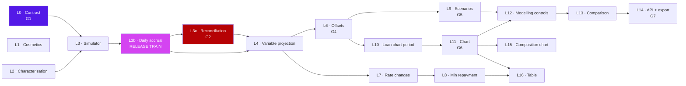

<!--
  NORMATIVE DELIVERY PLAN for the Loan Amortisation Modelling epic (#24).

  This is the full document. Between #28 and #36 the repository carried a 51-line
  summary of it. Do not replace this file with a summary again; add summaries alongside it.
-->

# Loan Amortisation Modelling — Delivery Breakdown

Companion to [`loan-amortisation-modelling.md`](./loan-amortisation-modelling.md).
That document is the **design blueprint**. This one is the **work management plan**: how the
blueprint becomes GitHub issues, sprints, and pull requests.

---

## 0. Repository setup — done

> **Status: complete.** Issues were disabled on the fork (inherited fork default) and have since been
> enabled; labels, milestones and all 19 issues are filed. The original blocker is retained below for
> the record.

### The original blocker

```
$ gh api repos/jaysbeekay/sure --jq '{has_issues, has_projects}'
{"has_issues": false, "has_projects": true}
```

`jaysbeekay/sure` inherited the fork default with **Issues turned off**. Nothing below can be filed
until that is switched on. It is a repository-settings change, so it is yours to make:

**Settings → General → Features → tick "Issues"**

or, equivalently:

```bash
gh api -X PATCH repos/jaysbeekay/sure -f has_issues=true
```

Also worth knowing before you start:

| Finding | Consequence |
|---|---|
| No milestones exist | Create six (one per sprint) — §4 |
| Only GitHub's default labels + `accessibility` | Create the label taxonomy — §4 |
| Projects **is** enabled | Use Projects v2 for the board; it carries the fields (Iteration, Estimate, Phase) that milestones cannot |
| Upstream `we-promise/sure` has issues enabled | Track everything in the fork; file upstream only when actually contributing a PR (§7) |

---

## 0.1 Filed — plan ID to GitHub issue

All 19 issues are filed in `jaysbeekay/sure`. **Epic: [#24](https://github.com/jaysbeekay/sure/issues/24).**
Milestones: `M1 — Loan engine` (7), `M2 — Loan configuration` (4), `M3 — Loan forecasting UX` (7).

| Plan ID | Issue |
|---|---|
| **L0** | [#6](https://github.com/jaysbeekay/sure/issues/6) |
| **L1** | [#7](https://github.com/jaysbeekay/sure/issues/7) |
| **L2** | [#8](https://github.com/jaysbeekay/sure/issues/8) |
| **L3** | [#9](https://github.com/jaysbeekay/sure/issues/9) |
| **L3b** | [#10](https://github.com/jaysbeekay/sure/issues/10) |
| **L3c** | [#11](https://github.com/jaysbeekay/sure/issues/11) |
| **L4** | [#12](https://github.com/jaysbeekay/sure/issues/12) |
| **L6** | [#13](https://github.com/jaysbeekay/sure/issues/13) |
| **L7** | [#14](https://github.com/jaysbeekay/sure/issues/14) |
| **L8** | [#15](https://github.com/jaysbeekay/sure/issues/15) |
| **L9** | [#16](https://github.com/jaysbeekay/sure/issues/16) |
| **L10** | [#17](https://github.com/jaysbeekay/sure/issues/17) |
| **L11** | [#18](https://github.com/jaysbeekay/sure/issues/18) |
| **L12** | [#19](https://github.com/jaysbeekay/sure/issues/19) |
| **L13** | [#20](https://github.com/jaysbeekay/sure/issues/20) |
| **L15** | [#21](https://github.com/jaysbeekay/sure/issues/21) |
| **L16** | [#22](https://github.com/jaysbeekay/sure/issues/22) |
| **L14** | [#23](https://github.com/jaysbeekay/sure/issues/23) |
| ~~L5~~ | *retired — merged into #10* |

Cross-references inside every issue body resolve to real numbers; the plan IDs above are retained
only so this document and the tracker stay legible against each other.

---

## 1. Issues or PRs? — the direct answer

**Both, and they are not the same unit.**

| | Issue | Pull request |
|---|---|---|
| **Answers** | *What are we building and why?* | *Here is the change; is it correct?* |
| **Lives for** | Days–weeks | Hours–days |
| **Owned by** | Whoever is planning | Whoever is coding |
| **Sized by** | A sprint's worth of value | A reviewer's attention span |
| **Closed when** | The capability works end to end | The diff merges |

The mistake to avoid is **1:1 mapping**. It forces you to either write issues so small they carry no
context ("add a column"), or PRs so large nobody reviews them properly. This plan has both problems
lurking: PR-2 (the calculation engine) is ~700 lines and genuinely indivisible, while the cosmetics
work is three one-line changes that share a single coherent goal.

**The rule used below:**

> **One issue per capability or architectural workstream. One PR per reviewable slice.
> Most issues are one PR. The three oversized ones are two.**

### The hierarchy

```
1 Epic issue  (tracking only — never closed by a PR)
 └── 18 work issues  (each = one sprint-sized chunk, each closed by its PR(s))
      └── 20 pull requests  (each = one reviewable slice)
```

The epic is a task list. GitHub renders task-list references as live checkboxes with status, so the
epic becomes a progress dashboard for free. It is the one place a stakeholder should need to look.

### Why not just PRs?

You *could* run this as a PR-only stack — that is what PRs #2/#3/#4 currently are. It breaks down
for three reasons this project will hit:

1. **A stacked draft PR is a terrible planning artifact.** It cannot be estimated, assigned, or
   sprint-planned before the code exists, and it cannot hold a discussion that outlives the branch.
2. **Some work has no PR yet is still work** — the design decisions in §11 open questions, the
   financial-correctness review of Phase 1, the decision on TypeScript in §10.
3. **You already have the evidence.** PRs #3 and #4 need closing (§7 of the design doc) precisely
   because the *intent* they carry is trapped inside code that is about to be rewritten. Intent
   belongs in an issue; code belongs in a PR.

---

## 2. Issue breakdown — 18 issues

Legend: **Est** = engineer-days · **Cx** = complexity (L/M/H) · **Risk** refs the design doc's §16.

### Epic

| ID | Title | Type |
|---|---|---|
| **E** | **[Epic] Loan Amortisation Modelling** | Tracking issue. Links both design docs, holds the task list of all 18, records the resolved decisions and the release gates. Never closed by a PR. |

### Phase 0 / 0.5 — Foundation and decisions

| ID | Title | Est | Cx | Blocked by | PR(s) | Requirements |
|---|---|---|---|---|---|---|
| **L0** | **Calculation contract and decision record** | 5 | M | — | PR-0 | §6.1, gate **G1** |
| **L1** | Loan page information architecture and labelling | 3 | L | — | PR-1 | FR-404, FR-510, FR-511 |
| **L2** | Characterisation test harness | 3 | M | — | PR-2a | §15.1 |

### Phase 1 — Calculation engine

| ID | Title | Est | Cx | Blocked by | PR(s) | Requirements |
|---|---|---|---|---|---|---|
| **L3** | Extract `Loan::Simulator` engine (incl. the four time boundaries) | 10 | **H** | L0, L2 | PR-2 | §11, C4/C9 |
| **L3b** | **Daily accrual release train** — accrual + version + backfill + rollout | 10 | **H** | L3 | PR-2b, PR-2c | FR-309, §6.2 |
| **L3c** | **Lender statement reconciliation** | 3 | M | L3b (PR-2b) | PR-2d | gate **G2** |
| **L4** | Variable-rate payoff projection | 5 | **H** | L3b, L3c | PR-3 | FR-401, FR-206 |
| ~~L5~~ | *Retired — merged into L3b (F4). A version bump that ships apart from the accrual it invalidates puts monthly rows beside daily cards.* | — | — | — | — | — |

### Phase 2 — Domain

| ID | Title | Est | Cx | Blocked by | PR(s) | Requirements |
|---|---|---|---|---|---|---|
| **L6** | Offset accounts + **shared-input visibility policy** | 7 | M | L4 | PR-4 | FR-105, FR-305–310, gate **G4** |
| **L7** | Origination date and rate change management (two clocks) | 6 | M | L4 | PR-5 | FR-102, FR-203, FR-205 |
| **L8** | Current minimum repayment and rate change table | 5 | M | L7 | PR-6 | FR-204, FR-405 |
| **L9** | Extra repayments and saved scenarios | 9 | M | L6 | PR-7a, PR-7b | FR-302, FR-303, FR-408, gate **G5** |

### Phase 3 — Experience

| ID | Title | Est | Cx | Blocked by | PR(s) | Requirements |
|---|---|---|---|---|---|---|
| **L10** | **Loan-scoped** all-time chart period | 2 | L | L6 | PR-8a | FR-501 |
| **L11** | Loan payoff chart on the account page | 6 | **H** | L10 | PR-8b | FR-502, FR-406, FR-509 |
| **L12** | Scenario modelling controls on the chart | 5 | M | L9, L11 | PR-9 | FR-503, FR-407, FR-311 |
| **L13** | Scenario comparison view | 5 | M | L12 | PR-10 | FR-409 |
| **L15** | **Interest-vs-principal composition chart** | 3 | L | L11 | PR-11 | **FR-504** |
| **L16** | **Amortisation table enhancements** | 2 | L | L8, L11 | PR-12 | **FR-505** |
| **L14** | Scenario API, CSV export, response hygiene, methodology doc | 6 | M | L13 | PR-13 | FR-506, FR-507, gate **G7** |

**Total: 95 engineer-days ≈ 19 working weeks at 100% allocation.** Up from 76d before architecture
review; the delta is L0 (5d), L3c (3d), the release-train engineering in L3b (+3d), the offset
visibility policy in L6 (+1d), scenario slots and reproducibility in L9 (+1d), response hygiene in
L14 (+1d), and FR-504/505 confirmed in scope as L15/L16 (5d).

**L10 is no longer dependency-free.** It was an isolated platform change; per F11 it is now scoped
to the loan chart path, which puts it behind L6. The generalised account-wide version is proposed
separately, upstream.

**L10 has no blockers and is only 2 days.** It is deliberately independent — a standalone
improvement affecting every account type, useful as filler when someone is blocked, and it wants its
own review with before/after screenshots for a *non-loan* account (design doc R10).

---

## 3. Sprint plan

Two-week sprints. Two views: solo, and two engineers.

### Solo — 10 sprints (19 weeks)

| Sprint | Issues | Days | Theme | Exit criteria |
|---|---|---|---|---|
| **S1** | L0, L1 | 8 | Decisions | **Gate G1**: §6.1 contract approved. Offset policy and scenario semantics signed off. **G2 statement sourcing started.** Cosmetics shipped |
| **S2** | L2, start L3 | 10 | Safety net | Characterisation tests green and pinning current output; verified to fail on a deliberate one-cent change |
| **S3** | L3 | 9 | Engine | Simulator passes the characterisation gate; four time boundaries explicit; **no behaviour change** |
| **S4** | L3b (PR-2b) | 6 | Daily accrual | Segment-equivalence test and benchmark green; re-baseline diff reviewed line by line |
| **S5** | L3b (PR-2c), L3c | 7 | Release train | **Gates G2 + G3**: statement reconciled; rebuild rehearsed on production-shaped data; rollback demonstrated. **2b and 2c deploy together** |
| **S6** | L4, start L6 | 10 | Variable + offsets | Variable loans get a projection; non-convergence surfaced in words |
| **S7** | L6, L7 | 10 | Offsets + rates | **Gate G4**: shared-input policy tested across link, grant, revoke and every output surface |
| **S8** | L8, L9 | 10 | Repayments | Bank-letter table reproduces ±$1; **Gate G5**: slot-cap concurrency and scenario authority tested |
| **S9** | L9, L10, L11 | 12 | The chart | Chart on the account page with real history; **Gate G6**: keyboard-operable, accessible data alternative |
| **S10** | L12, L13, L15, L16, L14 | 21 ⚠️ | Experience + platform | **Gate G7**: caching, versioning, CSV escaping verified |

⚠️ **S10 is over capacity at 21 days, and is drawn honestly rather than tidied.** The Phase 3 tail
is where scope pressure will actually land. Either add a sprint (11 total), bring a second engineer
in from S6, or defer L15/L16 — which are the two items the architecture review restored to MVP, so
deferring them is a scope decision to take deliberately with product, not silently under deadline.

### Two engineers — 6 sprints (12 weeks)

Engineer B is genuinely blocked for most of S1–S3; nothing depends only on itself until the engine
exists. Use that window for **Phase 0.5, G2 statement sourcing and the scenario-editor UX** — not
for invented parallel code work, which is how a second calculation path gets written.

| Sprint | Engineer A — engine | Engineer B — domain and UI |
|---|---|---|
| **S1** | L0 (calculation contract), L2 | L0 (privacy + scenario policy), L1 |
| **S2** | L3 | G2 statement sourcing; scenario UX design (blocked on code) |
| **S3** | L3b, L3c | Design work; review L3 |
| **S4** | L4, L9 | L6, L7 |
| **S5** | L14 | L8, L10, L11 |
| **S6** | L15, L16 | L12, L13 |

### Dependency graph



### Milestone-to-sprint mapping

| Milestone | Sprints | Ships |
|---|---|---|
| `M1 — Loan engine` | S1–S6 | Correct fixed + variable calculation on a daily accrual basis. **No new UI.** Exit: **G1, G2, G3** |
| `M2 — Loan configuration` | S7–S8 | Offsets, rate changes, repayments, scenarios. Exit: **G4, G5** |
| `M3 — Loan forecasting UX` | S9–S10 | Chart, modelling, comparison, composition chart, table, API. Exit: **G6, G7, G8** |

**M1 is releasable on its own**, but only through the full gate set — G1 (contract), G2 (lender
reconciliation) and G3 (rebuild rehearsed). It changes every persisted number for every existing
loan, so despite shipping almost no new UI it is the highest-consequence release in the programme.

---

## 4. GitHub setup

### Labels to create

```bash
REPO=jaysbeekay/sure

# Type
gh label create "type:epic"     --repo $REPO --color 5319E7 --description "Tracking issue for a body of work"
gh label create "type:feature"  --repo $REPO --color A2EEEF --description "New user-facing capability"
gh label create "type:refactor" --repo $REPO --color FBCA04 --description "Internal change, no behaviour change"
gh label create "type:chore"    --repo $REPO --color EDEDED --description "Tooling, docs, housekeeping"

# Area
gh label create "area:loans"       --repo $REPO --color D444F1 --description "Loan feature"
gh label create "area:calculation" --repo $REPO --color B60205 --description "Financial calculation — extra review required"
gh label create "area:charts"      --repo $REPO --color 0E8A16 --description "Data visualisation"
gh label create "area:api"         --repo $REPO --color 1D76DB --description "Public API — OpenAPI regeneration required"

# Risk and phase
gh label create "risk:high"    --repo $REPO --color B60205 --description "Touches persisted financial data"
gh label create "needs:design" --repo $REPO --color D876E3 --description "Blocked on design input"
gh label create "phase:0" --repo $REPO --color EDEDED
gh label create "phase:1" --repo $REPO --color EDEDED
gh label create "phase:2" --repo $REPO --color EDEDED
gh label create "phase:3" --repo $REPO --color EDEDED

# Upstream
gh label create "upstream:candidate" --repo $REPO --color 006B75 --description "Contribute to we-promise/sure"
```

`area:calculation` and `risk:high` are the ones that earn their keep: they are the trigger for the
two-reviewer rule in §6.

### Milestones

```bash
gh api -X POST repos/$REPO/milestones -f title="M1 — Loan engine"          -f description="Correct fixed and variable calculation. No new UI."
gh api -X POST repos/$REPO/milestones -f title="M2 — Loan configuration"   -f description="Offsets, rate changes, extra repayments, scenarios."
gh api -X POST repos/$REPO/milestones -f title="M3 — Loan forecasting UX"  -f description="Chart, modelling controls, comparison, API, export."
```

### Project board (Projects v2)

Milestones cannot carry estimates or iterations; the project can. Create one project,
**"Loan Amortisation Modelling"**, with these custom fields:

| Field | Type | Values |
|---|---|---|
| Status | Single select | `Backlog` · `Ready` · `In progress` · `In review` · `Blocked` · `Done` |
| Iteration | Iteration | 2-week sprints, S1–S7 |
| Estimate | Number | Engineer-days from §2 |
| Phase | Single select | `0 Foundation` · `1 Engine` · `2 Domain` · `3 Experience` |
| Risk | Single select | `Low` · `Medium` · `High` |

Two views: **Board** grouped by Status (daily standup), **Table** grouped by Iteration and sorted by
Estimate (sprint planning).

### Dependency tracking

GitHub has no native "blocked by". Three conventions, applied consistently:

1. Every issue body opens with a **`Blocked by: #NN`** line (or `— none —`).
2. The epic's task list is ordered by dependency, so reading top to bottom is the build order.
3. `Status = Blocked` on the project board, with the blocker named in a comment.

**Do not** rely on GitHub auto-linking to communicate order. It links, it does not sequence.

### Branch and PR conventions

Matching the existing branches on this fork (`feat/loan-payoff-chart`, `feat/loan-whatif-extra-payment`):

```
feat/loan-<slug>       # user-facing capability
refactor/loan-<slug>   # no behaviour change
chore/loan-<slug>      # docs, tooling
```

PR titles follow the repo's existing Conventional Commits style:
`feat(loans): …` · `refactor(loans): …` · `chore(loans): …`

PR body must include `Closes #NN` (or `Part of #NN` where an issue takes two PRs) so the board moves
itself.

---

## 5. Ready-to-file issue specifications

Each block below is a complete issue: title, labels, milestone, estimate, and body. Paste them, or
use the script in §8.

Every body follows the same template — **Blocked by · Context · Scope · Out of scope · Acceptance
criteria · Files · Verification** — so a reader knows where to look without reading prose.

---

### E — `[Epic] Loan Amortisation Modelling`

**Labels:** `type:epic`, `area:loans` · **Milestone:** none · **Estimate:** —

```markdown
Tracking issue for the Loan Amortisation Modelling feature.

**Design blueprint:** `docs/plans/loan-amortisation-modelling.md`
**Delivery plan:** `docs/plans/loan-amortisation-delivery-breakdown.md`
**Upstream context:** we-promise/sure#3295, we-promise/sure#3332, we-promise/sure#3296

## Goal
Turn loan accounts from a passive balance record into a forecasting and modelling surface:
real payoff dates, offset-aware interest, variable-rate handling, and "what if" scenarios.

## Phase 0 / 0.5 — Foundation and decisions
- [ ] #L0 Calculation contract and decision record  ← **blocks the engine**
- [ ] #L1 Loan page information architecture and labelling
- [ ] #L2 Characterisation test harness for amortisation output

## Phase 1 — Calculation engine
- [ ] #L3 Extract `Loan::Simulator` calculation engine
- [ ] #L3b Daily accrual release train (accrual + version + backfill + rollout)
- [ ] #L3c Lender statement reconciliation  ← **gate G2**
- [ ] #L4 Variable-rate payoff projection

## Phase 2 — Domain
- [ ] #L6 Offset accounts: linking and offset-aware interest
- [ ] #L7 Loan origination date and rate change management
- [ ] #L8 Current minimum repayment and rate change table
- [ ] #L9 Extra repayments and saved scenarios

## Phase 3 — Experience
- [ ] #L10 Loan-scoped all-time chart period
- [ ] #L11 Loan payoff chart on the account page
- [ ] #L12 Scenario modelling controls on the chart
- [ ] #L13 Scenario comparison view
- [ ] #L15 Interest-vs-principal composition chart
- [ ] #L16 Amortisation table enhancements
- [ ] #L14 Scenario API, CSV export, response hygiene, methodology doc

## Superseded work
- [ ] Close #3 — chart carried forward into #L11
- [ ] Close #4 — modelling carried forward into #L12; cherry-pick its `render_schedule_tab` frame fix into #L1
- [ ] Rebase #2 into #L4

## Resolved decisions
- [x] Forward offset — **flat at today's balance, daily accrual.** Averaging rejected; the sensitivity is the feature
- [x] "Variable + offset" — **composed display label**, no new `rate_type` enum value
- [x] Third chart line — **both modes**: "extra $X" and solve-for-payment-by-date
- [x] Recomputed minimum repayment — **display only**; the contracted schedule never tracks live balance (invariant A7)
- [x] TypeScript — **payload spec only**; this repo has no TypeScript
- [x] Offset visibility — **shared-input policy** (§13.2)
- [x] FR-504 / FR-505 — **in MVP** (#L15, #L16)

## Release gates
Evidence must be attached to the relevant issue or PR. See design doc §17.5.
- [ ] **G1** Calculation contract approved and represented in unit tests
- [ ] **G2** Lender statement reconciliation, incl. rate-change and offset cases
- [ ] **G3** Rebuild rehearsed on production-shaped data, rollback demonstrated
- [ ] **G4** Offset privacy tested across link, grant, revoke and every output surface
- [ ] **G5** Scenario authorisation and slot-cap concurrency tested
- [ ] **G6** Chart keyboard-operable with an accessible data alternative
- [ ] **G7** API/CSV caching, sharing and versioning approved
- [ ] **G8** Scope, issue count, PR count and milestone exit criteria agree
```

---

### L0 — `Calculation contract and decision record`

**Labels:** `type:chore`, `area:calculation`, `risk:high`, `phase:0`, `needs:design` · **Milestone:** M1 · **Est:** 5d

```markdown
Blocked by: — none — · **Blocks: #L3**

## Context
Architecture review found the plan contradicted itself on repayment timing, conflated two distinct
rate-change events, and left the simulator's time model under-specified. Each ambiguity produces
different numbers for the same loan, and an implementer would reasonably pick either.

This issue produces the decision record. **Time-boxed to a week** — its content is decisions already
recommended in the design doc needing sign-off, not open research.

## Scope
Produce `docs/loans/calculation-contract.md` covering:
- **The §6.1 contract table (C1–C16), approved.** Accrual basis, day count, charging, payment
  calendar, payment sizing, extra-repayment timing (C6), the two rate clocks (C7/C8), same-day
  event order (C9), effective-date inclusivity, rounding, final payment, offset floor and forward
  offset
- **Offset visibility: the shared-input policy**, approved (design §13.2)
- **Scenario semantics:** shared-household editing, live recompute, `calculator_version` and
  `last_calculated_at` (design §10.2)
- **The `ALGORITHM_VERSION` release, rebuild, rollback and reconciliation plan** (design §17.3)
- **Start G2 statement sourcing.** De-identifying a real lender statement has a privacy and approval
  path; discovering its lead time during M1's final week is how M1 slips

## Acceptance criteria
- [ ] Every row of the contract table has a decision, not a "TBD"
- [ ] Each contract row names the test that will demonstrate it (**gate G1**)
- [ ] `actual/365` and the C7/C8 timing are listed as **verify-against-a-real-statement** items
- [ ] Offset policy names the behaviour on access grant *and* revoke, not only on link
- [ ] The traceability table (design §17.7) is baselined with exactly one status per FR
- [ ] At least one de-identified statement identified and its approval path started

## Out of scope
Any code. This issue produces a document and a set of approvals.

## Files
`docs/loans/calculation-contract.md` (new)

## Verification
Sign-off from eng lead and product recorded on this issue.
```

---

### L1 — `Loan page information architecture and labelling`

**Labels:** `type:chore`, `area:loans`, `phase:0`, `upstream:candidate` · **Milestone:** M1 · **Est:** 3d

```markdown
Blocked by: — none —

## Context
Three independent presentation defects, grouped because they share one file set and one review.
Design doc: FR-404, FR-510, FR-511, debt items D7.

## Scope
- Reorder loan tabs to `Overview · Activity · Schedule · Statements`. `UI::AccountPage#active_tab`
  falls back to `tabs.first`, so Overview becomes the default landing tab (FR-511).
- Rename the chart title **value** for `UI.account.chart.title.remaining_principal_balance`
  to "Remaining loan balance". **Do not rename the key** — it appears in ~20 locale files (FR-510).
- Align `loans.tabs.overview.remaining_principal` to the same wording. One concept, one label (D7).
- Add an "Original payoff date" card to the Overview tab from
  `amortization_schedule.payoff_date`, falling back to the translated "Unknown" when the loan is
  not amortisable (FR-404).
- Cherry-pick the `UI::AccountPage#render_schedule_tab` turbo-frame fix from #4 — it is an
  independent bug fix and should not wait for that PR's fate.

## Out of scope
Any calculation change. Any chart change.

## Acceptance criteria
- [ ] Loading a loan account lands on Overview
- [ ] Chart title reads "Remaining loan balance"; Overview card matches
- [ ] Original payoff date renders, and degrades to "Unknown" for a loan with no rate or term
- [ ] Overview grid remains readable at 7 cards (move to 4-col at `md:` if needed)
- [ ] Non-English locales still resolve (key unchanged); stale wording noted in the PR body
- [ ] `test/controllers/accounts_controller_test.rb` and `test/system/loan_payoff_chart_test.rb`
      updated for the new default tab

## Files
`app/components/UI/account_page.rb` · `app/views/loans/tabs/_overview.html.erb` ·
`config/locales/views/components/en.yml` · `config/locales/views/loans/en.yml`

## Verification
`bin/rails test` · `bin/rubocop -a` · `bundle exec erb_lint ./app/**/*.erb -a`
```

---

### L2 — `Characterisation test harness for amortisation output`

**Labels:** `type:chore`, `area:calculation`, `risk:high`, `phase:0` · **Milestone:** M1 · **Est:** 3d

```markdown
Blocked by: — none —

## Context
#L3 rewrites the amortisation period loop. Real users have persisted schedules in
`loan_amortizations`. A silent change to their numbers is the worst outcome this project can
produce. Design doc §15.1 — **this is the merge gate on the entire Phase 1 refactor.**

## Scope
Pin the *current* output of `Loan::AmortizationSchedule#generate_schedule` before any refactor:
- Golden-master fixtures across fixed-rate, variable-rate-with-changes, zero-interest,
  short-term, and month-end-clamping (Jan 31 → Feb 28) cases
- Assert **every field of every row**, not just totals
- Assert the invariant `ending_balance[t] == beginning_balance[t+1]` throughout
- Assert the final period lands exactly on zero

## Out of scope
Any production code change. This issue adds tests only.

**And, critically: this is not a financial oracle.** It pins *current* behaviour so the refactor is
safe. It cannot tell you the new daily-accrual model matches a lender — once re-baselined in #L3b it
will preserve a new defect just as faithfully. **#L3c (gate G2) is the oracle.** Do not treat a green
characterisation suite as evidence of correctness.

## Acceptance criteria
- [ ] Tests pass against `main` **before** any refactor exists
- [ ] Tests fail loudly on a deliberately introduced one-cent change (verify this — an assertion
      that cannot fail is not a gate)
- [ ] At least one variable-rate case with two rate changes
- [ ] Minitest + fixtures. No RSpec, no factories.

## Files
`test/models/loan/amortization_schedule_test.rb` (extend) ·
`test/fixtures/**` (minimal additions)

## Verification
`bin/rails test test/models/loan/`
```

---

### L3 — `Extract Loan::Simulator calculation engine`

**Labels:** `type:refactor`, `area:calculation`, `risk:high`, `phase:1`, `upstream:candidate` · **Milestone:** M1 · **Est:** 10d

```markdown
Blocked by: #L0, #L2

## Context
Three near-duplicate period loops exist (design doc D1). Every capability in this project wants a
fourth. Collapse them into one resolver-driven loop. Design doc §11.

**This issue must produce no behaviour change.** Its success criterion is that #L2's tests still
pass unmodified.

## Scope
- `Loan::Simulator` (`app/models/loan/simulator.rb`) taking resolvers, not scalars
- **The four time/balance boundaries (contract C4, review finding F3)** — not one
  `starting_payment_date`: `starting_balance`, `starting_balance_as_of`, `accrual_start_date`,
  `payment_schedule`. A projection begun mid-cycle accrues a **stub period** to the loan's next
  contractual payment date; it does not re-anchor the calendar on today
- **Two rate clocks (C7/C8):** `accrual_rate_for(date)` and `re_amortisation_events(from, to)` are
  separate inputs. A rate change alters accrual from its effective date and the minimum repayment
  from the next payment date
- `offset_for` / `extra_for` return **change points over a range**, not a value per date
- `EVENT_ORDER` as a **constant** implementing C9 — not a caller parameter; configurable ordering
  would let two callers produce different numbers for the same loan
- `payment_strategy: :hold | :reamortize`
- `Loan::SimulationResult` — immutable; `converged?`, `balloon_amount`, totals, `compare_to`
- `Loan::RateResolver` — wraps `Loan#current_variable_rate`; constant lambda for fixed loans
- `Loan::AmortizationMath.step` gains optional `interest_bearing_balance:` defaulting to `balance:`
  (backwards compatible; offset support lands in #L6)
- Refactor `Loan::AmortizationSchedule` to configure the simulator. **Public API unchanged.**

## Out of scope
`PayoffProjection` (#L4). Offsets (#L6). Extra repayments (#L9). Any UI.

## Acceptance criteria
- [ ] #L2's characterisation tests pass **unmodified**
- [ ] Rate segmentation still amortises over payments remaining to **maturity**, not segment length
- [ ] `BigDecimal` throughout; no `Float` anywhere in the loop
- [ ] `:hold` keeps the payment and shortens the term; `:reamortize` changes the payment and holds the term
- [ ] Convergence guard intact: a run that exhausts its cap reports `converged? == false`, never a
      fabricated payoff date
- [ ] Simulator takes values and lambdas — it never reads `Loan` directly
- [ ] `MAX_TERM_MONTHS` iteration cap preserved
- [ ] **Stub-period test:** a projection begun mid-cycle accrues exactly the days from today to the
      next contractual payment date — no dropped day, no double-count
- [ ] **Same-day ordering test** for each pair in C9 (rate change + payment, payment + extra
      repayment, extra repayment + offset movement)
- [ ] Month-end clamping preserved: Jan 31 → Feb 28 → Mar 28, **not** Mar 31

## Files
New: `app/models/loan/{simulator,simulation_result,rate_resolver}.rb`,
`test/models/loan/simulator_test.rb`
Modified: `app/models/loan/{amortization_schedule,amortization_math}.rb`

## Verification
`bin/rails test` · `bin/rubocop -a` · **two reviewers, one with financial-modelling background**
```

---

### L3b — `Daily accrual release train`

**Labels:** `type:feature`, `area:calculation`, `risk:high`, `phase:1` · **Milestone:** M1 · **Est:** 10d · **PRs:** 2b (accrual) + 2c (release) — **merged and deployed together**

```markdown
Blocked by: #L3

## Context
Home loans accrue interest **daily** on the end-of-day balance and charge it monthly. For an offset
loan monthly accrual is not a simplification — it is structurally incapable of expressing the
feature, because it cannot see a balance that moves between payment dates.

**This issue absorbs the former L5 (version bump + backfill), which is retired.** They were separate, and architecture
review was right that separating them is a defect: daily accrual shipping ahead of the schedule
rebuild puts monthly-accrual payment table rows beside daily-accrual summary cards on the same
screen. Inconsistent numbers on a financial product is the exact outcome this design exists to
prevent (risk R21).

Design doc §6.2, FR-309, contract rows C1–C3, C13, C15.

## Scope — PR 2b (the calculation)
- `Loan::InterestAccrual`: `DAY_COUNT = 365` as a named constant with a seam
- Accrue over **piecewise-constant segments**, not day by day:
  `Σ segment_days × max(0, balance − offset) × annual_rate / 100 / 365`
- Accumulate unrounded; round **once**, at the monthly charge point (C13)
- `AmortizationMath.step` takes a pre-computed `interest:` and keeps the principal / rounding /
  final-period logic
- Applies to **all loans**. The non-offset case is the one-segment degenerate form
- **Deliberately re-baseline #L2's characterisation tests**

## Scope — PR 2c (the release)
- `ALGORITHM_VERSION` 2 → 3
- Readable `algorithm_version` and `generated_at` columns on `loan_amortizations`, alongside the
  existing `schedule_signature` (which bakes the version into a digest and so cannot be queried)
- `rake loans:rebuild_schedules` — **batched and rate-limited**, idempotent, progress-logged
- **Sampled dual calculation** (old vs new) across a representative loan population, with the
  variance distribution reviewed — a long tail is a defect signal, not noise
- Prebuild in controlled batches; **never rely on page-view-triggered enqueues**
- Monitoring: queue depth, failed rebuilds, stale schedules, calculation variance
- Demonstrated rollback path

## Acceptance criteria — calculation
- [ ] A full year of daily accrual at a constant balance equals `balance × annual_rate` **exactly**
- [ ] A 31-day month accrues more than a 28-day month at the same balance and rate
- [ ] A leap year accrues 366/365 — **asserted, so nobody "fixes" it**
- [ ] **Segment-equivalence test:** N segments equal an N-day loop over the same balances.
      *This test is what licenses the optimisation; without it the optimisation is a guess*
- [ ] Interest accumulates unrounded and rounds only at the charge point
- [ ] Offset moving mid-period pro-rates by day count; offset ≥ balance zeroes only those days
- [ ] **Benchmark failing the build on regression:** a 4-simulation comparison request on a 30-year
      loan whose offset changes 30×/month completes in < ~50ms
- [ ] Accrual reads `balances` directly and **never** `Balance::ChartSeriesBuilder`, whose interval
      is period-dependent (risk R17)

## Acceptance criteria — release (gate G3)
- [ ] Rebuild rehearsed on production-shaped data, timed, with queue and failure thresholds recorded
- [ ] Dual-calculation variance report attached to the PR and reviewed
- [ ] Rollback demonstrated, not merely described
- [ ] **The characterisation re-baseline is reviewed line by line and justified in the PR body** —
      the highest-scrutiny diff in the programme (risk R16)
- [ ] **2b and 2c deploy together.** #L4 does not merge until both have shipped and G2 has passed

## Files
New: `app/models/loan/interest_accrual.rb`, `test/models/loan/interest_accrual_test.rb`,
`db/migrate/*_add_algorithm_version_to_loan_amortizations.rb`, `lib/tasks/loans.rake`
Modified: `app/models/loan/{simulator,amortization_math,amortization_schedule}.rb` ·
`test/models/loan/amortization_schedule_test.rb` (re-baseline)

## Verification
`bin/rails test` · benchmark · rebuild rehearsal · **two reviewers, one with financial-modelling
background**
```

---

### L3c — `Lender statement reconciliation`

**Labels:** `type:chore`, `area:calculation`, `risk:high`, `phase:1` · **Milestone:** M1 · **Est:** 3d · **Gate: G2**

```markdown
Blocked by: #L3b (PR-2b) · **Blocks the daily-accrual release**

## Context
#L2's characterisation tests protect the *refactor*. Once deliberately re-baselined for daily
accrual, they pin whatever the new model produced — **correct or not** — and will preserve a defect
just as faithfully as correct behaviour.

Architecture review's sharpest finding: characterisation is not a financial oracle. Nothing in the
plan currently establishes that the daily model matches a real lender. This issue is that oracle
(risk R20).

## Scope
- Reconcile against **at least one real, de-identified lender statement** across a full cycle,
  covering different month lengths
- Plus: one mid-cycle rate change, one offset movement, one extra repayment
- Plus: an **independently implemented** reference calculation for the fixed / no-offset case —
  written from the formula, not from the simulator, ideally by someone who did not write #L3
- Record tolerances, and a documented reason for **every** mismatch
- If reconciliation shows `actual/365` is only an approximation for that lender, **the UI copy must
  say so** rather than the constant being quietly tuned to fit one statement

## Out of scope
Production code changes, unless reconciliation reveals a defect — in which case fix it in #L3b.

## Acceptance criteria
- [ ] Statement reconciled; every line of divergence explained, none merely tolerated
- [ ] Mid-cycle rate change reconciles under the C7/C8 two-clock rule
- [ ] Offset movement reconciles to the day
- [ ] Independent reference calculation agrees for fixed / no-offset
- [ ] Findings recorded in `docs/loans/methodology.md`
- [ ] **Gate G2 signed off before #L3b deploys**

## Files
`test/models/loan/reconciliation_test.rb` (new, fixture-backed with de-identified data) ·
`docs/loans/methodology.md`

## Verification
`bin/rails test` · finance reviewer sign-off recorded on this issue
```

---

### L4 — `Variable-rate payoff projection`

**Labels:** `type:feature`, `area:calculation`, `risk:high`, `phase:1`, `upstream:candidate` · **Milestone:** M1 · **Est:** 5d

```markdown
Blocked by: #L3

## Context
`Loan::PayoffProjection#applicable?` requires `fixed_rate?`, and `#generate_schedule` /
`#unamortizable_payment?` read a scalar `loan.interest_rate`. Variable loans therefore get no
projection at all. Design doc D2, FR-401, FR-206. Supersedes PR #2.

## Scope
- Refactor `PayoffProjection` onto `Loan::Simulator` with `payment_strategy: :hold`
- **Remove the `fixed_rate?` gate**
- Fix `loan.interest_rate / 100.0` — `Float` → `BigDecimal`
- Correct `unamortizable_payment?` to use the rate at the first projected period and (once #L6
  lands) the interest-bearing balance
- Show the projected payoff date whenever the simulation converges. **Drop the
  `months_saved.abs > 1 || interest_saved.abs >= 1` gate from the date card** — keep it only on the
  "X months sooner / interest saved" comparison framing, where its rounding rationale holds
- Add the explicit non-convergence state (FR-206): a translated message, not a hidden card
- Extend `payoff_projection_signature` to include today's date, so an overnight rate change is not
  served from a memo

## Out of scope
Offsets (#L6). Daily accrual and the `ALGORITHM_VERSION` release train (#L3b). The chart (#L11).

## Acceptance criteria
- [ ] A variable-rate loan with two recorded rate changes produces a projection
- [ ] A fixed-rate loan's projection is unchanged from before this issue
- [ ] Payment ≤ interest ⇒ `converged? == false` and a visible, translated explanation
- [ ] No `Float` in the projection path
- [ ] Read path still never writes: a stale schedule enqueues a rebuild and reads what is persisted

## Files
`app/models/loan/payoff_projection.rb` · `app/models/loan.rb` ·
`app/views/loans/tabs/_schedule.html.erb` · `config/locales/views/loans/en.yml`

## Verification
`bin/rails test` · two reviewers
```

---

### L5 — *retired*

Merged into **#L3b** (the daily accrual release train). A version bump that ships apart from the
accrual it invalidates puts monthly-accrual rows beside daily-accrual cards on the same screen.
See architecture-review finding F4 / risk R21.

---

### L6 — `Offset accounts, offset-aware interest, and the shared-input visibility policy`

**Labels:** `type:feature`, `area:loans`, `area:calculation`, `risk:high`, `phase:2` · **Milestone:** M2 · **Est:** 7d · **Gate: G4**

```markdown
Blocked by: #L4

## Context
The string "offset" appears nowhere in `app/models` or `db/schema.rb`. This is net-new domain.
Design doc §5.3, §6.5, §10.2, FR-105, FR-305–308.

Follow the `goal_accounts` precedent exactly — it solves the identical problem.

## Scope
- Migration: `loan_offset_accounts` (uuid pk, `loan_id`, `account_id`, unique index, FKs)
- `LoanOffsetAccount` model; `Loan has_many :offset_accounts, through:`
- Validations mirroring `Goal`'s: asset classification, **matching currency**, same family,
  not the loan account itself
- **The shared-input visibility policy (design §13.2), approved in #L0.** An account may be linked
  as an offset **only if every user who can access the loan can also access that account.**
  Enforced at the link, so every downstream surface is safe by construction and needs no conditional
  suppression:
  - the picker offers only accounts satisfying the rule **for this loan** — not merely
    `Current.user.accessible_accounts`
  - **granting** a user loan access re-validates existing links; **revoking** offset access
    invalidates the link and the loan reverts to non-offset math with a visible notice
  - outputs are unconditional: anyone who can see the loan sees every offset-derived figure
- **No `offset_enabled` column** — offset is on iff `offset_accounts.any?`
- `Loan::OffsetResolver`: yields offset **change points** over a range.
  **Accrual reads `balances` directly (daily rows).** `Balance::ChartSeriesBuilder` is used only for
  the chart line — its interval is period-dependent and would silently feed monthly points into a
  daily accrual (risk R17). Forward = the accounts' current total, held flat day by day
- Wire `offset_for(date)` into the simulator; interest accrues on `max(0, balance − offset)`
- Form: offset picker revealed when `rate_type == "variable"`. Overview "Type" card renders
  **"Variable + offset"** when `rate_type == "variable" && offset_accounts.any?`
- Visible, translated disclosure of the flat-forward assumption

## Out of scope
Scheduled offset changes (future). Multi-currency offsets (rejected by validation).

## Acceptance criteria
- [ ] Offset reduces **interest**, not the displayed balance; the term shortens
- [ ] **Moving $50,000 into a linked offset changes the projected payoff date on the next page load;
      moving it out restores it** (FR-310). No averaging, no smoothing — the sensitivity is the feature
- [ ] A 1-day deposit saves ~1/30 of a month's offset benefit, not a full month's
- [ ] Offset ≥ balance ⇒ zero interest for those **days**, no negative interest, no infinite loop
- [ ] Offset = 0 produces output identical to a non-offset loan
- [ ] **Sign handling asserted in a test** — `ChartSeriesBuilder`'s `sign_multiplier` is −1 for
      liabilities, so both series return positive; the subtraction depends on it (risk R4)
- [ ] **Shared-input policy (gate G4):** link permitted when all loan-accessible users can see the
      offset; **rejected** when one cannot, with a message naming the shortfall
- [ ] Granting a new user loan access re-validates existing links
- [ ] Revoking offset access invalidates the link; the loan reverts to non-offset math with a notice
- [ ] **No surface** — page, chart payload, saved scenario, comparison, API, CSV, background job —
      emits an offset-derived figure to a user who cannot see the offset account
- [ ] *Note why field-level suppression was rejected:* the offset balance is recoverable by
      inference from the payoff date, interest saved or chart deltas. Hiding the field while
      publishing the derived figure leaks it anyway (risk R22)
- [ ] Different-currency account is rejected at link time, never silently converted
- [ ] Deleting an offset account cascades the link; the loan still computes
- [ ] Removing the last link reverts the loan to non-offset math with no data loss

## Files
New: `db/migrate/*_create_loan_offset_accounts.rb`, `app/models/loan_offset_account.rb`,
`app/models/loan/offset_resolver.rb`, `test/models/loan/offset_resolver_test.rb`
Modified: `app/models/loan.rb` · `app/models/loan/simulator.rb` ·
`app/views/loans/_form.html.erb` · `app/views/loans/tabs/_overview.html.erb` ·
`app/controllers/loans_controller.rb`

## Verification
`bin/rails test` · `bin/brakeman --no-pager` · **one engineer + one security-aware reviewer**
```

---

### L7 — `Loan origination date and rate change management`

**Labels:** `type:feature`, `area:loans`, `phase:2`, `upstream:candidate` · **Milestone:** M2 · **Est:** 6d

```markdown
Blocked by: #L4

## Context
`variable_rate_schedule` (jsonb) has complete model support — validation, normalisation,
`add_variable_rate_change`, `current_variable_rate`, inclusion in the schedule signature — and
**zero UI**. Neither it nor `start_date` is in
`LoansController.permitted_accountable_attributes`. Design doc D4, FR-102, FR-203, FR-205.

## Scope
- Permit `start_date` and render it in the loan form. When blank, the schedule falls back to
  `account.opening_anchor_date` (current behaviour) — say so in the form
- Rate-change editor: repeatable `{effective date, rate}` rows, revealed when
  `rate_type == "variable"`. Use `DS::Disclosure` or native `<details>` (Hotwire-first convention)
- **Accept structured `{effective_date, rate}` pairs and assemble the jsonb in the model.**
  Do not permit a free-form jsonb hash — Brakeman will flag it, correctly (risk R13)
- Past rate changes listed read-only; highlight the switch row in the amortisation table (FR-205)

## Out of scope
The recomputed-minimum-repayment table (#L8). Provider-sourced rates (future).
Migrating the jsonb to a table — deliberately **not** doing this; design doc §10.2.

## Acceptance criteria
- [ ] `start_date` is editable; changing it invalidates the signature and enqueues a rebuild
- [ ] A rate change can be added, edited and removed; a duplicate effective date replaces rather
      than duplicating (matching `add_variable_rate_change` merge semantics)
- [ ] Existing model validation errors (invalid date, non-numeric, outside 0–100) surface as
      inline field errors, not a flash
- [ ] Brakeman clean — no free-form jsonb mass assignment
- [ ] Adding a rate change triggers a schedule rebuild

## Files
`app/controllers/loans_controller.rb` · `app/views/loans/_form.html.erb` ·
`app/models/loan.rb` · `app/views/loans/tabs/_schedule.html.erb` ·
`config/locales/views/loans/en.yml`

## Verification
`bin/rails test` · `bin/brakeman --no-pager` · `bundle exec erb_lint ./app/**/*.erb -a`
```

---

### L8 — `Current minimum repayment and rate change table`

**Labels:** `type:feature`, `area:loans`, `area:calculation`, `phase:2` · **Milestone:** M2 · **Est:** 5d

```markdown
Blocked by: #L7

## Context
`AmortizationSchedule#monthly_payment` computes from `original_balance` at the rate effective on the
*first* payment date. For a variable loan years in, that number is meaningless — which is why
`_overview.html.erb` currently prints a hardcoded `N/A` for every non-fixed loan.
Design doc §6.3, FR-204, FR-405.

## Scope
- `Loan#current_minimum_payment`:
  - fixed → `amortization_schedule.monthly_payment` (unchanged)
  - variable → level payment on the current interest-bearing balance, at
    `current_variable_rate(today)`, over months remaining to the **original maturity**
- Replace the `N/A` branch on Overview; sub-label with the rate used
- Show the same figure on the Schedule tab — the two tabs must not disagree
- `UI::Loan::RateChangeTable` — one row per **future** rate change, in the lender-letter shape:
  current balance · current rate · new rate · effective date · current min. repayment ·
  new min. repayment. The "new" figure uses the **simulated balance at the effective date**,
  which the engine produces for free
- Translated caption stating the assumptions (offset flat, no extra repayments, remaining term to
  original maturity)
- Revise the existing `variable_rate_notice` copy — the schedule now re-amortises at each change

## Acceptance criteria
- [ ] **Worked example reproduced within ±$1.00**, with the tolerance justified in a code comment:
      `P = 400,762.12` @ 6.18%, n = 277 → **$2,719.33** (lender: $2,719.04)
      `P = 400,762.12` @ 5.93%, n = 279 → **$2,650.32** (lender: $2,651.07)
- [ ] Overview and Schedule show the same figure for the same loan
- [ ] Fixed-rate loans are unaffected
- [ ] Empty state when a variable loan has no scheduled changes

## Files
New: `app/components/UI/loan/rate_change_table.{rb,html.erb}`
Modified: `app/models/loan.rb` · `app/views/loans/tabs/_overview.html.erb` ·
`app/views/loans/tabs/_schedule.html.erb` · `config/locales/views/loans/en.yml`

## Verification
`bin/rails test` · manual check against a real lender letter if one is available
```

---

### L9 — `Extra repayments and saved scenarios`

**Labels:** `type:feature`, `area:loans`, `phase:2` · **Milestone:** M2 · **Est:** 8d · **PRs:** 7a (models) + 7b (UI)

```markdown
Blocked by: #L6

## Context
Design doc §6.6, §10.2, FR-302, FR-303, FR-408. Supersedes PR #4, whose `monthly_equivalent`,
request-boundary validation and no-mutation tests carry forward.

**Reuse `RecurringTransaction::Schedule` for cadence resolution.** Its constructor takes plain
keywords (`expected_day_of_month:`, `rules:`, `anchor_date:`, `weekend_adjust:`) and does not
require a `RecurringTransaction`. Do not write a second recurrence engine. The *table*
(`recurrence_rules`) is not reusable — `recurring_transaction_id` is `null: false` — so this issue
adds its own columns rather than making an unrelated subsystem polymorphic.

## Scope — PR 7a (models)
- Migrations: `loan_scenarios`, `loan_extra_repayments` with the check constraints from design §10.2
- `LoanScenario`, family-scoped (matching the `Goal` precedent); `created_by_user_id` for
  attribution only, never access control
- **Cap of 5 enforced structurally: allocated slots with a unique `(loan_id, slot)` index**, slot in
  0..4. *A `position < 5` row check does not bound the row count — five rows can all hold position 0
  — and model-level counting races under concurrent creation (finding F8).*
- **No unique index on `(loan_id, name)`** — accounts are shared per-user via `account_shares`, so a
  unique name index would turn a cosmetic collision between housemates into an error
- **Scenario semantics (F7):** shared household artifacts — anyone who can see the loan may edit or
  delete any scenario on it, with the creator shown and a warning before deleting someone else's.
  Results are **live estimates**, recomputed against current loan data on every view and labelled as
  such; `calculator_version` and `last_calculated_at` are stored so support can tell which engine
  produced a figure a user is quoting. The simulation result itself is **not** persisted
- `LoanExtraRepayment` — `one_off` (amount + date) and `recurring` (amount + cadence + interval +
  optional start/end)
- **Contract C6 — exact-date semantics.** An extra repayment takes effect at the **end of its own
  effective date**; the balance drops that day and subsequent days accrue on it. Payment dates never
  defer it. *(This replaces the earlier "applies at the next scheduled payment" rule, which
  contradicted the daily-accrual model — architecture-review finding F1.)*
- **Recurrence materialises to exact dates**, never to a monthly-equivalent figure
- `Loan::RepaymentPlan` — materialises both into per-date amounts; delegates recurrence
- Wire `extra_for(date)` into the simulator
- Sub-monthly cadences converted to monthly equivalents, **stated in the UI**

## Scope — PR 7b (UI)
- Scenario CRUD (`Loans::ScenariosController`), editor in a `DS::Dialog`
- Reuse `frequency_fields_controller.js` for cadence-dependent fields
- Transient scenario params via query string, validated at the request boundary

## Out of scope
The chart (#L11). Modelling controls on the chart (#L12). Comparison (#L13).

## Acceptance criteria
- [ ] One-off on an exact payment date, **and between dates — applied on its own date (C6), not
      deferred to the next payment**
- [ ] A $500 weekly repayment produces 52 balance reductions a year, not 12 monthly equivalents
- [ ] **Slot-cap concurrency test (gate G5):** two simultaneous creates on a loan with 4 scenarios
      produce one success and one clean rejection, never 6 rows
- [ ] Two family members who can both see the loan can each edit or delete any scenario, with the
      creator attributed
- [ ] A saved scenario recomputes against the current balance and is labelled as a live estimate
- [ ] Recurring monthly; recurring weekly converted to a monthly equivalent with the UI saying so
- [ ] Extra repayment larger than the remaining balance is capped; no negative balance
- [ ] The 6th scenario is rejected at both the model and DB layers
- [ ] Two family members who both see the loan can each save a scenario named "Aggressive"
- [ ] A scenario is visible to anyone who can see the loan; attribution shows who created it
- [ ] **A scenario request mutates nothing** — `account.balance` and the `loan_amortizations` count
      unchanged (carry PR #4's test forward verbatim)
- [ ] Malformed params fall back to baseline silently; no 500 (carry PR #4's tests forward)
- [ ] Deleting a loan cascades scenarios and repayments
- [ ] Scenario names are HTML-escaped in labels and `data-*` payloads

## Files
New: `db/migrate/*_create_loan_scenarios.rb`, `db/migrate/*_create_loan_extra_repayments.rb`,
`app/models/{loan_scenario,loan_extra_repayment}.rb`, `app/models/loan/repayment_plan.rb`,
`app/controllers/loans/scenarios_controller.rb`, `app/views/loans/scenarios/*`,
`test/models/loan_scenario_test.rb`
Modified: `app/models/loan.rb` · `app/controllers/accounts_controller.rb`

## Verification
`bin/rails test` · `bin/brakeman --no-pager`
```

---

### L10 — `Loan-scoped all-time chart period`

**Labels:** `type:refactor`, `area:charts`, `phase:3`, `upstream:candidate` · **Milestone:** M3 · **Est:** 2d

```markdown
Blocked by: #L6

## Context
`Period::PERIODS["all_time"]` computes its start from `Current.family&.oldest_entry_date` —
**family**-scoped. A loan opened last year in a family with five years of history charts four years
of `COALESCE`-to-zero before the loan exists, then jumps. Design doc D5, FR-501.

**Scoped to the loan chart only (architecture-review finding F11).** The generalised version —
account-scoped all-time for *every* account type — is a real improvement, but it would change
investment, depository and property charts on the back of a loan requirement, with no acceptance
criteria for those types and no product sign-off a loan epic can credibly obtain. A before/after
screenshot is evidence, not a regression strategy.

Isolate it now; propose the general change separately, upstream, where it can carry its own fixtures
and sign-off (risk R10, R11).

## Scope
- When the requested period key is `all_time` **on a Loan account's chart**, substitute
  `Period.custom(start_date: <account's own earliest date>, end_date: Date.current)`
- Reuse `Balance::BaseCalculator#calculation_start_date`, which already computes
  `min(opening_anchor_date, oldest entry date)` — do not duplicate the expression
- Leave `Period::PERIODS` untouched (net worth, reports and the dashboard depend on it)

## Acceptance criteria
- [ ] A loan account's "All" chart starts at the loan's own origination, not the family's oldest entry
- [ ] No leading flat-zero segment
- [ ] **Depository, investment, property and vehicle charts are provably unchanged** — the branch is
      loan-only. Assert this in a test, not by inspection
- [ ] Family-level charts (net worth, reports) are unchanged
- [ ] A follow-up issue is filed proposing the generalised change upstream

## Files
`app/models/account/chartable.rb` (or `app/components/UI/account/chart.rb`)

## Verification
`bin/rails test` · manual check on a depository, an investment and a property account
```

---

### L11 — `Loan payoff chart on the account page`

**Labels:** `type:feature`, `area:charts`, `area:loans`, `phase:3` · **Milestone:** M3 · **Est:** 6d

```markdown
Blocked by: #L6, #L10

## Context
PR #3 built a good D3 controller but drew its "history" line from the **persisted contracted
schedule**, on the stated premise that the app does not track actual historical balances. That
premise is false — `balances` holds a daily per-account series and `Account#balance_series` already
renders it on the same page. Design doc D3, FR-502, FR-509. Supersedes PR #3.

## Scope
- Branch `UI::Account::Chart` — `loan-payoff-chart` for `Loan` accountables, `time-series-chart`
  otherwise. Shell (title, figure, trend, period picker) unchanged.
  **Do not teach `time_series_chart_controller.js` about projections.**
- Rewrite the payload: solid **actual** history from `balances`; a second solid "net of offset" line
  when offsets are linked; the contracted schedule as a thin, low-contrast dashed line spanning the
  full width; the projection as a dashed forward line
- Seed the origination point explicitly, so a loan with no balance rows yet still starts correctly
- Extract serialisation out of `Loan#payoff_chart_payload` into `Loan::ChartPayload` (D8)
- `UI::Loan::ChartLegend` component — replaces the inline-`style=` `<ul>` in `_schedule.html.erb`
- **Colours from design tokens**, not hardcoded hex (D6). New tokens go in
  `design/tokens/sure.tokens.json`; run `npm run tokens:build`; commit JSON + `_generated.css`
  together; bump the root `$version` minor
- Remove the chart from the Schedule tab
- Extend the server-rendered `sr-only` description to cover every line (FR-509)

## Out of scope
Scenario controls (#L12). Comparison (#L13).

## Acceptance criteria
- [ ] Solid line is the real balance series, including extra repayments actually made
- [ ] Offset-net line appears only when offsets are linked
- [ ] Default view is **three** lines; density remains legible at 256px height
- [ ] Ahead/behind is conveyed in **words**, not colour alone
- [ ] `sr-only` summary carries the same figures as the visible cards
- [ ] Dates parsed component-wise, never `new Date(str)`
- [ ] Redraw on resize, theme change, and `turbo:render` / `turbo:frame-load`
- [ ] Payload container carries `privacy-sensitive`
- [ ] No hardcoded hex colours
- [ ] `npm run lint` clean

## Files
New: `app/models/loan/chart_payload.rb`, `app/components/UI/loan/chart_legend.{rb,html.erb}`
Modified: `app/components/UI/account/chart.{rb,html.erb}` ·
`app/javascript/controllers/loan_payoff_chart_controller.js` ·
`app/views/loans/tabs/_schedule.html.erb` · `app/models/loan.rb` ·
`design/tokens/sure.tokens.json` · `app/assets/tailwind/sure-design-system/_generated.css`

## Verification
`bin/rails test` · `npm run lint` · **one engineer + one designer**
```

---

### L12 — `Scenario modelling controls on the chart`

**Labels:** `type:feature`, `area:loans`, `area:charts`, `phase:3` · **Milestone:** M3 · **Est:** 5d

```markdown
Blocked by: #L9, #L11

## Context
The what-if form from PR #4 lives inside the Schedule tab's turbo frame; the chart it drives is now
outside that frame. Design doc §7.2 Flow B, FR-503.

## Scope
- Move scenario controls into the chart card, beside the period picker, as a GET form on
  `account_path` using the existing `auto_submit_form_controller.js`. The precedent is two lines
  away — the `chart_view` select already does exactly this
- Add the scenario line to the chart
- Extra amount + cadence, one-off repayments, assumed offset balance
- "Modelling +$X per month" label; one-click clear back to baseline
- One-tap presets for the empty state: **+$100/mo · +$500/mo · round up to the next $100**
- "Save this scenario" hand-off to #L9's editor

## Explicitly rejected
Keeping the form in the tab and broadcasting to the chart frame — a cross-frame dependency for no
benefit. Client-side scenario state — breaks the back button, unshareable, duplicates financial
logic into JS.

## Acceptance criteria
- [ ] A scenario is fully reconstructible from the URL; back button correct; shareable
- [ ] Auto-submit on change; the explicit submit button still works with JS disabled
- [ ] Malformed params fall back to baseline silently
- [ ] A user with no scenario sees presets, not a blank input (persona P1)
- [ ] Transient one-offs capped at ~5, beyond which the UI prompts to save the scenario

## Files
`app/components/UI/account/chart.{rb,html.erb}` ·
`app/javascript/controllers/loan_payoff_chart_controller.js` ·
`app/controllers/accounts_controller.rb` · `config/locales/views/loans/en.yml`

## Verification
`bin/rails test` · one system test: entering an extra repayment updates the chart and the cards
```

---

### L13 — `Scenario comparison view`

**Labels:** `type:feature`, `area:loans`, `phase:3` · **Milestone:** M3 · **Est:** 5d

```markdown
Blocked by: #L12

## Context
Design doc §8.3, FR-409, persona P3 (refinancers).

## Scope
- `UI::Loan::ScenarioComparison` — baseline + up to 2 saved scenarios side by side
- Metrics: payoff date, term, total interest, total repayments, monthly cost, deltas vs. baseline
- Grouped horizontal bars for payoff duration, using the existing `bar_chart_controller.js`
- `DS::SegmentedControl` for scenario selection (documented as a mode switch, not a tab widget)
- Overlay the selected scenarios' lines on the chart

## Acceptance criteria
- [ ] Up to 4 simulations per request stays responsive
- [ ] A non-converging scenario is shown as such, never as a blank row
- [ ] Deltas are signed and directional in words, not colour alone
- [ ] Scenario names are HTML-escaped

## Files
New: `app/components/UI/loan/scenario_comparison.{rb,html.erb}`
Modified: `app/views/loans/tabs/_schedule.html.erb` · `config/locales/views/loans/en.yml`

## Verification
`bin/rails test` · one engineer + one designer
```

---

### L15 — `Interest-vs-principal composition chart`

**Labels:** `type:feature`, `area:charts`, `phase:3` · **Milestone:** M3 · **Est:** 3d

```markdown
Blocked by: #L11

## Context
FR-504. Confirmed in MVP after architecture review found it had a requirement but no delivery issue
(finding F10).

Amortisation front-loading is the single most counter-intuitive property of a mortgage: on a 30-year
loan at 6%, roughly **two-thirds of year-one payments are interest**. Users linearise this and
therefore under-estimate the value of early extra payments by an order of magnitude. This is the
chart that changes behaviour for persona P1 (first-home buyer).

## Scope
- Stacked bars, one per year of the loan, splitting principal and interest
- Reuse the existing `bar_chart_controller.js` — **no new chart library**
- Yearly aggregates from the persisted `loan_amortizations` rows (baseline) or the simulator
  (active scenario)
- Scenario-aware: with a scenario active, show its composition
- Colours from design tokens, not hardcoded hex
- Server-rendered accessible data alternative (gate G6)

## Acceptance criteria
- [ ] Year 1 is visibly interest-dominant and the crossover year is identifiable
- [ ] Yearly totals reconcile with the amortisation table's row-level figures
- [ ] Renders correctly for a 1-year loan and a 100-year loan
- [ ] Accessible alternative carries the same figures
- [ ] `npm run lint` clean

## Files
`app/components/UI/loan/composition_chart.{rb,html.erb}` (new) ·
`app/views/loans/tabs/_schedule.html.erb` · `config/locales/views/loans/en.yml`

## Verification
`bin/rails test` · `npm run lint` · one engineer + one designer
```

---

### L16 — `Amortisation table enhancements`

**Labels:** `type:feature`, `area:loans`, `phase:3` · **Milestone:** M3 · **Est:** 2d

```markdown
Blocked by: #L8, #L11

## Context
FR-505. Confirmed in MVP after architecture review found it had a requirement but no delivery issue
(finding F10). The table exists (#3296); this issue completes it.

## Scope
- **Rate-change highlighting** (FR-205): visually mark the row where the accrual rate changes, and
  the row where the minimum repayment is recalculated — **they are different rows** under the C7/C8
  two-clock rule, and showing them as one would contradict the rate-change table from #L8
- Scenario-aware rows: with a scenario active, the table reflects it
- Daily-accrual columns: show the offset balance and interest-bearing balance per period for offset
  loans, so the charged interest is checkable by hand
- Month-length variation is visible and explained — charged interest differs month to month at a
  constant balance and rate, which is correct and will otherwise read as a bug

## Acceptance criteria
- [ ] Accrual-rate-change and re-amortisation rows are distinctly marked and consistently labelled
      with #L8's rate-change table
- [ ] A user can reconcile any row's interest by hand from the displayed balance, offset and days
- [ ] Scenario-active rows match the chart's scenario line
- [ ] Table scrolls within its own container; the page never scrolls horizontally
- [ ] Sticky header preserved

## Files
`app/views/loans/tabs/_schedule.html.erb` · `config/locales/views/loans/en.yml`

## Verification
`bin/rails test` · `bundle exec erb_lint ./app/**/*.erb -a`
```

---

### L14 — `Scenario API, CSV export, response hygiene, and methodology doc`

**Labels:** `type:feature`, `area:api`, `phase:3` · **Milestone:** M3 · **Est:** 6d · **Gate: G7**

```markdown
Blocked by: #L13

## Context
Design doc §12, FR-506, FR-507. **CSV export was in the original acceptance criteria of
we-promise/sure#3295 and was never built.**

## Scope
- Extend `GET /api/v1/loans/:id/amortization_schedule`: `display_type`, `original_payoff_date`,
  `current_minimum_payment`, `rate_changes`, `offset_accounts`, `payoff_projection.assumptions`.
  Preserve the strictly-read-only contract
- `POST /api/v1/loans/:id/simulate` — transient scenario, **read scope**, rate-limited
- `GET|POST|PATCH|DELETE /api/v1/loans/:id/scenarios[/:id]`
- `GET /api/v1/loans/:id/amortization_schedule.csv`
- `docs/loans/methodology.md` — user-facing "how we calculate this" (risk R2), incorporating #L3c's
  reconciliation findings
- **Response hygiene (finding F9).** Nothing in the app sets these today — verified against
  `Api::V1::BaseController` and `ApplicationController`:
  - `Cache-Control: no-store` on every loan API response and every CSV export
  - `Referrer-Policy: same-origin` on the loan account page, so scenario query parameters do not
    leak in the `Referer` header on any outbound click
  - Document the stale-GET rebuild enqueue as a **deliberate idempotent refresh side effect**
    (inherited from #3296, deduped via sidekiq-unique-jobs) rather than re-architecting it —
    changing that contract diverges the fork from upstream for no user-visible gain
  - Publish an API version note: `payoff_projection` changes from `null` to an object for variable
    loans. Additive within `/api/v1`; give consumers one minor release of warning
- **Accepted trade-off, recorded in the PR body:** scenario parameters stay in the URL. The values
  are hypothetical amounts, not balances; URL state buys back-button correctness, shareability and
  house-pattern alignment. Tokenised sharing is deferred until an outbound share feature exists

## Acceptance criteria
- [ ] rswag specs in `spec/requests/api/v1/` are **docs-only** — `run_test!`, no assertions,
      API-key auth pattern
- [ ] Behavioural coverage in `test/controllers/api/v1/` (401/403/404/422 included)
- [ ] `RAILS_ENV=test bundle exec rake rswag:specs:swaggerize` regenerates `docs/api/openapi.yaml`
- [ ] `POST /simulate` writes nothing — asserted by test
- [ ] **`offset_accounts` is authorisation-gated** — a caller without access to those accounts gets
      ids only, or nothing (risk R7)
- [ ] CSV escapes leading `=` `+` `-` `@` in scenario names (formula injection)
- [ ] CSV sets `Content-Disposition: attachment` with a non-user-controlled filename
- [ ] `Cache-Control: no-store` and `Referrer-Policy: same-origin` **verified by test**, not by
      inspection (gate G7)
- [ ] The stale-GET side effect is documented in the OpenAPI description
- [ ] Breaking-ish change noted: `payoff_projection` is no longer null for variable loans

## Files
`app/controllers/api/v1/loans_controller.rb` ·
`app/controllers/api/v1/loan_scenarios_controller.rb` (new) ·
`app/views/api/v1/loans/amortization_schedule.json.jbuilder` ·
`app/models/loan/csv_exporter.rb` (new) · `spec/swagger_helper.rb` ·
`spec/requests/api/v1/loan_scenarios_spec.rb` (new) · `config/routes.rb` ·
`docs/loans/methodology.md` (new)

## Verification
`bin/rails test` · `RAILS_ENV=test bundle exec rake rswag:specs:swaggerize` · `bin/brakeman --no-pager`
```

---

## 6. Sprint ceremonies and definition of done

### Sprint entry — an issue is `Ready` when

- Blockers are closed or explicitly waived
- Acceptance criteria are unambiguous (a reviewer could verify them without asking the author)
- Any `needs:design` label is removed
- The estimate has been sanity-checked by whoever will do the work

### Definition of done — per issue

- [ ] Acceptance criteria all met
- [ ] `bin/rails test` green
- [ ] `bin/rubocop -f github -a` · `bundle exec erb_lint ./app/**/*.erb -a` · `npm run lint` clean
- [ ] `bin/brakeman --no-pager` clean
- [ ] New user-facing strings in `config/locales/views/**/en.yml` — **no bare literals**
- [ ] `RAILS_ENV=test bundle exec rake rswag:specs:swaggerize` re-run if the API changed
- [ ] Epic task list checkbox ticked (automatic if the PR says `Closes #NN`)

**Additionally, for any PR labelled `area:calculation`:**

- [ ] The §6.1 contract rows it implements are cited in its tests
- [ ] For the release train: gate G2 and G3 evidence linked from the PR
- [ ] For offset surfaces: gate G4 evidence linked
- [ ] A post-deploy review is scheduled, naming the monitoring dashboards (queue depth, failed
      rebuilds, stale schedules, calculation variance)

*Green tests and clean linters do not prove a safe financial-data rollout.*

### Definition of done — per milestone

| Milestone | Additional gate |
|---|---|
| **M1** | **G1** calculation contract approved and represented in tests · **G2** lender reconciliation accepted, including rate-change and offset cases · **G3** controlled rebuild completed on production-shaped data with rollback demonstrated. #L2's characterisation tests pass unmodified up to #L3b, and their re-baseline there is reviewed line by line |
| **M2** | **G4** offset visibility tested for link, grant, partial access and revocation across every surface · **G5** scenario authorisation and slot-cap concurrency tested · the lender-letter worked example reproduces within ±$1.00 |
| **M3** | **G6** chart controls keyboard-operable with an equivalent accessible **data representation**, not only screen-reader prose · **G7** API/CSV caching, sharing and versioning verified by test · **G8** scope, issue count, PR count and milestone exit criteria agree · OpenAPI regenerated and committed |

### Review rules — by label

| Label present | Reviewers |
|---|---|
| `area:calculation` **or** `risk:high` | **Two**, one with financial-modelling background. For the release train (#L3b), the dual-calculation variance report and rollback demonstration are review artifacts, not appendices |
| `area:charts` | One engineer + one designer |
| `area:api` | One engineer; OpenAPI diff checked in the PR |
| Anything touching offset accounts | One security-aware reviewer — the shared-input policy across link, grant, revoke and **every output surface** (gate G4, risk R22) |
| Everything else | One engineer |

---

## 7. Handling the existing PRs

Do this **in sprint 1**, before any new work lands, so the queue is honest:

| Action | PR | Comment to leave |
|---|---|---|
| **Cherry-pick then close** | #4 | *"The `render_schedule_tab` turbo-frame fix is an independent bug fix and has been taken into #L1. The modelling work is carried forward into #L9 and #L12 — its `monthly_equivalent`, request-boundary validation and no-mutation tests are being reused verbatim. Closing so reviewers aren't reading a diff that #L9 rewrites."* |
| **Close** | #3 | *"The D3 controller is being carried forward into #L11. Its data source changes: PR #3 draws history from the persisted contracted schedule, but `balances` holds the real series and `Account#balance_series` already renders it on the same page. Closing rather than revising."* |
| **Rebase into #L4** | #2 | Keep `converged?`, the read-path discipline and the test suite. The `PayoffProjection` loop itself is rewritten onto `Loan::Simulator`. |
| **Leave open** | #3296 upstream | This is the base. Everything stacks on it. |

**Upstream contribution.** L1, L3, L4, L7 and L10 are general improvements to Sure rather than
fork-specific — that is what `upstream:candidate` marks. Offer them to `we-promise/sure` as they
land. It keeps the fork rebaseable (risk R11) and builds the credibility that makes the later,
more opinionated PRs (offsets, scenarios) easier to land. File the corresponding upstream issue
only when you are actually opening the PR; do not mirror the whole backlog upstream.

---

## 8. Bootstrap script

Run after enabling Issues (§0). Creates labels, milestones, the epic and all 14 issues, then wires
the epic's task list to the real issue numbers.

Review it before running — it creates 19 issues.

```bash
#!/usr/bin/env bash
set -euo pipefail
REPO=jaysbeekay/sure

# 0. Preconditions
gh api "repos/$REPO" --jq '.has_issues' | grep -q true \
  || { echo "Enable Issues first: Settings > General > Features"; exit 1; }

# 1. Labels  (see §4 for the full list)
while IFS='|' read -r name color desc; do
  gh label create "$name" --repo "$REPO" --color "$color" --description "$desc" 2>/dev/null \
    || gh label edit "$name" --repo "$REPO" --color "$color" --description "$desc"
done <<'LABELS'
type:epic|5319E7|Tracking issue for a body of work
type:feature|A2EEEF|New user-facing capability
type:refactor|FBCA04|Internal change, no behaviour change
type:chore|EDEDED|Tooling, docs, housekeeping
area:loans|D444F1|Loan feature
area:calculation|B60205|Financial calculation - extra review required
area:charts|0E8A16|Data visualisation
area:api|1D76DB|Public API - OpenAPI regeneration required
risk:high|B60205|Touches persisted financial data
needs:design|D876E3|Blocked on design input
upstream:candidate|006B75|Contribute to we-promise/sure
phase:0|EDEDED|Foundation
phase:1|EDEDED|Calculation engine
phase:2|EDEDED|Domain
phase:3|EDEDED|Experience
LABELS

# 2. Milestones
for m in "M1 — Loan engine|Correct fixed and variable calculation. No new UI." \
         "M2 — Loan configuration|Offsets, rate changes, extra repayments, scenarios." \
         "M3 — Loan forecasting UX|Chart, modelling controls, comparison, API, export."; do
  gh api -X POST "repos/$REPO/milestones" \
    -f title="${m%%|*}" -f description="${m##*|}" >/dev/null 2>&1 || true
done

# 3. Issues.  Write each body from §5 into docs/plans/issues/<id>.md first,
#    then create them in dependency order so #N references resolve.
for id in L0 L1 L2 L3 L3b L3c L4 L6 L7 L8 L9 L10 L11 L12 L13 L15 L16 L14; do
  gh issue create --repo "$REPO" \
    --title "$(head -1 "docs/plans/issues/$id.title")" \
    --body-file "docs/plans/issues/$id.md" \
    --label "$(cat "docs/plans/issues/$id.labels")" \
    --milestone "$(cat "docs/plans/issues/$id.milestone")"
done

# 4. Epic last, so its task list can reference the real numbers
gh issue create --repo "$REPO" \
  --title "[Epic] Loan Amortisation Modelling" \
  --body-file docs/plans/issues/EPIC.md \
  --label "type:epic,area:loans"
```

**Project board** (Projects v2 fields cannot be created via `gh` today — do these in the UI):
create the project, add the five custom fields from §4, then bulk-add the issues with
`gh project item-add`.

---

## 9. Summary

| Question | Answer |
|---|---|
| Issues or PRs? | **Both.** Issues plan and track; PRs deliver. Not 1:1. |
| How many issues? | **1 epic + 18 work issues** |
| How many PRs? | **20** — L3b and L9 take two each |
| How many sprints? | **10 solo** (19 weeks) or **6 with two engineers** (12 weeks) |
| Total effort | **95 engineer-days** |
| First thing to do | **Enable Issues on the repository** (§0) |
| Second thing | **#L0 — the calculation contract.** It gates the engine, and G2 statement sourcing has a lead time |
| Third thing | **Ship #L1** — three days, visible, zero dependencies |
| Biggest risk | The daily-accrual release changing every user's numbers. **#L2 gates the refactor; #L3c (G2) gates the release. Characterisation alone is not a financial oracle.** |
| Releasable early | **M1 alone** delivers 8 of the 10 original asks — but only through gates G1–G3. Scenarios and comparison are the deferrable half. |


## Release rules

*Normative. Added after the tranche-1 gate review.*

Every issue/PR records changed files, decisions, tests and runtime, unresolved risks, gate
evidence, and the next unblocked issue. Superseded branches are closed only after each commit has
a documented destination and the destination PR is independently reviewable.

Each issue gets its own PR. Two release gates are defined as things that happen *in a PR body* and
cannot be signed off without one.
