<!--
  NORMATIVE DESIGN RECORD for the Loan Amortisation Modelling epic (#24).

  This is the full document. Between #28 and #36 the repository carried a 78-line
  summary of it, which broke every structural citation in issues #6-#13 and #25:
  the section numbers (§5.3, §6.1, §6.2, §6.5, §10.2, §13.2, §15.1, §17.3, §17.7),
  the risk register (R4, R16, R17, R20, R21, R22), the debt items (D1, D7), the
  invariants (A7) and the FR traceability table are all defined here and nowhere
  else. Do not replace this file with a summary again; add summaries alongside it.

  The calculation contract in docs/loans/calculation-contract.md remains the
  authoritative source for individual financial decisions.
-->

# Loan Amortisation Modelling — Feature Design & Technical Architecture Proposal

**Repository:** `jaysbeekay/sure` (fork of `we-promise/sure`)
**Related upstream work:** issue [#3295](https://github.com/we-promise/sure/issues/3295), issue [#3332](https://github.com/we-promise/sure/issues/3332), PR [#3296](https://github.com/we-promise/sure/pull/3296)
**Related fork work:** PRs [#2](https://github.com/jaysbeekay/sure/pull/2), [#3](https://github.com/jaysbeekay/sure/pull/3), [#4](https://github.com/jaysbeekay/sure/pull/4) (all draft, stacked)
**Baseline analysed:** branch `feat/loan-whatif-extra-payment` (= #3296 + #2 + #3 + #4)
**Status:** design proposal. No code.

> **Document contract.** Section 10 asks for TypeScript interfaces. **This repository contains no
> TypeScript** — it is Rails 8 + Hotwire (Turbo/Stimulus) + D3, linted with Biome, and there is no
> build-time type system on the client. Introducing one for this feature would be new architecture
> for zero benefit and directly contradicts the brief's "optimise for extending the current
> architecture". Section 10 therefore gives **Rails/SQL schema as the authoritative model** and
> **TypeScript interfaces as documentation-only descriptions of the JSON payload contracts** — the
> shapes that cross the Ruby→Stimulus and Ruby→API boundaries. Treat the TS as a spec artifact, not
> as code to be written.

---

## Table of contents

1. [Executive Summary](#1-executive-summary)
2. [Current State Assessment](#2-current-state-assessment)
3. [User Problem Analysis](#3-user-problem-analysis)
4. [Scope Definition](#4-scope-definition)
5. [Functional Requirements](#5-functional-requirements)
6. [Financial Modelling Design](#6-financial-modelling-design)
7. [User Experience Design](#7-user-experience-design)
8. [Visualisation Design](#8-visualisation-design)
9. [Technical Architecture](#9-technical-architecture)
10. [Data Model Design](#10-data-model-design)
11. [Calculation Engine Design](#11-calculation-engine-design)
12. [API and Persistence Impact](#12-api-and-persistence-impact)
13. [Security and Privacy](#13-security-and-privacy)
14. [Analytics and Success Metrics](#14-analytics-and-success-metrics)
15. [Testing Strategy](#15-testing-strategy)
16. [Risks and Mitigations](#16-risks-and-mitigations)
17. [Implementation Plan](#17-implementation-plan)
18. [Pull Request Strategy](#18-pull-request-strategy)
19. [Future Enhancements](#19-future-enhancements)

---

# 1. Executive Summary

## Feature name

**Loan Amortisation Modelling** — internally, the `Loan::Simulator` platform.

## Business objective

Turn Sure's loan accounts from a **passive balance record** into an **active planning surface**.
Today a loan account answers one question: *"how much do I owe?"* — a number the user's bank already
tells them. This feature makes it answer the questions the bank does *not* answer for free:

> *"When will this actually be gone? What does it cost me in interest? And what happens if I change
> something?"*

For a personal finance product, mortgage debt is typically the largest single line on the balance
sheet and the one with the highest decision-value per unit of user attention. A user with a 30-year
mortgage who discovers that an extra $200/month removes 5 years and ~$90,000 of interest has
received more concrete value from that one screen than from a year of transaction categorisation.

## User problem being solved

Three distinct failures in the current product:

1. **No forward view.** PR #3296 added a contracted amortisation schedule, but it is *static* — it
   models the loan as if the user has only ever paid the minimum, and always will. Real borrowers
   round payments up, make lump sums at bonus time, and park cash in offset accounts. The schedule
   is wrong for them from the first month.
2. **No modelling.** There is no way to ask *"what if"*. The user must leave the product for a
   spreadsheet or a bank calculator — and those calculators don't know their actual balance, their
   actual rate history, or their offset balance.
3. **No support for how loans actually work outside the US.** Variable-rate loans with offset
   accounts are the dominant Australian mortgage product. Sure currently models neither. PR #2's
   projection is explicitly gated to `fixed_rate?` (`app/models/loan/payoff_projection.rb`), and the
   string "offset" does not appear anywhere in `app/models` or `db/schema.rb`.

## Expected user value

| Value | Mechanism |
|---|---|
| **Certainty** — "I know my real payoff date" | Projection anchored on `account.balance`, not contracted terms |
| **Agency** — "I can see what my choices are worth" | Scenario modelling: extra repayments, lump sums, offset balance |
| **Motivation** — "I'm ahead" | Actual-vs-contracted divergence visualised as the gap between two lines |
| **Correctness for their product** | Variable rates, rate-change letters, offset accounts |
| **Integration with their plan** | Interest saved is re-expressible as a Goal contribution (§19) |

## Expected business value

- **Differentiation.** Mainstream PFM tools (Monarch, Copilot, YNAB) track loan *balances*. Very few
  model *repayment scenarios*, and effectively none model AU/NZ/UK offset accounts. This is a
  wedge into a market segment upstream Sure does not currently serve.
- **Retention.** Amortisation modelling is a "return to it" surface with a natural monthly cadence
  (rate changes, bonus payments, statement arrival) — unlike one-shot setup features.
- **Upstream contribution.** The fork's work already closes two upstream issues (#3295, #3332).
  A well-factored engine is a credible upstream PR series, which is strategically valuable for a
  fork that intends to stay rebaseable.
- **Foundation, not a feature.** The calculation engine designed here (§11) is loan-agnostic. It
  extends to car loans, HECS/student loans, margin loans, BNPL amortisation, and refinance
  comparison without re-architecture.

---

# 2. Current State Assessment

Findings below are from direct reading of the fork's `feat/loan-whatif-extra-payment` branch.

## 2.1 Existing loan and debt management models

| Entity | Location | State |
|---|---|---|
| `Loan` (an `Accountable`) | `app/models/loan.rb` | Mature. `SUBTYPES` (mortgage, student, auto, home_equity, line_of_credit, business, other), `MAX_TERM_MONTHS = 1200` with a matching DB check constraint, validations on `interest_rate` (0–100) and `term_months`. |
| `loans` table | `db/schema.rb` | `initial_balance`, `interest_rate` (precision 10, scale 3), `rate_type`, `start_date`, `subtype`, `term_months`, `variable_rate_schedule` jsonb (default `{}`, not null), `locked_attributes` jsonb. |
| `LoanAmortization` | `app/models/loan_amortization.rb` | Persisted schedule rows: payment_number, payment_date, payment_amount, principal_payment, interest_payment, beginning_balance, ending_balance, interest_rate, `schedule_signature`. |
| `Account` | `app/models/account.rb` | Virtual `classification` column marks `Loan`/`CreditCard`/`OtherLiability` as `liability`. `first_valuation_amount`, `opening_anchor_date`, `balance`, `balance_money`. |
| Other liabilities | `CreditCard`, `OtherLiability` | Balance-only; **no amortisation**. Deliberately out of scope, but see §19. |

**Notable:** `Loan#original_balance` is `Money.new(account.first_valuation_amount, account.currency)`
— the loan's opening valuation *is* the original principal. This is why ask "chart should start at
the loan's value" is nearly free once the period is right (§6.3 / FR-501).

## 2.2 Existing financial calculation components

| Component | Location | Reusability |
|---|---|---|
| `Loan::AmortizationSchedule` | `app/models/loan/amortization_schedule.rb` | **High.** `build_rate_segments` groups consecutive payment dates by effective rate; `calculate_segment_payment` re-amortises at each rate change over *payments remaining to maturity* (not to the next change — a subtle correctness fix already made). `scheduled_payment_dates` uses `Date#next_month` with month-length clamping (Jan 31 → Feb 28 → Mar 28), with boundary tests. **This is the seed of the engine.** |
| `Loan::AmortizationMath.step` | `app/models/loan/amortization_math.rb` | **Very high.** 20 lines. One period's interest/principal split with a `final:` flag that zeroes the balance exactly. Already shared between the schedule and the projection. |
| `Loan::PayoffProjection` | `app/models/loan/payoff_projection.rb` | **Partial.** Good ideas (`converged?` distinguishes real payoff from iteration-cap exhaustion; `monthly_equivalent` for weekly/yearly cadences; read paths never write). **But hard-gated to fixed rate** and reads a scalar `loan.interest_rate` in three places. |
| `Money` | `lib/money.rb`, `lib/money/{arithmetic,currency,formatting}.rb` | **Reuse as-is.** `BigDecimal`-backed, `Currency#default_precision`, `exchange_to` with `ConversionError`. All money in the engine must be `Money`/`BigDecimal` — never `Float`. |
| `Balance::ChartSeriesBuilder` | `app/models/balance/chart_series_builder.rb` | **High.** Raw SQL with `generate_series` dates × `LATERAL` last-observation-carried-forward per account, FX conversion, and a `sign_multiplier` that flips liabilities positive. Takes `account_ids:` as an **array** — which is exactly how offset-account history gets built with no new SQL (§6.5). |
| `Series` / `Series::Value` / `Trend` | `app/models/{series,trend}.rb` | **Reuse.** The canonical chart payload shape; `Trend#favorable_direction` already knows "down is good" for liabilities. |
| `Balance::BaseCalculator#calculation_start_date` | `app/models/balance/base_calculator.rb` | **Reuse.** Already computes `min(opening_anchor_date, oldest entry date)` — the exact expression an account-scoped "All time" period needs. |
| `RecurringTransaction::Schedule` + `RecurrenceRule` | `app/models/recurring_transaction/schedule.rb`, `app/models/recurrence_rule.rb` | **High, and easy to miss.** A complete date-recurrence engine: weekly/monthly/yearly, `interval`, `day_of_month` (incl. `-1` = last), `(weekday, weekday_ordinal)`, weekend adjustment, `occurrences_between`. Its constructor takes plain keywords (`expected_day_of_month:`, `rules:`, `anchor_date:`, `weekend_adjust:`) and does **not** require a `RecurringTransaction`. **This is the recurring-extra-repayment engine; do not write a second one.** |
| `Goal` projection | `app/models/goal.rb` (`#projection_payload`, `#projection_end_amount`) | **Pattern reuse.** The precedent for "server computes the payload, Stimulus draws it", including pre-formatting labels server-side so the chart never formats currency. |

## 2.3 Existing charts and visualisation frameworks

D3 v7 via `import * as d3 from "d3"`. Six chart controllers in `app/javascript/controllers/`:

| Controller | Shape | Relevance |
|---|---|---|
| `time_series_chart_controller.js` (596 lines) | Single-series line + gradient area + tooltip crosshair. Drives **every account's top chart** via `UI::Account::Chart`. | The surface being extended. Generic — **do not** teach it about projections. |
| `goal_projection_chart_controller.js` (662 lines) | Solid history → dashed projection, target line, today marker, `ResizeObserver` + `MutationObserver` (theme) + `turbo:render` redraw, local-midnight date parsing. | **The look-and-feel reference.** Also the source of the `parseLocalDate` component-wise parsing idiom. |
| `loan_payoff_chart_controller.js` (486 lines, PR #3) | Solid line → **two** independently-dated dashed forward lines. | **Keep and extend.** Extending it to 3–4 series is far cheaper than any alternative. |
| `bar_chart`, `donut_chart`, `sankey_chart`, `net_worth_chart` | — | `bar_chart` is the candidate for interest-vs-principal stacking (§8.2). |
| `utils/chart_tooltip` | Shared tooltip factory + `CHART_TOOLTIP_*` class constants | Reuse; every chart already does. |

**Design system:** `design/tokens/sure.tokens.json` (W3C DTCG format) → `npm run tokens:build` →
`app/assets/tailwind/sure-design-system/_generated.css`. Root `$version` is semver over the token
contract; additive = minor. Documented gotcha: Tailwind's `class/N` alpha modifier works on
`color.*` theme colours but **silently no-ops** on `utility.*` classes — use `opacity-N` there.

**Design system components** (`app/components/DS/`): `Tabs` (with panels), `SegmentedControl` (pill
group, explicitly *not* tabs), `Card`, `Button`, `Link`, `Select`, `Toggle`, `Disclosure`, `Dialog`,
`Alert`, `EmptyState`, `Sparkline`, `ProgressRing`, `Menu`, `Tooltip`, `Pill`. **Everything this
feature's UI needs already exists.**

## 2.4 Existing state management patterns

The house pattern is **query params → controller → server-rendered Turbo Frame**. CLAUDE.md
Convention 3 states it explicitly: *"Query params for state over localStorage/sessions"* and
*"Server-side formatting for currencies, numbers, dates"*.

Concrete precedents:

- `UI::Account::Chart` — period and `chart_view` are query params; the `chart_view` `<select>` uses
  `auto_submit_form_controller.js` to submit on change, re-rendering `turbo_frame_tag dom_id(account, :chart_details)`.
- `UI::AccountPage` — active tab is `?tab=`; `DS::Tabs` takes `url_param_key: "tab"`.
- `AccountsController#show` — lazy tab frames (`turbo_frame_tag ..., src: account_path(account, tab: "statements"), loading: :lazy`).
- PR #4 — `@extra_payment_params` is a validated query-param bundle (frequency allowlist, positive
  numeric, silent fallback to `{}`).

**Implication for scenario modelling:** a transient scenario is a **URL**, not a database row. This
is both the house pattern and the right call — it makes scenarios shareable, back-button-correct,
and free of persistence/GC concerns. Named scenarios (which the user asked to *compare*) are the
exception that justifies a table (§10.3), and even then the *transient* scenario stays in the URL.

## 2.5 Existing technical constraints

| Constraint | Source | Consequence |
|---|---|---|
| Minitest + fixtures only; **never RSpec or factories** | CLAUDE.md | rswag specs in `spec/requests/api/` are docs-only (`run_test!`, no assertions) |
| Business logic in `app/models/`, **avoid `app/services/`** | CLAUDE.md Convention 2 | Engine lives at `app/models/loan/simulator.rb`, not `app/services/` — note this contradicts issue #3295's wording ("AmortizationCalculator **service**"); the repo convention wins, and PR #3296 already followed it |
| Minimise dependencies | CLAUDE.md Convention 1 | No new gems, no new JS libs. D3 and `Money` cover everything here |
| All user-facing strings i18n'd | CLAUDE.md | ~20 locale files under `config/locales/views/loans/`; `en.yml` is the source of truth |
| API endpoints **must** have rswag OpenAPI specs | CLAUDE.md (MANDATORY) | Every §12 change needs `RAILS_ENV=test bundle exec rake rswag:specs:swaggerize` |
| Functional design tokens only (`text-primary`, not `text-white`) | CLAUDE.md + tokens README | Chart colours must be `var(--color-*)` |
| `MAX_TERM_MONTHS = 1200` + DB check constraint | `app/models/loan.rb` | Hard upper bound on every simulation loop — natural DoS ceiling (§13) |
| Multi-currency with historical FX | CLAUDE.md | Offset accounts must match loan currency; **reject, don't convert** (§6.5) |
| Two app modes: `managed` / `self_hosted` | CLAUDE.md | Analytics (PostHog) is production-and-key-gated; must degrade silently self-hosted (§14) |

## 2.6 Technical debt considerations

Ranked by how much they will hurt this feature:

| # | Debt | Severity | Detail |
|---|---|---|---|
| **D1** | **Three near-duplicate amortisation loops** | **High** | `AmortizationSchedule#generate_schedule`, `PayoffProjection#generate_schedule`, and the same loop again with `extra_payment`. Every new capability in this brief (offset, one-off repayments, recurring repayments, scenario comparison) wants a fourth, fifth, sixth. This is the single largest source of future defect risk. |
| **D2** | **`PayoffProjection` is fixed-rate-only** | **High** | `applicable?` requires `fixed_rate?`; `generate_schedule` and `unamortizable_payment?` read scalar `loan.interest_rate`. Directly blocks the brief's requirement 8 (variable + offset loans). |
| **D3** | **PR #3's "history" line is contracted, not actual** | **High** | `Loan#payoff_chart_payload` builds `scheduled_history` from persisted `loan_amortizations` rows, on the stated premise that *"this app doesn't track"* actual historical balances. **That premise is false** — the `balances` table holds a daily per-account series and `Account#balance_series` already renders it on the same page. This is a factual error in the current implementation, not a design choice. |
| **D4** | `variable_rate_schedule` has full model support and **zero UI** | Medium | Not in `LoansController.permitted_accountable_attributes` (which permits only `:id, :subtype, :rate_type, :interest_rate, :term_months, :initial_balance`). Neither is `start_date` — so loan origination silently falls back to the account's opening anchor. |
| **D5** | `Period::PERIODS["all_time"]` is **family**-scoped | Medium | Computes from `Current.family&.oldest_entry_date`. A loan opened last year in a family with 5 years of history charts 4 years of `COALESCE`-to-zero before the loan exists. Affects all account types. |
| **D6** | Chart colours hardcoded as hex behind an `isDark` check | Low | `loan_payoff_chart_controller.js` L63–68 and `goal_projection_chart_controller.js` L94–97 both do it. Violates the tokens README. Entrenching it in a third chart makes it a pattern. |
| **D7** | Duplicate labels for one concept | Low | `UI.account.chart.title.remaining_principal_balance` ("Principal Balance") and `loans.tabs.overview.remaining_principal` ("Remaining Principal") name the same quantity differently on the same page. |
| **D8** | `Loan#payoff_chart_payload` has 5 responsibilities | Low | Serialisation + gating + i18n + a11y copy + label construction, in one method on the `Loan` model. Will not survive four series and two scenarios. Extract to a payload/presenter object. |

## 2.7 Gaps in the existing PR stack

| PR | What it got right | What blocks it |
|---|---|---|
| **#3296** (upstream, open, not draft) | The whole persisted-schedule foundation: signature-based invalidation (SHA256 over `ALGORITHM_VERSION` + every input), double-checked locking in `ensure_amortization_schedule_current!`, an indexed lock-free `schedule_current?`, read paths that enqueue rather than write, `LoanAmortizationRebuildJob` deduped via sidekiq-unique-jobs. **Keep all of it.** | Nothing. This is the base. |
| **#2** | Correct instinct (project from actual balance); `converged?`; read-path discipline | D2 — fixed-rate gate. Requires rewrite, not extension. |
| **#3** | The D3 controller is good, reusable work | D3 — wrong data source; and it puts the chart in a tab rather than at the top of the page |
| **#4** | `monthly_equivalent` + its honest approximation docs; request-boundary param validation; a genuine turbo-frame bug fix in `UI::AccountPage#render_schedule_tab` | Models only a *recurring* extra payment. No one-off/lump-sum. Form lives inside the frame the chart is about to leave. |

**Recommendation: restructure the stack, don't extend it** (§18). #3 and #4 are rewriting code that
S1 deletes; reviewing them now spends reviewer attention on doomed diffs.

---

# 3. User Problem Analysis

## 3.1 The typical mortgage user journey

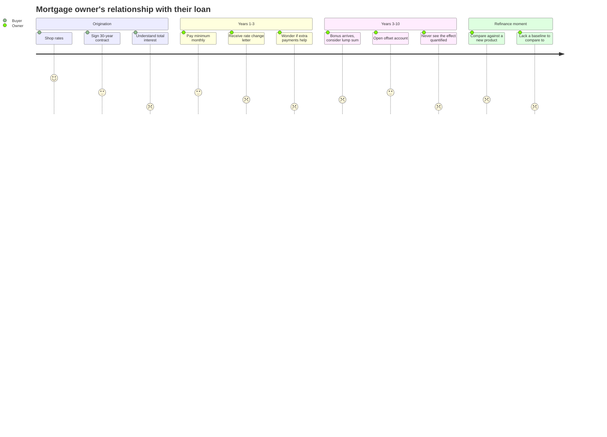

The low scores are the product opportunity. At **origination** the user signs a 30-year contract
without internalising that the total interest may approach the principal. In **years 1–10** they
make decisions (round the payment up, park the bonus, fund the offset) whose value is invisible —
the bank statement shows a balance, never a counterfactual. At **refinance** they have no baseline
to compare a new offer against.

Sure sits in a uniquely good position here because it already holds the two facts a bank calculator
never has: **the user's actual current balance** and **their actual offset account balances**.

## 3.2 Why amortisation modelling matters

Amortisation is deeply counter-intuitive, and the intuitions people default to are wrong in a
direction that costs them money:

1. **Front-loading.** On a 30-year loan at 6%, roughly **two-thirds of year-one payments are
   interest**. Users assume payments are split evenly and therefore massively under-estimate the
   value of early extra payments.
2. **Non-linearity of extra payments.** A dollar paid to principal today saves compounded interest
   for the *entire remaining term*. Users linearise this and under-estimate by an order of
   magnitude.
3. **Rate-change asymmetry.** A rate rise on a variable loan usually raises the *minimum repayment*
   while leaving the term intact. Users experience the payment change but not the interest-cost
   change, and cannot evaluate "should I keep paying the old amount?" — which is the single highest-
   value action available to them at that moment.
4. **Offset opacity.** An offset account's benefit is an interest reduction that never appears as a
   line item anywhere. It is invisible by construction.

## 3.3 Common user questions

Each is a functional requirement in disguise; the mapping is in §5.

| Question | Requirement |
|---|---|
| "When will this actually be paid off?" | FR-401 (projection from actual balance) |
| "How much interest will I pay in total?" | FR-402 |
| "What if I pay an extra $200 a month?" | FR-302 (recurring extra repayment) |
| "What if I dump my $40k bonus into it?" | FR-303 (one-off repayment) |
| "My rate is changing on 30 May — what happens?" | FR-203 (rate changes) + FR-405 (recomputed minimum) |
| "How much is my offset actually saving me?" | FR-406 (offset interest saved) |
| "Am I ahead of where I should be?" | FR-403 (actual vs contracted divergence) |
| "Should I pay down the loan or invest?" | Out of scope — see §4.2 |
| "Which of these two plans is better?" | FR-501/FR-502 (scenario comparison) |

## 3.4 Personas

### P1 — Priya, first-home buyer (28, first mortgage, 30-year variable)

**Context:** just signed, cash-poor, anxious. Rate is variable at 6.18%; has never seen an
amortisation table.
**Need:** understand what she has committed to, and see that small actions matter.
**Key moment:** discovering that rounding $2,719 up to $2,800 removes years from the term.
**Design implication:** the **default view must be immediately legible with zero configuration**.
Priya has no offset, no extra repayments, no rate history. If the first screen requires setup, she
leaves. → *Empty and minimal states are first-class (§7.3), not an afterthought.*

### P2 — Marcus, property investor (45, three loans, two interest-only)

**Context:** treats loans as instruments. Interested in total interest as a tax-deductible cost and
in per-loan payoff sequencing.
**Need:** compare loans; model paying one down faster than another.
**Design implication:** **per-loan modelling is enough for v1**, but the engine must not assume a
single loan (§11.4). Cross-loan avalanche/snowball is §19.
**Note:** interest-only loans are a real gap — see §4.2 and FR-107.

### P3 — Sarah & Tom, refinancers (38, 12 years into a 30-year loan)

**Context:** offered 5.93% against their current 6.18%. Need to decide.
**Need:** a like-for-like comparison — same balance, same remaining term, two rates.
**Design implication:** the **scenario comparison view (FR-502) must support varying the rate**, not
only the repayment. This is the strongest argument for making the scenario input a *set of
overrides* rather than "an extra payment amount".
**This persona is exactly the worked example in the ask:** `$400,762.12`, `6.18% → 5.93%`, effective
`30 May 2025`, `$2,719.04 → $2,651.07`.

### P4 — Dave, offset-account user (52, AU mortgage, $85k sitting in offset)

**Context:** salary lands in the offset; balance oscillates monthly. Genuinely does not know what
the offset is worth to him.
**Need:** see the offset's contribution quantified, historically and forward.
**Design implication:** offset must be modelled **dynamically over history** (from the `balances`
table) and **explicitly assumed forward** (§6.5). Dave will not accept "we assumed it's zero", and
he will not believe "we forecast your savings behaviour". The honest answer is *"held flat at
today's balance, and here's that number"*.

---

# 4. Scope Definition

## 4.1 In scope

### Loan configuration
- **S-01** Loan type selection: fixed, variable, variable + offset
- **S-02** Interest rate and term entry (exists)
- **S-03** `start_date` (loan origination) as an **editable** field *(currently a schema column with no UI — D4)*
- **S-04** Variable rate change management: add/edit/remove `{effective_date, rate}` entries
- **S-05** Offset account selection: link one or more of the family's asset accounts to a loan

### Calculation
- **S-06** Contracted amortisation schedule (exists — #3296)
- **S-07** Actual-balance payoff projection, **for fixed *and* variable loans** *(#2 is fixed-only — D2)*
- **S-08** **Daily interest accrual, charged monthly**, on the balance net of offset
- **S-09** Recurring extra repayments (weekly / fortnightly / monthly / quarterly / yearly)
- **S-10** One-off / lump-sum repayments on a specific date
- **S-11** Interest saved, time saved, total repayments, payoff date
- **S-12** Recomputed minimum repayment at a rate change (the bank-letter calculation)

### Modelling & comparison
- **S-13** Transient "what-if" scenario driven by URL params
- **S-14** Saved, named scenarios (persisted) — up to a small cap per loan
- **S-15** Side-by-side comparison of baseline vs. up to 2 scenarios

### Visualisation
- **S-16** Balance-over-time chart on the **account's top chart**, with actual history, contracted
  schedule, projection, and scenario lines
- **S-17** Interest-vs-principal composition chart
- **S-18** Payoff timeline / milestone strip
- **S-19** Amortisation table with rate-change highlighting (exists, needs extension)

### Platform
- **S-20** API exposure of schedule, projection, scenarios (extends the existing endpoint)
- **S-21** CSV export of the amortisation schedule *(explicitly requested in issue #3295, never built)*
- **S-22** i18n for all new strings
- **S-23** Accessible equivalents for every chart (server-rendered text summaries)

## 4.2 Out of scope

| Excluded | Rationale |
|---|---|
| **Pay-down-vs-invest advice** | Requires a return assumption and risk tolerance → regulated financial advice territory. Sure must present arithmetic, not recommendations (§13.4). |
| **Refinance product recommendations** | Same. Modelling *a user-supplied rate* is fine; *suggesting a lender* is not. |
| **Sub-daily accrual / intra-day balance ordering** | Daily accrual is now **in scope** (S-08) — see §6.2. What remains excluded is modelling the order of transactions *within* a single day; the end-of-day balance is the accrual basis, matching how lenders strike it. |
| **Interest-only periods** | Common in AU investment loans (P2). Genuinely needed, but it is a distinct payment structure, not a parameter — it deserves its own design pass. Called out as the top §19 item; the engine's `payment_strategy` hook is designed to accept it (§11.4). |
| **Redraw facilities** | Modelling a *reversible* extra repayment is a different balance semantic. Related to offsets but not the same. |
| **Fees** | Establishment, ongoing, discharge, break costs, LMI. Materially affects comparison accuracy but each is lender-specific. §19. |
| **Cross-loan strategies (avalanche/snowball)** | Multi-loan optimisation. Engine supports it (§11.4); UI does not, in v1. |
| **Monte Carlo / probabilistic rate paths** | §19. Requires a rate model and a very different UI for communicating uncertainty. |
| **Automatic detection of extra repayments from transactions** | Tempting (the data is there) but a misclassification silently corrupts the user's projection. Needs a confirmation UX. §19. |
| **Credit cards / lines of credit / BNPL amortisation** | Revolving credit is a different structure. Engine is extensible to it (§11.4); v1 is term loans. |
| **Amortisation for `CreditCard` / `OtherLiability` accountables** | Same. |

## 4.3 Assumptions

| # | Assumption | Risk if wrong | Validation |
|---|---|---|---|
| A1 | `account.balance` for a loan is **principal only** (excludes escrow/impounds/fees) | Overstates interest and time saved for US escrowed mortgages | Already documented as a caveat in `PayoffProjection`. Surface it as a UI note; add an optional "balance excludes escrow" acknowledgement in §19 |
| A2 | **Interest accrues daily on the end-of-day balance net of offset, at `annual_rate / 365`, and is charged on the monthly payment date.** Payment falls on the same day-of-month as origination + 1 month | A lender using actual/actual, 30/360, or a 365-in-leap-years variant will diverge slightly | Day count is a named constant with a seam (§6.2). **Confirm `actual/365` against a real statement before M1 ships** |
| A3 | Forward offset balance is **held flat at today's total** | Over/under-states savings if the balance trends | **Stated explicitly in the UI**, user-overridable in the scenario input |
| A4 | **Extra repayments reduce the balance on the date they are made**, and accrual sees it from that day (daily clock, §6.2) | Diverges only from lenders that hold extra payments in suspense until cycle end | Materially tighter than the monthly-accrual version of this assumption. Documented |
| A5 | Offset accounts share the loan's currency | Wrong FX conversion silently corrupts interest | **Enforced by validation — reject, do not convert** |
| A6 | **Two clocks (C7/C8): the new rate accrues from its effective date; the minimum repayment recalculates on the first payment date on or after it** | A lender that pro-rates differently, or recalculates on the effective date itself, will diverge | This supersedes #3296's single-event `build_rate_segments`. Verify against the rate-change letter alongside A2 |
| A7 | The contracted schedule is the honest baseline for "am I ahead?" | If it drifts to track actual balance, the comparison becomes vacuous | **Architectural invariant: the contracted schedule never sees actual balance, offsets, or extra repayments** (§11.2) |
| A8 | Users have ≤3 loans they actively model | Perf assumptions in §16 | Monitor; engine is bounded by `MAX_TERM_MONTHS` regardless |
| A9 | `variable_rate_schedule` entries are user-entered from a lender letter, not synced | Manual entry burden | Provider-sourced rates are §19 |
| **A10** | **Dates are date-only, with no time zone.** A transaction's `date` is the day the provider assigned it | A provider that normalises to UTC can place a late-evening transaction on the wrong local day, shifting one day of accrual | **Inherited, not introduced.** `balances.date` and `entries.date` are date-only throughout the app; every balance already depends on this. Documented as a dependency (C12), not solved here |

---

# 5. Functional Requirements

Priority: **P0** = v1 blocker · **P1** = v1 target · **P2** = fast-follow.
"Exists" = already delivered by #3296/#2/#3/#4 on the fork branch.

## 5.1 Loan creation & editing (FR-1xx)

| ID | Description | Acceptance criteria | Priority |
|---|---|---|---|
| FR-101 | Create a loan with principal, rate, term, subtype | Exists (`app/views/loans/_form.html.erb`). Regression-only. | P0 |
| FR-102 | **Set the loan's origination date (`start_date`)** | `start_date` is permitted in `LoansController.permitted_accountable_attributes` and rendered in the form. When blank, the schedule falls back to `account.opening_anchor_date` (current behaviour) and the form says so. Changing it triggers `amortization_inputs_changed?` → rebuild. | **P0** — D4; FR-501 and FR-404 both depend on origination being right |
| FR-103 | Select loan type: Fixed / Variable / Variable + offset | The type control writes `rate_type` (`fixed`\|`variable`) and, for "variable + offset", reveals the offset picker (FR-105). Overview "Type" card renders **"Variable + offset"** when `rate_type == "variable" && offset_accounts.any?`. **`rate_type` gains no new enum value** (§10.2 rationale). | P0 |
| FR-104 | Edit a loan without losing schedule integrity | Any change to `interest_rate`, `term_months`, `rate_type`, `start_date`, `variable_rate_schedule` invalidates `amortization_schedule_signature` and enqueues `LoanAmortizationRebuildJob`. Exists — must stay true for new inputs. | P0 |
| FR-105 | Link one or more offset accounts | Multi-select of eligible accounts: asset classification, matching currency, not the loan account itself, and — **per the shared-input policy (§13.2)** — accessible to *every* user who can access the loan, not merely to `Current.user`. Persisted via `loan_offset_accounts`. Access changes on either side re-validate the link. Removing the last link reverts the loan to non-offset behaviour with no data loss. | P0 |
| FR-106 | Validate loan inputs | Rate 0–100, term 1–1200 (existing DB check constraints + model validations), principal > 0, `start_date` not in the future. Inline field errors, no silent coercion. | P0 |
| FR-107 | Interest-only period | **Out of scope for v1** (§4.2). Recorded so the engine's `payment_strategy` seam (§11.4) is designed to accept it. | P2 |

## 5.2 Interest rate management (FR-2xx)

| ID | Description | Acceptance criteria | Priority |
|---|---|---|---|
| FR-201 | Fixed loans use one rate for the term | Exists. | P0 |
| FR-202 | Variable loans amortise at the current rate | Exists (`current_variable_rate(as_of)`, `build_rate_segments`). | P0 |
| FR-203 | **Add / edit / remove rate changes via the UI** | A repeatable `{effective date, rate}` group, revealed when `rate_type == "variable"`. Persists to the existing `variable_rate_schedule` jsonb. Existing model validation (ISO date, numeric, 0–100) surfaces as field errors. Duplicate effective date replaces rather than duplicating (matches `add_variable_rate_change`). | **P0** — D4 |
| FR-204 | **Recomputed minimum repayment on rate change** | For each *future* rate change, show the bank-letter row: current balance, current rate, new rate, effective date, current minimum repayment, new minimum repayment. Reproduces the §6.3 worked example within **±$1.00**. | **P0** |
| FR-205 | Rate-change history is visible | Past changes are listed read-only and highlighted in the amortisation table where the rate switches. | P1 |
| FR-206 | Non-convergence is surfaced explicitly | If a rate rise means the current payment never clears the loan, the UI says so in words. **It must not silently hide the projection card** (which is what #2's `applicable?` gate would do). | **P0** |

## 5.3 Repayments & offsets (FR-3xx)

| ID | Description | Acceptance criteria | Priority |
|---|---|---|---|
| FR-301 | Contracted minimum repayment | Exists (`AmortizationSchedule#monthly_payment`). | P0 |
| FR-302 | **Recurring extra repayment** | Amount + cadence (weekly, fortnightly, monthly, quarterly, yearly) + optional start/end date. Cadence resolution reuses `RecurringTransaction::Schedule` / `RecurrenceRule` — **no second recurrence engine**. Sub-monthly cadences are converted to a monthly equivalent and **the UI states this** (A2/§4.2). | P0 |
| FR-303 | **One-off / lump-sum repayment** | Amount + date. Multiple allowed. **Takes effect at the end of its own effective date** (contract C6) — the balance drops that day and subsequent days accrue on it. Payment dates never defer it. | P0 |
| FR-304 | Extra repayments never mutate real data | A scenario request leaves `account.balance` and the persisted `loan_amortizations` count unchanged. (PR #4 has this exact test — carry it forward verbatim.) | P0 |
| FR-305 | **Offset reduces interest, not balance** | Interest for a period accrues on `max(0, balance − offset_balance)`. The displayed loan balance is unchanged. | P0 |
| FR-306 | **Historical offset is dynamic** | The historical "net of offset" line uses each date's *actual* offset balance from the `balances` table, not today's. | P0 |
| FR-307 | Forward offset is an explicit, overridable assumption | Defaults to today's total offset balance held flat; the assumption is stated wherever a derived figure appears; user-overridable in the scenario input. | P0 |
| FR-308 | Offset fully covering the balance | Zero interest for those **days**; the whole payment goes to principal. No negative interest, no division by zero, no infinite loop. | P0 |
| **FR-309** | **Daily interest accrual, charged monthly** | Interest accrues each day on `max(0, balance − offset)` at `annual_rate / 365` and is charged on the payment date. Applies to **all** loans, not only offset loans. Month-length variation is visible in the schedule. | **P0** |
| **FR-310** | **Projection is sensitive to today's offset balance** | Moving funds into or out of a linked offset account changes the projected payoff date on the next page load, with no averaging or smoothing. `payoff_projection_signature` includes the offset accounts' balances. | **P0** |
| **FR-311** | **"Move money to offset" scenario** | A scenario override that models transferring a lump sum into the offset from a given date — distinct from a lump-sum *repayment*, because the money stays the user's. Shows the interest saved without reducing the balance. | P1 |

## 5.4 Forecasting & scenarios (FR-4xx)

| ID | Description | Acceptance criteria | Priority |
|---|---|---|---|
| FR-401 | **Projected payoff date from actual balance** | Shown for **fixed and variable** loans, incorporating offsets and any active scenario. Shown whenever the simulation converges — **not** gated on a "meaningful divergence" threshold (that gate stays only on the *comparison* framing, where its rounding rationale holds). | **P0** — removes D2 |
| FR-402 | Total remaining interest & total repayments | Both, for baseline and each scenario. | P0 |
| FR-403 | Ahead/behind vs. contracted | Months and interest delta vs. the contracted schedule's remaining path. Direction stated in words, not only colour. | P0 |
| FR-404 | **Original (contracted) payoff date on the loan summary** | From `amortization_schedule.payoff_date`. Falls back to a translated "Unknown" for non-amortisable loans. | P0 |
| FR-405 | **Current minimum repayment for variable loans** | Replaces today's hardcoded `N/A` in `_overview.html.erb`. Computed per §6.3, sub-labelled with the rate it used. Overview and Schedule tabs must show the **same** figure. | **P0** |
| FR-406 | Offset interest saved | "Your offset saved you $X over the last 12 months, and saves ~$Y/yr at today's balance." | P1 |
| FR-407 | Transient scenario via URL | Fully reconstructible from query params; back-button correct; shareable. | P0 |
| FR-408 | **Saved named scenarios** | Persist up to **5 per loan** (cap enforced in model + DB). Name, overrides, created/updated. Deleting a loan cascades. | P1 |
| FR-409 | **Scenario comparison** | Baseline + up to 2 scenarios side by side: payoff date, term, total interest, total repayments, monthly cost, deltas vs. baseline. | P1 |
| FR-410 | Goal linkage | Interest saved is expressible as a contribution toward a `Goal`. | P2 |

## 5.5 Persistence, visualisation, platform (FR-5xx)

| ID | Description | Acceptance criteria | Priority |
|---|---|---|---|
| FR-501 | **Top chart starts at the loan's origination value** | On "All time", the x-domain begins at `min(opening_anchor_date, oldest entry date)` for **this account** (not the family), and the first point is `original_balance`. | **P0** — D5 |
| FR-502 | **Top chart shows actual repayment progress** | The solid line is the real balance series from `balances` (incl. extra repayments actually made), **not** the contracted schedule. A second solid line shows balance net of offset when offsets are linked. | **P0** — D3 |
| FR-503 | **Modelling happens on the top chart** | Scenario controls sit with the chart; an active scenario adds a forward line. Default view = 3 lines (actual history, contracted, projection); offset and scenario lines are conditional. | P0 |
| FR-504 | Interest-vs-principal composition | Stacked view over the loan's life. | P1 |
| FR-505 | Amortisation table | Exists. Add rate-change highlighting (FR-205) and scenario-aware rows. | P1 |
| FR-506 | **CSV export** | Requested in #3295, never built. Server-generated, respects the active scenario, filename includes loan + scenario. | P1 |
| FR-507 | API parity | Everything the UI computes is available via `/api/v1/loans/:id/...` with rswag docs. | P1 |
| FR-508 | i18n | Every new string in `config/locales/views/loans/en.yml`. No bare literals. | P0 |
| FR-509 | Accessibility | Every chart has a server-rendered, translated text equivalent (`sr-only`) carrying the same figures as the visible cards. Colour is never the sole carrier of ahead/behind. | P0 |
| FR-510 | **Rename "Principal Balance" → "Remaining loan balance"** | Change the **value** of `UI.account.chart.title.remaining_principal_balance`; do **not** rename the key (it appears in ~20 locale files). Align `loans.tabs.overview.remaining_principal` to match — one concept, one label (D7). | P0 |
| FR-511 | **Overview is the first loan tab** | `UI::AccountPage#loan_tabs` returns `[:overview, :activity]` + `:schedule`; `active_tab` falls back to `tabs.first`, so Overview becomes the default landing tab. | P0 |

---

# 6. Financial Modelling Design

All money is `BigDecimal` via `Money`; **never `Float`**. Note `PayoffProjection#generate_schedule`
currently uses `loan.interest_rate / 100.0` (Float) — that is a latent precision bug to fix during
the refactor, not to carry forward.

## 6.1 The calculation contract (normative)

Everything below this table is explanation. **This table is the specification.** Where prose and
this table disagree, this table wins; where an implementer must choose, they must not — they raise
it and this table gains a row.

It exists because an earlier draft of this document contradicted itself: the requirements said an
extra repayment applied at the next scheduled payment, while the financial model said it applied on
its own date. Both are defensible; shipping both is not.

| # | Rule | Decision | Detail |
|---|---|---|---|
| **C1** | **Accrual basis** | Interest accrues **daily** on the end-of-day balance net of offset | §6.2 |
| **C2** | **Day count** | `actual/365` — daily rate is `annual_rate / 100 / 365`, leap years included. Named constant with a seam | §6.2 |
| **C3** | **Charging** | Accrued interest is charged on the contractual payment date; the accumulator resets | §6.2 |
| **C4** | **Payment calendar** | Origination anchor, first payment one calendar month later, monthly thereafter, `Date#next_month` month-end clamping (Jan 31 → Feb 28 → Mar 28) | §6.3 |
| **C5** | **Payment sizing** | Level-payment formula on a **monthly** period. Accrual is daily; sizing is monthly. These are separate clocks | §6.3 |
| **C6** | **Extra repayment timing** | **An extra repayment takes effect at the end of its own effective date.** It reduces the balance immediately; subsequent days accrue on the reduced balance. Payment dates never defer it | §6.7 |
| **C7** | **Rate change — accrual** | `accrual_rate_for(date)`: the new rate applies to accrual **from and including its effective date** | §6.4 |
| **C8** | **Rate change — re-amortisation** | `re_amortisation_event(payment_date)`: the contractual minimum repayment is recalculated on **the first payment date on or after** the effective date. **C7 and C8 are different events on different dates** | §6.4 |
| **C9** | **Same-day event order** | Within one date, applied in this order: (1) rate change, (2) scheduled payment — charge accrued interest, then principal, (3) extra repayment, (4) offset movement. The end-of-day balance is the next day's accrual basis | §6.9 |
| **C10** | **Effective-date inclusivity** | All effective dates are **inclusive**: an event dated *d* affects day *d* | §6.9 |
| **C11** | **Intra-day ordering** | Not modelled. The end-of-day balance is the accrual basis, matching how lenders strike it | §4.2 |
| **C12** | **Date normalisation** | Dates are date-only, no time zone. Inherited from `balances.date` / `entries.date`; provider import normalisation is **out of this feature's scope** and is an assumption it depends on, not one it establishes | §4.3 A10 |
| **C13** | **Rounding** | Interest accumulates unrounded; rounds once, at the charge point, to `Money::Currency#default_precision` | §6.10 |
| **C14** | **Final payment** | The period that clears the balance settles exactly: principal := remaining balance, payment := principal + accrued interest | §6.10 |
| **C15** | **Offset floor** | `max(0, balance − offset)` per day. Never negative interest, never a negative balance | §6.6 |
| **C16** | **Forward offset** | The linked accounts' current total, held flat day by day. No averaging, no behavioural forecast | §6.6 |

**C6, C7/C8 and C9 are the rules an implementer would otherwise have guessed at**, and each guess
changes the numbers a user sees. They are the reason this table exists.

### The engine's time model (C4, C9)

`Loan::Simulator` takes **four** date/balance boundaries, not two. Conflating them is the principal
source of off-by-one-day and partial-period defects:

| Input | Meaning | Contracted schedule | Live projection |
|---|---|---|---|
| `starting_balance` | The balance to begin from | `original_balance` | `account.balance` |
| `starting_balance_as_of` | The date that balance is true on | origination | today |
| `accrual_start_date` | First day interest accrues | origination + 1 day | today + 1 day |
| `payment_schedule` | Contractual payment dates | from origination | **the loan's own calendar**, not today + 1 month |

A projection begun mid-cycle therefore accrues from today to the *next contractual payment date* —
a partial period — and charges it there. It does not invent a new payment calendar anchored on
today. This is the F3 correction; the earlier interface had only `starting_payment_date` and could
silently drop or double-count the stub period.

## 6.2 Interest accrual: daily, charged monthly

**This is the foundational decision of the whole model, and it separates two things the original
code conflates: how interest *accrues* and how the payment is *sized*.**

Real home loans — Australian offset mortgages emphatically, but in practice most term loans —
accrue interest **daily on the end-of-day balance** and **charge the accumulated interest on the
monthly payment date**. Monthly accrual is not a simplification of this; for an offset loan it is
structurally wrong, because it cannot see a balance that moves between payment dates. An offset
account whose whole purpose is that money sitting in it *today* reduces interest *today* is
unmodellable under monthly accrual.

### The two clocks

| Concern | Clock | Formula |
|---|---|---|
| **Interest accrual** | **Daily** | `daily_interest(d) = max(0, B(d) − offset(d)) × annual_rate / 100 / DAY_COUNT` |
| **Interest charging** | Monthly, on the payment date | `interest_charged = round(Σ daily_interest(d) over the period, precision)` |
| **Payment sizing** (the level payment / lender minimum) | **Monthly** | Unchanged — §6.3 |

Keeping payment sizing monthly matters: it is what the lender's rate-change letter quotes, and it is
what §6.3's worked example validates. **Daily accrual changes what you are charged, not how the
minimum repayment is calculated.**

### Day count

`DAY_COUNT = 365`, fixed — the prevailing Australian convention (daily rate = annual rate ÷ 365
regardless of leap years). Implement it as a named constant with a seam
(`Loan::InterestAccrual::DAY_COUNT`) rather than a user-facing field, so `actual/actual` or `30/360`
becomes a one-line change if a lender needs it.

> ⚠️ **Confirm `actual/365` against a real statement before M1 ships.** It is the single assumption
> here most likely to differ per lender, and it is cheap to verify and cheap to change — but only
> before users have balances they are reconciling against.

### The piecewise-constant optimisation — why this does not blow up performance

A naïve daily loop is 36,525 iterations for a 100-year term, ×4 simulations per comparison request.
That is unnecessary: **the offset balance is piecewise-constant.** It changes only on days that have
a transaction. So accrue over *segments*, not days:

```
interest_for_period = Σ over offset-constant segments:
                        segment_days × max(0, B − offset_seg) × annual_rate / 100 / 365
```

- **Forward projection:** the offset is held at one value (§6.5), so each payment period is a
  **single segment** — exactly the same cost as the monthly loop it replaces.
- **Historical/actual:** an offset account might see 5–30 balance changes a month, so a period is a
  handful of segments.

Daily accrual therefore costs essentially nothing over monthly, while being correct. This is the
design's key structural insight, and it is why `offset_for(date)` must be able to yield **change
points**, not just a value per call (§11.2).

### What this changes about the existing code

| Existing behaviour | Becomes |
|---|---|
| `interest = balance × (annual/100/12)` | `interest = Σ segment_days × interest_bearing × (annual/100/365)` |
| `AmortizationMath.step(balance:, payment:, monthly_rate:, …)` | `step` receives a **pre-computed `interest:`** from `Loan::InterestAccrual`; it keeps the principal/rounding/final-period logic that makes it worth keeping |
| Offset as an optional kwarg on `step` | Offset resolved *before* `step`, inside the accrual |

**Scope of the change: all loans, not just offset loans.** Two code paths (daily for offset,
monthly for everything else) is exactly the duplication this design exists to remove, and the
non-offset case is simply the one-segment degenerate form. It does mean **every persisted number
moves** — a 31-day month accrues more than 1/12 of a year, a 28-day month less — but L5 is already
bumping `ALGORITHM_VERSION` and rebuilding every schedule, so this rides that single migration
rather than forcing a second one later. See risk R16.

## 6.3 Level payment (the lender minimum)

Level-payment (French) amortisation. **Sizing only** — the accrual above is what is actually charged.

Let:
- `P` = principal outstanding
- `i` = monthly rate = `annual_rate / 100 / 12`
- `n` = number of periods remaining

**Level payment:**

```
        P · i · (1 + i)^n
A  =  ────────────────────         (i > 0)
         (1 + i)^n − 1

A  =  P / n                        (i = 0)
```

**Per period** (this is `Loan::AmortizationMath.step`, unchanged):

```
interest_t   = round(B_{t−1} · i,  precision)
principal_t  = A − interest_t
B_t          = round(B_{t−1} − principal_t,  precision)
```

**Final period:** `principal_t := B_{t−1}` exactly, and `A_t := principal_t + interest_t`. This
zeroes the balance without a rounding tail. Already implemented via the `final:` flag.

**Payment dates:** origination anchor (`start_date` ‖ `account.opening_anchor_date`), first payment
one calendar month later, then monthly. `Date#next_month` clamps into short months (Jan 31 → Feb 28
→ Mar 28, *not* Mar 31). This is existing, tested behaviour in `scheduled_payment_dates` — preserve
it exactly.

## 6.4 Variable loans

### Rate resolution

`Loan#current_variable_rate(as_of)` already returns the latest entry in `variable_rate_schedule`
whose effective date is `<= as_of`, falling back to `interest_rate`. The engine consumes this as a
**callable** `rate_for(date)` (§11.1) — which is what makes fixed loans the degenerate case
(a constant-returning lambda) rather than a separate code path.

### Two clocks: accrual rate vs. re-amortisation (C7/C8)

A rate change is **two events on two dates**, and the earlier draft of this document collapsed them
into one:

| Event | When | What changes |
|---|---|---|
| `accrual_rate_for(date)` | **From and including the effective date** | The daily accrual rate |
| `re_amortisation_event(payment_date)` | **The first payment date on or after** the effective date | The contractual minimum repayment |

A rate change effective 30 May on a loan that pays on the 1st therefore accrues at the new rate for
2 days of the May–June cycle while still collecting the old minimum repayment, and collects the new
minimum from 1 June onward.

**This also resolves an anomaly the earlier draft hand-waved.** §6.3's worked example needed
`n = 277` to reproduce the lender's current repayment and `n = 279` for the new one. Under a single
combined event that is inexplicable; under two clocks it is exactly what you would expect — the two
figures are struck against different remaining terms because they belong to different events.

**UI consequence (FR-203, FR-204):** the rate-change editor and table must distinguish
**"rate effective from"** and **"new repayment applies from"**. They are different dates and users
will reconcile both against their letter.

**Same-day tie-break:** a rate change dated on a payment date applies to accrual first, then the
payment is charged, then the repayment is recalculated for the following cycle (C9).

### Segmentation

`build_rate_segments` groups consecutive payment dates sharing a rate. Critically,
`calculate_segment_payment` amortises over **payments remaining to maturity**, not the segment's own
length. Amortising over the segment length would produce a payment that pays the loan off at the
rate change — a large, wrong number. This fix already exists; do not regress it.

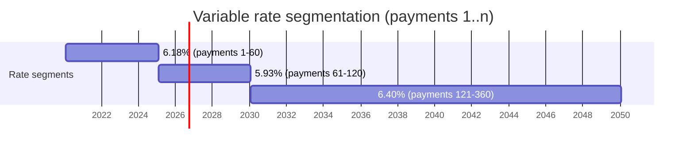

At each segment boundary the payment is recomputed from the balance carried in, the new rate, and
the payments remaining to maturity.

### Minimum repayment at a rate change — the bank-letter calculation (FR-204)

This is the ask's worked example. Given the notice:

| Current balance | Current rate | New rate | Effective | Current min. | New min. |
|---|---|---|---|---|---|
| $400,762.12 | 6.1800% | 5.9300% | 30 May 2025 | $2,719.04 | $2,651.07 |

Applying the level-payment formula to `P = 400,762.12`:

| n (months) | @ 6.18% | @ 5.93% |
|---|---|---|
| 277 | **$2,719.33** | $2,659.23 |
| 278 | $2,714.91 | $2,654.75 |
| **279** | $2,710.53 | **$2,650.32** |

So the current minimum matches at **n = 277** (Δ $0.29) and the new minimum at **n = 279**
(Δ $0.75). The residual is not a formula error — the lender computes the *new* figure from the
balance and remaining term **as at the effective date**, not as at the letter date, and the two
quotes therefore sit on different `n`.

**Design consequence — this is why FR-204 needs the engine, not a standalone formula:**

```
current_minimum = level_payment(
    P = current interest-bearing balance,
    i = current_variable_rate(today) / 12,
    n = months from the next payment date to original maturity )

new_minimum     = level_payment(
    P = simulated balance at the effective date,   ← the engine produces this for free
    i = new rate / 12,
    n = months from the effective date to original maturity )
```

**Test to ±$1.00 with the tolerance justified in a code comment.** Cent-exact agreement with any
given lender is unattainable (day-count conventions, rounding direction, whether the effective-date
balance assumes the current payment continues). Chasing cents here produces brittle tests and false
confidence.

## 6.5 Fixed loans

A fixed loan is the degenerate variable loan: `rate_for(date)` returns a constant and
`build_rate_segments` yields exactly one segment. **No separate code path.**

Fixed-*period* loans (fixed for 3 years, then variable) are expressed as a `variable_rate_schedule`
with an entry at the roll-off date — no new modelling, only UI affordance. The revert rate is a user
input at that point.

## 6.6 Offset loans

### The mechanic

An offset account is an asset whose balance is netted against the loan for **interest calculation
only**. The loan balance is unchanged; the interest charged is reduced. In Australia this is the
dominant mortgage feature and it is the reason "variable + offset" is named as a loan type in the
brief.

Interest accrues **daily** (§6.2) on the balance net of the offset **on that day**:

```
daily_interest(d) = max(0, B(d) − offset(d)) × annual_rate / 100 / 365

interest_charged_t = round( Σ daily_interest(d) for d in period t , precision)
principal_t        = A_t − interest_charged_t     ← the full payment still applies to principal
```

Because `principal_t` grows while `A_t` is unchanged, an offset **shortens the term**; it does not
reduce the repayment. That is the insight P4 (Dave) is missing and this feature delivers.

**Why the daily clock is not optional here.** The defining behaviour of an offset is that moving
$50,000 into it *today* reduces the interest you are charged *from today*, and moving it out again
next week restores it. A monthly snapshot cannot express that: it would either miss the move
entirely or attribute a whole month's benefit to a seven-day deposit. **Sensitivity to the current
offset balance is the feature, not a refinement of it.**

**Implementation:** offset is resolved *before* the per-period step, inside
`Loan::InterestAccrual`, which returns the charged interest for a period given the balance and the
offset's change points. `AmortizationMath.step` then takes that `interest:` directly and keeps the
principal / rounding / final-period logic that makes it worth keeping.

### Historical offset (FR-306, FR-406)

Two different reads, for two different purposes — **do not conflate them**:

| Purpose | Source | Granularity |
|---|---|---|
| **Drawing the chart's offset-net line** | `Balance::ChartSeriesBuilder` (accepts `account_ids:` as an **array**, so one extra call) | Whatever the `Period`'s interval is — monthly on a 30-year view |
| **Computing accrued interest / "what your offset saved you"** (FR-406) | **`balances` queried directly — daily rows** | **Daily. Always.** |

This is a trap worth naming: `ChartSeriesBuilder` picks its interval from the `Period`, so on an
all-time view it returns monthly points. Feeding those into a daily accrual would silently produce a
plausible-looking wrong number. **Accrual reads `balances` directly; only the chart goes through the
series builder.**

```
net_balance(d) = loan_balance(d) − offset_balance(d)
```

⚠️ **Sign handling is the single easiest thing here to get backwards.** The builder's
`sign_multiplier` is `-1` when `favorable_direction == "down"` (liabilities), so the loan series
returns **positive** and the offset series (an asset, `favorable_direction == "up"`) also returns
**positive**. The subtraction is therefore direct — but this must be asserted in a test, not assumed.

### Forward offset (FR-307)

**Held flat at the offset accounts' current total**, day by day, stated in visible copy:
*"Assumes your offset stays at $85,000."* User-overridable in the scenario input.

Combined with daily accrual, this gives the behaviour the feature is for: **the projected payoff
date is a live function of today's offset balance.** Move $50,000 in and the projection shortens on
the next page load; move it out and it lengthens. No averaging, no smoothing — the current balance
is the input, because the current balance is what the lender is charging against right now.

> **Rejected: a trailing 3-month average.** An earlier draft proposed averaging to smooth an
> oscillating salary-cycle offset. That is wrong for this product. Averaging deliberately *hides*
> the sensitivity that makes the offset worth modelling, and it would make the projection unable to
> answer the user's actual question — "what happens if I park my bonus here?" The volatility is
> signal.

**Also rejected:** projecting offset growth from the user's savings rate. That forecasts the user's
*behaviour*, not the loan. It makes the projection unfalsifiable.

**Honest caveat to surface:** because the forward offset is today's spot balance held flat, the
projected payoff date will drift as the balance oscillates over a salary cycle. State this
(*"based on your offset balance today"*), and consider showing the 12-month range of the offset
balance alongside it so the user can see how much of the movement is normal. That is disclosure of a
real property of the model, not a reason to average it away.

Because the engine takes `offset_for(date)` as a callable that yields **change points**, "flat" is a
single-segment lambda, a user override is the same lambda with a different constant, and scheduled
future offset changes (§19) are the same lambda with several — the seam costs nothing.

## 6.7 Extra repayments

### Model

An extra repayment is `{amount, kind, date | recurrence, currency}`. It is applied to **principal**
on the first scheduled payment date on or after its date, in addition to the level payment.

| Kind | Shape | Resolution |
|---|---|---|
| **One-off** (FR-303) | amount + date | Applied on that exact date (C6) — a balance change point, not a payment-date event |
| **Recurring** (FR-302) | amount + `RecurrenceRule` (frequency, interval, day spec) + optional start/end | `RecurringTransaction::Schedule#occurrences_between` — **reuse, do not rewrite**. Materialised to **exact dates** (C6), never to a monthly-equivalent figure |
| **Lump sum** | A one-off, semantically | Same as one-off |

### Sub-monthly cadence — now modelled exactly

Under monthly accrual, a weekly extra repayment had to be flattened to a monthly equivalent
(`weekly × 52/12`), which understated its benefit because real weekly payments reduce principal
*between* accrual points. **Daily accrual removes that approximation entirely.**

Each extra repayment is applied to the balance on its own date, and accrual sees the reduced balance
from that day forward. A $500 weekly repayment is now genuinely 52 balance reductions a year, not
`$2,166.67` once a month.

**Consequences:**
- `Loan::PayoffProjection.monthly_equivalent` from PR #4 is **no longer needed for accuracy**. Keep
  it only where the UI must display a comparable monthly figure ("that's about $2,167/month"), and
  drop the approximation disclaimer — it no longer applies.
- Fortnightly repayments — the single most common Australian acceleration strategy, and the one whose
  whole benefit comes from 26 half-payments beating 12 full ones — are now modelled correctly rather
  than being flattened into invisibility. **This was a real defect in the monthly design.**
- Timing within the month now matters and is honoured: a lump sum on the 1st saves more than the
  same sum on the 28th.

### Per-period application

```
# Extras reduce the balance on their own date — they are balance change points,
# not additions to the monthly payment. Accrual sees them from that day.
for each extra repayment e in period t:
    B(e.date) −= e.amount          # becomes an accrual segment boundary

interest_charged_t = Σ segment_days × max(0, B − offset) × annual/100/365
principal_t        = level_payment_t − interest_charged_t

# Never overshoot: if the balance would go negative, cap and finalise.
if B would reach 0 mid-period:
    settle exactly on that date    # step(final: true)
```

Note the shift: under monthly accrual an extra repayment was *added to the payment*. Under daily
accrual it is a **balance change point**, which is both more accurate and structurally identical to
how an offset movement is handled — one mechanism, two uses.

## 6.8 Scenario calculations

Given baseline `S₀` and scenario `Sₖ`, both run to convergence from **today's actual balance**:

| Metric | Formula |
|---|---|
| Payoff date | `Sₖ.payments.last.payment_date` |
| Months saved | `S₀.payment_count − Sₖ.payment_count` |
| Interest saved | `S₀.total_interest − Sₖ.total_interest` |
| Total repayments | `Σ Sₖ.payments.payment_amount` |
| Balance at date `d` | LOCF over `Sₖ.payments` |
| Ahead/behind vs. contract | Compare `Sₖ` against the **contracted** remaining path (`loan_amortizations WHERE payment_date > today`) |

**Invariant A7:** the contracted schedule is computed from `original_balance`, contracted rates, and
**no offset and no extra repayments**. If it ever tracked the actual balance, "am I ahead?" would
always answer "no" and the feature's core comparison would be vacuous.

## 6.9 Edge cases

| Case | Behaviour |
|---|---|
| Zero interest rate | `A = P / n`. Existing code handles it in both `monthly_payment` and `calculate_segment_payment`. |
| Payment ≤ interest (negative amortisation) | **Do not** silently truncate at the iteration cap and report the truncated date as a payoff. Detect and surface: *"At this payment the balance never clears."* Extends #2's `unamortizable_payment?`, which must be corrected to use the *rate at the first projected period* and the *interest-bearing* balance. |
| Offset ≥ balance | `interest = 0`; the whole payment retires principal. No negative interest. |
| Balance already ≤ 0 | Loan is paid off. Show a completed state; no projection. |
| Rate change before the first payment | Segment 1 simply carries the new rate. Handled by `build_rate_segments`. |
| Multiple rate changes in one month | Latest effective date on or before the payment date wins (`current_variable_rate` semantics). |
| Extra repayment > remaining balance | Cap at the balance; final period; no negative balance. |
| Term expiry with a residual balance | Possible after rate rises. Report a **balloon**: *"$X will remain at the end of the term."* |
| Loan opened today, no history | Seed the chart with the origination point; history is a single point. |
| Very long term (1200 months) | Bounded by `MAX_TERM_MONTHS` + DB check constraint. Projection cap is `MAX_ITERATIONS_MULTIPLIER × term_months`. |
| Missing `start_date` | Falls back to `account.opening_anchor_date` (existing). FR-102 makes it editable. |
| **Leap year** | `DAY_COUNT` is fixed at 365, so a leap year accrues 366/365 of a year's interest. This is the AU convention, not a bug — assert it in a test so nobody "fixes" it |
| **Offset moves mid-period** | Creates an accrual segment boundary; interest is pro-rated across the two balances by day count |
| **Offset exceeds balance for part of a period** | Those days accrue zero; the remaining days accrue normally. No negative interest on any segment |
| **Month lengths** | Feb accrues 28/365, Jan 31/365. Monthly charges therefore vary slightly month to month even at a constant balance and rate — expected, and visible in the schedule |
| **Extra repayment and offset movement on the same day** | Both applied to the end-of-day balance; intra-day ordering is not modelled (§4.2) |
| Currency mismatch on an offset | **Validation error at link time.** Never convert silently. |

## 6.10 Rounding strategy

1. **`BigDecimal` end to end.** `Money` is `BigDecimal`-backed. The Float usage in
   `PayoffProjection#generate_schedule` is a bug to fix in the refactor.
2. **Accrue unrounded; round once, when interest is charged.** Daily interest accumulates as a
   full-precision `BigDecimal` across the period and is rounded to
   `Money::Currency#default_precision` (2 for most currencies, 0 for JPY) **only at the monthly
   charge point**. Rounding each day would compound ~30 rounding errors per period into the balance.
   Never round intermediate factors like `(1+i)^n` either.
3. **Interest rounds; principal is the residual** (`principal = payment − interest`). This keeps
   `payment_amount` exact and confines all drift to the balance.
4. **Final period is forced exact** (`final: true`).
5. **Invariant** (from #3295): `ending_balance[t] == beginning_balance[t+1]`. Assert it in tests.
6. **Two independently-terminated simulations may differ by one small cleanup payment.** This is
   expected, documented in `PayoffProjection`, and is why the *comparison framing* keeps a
   divergence threshold (`months_saved.abs > 1 || interest_saved.abs >= 1`) — while the *projected
   date itself* (FR-401) is shown unconditionally.

---

# 7. User Experience Design

## 7.1 Information architecture

The loan account page keeps its existing shell — `UI::AccountPage` renders header → chart →
`DS::Tabs`. Two changes:

1. **Tab order becomes `Overview · Activity · Schedule · Statements`** (FR-511). Overview becomes
   the default landing tab, because a loan's primary question is "what is this loan?", not "what
   transactions hit it?".
2. **The chart becomes the modelling surface** (FR-503) rather than a static balance line.

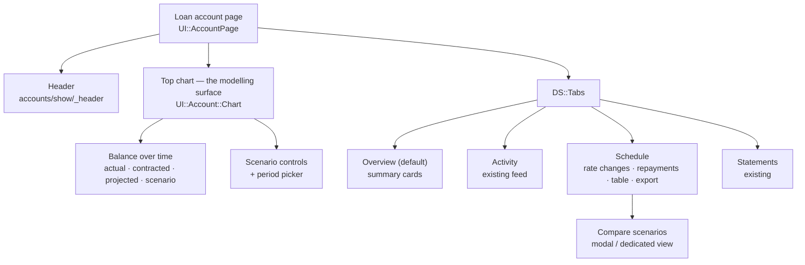

## 7.2 User flows

### Flow A — Create a loan (P1 Priya)

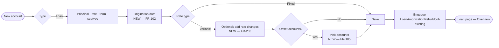

**Design note.** Rate changes and offsets are **progressive disclosure**, revealed only when
`rate_type == "variable"`. Priya never sees them. Use `DS::Disclosure` or a native
`<details>`/`<summary>` — CLAUDE.md Convention 3 prefers native HTML over JS components.

### Flow B — Model an extra repayment (P1 → P4)

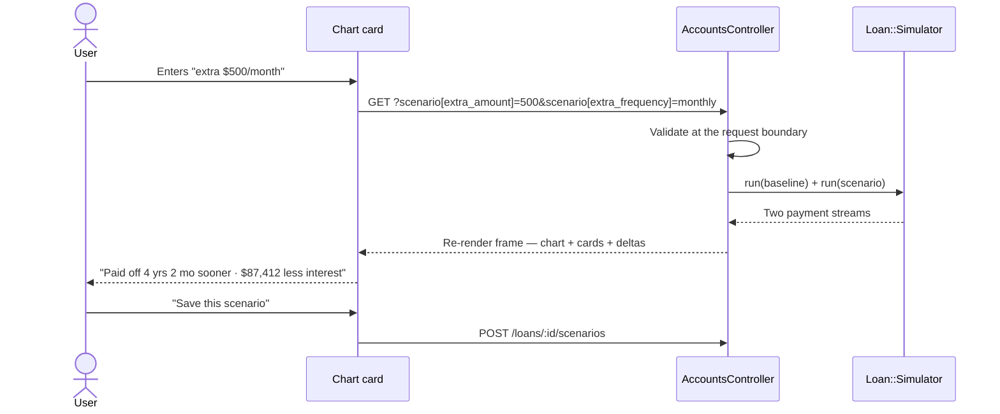

Auto-submit on change via the existing `auto_submit_form_controller.js` — the precedent is two lines
away in `chart.html.erb`, where the `chart_view` select already does exactly this.

### Flow C — Rate change arrives (P3 Sarah & Tom)

Lender letter → Schedule tab → "Add rate change" → `{5.93%, 30 May 2025}` → save → the bank-letter
table (FR-204) shows the new minimum repayment alongside the current one, and the chart's contracted
line re-renders through the change.

**The high-value moment:** a prompt offering *"Keep paying $2,719.04 instead of the new $2,651.07?"*
as a one-click scenario. This is the most valuable single interaction in the feature and it costs
almost nothing to build once scenarios exist.

### Flow D — Modify offset balance

The *actual* offset is read from linked accounts and needs no input. The flow is about the
**forward assumption** (FR-307): an "Assumed offset balance" field, defaulted to today's total,
with the assumption stated in plain words next to it.

### Flow E — Compare scenarios

Schedule tab → "Compare" → select baseline + up to 2 saved scenarios → side-by-side table + overlaid
chart lines. Use `DS::SegmentedControl` for scenario selection (it is explicitly documented as a
"filters / mode switches" control, not a tab widget).

## 7.3 Screens

| Screen | Location | Contents |
|---|---|---|
| **Loan Overview** (default tab) | `app/views/loans/tabs/_overview.html.erb` | Original amount · **Remaining loan balance** (FR-510) · Interest rate (+ "variable, next change 30 May") · **Monthly payment** (FR-405 — real number for variable loans) · Term · Type ("Variable + offset") · **Original payoff date** (FR-404) · **Projected payoff date** · Offset summary. Grid moves 3-col → 4-col at `md:`. |
| **Forecast surface** (top chart) | `app/components/UI/account/chart.*` | Multi-series chart + scenario controls + legend + period picker. |
| **Amortisation schedule** | `app/views/loans/tabs/_schedule.html.erb` | Summary cards · rate-change management (FR-203) + bank-letter table (FR-204) · extra-repayment management (FR-302/303) · payment table with rate-change highlighting · CSV export (FR-506). |
| **Comparison view** | New | Baseline + up to 2 scenarios; metric rows; deltas. |
| **Scenario editor** | New, `DS::Dialog` | Name · extra repayments · one-offs · assumed offset · optional rate override. |

## 7.4 States

| State | Trigger | Treatment |
|---|---|---|
| **Empty — no loan terms** | No rate or term | `DS::EmptyState`: *"Add your interest rate and term to see a repayment schedule."* CTA to edit. **Never show a chart drawn from partial data.** (`loan_tabs` already hides Schedule for non-amortisable loans.) |
| **Empty — no scenarios** | Loan valid, no saved scenarios | Inline prompt with one-tap presets: *+$100/mo · +$500/mo · round up to the next $100*. Removes the blank-input problem for P1. |
| **Empty — no rate changes** | Variable loan, none recorded | *"No rate changes recorded. Add one when your lender notifies you."* |
| **Loading** | Turbo frame in flight | Existing `bg-loader` token (`bg-surface-inset animate-pulse`) at chart height. Chart controllers already handle 0-width containers via `ResizeObserver`. |
| **Stale schedule** | `schedule_current? == false` | The API already reports `status: "stale"`. UI shows a subtle "Updating…" affordance — **never blank the page**; the read path never rebuilds inline by design. |
| **Error — non-convergence** | Payment ≤ interest (FR-206) | `DS::Alert` variant `warning`: *"At $X/month this loan doesn't reduce — the interest is $Y/month."* Offer the minimum payment that would clear it. **Never silently hide the card.** |
| **Error — balloon at term end** | Residual at maturity | *"$X will remain at the end of the term."* |
| **Validation** | Bad input | Inline field errors from existing model validations (`variable_rate_schedule_entries_are_valid` already produces good messages). Never coerce silently. |
| **Completed** | Balance ≤ 0 | Celebratory completed state; historical chart retained, no projection. |
| **Assumption disclosure** | Any derived figure | Persistent, translated note stating daily accrual on an actual/365 basis, the forward offset assumption, and principal-only balance (A1/A2/A3). |

## 7.5 Accessibility

- Every chart carries a **server-rendered, translated `sr-only` summary** with the same figures as
  the visible cards. #3's `aria_description` is the right pattern — extend it, don't replace it.
- **Ahead/behind is never colour-only** — always accompanied by words ("4 years sooner").
- Legend entries name the series in text.
- Form controls use real `<label>`s; the rate-change and repayment editors are keyboard-complete.
- Respect `prefers-reduced-motion` for any chart transition.

---

# 8. Visualisation Design

Everything below is buildable with **D3 v7 already in the project**. No new libraries (Convention 1).

## 8.1 Balance over time — the primary chart

**Location:** the account's top chart (`UI::Account::Chart`), branched for `Loan` accountables.
**Controller:** extend `loan_payoff_chart_controller.js` (PR #3) — already draws solid history plus
two independently-dated dashed forward lines, which is the hard part.

| Series | Style | Source | Condition |
|---|---|---|---|
| Actual balance (origination → today) | Solid, primary | `Account#balance_series` | Always |
| Balance net of offset | Solid, secondary weight | loan series − offset series | Offsets linked |
| Contracted schedule (full width) | Thin dashed, low contrast | `loan_amortizations.ending_balance` | Always |
| Projection from today | Dashed, green ahead / amber behind | `Loan::Simulator` | Converges |
| Scenario | Dashed, accent | `Loan::Simulator` + overrides | Scenario active |

**User value:** the gap between the solid actual line and the thin contracted line *is* the value of
every extra dollar already paid. It is the feature's single most persuasive pixel.

**Density.** Five series is at the edge of legibility in a 256px-tall chart. Mitigations, in order:
(a) offset and scenario lines are conditional, so the default is **three**; (b) the contracted line
is drawn thin and low-contrast — it is a reference, not a subject; (c) if density still bites,
make legend entries toggle series visibility.

**Required data:** dates + balances per series, payoff dates, today marker, currency,
pre-formatted labels, `ahead` boolean, a11y description. See `LoanChartPayload` (§10.5).

## 8.2 Interest vs. principal composition

**Chart:** stacked bars, one per year of the loan.
**Existing library:** `bar_chart_controller.js`.
**User value:** makes front-loading viscerally obvious — year 1 is ~⅔ interest, year 25 is ~⅔
principal. This is the chart that changes behaviour for P1.
**Data:** yearly aggregates of `principal_payment` / `interest_payment`, available directly from the
persisted `loan_amortizations` rows (baseline) or the simulator (scenario).

## 8.3 Scenario comparison

**Chart:** grouped horizontal bars (payoff duration) + a metric table.
**Existing library:** `bar_chart_controller.js` + `DS::Card`.
**User value:** direct answer to "which plan is better", in the two units people actually feel —
**time** and **total interest**.
**Data:** per scenario — payoff date, term months, total interest, total repayments, monthly cost.

## 8.4 Payoff timeline

**Visual:** a horizontal milestone strip (origination → today → projected payoff → contracted
payoff), with the saved span highlighted between the two payoff markers.
**Existing library:** plain SVG/HTML with design tokens; no chart library needed.
**User value:** compresses the whole story into one glanceable band — good for the Overview tab and
for a future dashboard widget.

## 8.5 Offset contribution (P1 / FR-406)

**Visual:** a sparkline of offset balance over time (`DS::Sparkline` exists) plus a single figure:
*"Saved $4,120 in interest over the last 12 months."*
**Data:** offset balance series + the interest differential between an offset run and a no-offset run
of the same period — a by-product of the engine, free once §11 exists.

## 8.6 Chart implementation standards

- **Colours from design tokens.** `loan_payoff_chart_controller.js` currently hardcodes `#ffffff` /
  `#171717` / `rgba(255,255,255,0.15)` behind an `isDark` check (D6). New series colours belong in
  `design/tokens/sure.tokens.json`; run `npm run tokens:build`, **commit the JSON and
  `_generated.css` together, and bump the root `$version` minor** (additive). Remember the README's
  alpha gotcha: `/N` works on `color.*`, silently no-ops on `utility.*` — use `opacity-N` there.
- **Dates parsed component-wise** (`parseLocalDate`), not `new Date(str)`, which parses `YYYY-MM-DD`
  as UTC midnight and shifts days west of Greenwich. Both existing chart controllers already do this.
- **Redraw triggers:** `ResizeObserver` (0-width on Turbo restore), `MutationObserver` on
  `data-theme`, and `turbo:render` / `turbo:frame-load`. All three are already implemented in #3 —
  keep them.
- **All formatting server-side.** The chart receives pre-formatted currency and date strings
  (CLAUDE.md Convention 3, and the pattern `Goal#projection_payload` already follows).
- **Legend becomes a ViewComponent.** With 3–5 entries of variable visibility it is past the
  "primarily static HTML" bar for a partial; the current inline-`style=` `<ul>` in
  `_schedule.html.erb` goes.

---

# 9. Technical Architecture

## 9.1 Architecture diagram

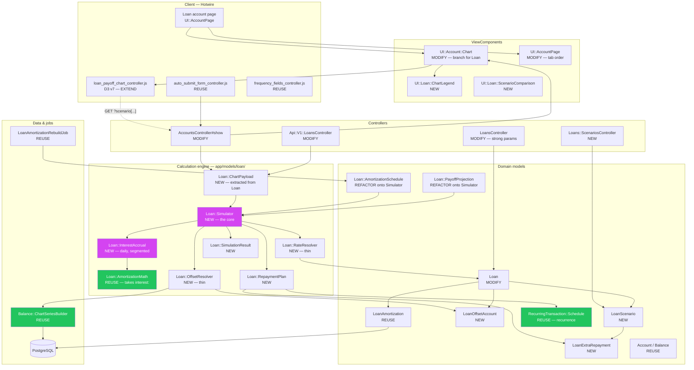

**Legend:** purple = the new core · green = significant existing reuse.

**Reuse ratio.** Of ~18 architectural elements, 8 are reused unchanged, 4 are refactored in place,
and 6 are new — and of the new ones, four (`RateResolver`, `OffsetResolver`, `RepaymentPlan`,
`SimulationResult`) are small value objects, not subsystems.

## 9.2 Frontend design

| Component | Path | Status | Purpose |
|---|---|---|---|
| `UI::Account::Chart` | `app/components/UI/account/chart.{rb,html.erb}` | **Modify** | Branch the chart body: `loan-payoff-chart` for `Loan`, `time-series-chart` otherwise. Shell (title, figure, trend, period picker) unchanged. |
| `UI::AccountPage` | `app/components/UI/account_page.rb` | **Modify** | Loan tab order (FR-511). Keep PR #4's turbo-frame fix in `render_schedule_tab`. |
| `UI::Loan::ChartLegend` | new | **New** | 3–5 entries, conditional visibility, optional toggles. |
| `UI::Loan::ScenarioComparison` | new | **New** | Metric table + delta formatting. |
| `UI::Loan::RateChangeTable` | new | **New** | The bank-letter table (FR-204). |
| `loan_payoff_chart_controller.js` | `app/javascript/controllers/` | **Extend** | 2 → up to 5 series; token colours; extended a11y description. |
| `auto_submit_form_controller.js` | existing | **Reuse** | Scenario controls submit on change. |
| `frequency_fields_controller.js` | existing | **Reuse** | Cadence-dependent field groups in the repayment editor. |
| `time_series_chart_controller.js` | existing | **Untouched** | Generic. Deliberately not taught about projections. |

## 9.3 Backend design

Per CLAUDE.md Convention 2 ("business logic in `app/models/`, avoid `app/services/`") — note this
deliberately departs from issue #3295's "AmortizationCalculator **service**" wording. PR #3296
already made this call correctly.

| Object | Path | Responsibility |
|---|---|---|
| **`Loan::Simulator`** | `app/models/loan/simulator.rb` | **The engine.** One period loop, resolver-driven. §11. |
| `Loan::SimulationResult` | `app/models/loan/simulation_result.rb` | Immutable result: payments, totals, payoff date, convergence status, balloon. |
| `Loan::RateResolver` | `app/models/loan/rate_resolver.rb` | `rate_for(date)`. Wraps `Loan#current_variable_rate`; constant for fixed. |
| `Loan::OffsetResolver` | `app/models/loan/offset_resolver.rb` | `offset_for(date)`. Historical from `Balance::ChartSeriesBuilder`; forward = flat/override. |
| **`Loan::InterestAccrual`** | `app/models/loan/interest_accrual.rb` | **Daily accrual over piecewise-constant segments (§6.2).** Holds `DAY_COUNT = 365`. Returns the interest charged for one period given the balance, rate and offset change points. |
| `Loan::RepaymentPlan` | `app/models/loan/repayment_plan.rb` | Materialises one-off + recurring extras into **balance change points**. Delegates recurrence to `RecurringTransaction::Schedule`. |
| `Loan::AmortizationMath` | existing | Per-period step. **+1 optional kwarg** for offsets. |
| `Loan::AmortizationSchedule` | existing | **Refactored** to configure the simulator. Public API unchanged. |
| `Loan::PayoffProjection` | existing | **Refactored**; fixed-rate gate removed. |
| `Loan::ChartPayload` | new | Serialisation extracted out of `Loan#payoff_chart_payload` (D8). |
| `Loan::CsvExporter` | new | FR-506. |
| `LoanAmortizationRebuildJob` | existing | **Unchanged.** |
| `Loan::ScheduleBackfillTask` | `lib/tasks/loans.rake` | Deploy-time rebuild after the `ALGORITHM_VERSION` bump (§16). |

## 9.4 Data flow

**Read path — loan page load:**

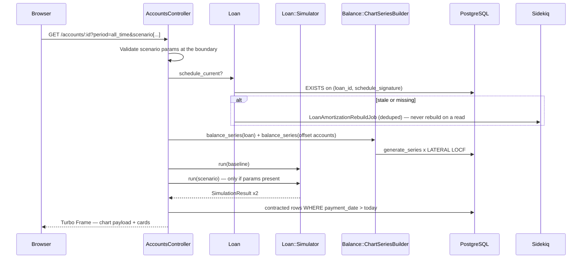

**Key invariant, inherited from #3296 and preserved:** *a read never writes.* Staleness is reported,
a rebuild is enqueued, and the read proceeds against what is persisted. This is why the read-scoped
API can never trigger a write.

**Write path — schedule rebuild:**

`Loan#save` → `amortization_inputs_changed?` → `LoanAmortizationRebuildJob.perform_later` (deduped)
→ `ensure_amortization_schedule_current!` → double-checked lock → `AmortizationSchedule` (now
simulator-backed) → `delete_all` + `insert_all!` in one transaction, stamped with the signature.

## 9.5 State management

Three tiers, matching the house pattern (§2.4):

| Tier | Storage | Lifetime | Contents |
|---|---|---|---|
| **Persisted contract** | `loans`, `loan_amortizations`, `loan_offset_accounts` | Permanent | Terms, rates, offsets, the contracted schedule |
| **Derived, cached** | `loan_amortizations` + `schedule_signature` | Until an input changes | The contracted schedule |
| **Derived, live** | In-memory per request | One request | Projection, scenario runs, chart payload |
| **Transient scenario** | **URL query params** | The URL | `scenario[extra_amount]`, `scenario[extra_frequency]`, `scenario[lump_sum][]`, `scenario[assumed_offset]`, `scenario[rate_override]` |
| **Saved scenario** | `loan_scenarios` + `loan_extra_repayments` | Until deleted | Named override sets (FR-408) |

**Invalidation:**
- Contracted schedule → SHA256 `amortization_schedule_signature` over `ALGORITHM_VERSION` + every
  contracted input. **Bump to 3** for this work (§16).
- Projection → `payoff_projection_signature`, currently `"#{schedule_signature}:#{account&.balance}"`.
  Must additionally include **offset account ids + their balances** and **today's date**, so a rate
  that becomes effective overnight is not served from a memo.
- Scenario runs → never cached; they are cheap (≤1200 iterations) and always derived from live state.

**Explicitly rejected:** client-side scenario state (localStorage / a JS store). It breaks the back
button, is unshareable, and duplicates financial logic into JS where it will drift from the Ruby.

---

# 10. Data Model Design

## 10.1 Existing entities to reuse

| Entity | Table | Reuse |
|---|---|---|
| `Loan` | `loans` | All existing columns. `variable_rate_schedule` jsonb already carries rate changes. |
| `LoanAmortization` | `loan_amortizations` | The contracted schedule, unchanged. |
| `Account` | `accounts` | Loan account + offset accounts. `classification` virtual column already separates asset/liability. |
| `Balance` | `balances` | Historical daily balances for both the loan and its offsets. |
| `RecurrenceRule` | `recurrence_rules` | **Pattern reuse**, not table reuse — it `belongs_to :recurring_transaction`. See §10.3 note. |
| `Goal` / `goal_accounts` | — | **Structural precedent** for `loan_offset_accounts`. |
| `Money`, `Series`, `Trend`, `Period` | POROs | Unchanged. |

## 10.2 Proposed new entities

Four new tables. Three are small joins/config; one (`loan_extra_repayments`) carries the real new
domain.

### `loan_offset_accounts` (FR-105)

Mirrors `goal_accounts` exactly.

```ruby
create_table :loan_offset_accounts, id: :uuid do |t|
  t.references :loan,    null: false, foreign_key: true, type: :uuid
  t.references :account, null: false, foreign_key: true, type: :uuid
  t.timestamps
end
add_index :loan_offset_accounts, [:loan_id, :account_id], unique: true
```

**No `offset_enabled` column on `loans`.** Offset is on iff `offset_accounts.any?`. Deriving it
removes a column, a migration, and a two-sources-of-truth bug class.

**Why `rate_type` gains no `variable_offset` value.** `rate_type` is consumed by `fixed_rate?`,
`variable_rate?` and `has_rate_changes?` — predicates about how interest is *rated*. Offset is
orthogonal to rating (a fixed loan can carry an offset). Adding a third enum value forces every one
of those predicates to learn a case for an unrelated property. The user-facing label
**"Variable + offset"** is composed at render time from `rate_type == "variable" && offset_accounts.any?`,
so the brief's wording is delivered without contaminating the enum.

### `loan_scenarios` (FR-408)

```ruby
create_table :loan_scenarios, id: :uuid do |t|
  t.references :loan, null: false, foreign_key: true, type: :uuid
  t.references :created_by_user, foreign_key: { to_table: :users }, type: :uuid
  t.string  :name,             null: false, limit: 100
  t.string  :currency,         null: false          # canonical: always the loan's currency
  t.decimal :assumed_offset_balance, precision: 19, scale: 4
  t.decimal :rate_override,          precision: 10, scale: 3
  # F8: the cap is a STRUCTURAL property, not a validation.
  t.integer :slot,             null: false          # 0..4
  # F7: reproducibility — what produced the numbers a user last saw.
  t.integer  :calculator_version, null: false
  t.datetime :last_calculated_at
  t.timestamps
end
# Five allocated slots per loan. A unique index makes the cap true under
# concurrency; a `position < 5` row check never did — five rows can all hold
# position 0, and model-level counting races.
add_index :loan_scenarios, [:loan_id, :slot], unique: true
add_check_constraint :loan_scenarios, "slot >= 0 AND slot <= 4",
  name: "chk_loan_scenarios_slot_range"
add_check_constraint :loan_scenarios,
  "rate_override IS NULL OR (rate_override >= 0 AND rate_override <= 100)",
  name: "chk_loan_scenarios_rate_override_range"
add_check_constraint :loan_scenarios,
  "assumed_offset_balance IS NULL OR assumed_offset_balance >= 0",
  name: "chk_loan_scenarios_offset_non_negative"
# NO unique index on (loan_id, name). Accounts are shared per-user
# (`account_shares`), so two household members can both see one loan. A unique
# name index turns a cosmetic collision between housemates into an error.
```

### Scenario semantics (F7)

Three questions the schema alone does not answer, decided here:

| Question | Decision |
|---|---|
| **Who can see a scenario?** | Anyone who can see the loan. Family-scoped, matching the `Goal` precedent (`family_id`, no `user_id`). `created_by_user_id` is attribution and display only, never access control |
| **Who can edit or delete one?** | **Shared household artifacts** — anyone who can see the loan can edit or delete any scenario on it, with the creator shown. A mortgage is a joint object and the alternative (author-locked drafts) blocks the common case of two people modelling together. The UI names the creator and warns before deleting someone else's |
| **Do saved results change over time?** | **Yes — deliberately. Scenarios are live estimates, not snapshots.** They recompute against the loan's current balance, rate and offset on every view. A scenario pinned to a stale balance is worse than useless: its whole value is answering "given where I am *now*, what if…". **The UI must label them as live** ("recalculated just now"), and `last_calculated_at` + `calculator_version` are stored so support can tell whether a figure a user is quoting came from a different engine version |

**Not persisted:** the simulation result itself. It is cheap to recompute (§11.6) and a stale
persisted result is a support liability, not an optimisation.

Precision matches the existing columns exactly: money `(19,4)` as on `accounts.balance`, rates
`(10,3)` as on `loans.interest_rate`.

### `loan_extra_repayments` (FR-302, FR-303)

```ruby
create_table :loan_extra_repayments, id: :uuid do |t|
  t.references :loan_scenario, null: false, foreign_key: true, type: :uuid
  t.string  :kind,      null: false           # "one_off" | "recurring"
  t.decimal :amount,    precision: 19, scale: 4, null: false
  t.date    :occurs_on                        # one_off only
  t.string  :frequency                        # recurring only
  t.integer :interval,  default: 1            # recurring only
  t.date    :starts_on
  t.date    :ends_on
  t.timestamps
end
add_check_constraint :loan_extra_repayments, "amount > 0",
  name: "chk_loan_extra_repayments_amount_positive"
add_check_constraint :loan_extra_repayments,
  "(kind = 'one_off'   AND occurs_on IS NOT NULL AND frequency IS NULL) OR " \
  "(kind = 'recurring' AND frequency IS NOT NULL AND occurs_on IS NULL)",
  name: "chk_loan_extra_repayments_kind_coherent"
add_check_constraint :loan_extra_repayments,
  "frequency IS NULL OR frequency IN ('weekly','fortnightly','monthly','quarterly','yearly')",
  name: "chk_loan_extra_repayments_frequency"
```

**Note on `RecurrenceRule` reuse.** The *recurrence resolution logic* in
`RecurringTransaction::Schedule` is reused (its constructor takes plain keywords and does not
require a `RecurringTransaction`). The *table* is not, because `recurrence_rules.recurring_transaction_id`
is `null: false`. Making it polymorphic is a larger, riskier change touching an unrelated, heavily
used subsystem — **defer it**. The columns above express the cadences this feature needs; if a third
consumer appears, that is the moment to generalise.

### `loans` — no schema change

`variable_rate_schedule` jsonb (default `{}`, not null) already carries rate changes, is already
validated (`variable_rate_schedule_entries_are_valid`), already normalised
(`quantize_variable_rate_schedule`), and is already in the schedule signature. **Keep the jsonb.**
A `loan_rate_changes` table would be more conventional but buys only per-row audit and ordering that
nothing currently needs. It is a clean future migration if that changes.

## 10.3 ER diagram

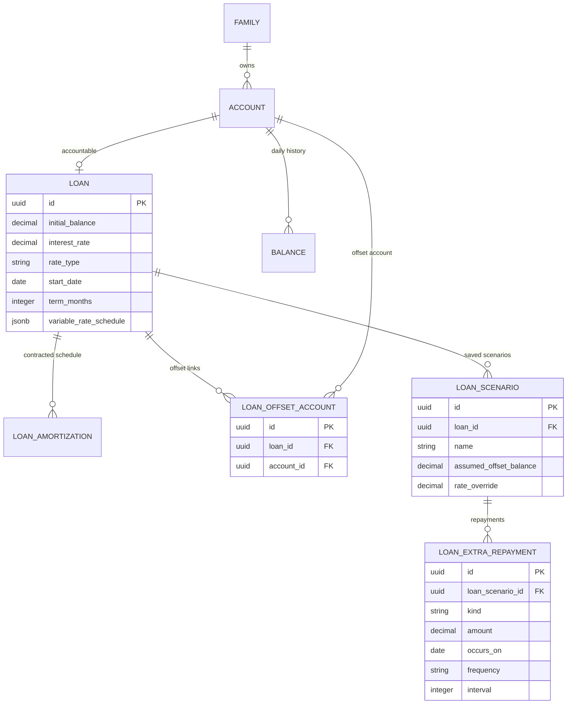

## 10.4 Payload contracts (TypeScript — documentation only)

> As stated at the top: **this repo has no TypeScript.** These interfaces describe the JSON that
> crosses the Ruby→Stimulus and Ruby→API boundaries. They are a specification artifact for
> reviewers and API consumers, not files to be created.

```ts
type ISODate = string;   // "YYYY-MM-DD" — parsed component-wise, never new Date(str)
type Decimal = number;   // serialised from BigDecimal at the boundary only

interface Loan {
  id: string;
  originalBalance: Decimal;
  currentBalance: Decimal;
  currency: string;
  interestRate: Decimal;
  rateType: "fixed" | "variable";
  termMonths: number;
  startDate: ISODate | null;
  variableRateSchedule: Record<ISODate, Decimal>;
  offsetAccounts: OffsetAccount[];
  hasOffset: boolean;                 // derived: offsetAccounts.length > 0
  displayType: string;                // "Fixed" | "Variable" | "Variable + offset"
}

interface OffsetAccount {
  id: string;
  name: string;
  balance: Decimal;
  currency: string;                   // MUST equal the loan's currency
}

interface AmortisationEntry {
  paymentNumber: number;
  paymentDate: ISODate;
  paymentAmount: Decimal;
  principalPayment: Decimal;
  interestPayment: Decimal;
  beginningBalance: Decimal;
  endingBalance: Decimal;             // invariant: === next.beginningBalance
  interestRate: Decimal;
  offsetBalance?: Decimal;            // present only for offset loans
  interestBearingBalance?: Decimal;   // max(0, beginningBalance - offsetBalance)
  extraPayment?: Decimal;             // scenario runs only
}

interface ExtraRepayment {
  id: string;
  kind: "one_off" | "recurring";
  amount: Decimal;
  occursOn?: ISODate;                                    // one_off
  frequency?: "weekly"|"fortnightly"|"monthly"|"quarterly"|"yearly";  // recurring
  interval?: number;
  startsOn?: ISODate;
  endsOn?: ISODate;
}

interface LoanScenario {
  id: string | null;                  // null for a transient URL scenario
  name: string;
  extraRepayments: ExtraRepayment[];
  assumedOffsetBalance?: Decimal;
  rateOverride?: Decimal;
}

interface SimulationResult {
  converged: boolean;                 // false => never pays off at this payment
  payments: AmortisationEntry[];
  payoffDate: ISODate | null;
  paymentCount: number;
  totalInterest: Decimal;
  totalRepayments: Decimal;
  balloonAmount: Decimal | null;      // residual at term end, if any
  monthsSavedVsBaseline: number | null;
  interestSavedVsBaseline: Decimal | null;
}
```

## 10.5 Chart payload contract

```ts
interface LoanChartPayload {
  today: ISODate;
  currency: string;
  originationDate: ISODate;
  actualHistory:        { date: ISODate; balance: Decimal }[];  // from `balances`
  offsetNetHistory?:    { date: ISODate; balance: Decimal }[];  // offset loans only
  contractedSchedule:   { date: ISODate; balance: Decimal }[];  // full width
  projection:           { date: ISODate; balance: Decimal }[];
  scenarioProjection?:  { date: ISODate; balance: Decimal }[];
  currentBalance:       { date: ISODate; balance: Decimal };
  contractedPayoffDate: ISODate | null;
  projectedPayoffDate:  ISODate | null;
  scenarioPayoffDate?:  ISODate | null;
  ahead: boolean;
  scenarioLabel?: string;             // e.g. "Modelling an extra $500 per month"
  offsetAssumptionLabel?: string;     // e.g. "Assumes offset stays at $85,000"
  labels: Record<string, string>;     // all i18n'd server-side
  ariaLabel: string;
  ariaDescription: string;            // carries the same figures as the visible cards
}
```

---

# 11. Calculation Engine Design

## 11.1 The problem it solves

Today there are **three near-duplicate period loops** (D1):

1. `AmortizationSchedule#generate_schedule` — original balance, origination date, rate *segments*, no offset, payment recomputed per segment
2. `PayoffProjection#generate_schedule` — current balance, next payment date, **one scalar rate**, no offset, payment held fixed
3. the same loop again with `extra_payment` added

Every capability in this brief wants another: offset-aware, one-off-repayment-aware,
recurring-repayment-aware, scenario-aware, and (later) interest-only. Adding them as branches is how
this file becomes unmaintainable and how a rounding fix gets applied in two places out of five.

**`Loan::Simulator` is one loop, parameterised by resolvers.** Every existing caller becomes a
configuration of it.

## 11.2 Inputs

```ruby
Loan::Simulator.new(
  # --- the four time/balance boundaries (C4, F3) — NOT two ---
  starting_balance:         Money,   # original_balance | account.balance
  starting_balance_as_of:   Date,    # the date that balance is true on
  accrual_start_date:       Date,    # first day interest accrues
  payment_schedule:         PaymentSchedule,  # contractual dates, month-end clamped (C4)

  term_months_remaining: Integer,   # horizon for re-amortisation and the iteration cap
  currency:              String,

  # --- resolvers: two rate clocks (C7/C8), change points not per-date values ---
  accrual_rate_for:       ->(date) { BigDecimal },        # Loan::RateResolver
  re_amortisation_events: ->(from, to) { [Date, ...] },   # payment dates that resize the payment
  offset_for:             ->(from, to) { [[date, Money], ...] },  # Loan::OffsetResolver
  extra_for:              ->(from, to) { [[date, Money], ...] },  # Loan::RepaymentPlan

  payment_strategy: :hold | :reamortize,
  base_payment:     Money | nil,            # required for :hold
  event_order:      Loan::Simulator::EVENT_ORDER   # C9, a constant — not a caller choice
)
```

Three design decisions carry the whole thing:

1. **Resolvers, not scalars.** A fixed loan is a constant-returning `rate_for`. A no-offset loan is a
   zero-returning `offset_for`. **The simple cases are the degenerate cases of the general one, not
   separate branches.** This is what removes D2 without a special case for variable loans.

   **`offset_for` and `extra_for` return change points over a date range, not a value per date.**
   This is what makes daily accrual (§6.2) cost the same as monthly: the engine accrues over
   piecewise-constant segments rather than iterating 30 days it already knows are identical. A
   flat forward offset yields one segment per period — exactly the old monthly loop. A busy
   historical month yields a handful. Getting this interface right is the difference between an
   elegant daily model and a 36,525-iteration one.
2. **`payment_strategy` is explicit.** `:hold` = "keep paying the same amount, finish sooner" (the
   effect of an extra payment — PR #2's semantics). `:reamortize` = "recompute the level payment when
   the rate changes" (what a lender does — the bank-letter behaviour, FR-204). Today this distinction
   is implicit in *which class you happen to be in*, which is why the projection cannot express a
   rate change.
3. **The engine never reads `Loan` directly.** It takes values and lambdas. That makes it testable
   with no fixtures, reusable for products that are not `Loan`, and impossible to accidentally
   couple to `account.balance` inside the contracted-schedule path (invariant A7).
4. **Time boundaries are explicit and separate.** `starting_balance_as_of`, `accrual_start_date` and
   `payment_schedule` are four distinct inputs, not one `starting_payment_date`. A live projection
   begun mid-cycle accrues a **stub period** from today to the loan's next contractual payment date;
   it does not re-anchor the calendar on today. Collapsing these is how you silently drop or
   double-count days (§6.1).
5. **Same-day event order is a constant, not a parameter.** `EVENT_ORDER` implements C9. Making it
   configurable would let two callers produce different numbers for the same loan.

## 11.3 Calculation pipeline

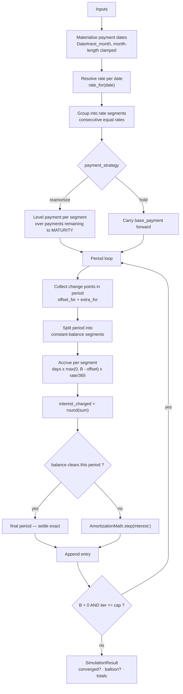

**Two guards that must not be lost:**

- **Convergence** (`converged?` from PR #2): a loop that exhausted its iteration cap while still
  owing money is **not** a payoff. Reporting the truncated last date as a "payoff date" would be a
  silently wrong financial figure. `SimulationResult#converged` makes this explicit rather than
  hiding the card (FR-206).
- **Balloon**: a run that reaches `term_months_remaining` with a residual balance reports
  `balloon_amount` (§6.8).

## 11.4 Extensibility

The seams, and what each one buys:

| Seam | Today | Future product it unlocks |
|---|---|---|
| `rate_for(date)` | Fixed constant / variable schedule | Introductory "honeymoon" rates, capped/collared rates, index-linked (BBSW + margin), **Monte Carlo rate paths** (§19) — a stochastic path is just a different lambda |
| `offset_for(date)` | Flat forward / historical from `balances` | Scheduled offset changes, partial-offset products, multiple offsets with different ratios |
| `extra_for(date)` | One-off + recurring | Redraw (negative extras), payment holidays, salary-cycle repayments |
| `payment_strategy` | `:hold` \| `:reamortize` | **`:interest_only`** (FR-107 — pay interest only until a switch date, then re-amortise), `:minimum_plus_percent`, `:fixed_term_target` (solve for the payment that hits a date) |
| `SimulationResult` | Payments + totals | Tax-deductible interest splits for investors (P2), fee schedules |

**Worked example — supporting an interest-only loan later.** No engine change: a
`payment_strategy: :interest_only` computes `payment_t = interest_t` until `io_end_date`, then
switches to `:reamortize` over the remaining term. The loop, the rounding, the offset handling and
the convergence guard are all unchanged. **That is the test of whether this abstraction is the right
one, and it passes.**

**Worked example — a non-`Loan` product.** Because the simulator takes values and lambdas rather than
a `Loan`, a `CreditCard` minimum-payment payoff calculator (§19) reuses it directly with
`payment_strategy: :minimum_plus_percent` and a different date generator.

## 11.5 Outputs

`Loan::SimulationResult` — immutable, memoised, no DB access:

| Member | Type | Notes |
|---|---|---|
| `payments` | `Array<Hash>` | Same shape `AmortizationMath.step` already returns, plus `offset_balance` / `interest_bearing_balance` / `extra_payment` when non-zero |
| `converged?` | Boolean | False ⇒ every date/total below is meaningless; **callers must check** |
| `payoff_date` | `Date \| nil` | |
| `payment_count` | Integer | |
| `total_interest` / `total_repayments` | `Money` | |
| `balloon_amount` | `Money \| nil` | |
| `compare_to(other)` | `Comparison` | months saved, interest saved, total-repayment delta |

## 11.6 Performance

- Bounded by `MAX_TERM_MONTHS = 1200` (model validation **and** a DB check constraint). A naïve
  daily loop would be ~36,525 iterations; the piecewise-constant segmentation in §6.2 collapses a
  flat-offset forward projection back to **one segment per period — 1200 iterations, as before.**
  A historical run with a busy offset account is a few thousand. Both are sub-10ms.
- **This is the load-bearing performance claim of the daily-accrual design. Benchmark it in L3**
  with a 30-year loan and an offset account carrying 30 balance changes a month, and fail the build
  if a full comparison request (4 simulations) exceeds ~50ms.
- A page load runs at most: contracted (from persisted rows, no simulation) + projection + one
  scenario = **2 simulations**. Comparison view: up to 4.
- The dominant cost is the **two `Balance::ChartSeriesBuilder` queries** (loan + offsets), which are
  the same queries the top chart already runs today.
- **Watch item:** `PayoffProjection#initialize` enqueues `LoanAmortizationRebuildJob` whenever the
  schedule is stale. Moving the projection to the top chart means *every* loan page view can enqueue.
  It is deduped via sidekiq-unique-jobs, so this is a note rather than a blocker — but verify the
  dedup window under real traffic.

---

# 12. API and Persistence Impact

## 12.1 Existing APIs affected

### `GET /api/v1/loans/:id/amortization_schedule` — extend

`app/controllers/api/v1/loans_controller.rb` + `app/views/api/v1/loans/amortization_schedule.json.jbuilder`.

**Contract preserved:** strictly read-only, never calls `ensure_amortization_schedule_current!`,
reports `status` (`current` / `stale` / `missing`), enqueues a rebuild when stale, paginates via
`limit` / `offset` with `MAX_PAGE`.

**Additions:**

```jsonc
{
  "loan": {
    "id": "…",
    "rate_type": "variable",
    "display_type": "Variable + offset",        // NEW
    "original_balance":  { "amount": "500000.00", "currency": "AUD" },
    "current_balance":   { "amount": "400762.12", "currency": "AUD" },
    "original_payoff_date": "2050-03-01",       // NEW — FR-404
    "current_minimum_payment": {                // NEW — FR-405
      "amount": "2719.33", "currency": "AUD",
      "rate": "6.180", "as_of": "2026-09-04"
    },
    "offset_accounts": [                        // NEW — authorisation-gated, see §13.2
      { "id": "…", "name": "Everyday", "balance": { "amount": "85000.00", "currency": "AUD" } }
    ],
    "offset_balance": { "amount": "85000.00", "currency": "AUD" }
  },
  "rate_changes": [                             // NEW — FR-204
    {
      "effective_date": "2025-05-30",
      "rate": "5.930",
      "projected_balance":        { "amount": "400762.12", "currency": "AUD" },
      "minimum_payment_before":   { "amount": "2719.33",   "currency": "AUD" },
      "minimum_payment_after":    { "amount": "2650.32",   "currency": "AUD" }
    }
  ],
  "payoff_projection": {                        // CHANGED — no longer null for variable loans
    "converged": true,
    "projected_payoff_date": "2044-11-01",
    "projected_total_interest": { "amount": "281044.10", "currency": "AUD" },
    "months_saved": 64,
    "interest_saved": { "amount": "118337.44", "currency": "AUD" },
    "balloon_amount": null,
    "assumptions": {
      "accrual": "daily",
      "day_count": "actual/365",
      "charged": "monthly",
      "offset_held_flat": true,
      "offset_balance": { "amount": "85000.00", "currency": "AUD" }
    }
  },
  "status": "current",
  "payments": [ /* unchanged, now with offset_balance / interest_bearing_balance */ ]
}
```

⚠️ **Breaking-ish change:** consumers that treat `payoff_projection: null` as "variable loan" will
now receive an object. Ship it as additive within `/api/v1`, note it in the OpenAPI description, and
mention it in release notes.

## 12.2 New APIs

| Method | Path | Purpose | Scope |
|---|---|---|---|
| `POST` | `/api/v1/loans/:id/simulate` | Run a transient scenario without persisting. Body = scenario overrides. | read |
| `GET` | `/api/v1/loans/:id/scenarios` | List saved scenarios | read |
| `POST` | `/api/v1/loans/:id/scenarios` | Create (max 5) | write |
| `PATCH` / `DELETE` | `/api/v1/loans/:id/scenarios/:scenario_id` | Update / delete | write |
| `GET` | `/api/v1/loans/:id/amortization_schedule.csv` | FR-506 export | read |

**`POST /simulate` is read-only despite being a POST** — the body carries a scenario too complex for
a query string. Enforce with `before_action :ensure_read_scope` and a test asserting no writes.
Rate-limit it (§13.3).

### Response hygiene (F9)

| Control | Where | Why |
|---|---|---|
| `Cache-Control: no-store` | Every loan API response and every CSV export | **Nothing in the app sets this today** — verified against `Api::V1::BaseController` and `ApplicationController`. Loan responses carry balances, rates and payoff dates; they must not sit in an intermediary or disk cache |
| `Referrer-Policy: same-origin` | The loan account page | Scenario parameters live in the query string (§9.5). Without this, a user clicking any outbound link leaks `?scenario[lump_sum]=44000` in the `Referer` header |
| Documented idempotent refresh | `GET .../amortization_schedule` | The endpoint reports `status` and **enqueues a rebuild when stale**. This is inherited from #3296, is deduped via sidekiq-unique-jobs, and is deliberate. **Document it as an idempotent refresh side effect** rather than re-architecting it — changing the contract diverges the fork from upstream for no user-visible gain |
| Version note | `payoff_projection` | It changes from `null` to an object for variable loans. Additive within `/api/v1`; note it in the OpenAPI description and the release notes, and give consumers one minor release of warning |

**Accepted trade-off — scenario parameters stay in the URL.** Tokenised, short-lived scenario
sharing was considered and deferred. The values in a scenario URL are *hypothetical* amounts, not
balances; URL state buys back-button correctness, shareability and alignment with the house pattern
(CLAUDE.md Convention 3); and `Referrer-Policy` plus `no-store` closes the majority of the exposure.
Revisit if an outbound "share this scenario" feature is ever built — that is when a token earns its
persistence and expiry handling.

**Example — request:**

```json
{
  "scenario": {
    "extra_repayments": [
      { "kind": "recurring", "amount": "500.00", "frequency": "monthly" },
      { "kind": "one_off",   "amount": "44000.00", "occurs_on": "2026-12-01" }
    ],
    "assumed_offset_balance": "85000.00",
    "rate_override": "5.930"
  }
}
```

**Example — response:**

```json
{
  "baseline": {
    "converged": true, "payoff_date": "2050-03-01", "payment_count": 277,
    "total_interest":   { "amount": "399381.54", "currency": "AUD" },
    "total_repayments": { "amount": "800143.66", "currency": "AUD" }
  },
  "scenario": {
    "converged": true, "payoff_date": "2039-07-01", "payment_count": 154,
    "total_interest":   { "amount": "201044.10", "currency": "AUD" },
    "total_repayments": { "amount": "601806.22", "currency": "AUD" },
    "balloon_amount": null
  },
  "comparison": {
    "months_saved": 123,
    "interest_saved":   { "amount": "198337.44", "currency": "AUD" },
    "repayment_delta":  { "amount": "-198337.44", "currency": "AUD" }
  },
  "assumptions": { "accrual": "daily", "day_count": "actual/365", "offset_held_flat": true }
}
```

**OpenAPI is mandatory** (CLAUDE.md): rswag specs in `spec/requests/api/v1/loans_spec.rb` and
`loan_scenarios_spec.rb` (docs-only, `run_test!`, API-key auth pattern), reusable schemas in
`spec/swagger_helper.rb`, then `RAILS_ENV=test bundle exec rake rswag:specs:swaggerize`. Behavioural
assertions go in Minitest under `test/controllers/api/v1/`, never in the rswag specs.

## 12.3 Data storage requirements

| Table | Rows/loan | Notes |
|---|---|---|
| `loan_amortizations` | ≤1200 | Existing. Bounded by the term check constraint. |
| `loan_offset_accounts` | 0–~5 | Trivial. |
| `loan_scenarios` | 0–5 (capped) | Trivial. |
| `loan_extra_repayments` | 0–~20 per scenario | Trivial. |

**Scenario results are never persisted.** They are cheap to recompute and stale results are worse
than no results.

## 12.4 Migration requirements

| # | Migration | Risk |
|---|---|---|
| 1 | `create_table :loan_offset_accounts` | None |
| 2 | `create_table :loan_scenarios` | None |
| 3 | `create_table :loan_extra_repayments` + 3 check constraints | None |
| — | *No `loans` change* | `variable_rate_schedule` and `start_date` already exist |
| **4** | **`AmortizationSchedule::ALGORITHM_VERSION` 2 → 3** | **Not a migration, but migration-scale.** It is the first element of `amortization_schedule_signature`, so every persisted schedule invalidates and rebuilds. Rebuilds are lazy-on-read plus a background enqueue, so on a large instance this is a **burst of jobs triggered by page views**. **Ship `rake loans:rebuild_schedules` and run it at deploy.** |

**Rollback:** the three new tables drop cleanly (all data is user-created config). Reverting
`ALGORITHM_VERSION` to 2 triggers one more rebuild cycle back to the old numbers. No destructive
data migration anywhere in this feature.

---

# 13. Security and Privacy

## 13.1 Data sensitivity

Loan terms, balances and offset balances are among the most sensitive data in the product — they
reveal income, wealth, property ownership and financial distress. Existing protections apply
unchanged: family scoping, `Current.user.accessible_accounts`, session auth for web, OAuth/API-key
with scopes for API, and the `privacy-sensitive` CSS class the top chart already carries (used by
`privacy_mode_controller.js` to blur figures).

**New surfaces to cover:**
- Chart payloads carry a full balance history in a `data-*` attribute → must inherit
  `privacy-sensitive`.
- **CSV export (FR-506) is a new data-egress path.** Authorise per request, never guess the family
  from the loan id, and set `Content-Disposition: attachment` with a safe, non-user-controlled
  filename.

## 13.2 Offset visibility — the shared-input policy

**Offset accounts are separate `Account` records**, and Sure has per-user account sharing
(`account_shares`, `accounts.owner_id`, `Account.accessible_by`, `Current.user.accessible_accounts`).
A user with access to a loan does **not** automatically have access to an account linked as its
offset.

### Why suppressing the field is not sufficient

An earlier draft proposed gating the API's `offset_accounts` array on the accessible set while still
using the balance in the aggregate the loan owner is entitled to. **That does not work, and the
reasoning is worth stating because it is easy to get wrong twice.**

The offset balance is *recoverable by inference* from figures the user can legitimately see. Given
the loan balance, the rate, the payment and the projected payoff date, solving for the offset is
arithmetic — it is the same closed form the engine uses, run backwards. The leak channels are:

- the projected payoff date and months-saved figure
- interest saved, and FR-406's "your offset saved you $X"
- the chart's offset-net line, and the delta between it and the gross line
- any scenario result, and the CSV export
- the API's `payoff_projection` object

Suppressing the *name and amount* while publishing *any* of those discloses the balance to within a
few hundred dollars. There is a second, worse path: a household member with broader access could
link **their private account** as an offset on a shared loan, creating a disclosure route that did
not previously exist and that the account's own sharing settings never authorised.

### The policy — shared input

> **An account may be linked as an offset only if every user who can access the loan can also
> access that account.**

This is enforced at the boundary — the link — rather than at every output, which means every
downstream surface (page, chart, scenario, comparison, API, CSV, background job) is safe *by
construction* and needs no conditional suppression logic.

| Aspect | Behaviour |
|---|---|
| **Link creation** | Validate that `loan_account.accessible_by_user_ids ⊇ offset_account.accessible_by_user_ids`… **inverted**: every user who can see the loan must be able to see the offset. Reject otherwise, with a message naming the shortfall — *"Everyday Account isn't shared with everyone who can see this loan."* |
| **Offset picker** | Only offers accounts satisfying the rule for **this** loan — not merely `Current.user.accessible_accounts` |
| **Loan access granted later** | A new user gaining loan access can invalidate an existing link. **Re-validate on grant**, and either block the grant with an explanatory message or prompt to unlink. This must be a deliberate product choice, not an incidental one |
| **Offset access revoked later** | Same trigger, opposite direction. Re-validate on revoke; the link becomes invalid and the loan reverts to non-offset math with a visible notice, rather than silently continuing to use a balance the household can no longer all see |
| **Outputs** | **No conditional suppression anywhere.** Anyone who can see the loan can see every offset-derived figure, because they can see the offset itself |
| **API** | `offset_accounts` returns names and balances unconditionally — the link's existence is already the proof of entitlement |

### Rejected: the restricted-output policy

The alternative — permit the link, but hide offset-aware outputs from users lacking access — was
considered and rejected. It preserves flexibility for households with genuinely private accounts,
but it requires conditional calculation and conditional rendering on **every** surface, doubles the
state matrix for charts and scenarios, and puts the burden on remembering to suppress rather than on
a single validated invariant. One missed surface is a silent leak. The shared-input policy makes the
same guarantee with one check.

**The trade-off, stated plainly:** a household where one partner keeps a private account cannot use
that account as an offset. Given the alternative is a leak class that is easy to reintroduce with
every new surface, that is the right trade.

### Tests required

- Link permitted when all loan-accessible users can see the offset; rejected when one cannot
- Granting a new user loan access re-validates existing links
- Revoking offset access invalidates the link and the loan reverts to non-offset math with a notice
- No surface — page, chart payload, saved scenario, comparison, API, CSV, background job — emits an
  offset-derived figure to a user who cannot see the offset account

## 13.3 Validation & abuse

| Vector | Mitigation |
|---|---|
| Unbounded simulation (huge term / tiny payment) | `MAX_TERM_MONTHS = 1200` (model + DB check) and `MAX_ITERATIONS_MULTIPLIER × term_months` cap the loop. Already in place — **do not remove during the refactor.** |
| Scenario-param injection via query string | Validate at the request boundary: frequency allowlist, positive numeric amounts, date parseable and within a sane window, rate 0–100. Malformed input falls back to baseline **silently** rather than 500-ing. PR #4 already does exactly this — carry it forward. |
| `POST /simulate` as a CPU amplifier | Rate-limit via the existing Rack::Attack config; cap `extra_repayments` array length (~20); reject payloads over a size limit. |
| Scenario-count exhaustion | Hard cap 5/loan, enforced in the model **and** the database. |
| Mass-assignment via `variable_rate_schedule` | **Do not permit a free-form jsonb hash.** Accept a structured array of `{effective_date, rate}` pairs and assemble the hash in the model. A `permit!`-shaped jsonb param is a Brakeman finding waiting to happen. |
| XSS via scenario name | Scenario names are user text rendered in labels and chart legends. Rails escapes by default — **do not `html_safe` them**, and do not interpolate them into the `data-*` JSON without escaping. |
| CSV injection | A scenario name starting with `=`, `+`, `-` or `@` becomes a formula in Excel. Prefix such cells with `'` in the exporter. |

## 13.4 Financial calculation integrity

Users will make six-figure decisions on these numbers. Integrity is a security property here, not
just a quality one.

- **`BigDecimal` throughout**; fix the `Float` in `PayoffProjection#generate_schedule`.
- **Assumptions are disclosed, always** — daily actual/365 accrual, flat forward offset, principal-only
  balance, monthly-equivalent sub-monthly cadences (A1–A6). Not in a tooltip; in visible copy.
- **Never present a projection as a guarantee.** Copy says "projected", "estimated", "assumes".
- **Never silently truncate.** A non-converging simulation says so (FR-206).
- **No advice.** Sure presents arithmetic ("this saves $X"), never recommendations ("you should pay
  down rather than invest"). Crossing that line is a regulatory question in most jurisdictions —
  this is why pay-down-vs-invest is out of scope (§4.2).
- **A visible "how we calculate this" explainer** linking to the methodology. Cheap; disproportionate
  trust value.

---

# 14. Analytics and Success Metrics

**Existing infrastructure:** the `posthog-ruby` gem is in the `Gemfile`; `config/initializers/posthog.rb`
builds a `$posthog` client when `POSTHOG_KEY` is set; the browser snippet renders from
`app/views/layouts/shared/_head.html.erb` **only when `Rails.env.production?` and a key is
configured**.

⚠️ **Finding: there are currently no server-side `$posthog.capture` call sites anywhere in
`app/` or `lib/`.** Analytics today is client-side autocapture only. This feature would be the first
deliberate server-side instrumentation, so it needs a **thin `capture` wrapper** that no-ops when
`$posthog` is nil — otherwise every self-hosted instance raises `NoMethodError`. That wrapper is a
prerequisite, not an afterthought.

**Privacy constraints:** never send amounts, balances, rates or account names. Send **buckets and
counts** only. Self-hosted instances must be unaffected.

## 14.1 Events

| Event | Properties (bucketed only) | Answers |
|---|---|---|
| `loan_created` | `rate_type`, `has_offset`, `subtype`, `term_bucket`, `has_start_date` | Which loan products do users actually hold? |
| `loan_rate_change_added` | `is_increase`, `days_until_effective_bucket` | Is the rate-change surface being used? |
| `loan_offset_linked` | `offset_account_count` | Offset adoption |
| `loan_scenario_generated` | `scenario_type` (recurring / one_off / offset / rate), `is_transient` | Core engagement metric |
| `loan_extra_repayment_added` | `kind`, `frequency`, `amount_bucket` | Which modelling shapes matter? |
| `loan_scenario_saved` | `scenario_count` | Do transient scenarios convert to saved ones? |
| `loan_comparison_viewed` | `scenario_count` | Is comparison worth its build cost? |
| `loan_schedule_exported` | `format` | Is CSV (FR-506) worth maintaining? |
| `loan_chart_period_changed` | `period` | Validates the FR-501 all-time work |
| `loan_projection_unavailable` | `reason` (non_convergent / stale / not_amortizable) | **Quality signal — a spike means a calculation regression** |

That last one is the most operationally valuable event in the list: it is a production canary for
the engine.

## 14.2 KPIs

| KPI | Definition | Target (first 90 days) |
|---|---|---|
| **Adoption** | % of families with ≥1 loan who view the loan page | 60% |
| **Modelling activation** | % of loan viewers who generate ≥1 scenario | **25%** — *the headline metric; it is the difference between a chart and a tool* |
| **Scenario persistence** | % of scenario generators who save one | 30% |
| **Return engagement** | % who generate a scenario in ≥2 distinct weeks | 20% |
| **Config completeness** | % of variable loans with ≥1 rate change recorded | 40% |
| **Offset adoption** | % of variable loans with a linked offset | 25% (AU-skewed cohorts higher) |
| **Behavioural (aspirational)** | % of scenario generators whose actual balance later beats the contracted line | Track, don't target — it is the feature's true north |
| **Quality** | `loan_projection_unavailable` rate | **< 2%** |

## 14.3 Instrumentation notes

- Server-side capture for domain events (creation, linking, saving) — reliable, ad-blocker-proof.
- Client-side for interaction events (period changes, comparison views).
- Bucket every numeric: `amount_bucket` as ranges, never the amount.
- Gate everything behind `Rails.configuration.x.posthog.api_key.present?`.
- Add a `loan_amortisation_v1` feature flag for staged rollout (PostHog supports flags; the client
  snippet already exposes `getFeatureFlag`).

---

# 15. Testing Strategy

**Framework:** Minitest + fixtures. **Never RSpec or factories** (CLAUDE.md). rswag specs under
`spec/requests/api/` are documentation-only — `run_test!`, no `expect`/`assert`. Keep fixtures
minimal (2–3 per model); build edge cases inline in the test.

## 15.1 The gate on the whole plan

> **Characterisation test, written *before* the S1 refactor.**
> For a fixed-rate, no-offset loan, `Loan::Simulator`'s output must be **byte-identical** to today's
> `AmortizationSchedule#generate_schedule` — every field of every row.

This is the safety net for everything else. Real users have persisted schedules; a silent change to
their numbers is the worst outcome this project can produce. Write it first, keep it forever.

## 15.2 Unit tests — `Loan::Simulator`

| Area | Cases |
|---|---|
| Level payment | i > 0; i = 0 (`P/n`); n = 1; matches `AmortizationSchedule#monthly_payment` |
| Rate resolution | Fixed constant; single change; multiple changes; change before first payment; two changes in one month; change after maturity (ignored) |
| Segmentation | Payment recomputed at each boundary **over payments remaining to maturity, not segment length** (regression test for the existing fix) |
| Payment strategy | `:hold` keeps the payment and shortens the term; `:reamortize` changes the payment and holds the term |
| Offset | Reduces interest, not balance; term shortens; offset ≥ balance ⇒ zero interest; offset = 0 ⇒ identical to no-offset |
| Extra repayments | One-off on an exact payment date; one-off between dates (applies to the next); recurring monthly; recurring weekly → monthly equivalent; both together; extra > remaining balance (capped) |
| Convergence | Payment ≤ interest ⇒ `converged? == false`, no fabricated payoff date; payment marginally > interest ⇒ converges within the cap |
| Balloon | Residual at maturity is reported |
| Dates | Jan 31 → Feb 28/29 → Mar 28/29 (`next_month` clamping); leap years |
| Rounding | `ending_balance[t] == beginning_balance[t+1]` for every t; final period lands exactly on 0; JPY (precision 0); **interest accumulates unrounded and rounds only at the charge point** |
| **Daily accrual** | 31-day month accrues more than a 28-day month at the same balance and rate; a full year of daily accrual reconciles with `balance × annual_rate` to the cent; leap year accrues 366/365 (asserted, so nobody "fixes" it) |
| **Accrual segmentation** | An offset moving mid-period pro-rates by day count; N segments give the same total as an N-day loop over the same balances (**equivalence test — this is what licenses the optimisation**); offset ≥ balance for part of a period zeroes only those days |
| **Offset sensitivity** | +$50,000 into the offset today shortens the projected payoff; removing it restores the original date; a 1-day deposit saves ~1/30 of a month's offset benefit, not a full month's |
| **Fortnightly repayments** | 26 half-payments beat 12 full payments of the same annual total — the difference is non-zero and in the right direction (**it was structurally invisible under monthly accrual**) |

## 15.3 Financial accuracy tests

| Test | Assertion |
|---|---|
| **Bank-letter reproduction** | `P = 400,762.12`, 6.18%, n = 277 → **$2,719.33** and 5.93%, n = 279 → **$2,650.32**, each within **±$1.00** of the lender's $2,719.04 / $2,651.07. Comment must explain why cent-exactness is unattainable. |
| Textbook 30-year | $300,000 @ 6.5%, 360 months → payment ≈ $1,896.20; total interest ≈ $382,633 |
| Zero-interest | $12,000 @ 0%, 12 months → exactly $1,000/month, zero interest |
| Extra-payment magnitude | $300,000 @ 6.5%/360 with +$200/month → ≈ 5 years and ≈ $90,000 saved (sanity band, not an exact figure) |
| Offset magnitude | $500,000 @ 6% with a $100,000 offset → interest ≈ that of a $400,000 loan at the same payment |
| Cross-check | Simulator totals reconcile with an independent closed-form calculation for the fixed, no-offset, no-extra case — **to within the daily-vs-monthly accrual difference, which must itself be asserted rather than hand-waved** |
| **Offset worth** | $500,000 @ 6% with $100,000 held in offset for a full year saves ≈ $6,000 in interest (`100,000 × 6%`) — a figure a user can check on the back of an envelope |
| **Accrual basis** | Daily total over a full year at a constant balance equals `balance × annual_rate` exactly (365/365), confirming `DAY_COUNT` is applied consistently |

## 15.4 Integration tests

- `Loan#save` with a changed rate → signature changes → rebuild job enqueued (existing behaviour, must survive)
- `ALGORITHM_VERSION` bump → all schedules stale → `schedule_current? == false`
- Offset account balance change → projection signature changes → projection recomputes (**this is the D2-era bug class: a memoised projection served against a moved balance**)
- Removing the last offset link → loan reverts to non-offset math, no data loss
- Deleting an offset **account** → `loan_offset_accounts` row cascades; the loan still computes
- Deleting a loan → scenarios and repayments cascade
- Scenario cap: the 6th create is rejected in the model **and** at the DB

## 15.5 Controller / API tests

- Malformed scenario params (bad frequency, negative amount, non-numeric, half-complete pair) → silently ignored, baseline rendered, **no 500** (PR #4 has these — carry forward verbatim)
- A scenario request mutates **nothing**: `account.balance` and the `loan_amortizations` count unchanged (PR #4 has this — carry forward verbatim)
- `POST /simulate` with a read scope succeeds and writes nothing
- **Authorisation: a user without access to an offset account cannot see its name/balance via the loan API** (§13.2)
- Read-scoped API never triggers a write, even with a stale schedule
- Variable loan now returns a non-null `payoff_projection`
- CSV export authorises, and escapes leading `=`/`+`/`-`/`@` in scenario names

## 15.6 UI / system tests

**Sparingly** (CLAUDE.md). Three only:

1. Loan page renders with the chart and Overview as the first tab
2. Entering an extra repayment updates the chart and the summary cards
3. Adding a rate change updates the bank-letter table

Retarget PR #3's `test/system/loan_payoff_chart_test.rb` to the new chart location rather than
writing a new one. **Do not** test the D3 drawing itself.

## 15.7 Edge-case scenarios worth naming

| Scenario | Expected |
|---|---|
| Loan created today, no balance history | Chart seeds from the origination point; single history point; no crash |
| Balance already 0 | Completed state; no projection; no divide-by-zero |
| Balance > original (capitalised interest / redraw) | "Behind schedule"; projection still runs; no negative months-saved formatting bug |
| Offset > loan balance | Zero interest; loan clears at the payment amount; terminates |
| Rate 0% + offset | No crash on `monthly_rate.zero?` with a non-zero offset |
| 100-year term (1200 months) | Completes inside the iteration cap; no timeout |
| Rate change dated in the past | Already reflected in persisted rows; not double-counted |
| Two rate changes on the same date | Last write wins (`add_variable_rate_change` merge semantics) |
| Offset account in a different currency | **Validation error at link time**, never a silent conversion |
| Family currency ≠ loan currency | Figures shown in loan currency with the existing converted-display pattern |
| Scenario named `=cmd()` | CSV-escaped on export; HTML-escaped in the DOM |
| Concurrent rebuild + read | Reader never sees a delete/insert gap (existing `with_lock` behaviour — regression only) |

---

# 16. Risks and Mitigations

Every **High** or **Critical** risk below carries an owner, a trigger, and a release gate in §17.6.
The register is re-reviewed at each milestone exit — a risk register that outlives the design it
describes is worse than none, and this one has already been stale once (R6).


| # | Risk | Category | Likelihood | Impact | Mitigation |
|---|---|---|---|---|---|
| R1 | **The S1 refactor silently changes existing users' persisted schedule numbers** | Calculation | Medium | **Critical** | The characterisation test (§15.1) is a **hard merge gate on S1**. Written before the refactor, not after. |
| R2 | **Users treat projections as guarantees and make real decisions on them** | Misunderstanding | **High** | High | Assumption disclosure in visible copy everywhere (§13.4); "projected/estimated" language; a "how we calculate this" explainer; never present advice |
| R3 | `ALGORITHM_VERSION` bump causes a rebuild burst via page views | Performance | Medium | Medium | Ship + run `rake loans:rebuild_schedules` at deploy; verify sidekiq-unique-jobs dedup window (§12.4) |
| R4 | **Offset sign inversion** in `ChartSeriesBuilder` (`sign_multiplier` = −1 for liabilities) | Calculation | **High** | High | Explicit test asserting both series' signs before the subtraction (§6.5). This is the single easiest thing in the plan to get backwards |
| R5 | 4–5 chart series are illegible at 256px | UX | Medium | Medium | Conditional series ⇒ 3 by default; contracted line thin and low-contrast; legend toggles as the escape hatch (§8.1) |
| R6 | **Day count or rate-change timing diverges from the user's lender** | Calculation | Medium | Medium | *(Supersedes the earlier "monthly accrual" risk — daily accrual is now P0, FR-309.)* `actual/365` and the C7/C8 two-clock rule are both behind named seams; **both verified against a real statement before M1 ships** (A2, A6, gate G2) |
| R7 | **Offset account data leaks to a user who can't access that account** | Security | Medium | **High** | Gate the picker and the API array on `Current.user.accessible_accounts`; explicit tests both ways (§13.2) |
| R8 | Scenario complexity overwhelms P1 (Priya) | UX | Medium | Medium | Progressive disclosure; one-tap presets (+$100/mo, +$500/mo, round up); the default view needs **zero** configuration |
| R9 | Engine abstraction is over-designed for current needs | Complexity | Low | Medium | Validated against a concrete future case: interest-only requires **no engine change** (§11.4). If that stopped being true, the abstraction would be wrong |
| R10 | Account-scoped all-time changes charts for **all** account types | Regression | **Closed** | — | **Mitigated by scope (F11):** the change is isolated to the loan chart path in v1. The generalised version is proposed separately, upstream, with its own fixtures and sign-off |
| R11 | Fork diverges from `we-promise/sure` and becomes unrebaseable | Process | Medium | High | Keep changes inside the loan feature's blast radius; contribute S1 upstream early; don't opportunistically refactor unrelated files |
| R12 | Non-convergence is silently hidden, so a user sees no card and no reason | Misunderstanding | Medium | High | FR-206 makes it an explicit, translated state. **The current `applicable?` gate would hide it — this is a real defect in #2's design, not a hypothetical** |
| R13 | `variable_rate_schedule` strong params permit a free-form jsonb | Security | Medium | Medium | Accept structured `{effective_date, rate}` pairs; assemble in the model (§13.3). Brakeman will flag the lazy version |
| R14 | Interest-only loans requested on day one by investor users (P2) | Extensibility | Medium | Medium | Out of scope, but the `payment_strategy` seam is designed for it; it is §19 item 1 |
| R15 | Scenario URLs grow unwieldy with several one-off repayments | UX | Low | Low | Cap transient one-offs at ~5; beyond that, prompt to save the scenario |
| **R16** | **Daily accrual changes every persisted number for every existing loan** | Calculation | **Certain** | High | Deliberate (§6.2). It rides L5's existing `ALGORITHM_VERSION` bump and backfill so it happens **once**, not twice. #L2's characterisation tests must be re-baselined *deliberately and reviewed*, not silently updated — that re-baseline is the highest-scrutiny diff in the project |
| **R17** | **`ChartSeriesBuilder`'s interval feeds monthly points into a daily accrual** | Calculation | Medium | **High** | Silent and plausible-looking when wrong. Accrual reads `balances` directly; only the chart uses the series builder (§6.6). Assert the accrual path never calls the builder |
| **R18** | Day count convention differs from the user's lender | Calculation | Medium | Medium | `actual/365` behind a named constant with a seam. **Verify against a real statement before M1 ships** (A2) |
| **R19** | Projected payoff date visibly drifts over the salary cycle as the offset oscillates | Misunderstanding | **High** | Medium | This is correct behaviour, not a bug — but it will generate support questions. Disclose it (*"based on your offset balance today"*) and show the 12-month offset range alongside |
| **R20** | **Re-baselined characterisation tests pin a new defect** | Calculation | **High** | **Critical** | Characterisation is a *refactor* gate; it cannot tell you the new model matches a lender. **An independent financial-validation gate (G2) is required before daily accrual releases** — real statement reconciliation plus an independently implemented reference calculation |
| **R21** | **Daily accrual ships ahead of the schedule rebuild**, so the payment table shows monthly-accrual rows beside daily-accrual cards | Calculation | **High** (if not merged) | High | Accrual, `ALGORITHM_VERSION`, backfill, monitoring and rollback are **one release unit** (L3b), never separate merges |
| **R22** | Offset balance inferred from payoff date / interest saved by a user who cannot see the offset account | Security | Medium | **High** | Closed structurally by the shared-input policy (§13.2), not by output suppression |
| **R23** | Scenario cap bypassed under concurrent creation | Correctness | Low | Low | Unique `(loan_id, slot)` index makes the cap structural. Low likelihood, cheap correct fix |

---

# 17. Implementation Plan

## 17.1 Files to modify

| Path | Reason |
|---|---|
| `app/models/loan.rb` | Offset + scenario associations; `current_minimum_payment` (FR-405); extract `payoff_chart_payload` into `Loan::ChartPayload` (D8); extend `payoff_projection_signature` with offsets + date |
| `app/models/loan/amortization_schedule.rb` | Refactor onto `Loan::Simulator`; **public API unchanged**; `ALGORITHM_VERSION` 2 → 3 |
| `app/models/loan/payoff_projection.rb` | Refactor onto the simulator; **remove the `fixed_rate?` gate** (D2); fix `Float` → `BigDecimal`; correct `unamortizable_payment?` to use the per-period rate and the interest-bearing balance |
| `app/models/loan/amortization_math.rb` | Takes a pre-computed `interest:` from `Loan::InterestAccrual` instead of deriving it from a monthly rate; keeps the principal / rounding / final-period logic |
| `app/models/account/chartable.rb` | Account-scoped all-time period (FR-501, D5) |
| `app/components/UI/account/chart.rb` + `.html.erb` | Branch the chart body for `Loan`; host the scenario controls |
| `app/components/UI/account_page.rb` | Loan tab order (FR-511); **keep** PR #4's `render_schedule_tab` frame fix |
| `app/controllers/accounts_controller.rb` | Generalise `extra_payment_params` → `scenario_params` (one-offs, assumed offset, rate override) |
| `app/controllers/loans_controller.rb` | Permit `start_date` (FR-102), structured rate changes (FR-203), offset account ids (FR-105) |
| `app/controllers/api/v1/loans_controller.rb` | New payload fields (§12.1); `Cache-Control: no-store` (F9) |
| `app/views/loans/_form.html.erb` | Origination date; rate-change editor; offset picker (progressive disclosure) |
| `app/views/loans/tabs/_overview.html.erb` | Original payoff date (FR-404); real monthly payment for variable loans (FR-405); "Variable + offset" type; rename (FR-510) |
| `app/views/loans/tabs/_schedule.html.erb` | Remove the relocated chart + inline legend; add rate-change table, repayment management, CSV export |
| `app/views/api/v1/loans/amortization_schedule.json.jbuilder` | New fields |
| `app/javascript/controllers/loan_payoff_chart_controller.js` | 2 → up to 5 series; **token colours** (D6); extended a11y description |
| `config/locales/views/loans/en.yml` | All new strings (FR-508) |
| `config/locales/views/components/en.yml` | FR-510 rename **value** (not the key) |
| `config/routes.rb` | Scenario + simulate + CSV routes |
| `design/tokens/sure.tokens.json` + `_generated.css` | New series colours; **bump `$version` minor**; commit both together |
| `spec/swagger_helper.rb` | New reusable schemas |
| `test/**` | Extend existing loan tests; carry PR #4's no-mutation tests forward verbatim |

## 17.2 New files to create

| Path | Purpose |
|---|---|
| `app/models/loan/simulator.rb` | **The engine** (§11) |
| `app/models/loan/interest_accrual.rb` | **Daily accrual over piecewise-constant segments; holds `DAY_COUNT`** (§6.2) |
| `app/models/loan/simulation_result.rb` | Immutable result + `compare_to` |
| `app/models/loan/rate_resolver.rb` | `rate_for(date)` |
| `app/models/loan/offset_resolver.rb` | `offset_for(date)` — historical + forward |
| `app/models/loan/repayment_plan.rb` | Materialises extras; delegates recurrence to `RecurringTransaction::Schedule` |
| `app/models/loan/chart_payload.rb` | Chart serialisation extracted from `Loan` (D8) |
| `app/models/loan/csv_exporter.rb` | FR-506 |
| `app/models/loan_offset_account.rb` | Join model + validations |
| `app/models/loan_scenario.rb` | Named scenario, cap 5 |
| `app/models/loan_extra_repayment.rb` | One-off / recurring |
| `app/controllers/loans/scenarios_controller.rb` | Scenario CRUD (web) |
| `app/controllers/api/v1/loan_scenarios_controller.rb` | Scenario CRUD (API) |
| `app/components/UI/loan/chart_legend.{rb,html.erb}` | Legend component |
| `app/components/UI/loan/rate_change_table.{rb,html.erb}` | Bank-letter table (FR-204) |
| `app/components/UI/loan/scenario_comparison.{rb,html.erb}` | Comparison view (FR-409) |
| `app/views/loans/scenarios/*` | Scenario editor (`DS::Dialog`) |
| `db/migrate/*_create_loan_offset_accounts.rb` | Migration 1 |
| `db/migrate/*_create_loan_scenarios.rb` | Migration 2 |
| `db/migrate/*_create_loan_extra_repayments.rb` | Migration 3 |
| `db/migrate/*_add_algorithm_version_to_loan_amortizations.rb` | Readable `algorithm_version` + `generated_at` columns — the signature digest cannot be queried or reported on (F4) |
| `docs/loans/calculation-contract.md` | Phase 0.5 decision record: §6.1 contract, offset policy, scenario semantics, release plan |
| `lib/tasks/loans.rake` | `loans:rebuild_schedules` backfill, batched and rate-limited; sampled dual-calculation report (§17.3) |
| `lib/analytics.rb` *(or similar)* | **`$posthog`-nil-safe capture wrapper** (§14) |
| `test/models/loan/simulator_test.rb` | Engine tests incl. the characterisation gate |
| `test/models/loan/interest_accrual_test.rb` | Day count, leap year, segmentation equivalence, offset sensitivity |
| `test/models/loan/offset_resolver_test.rb` | Sign-handling tests (R4) |
| `test/models/loan_scenario_test.rb` | Cap, cascade |
| `spec/requests/api/v1/loan_scenarios_spec.rb` | rswag docs |
| `docs/loans/methodology.md` | User-facing "how we calculate this" (R2) |

## 17.3 Recommended development order

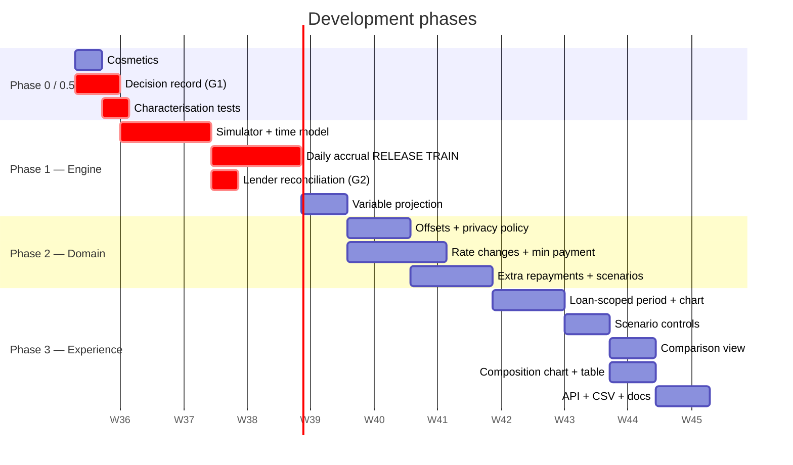

**Phase 0 — Cosmetics (3 days).** Tab order (FR-511), both renames (FR-510), original payoff date
(FR-404). Zero dependencies. **Ship it first**; it de-risks nothing else, so it costs nothing to
front-load.

**Phase 0.5 — Decision record (5 days). NEW, and it blocks the engine.** A time-boxed exercise, not
an open design phase — most of its content is decisions already recommended in this document,
needing sign-off rather than research. It produces one artifact, `docs/loans/calculation-contract.md`,
covering:

- §6.1's contract table, approved (C1–C16) — gate **G1**
- The offset visibility policy, approved (§13.2, shared-input)
- Scenario semantics: shared-household editing, live recompute (§10.2)
- The `ALGORITHM_VERSION` release, rebuild, rollback and reconciliation plan
- **Statement sourcing for G2 started** — it has a privacy/approval path and must not be discovered
  to be slow in M1's final week
- The §17.7 traceability table baselined

**L1 (cosmetics) and L2 (characterisation) run in parallel with Phase 0.5** — neither depends on
the contract.

**Phase 1 — Engine (5 weeks).** Characterisation tests **first**; then `Loan::Simulator` +
resolvers + the four time boundaries; then **the daily-accrual release train**; then variable-rate
projection.

> **The release train is one unit, and this is not negotiable (F4/R21).** Daily accrual,
> `ALGORITHM_VERSION`, the controlled backfill, monitoring and rollback merge and deploy **together**.
> Split across releases, a user sees a monthly-accrual payment table beside daily-accrual summary
> cards on the same screen — inconsistent numbers on a financial product, which is precisely the
> outcome this whole design exists to avoid. The train also carries the deliberate characterisation
> re-baseline, gated on **G2**.
>
> Release checklist, executed as part of the train:
> 1. Benchmark the rebuild and rate-limit it
> 2. Run a **sampled dual calculation** (old vs new) across a representative loan population and
>    review the variance distribution — a long tail is a defect signal, not noise
> 3. **Prebuild in controlled batches**, never by relying on page-view-triggered enqueues
> 4. Record `algorithm_version` and `generated_at` as readable columns on `loan_amortizations`,
>    alongside the existing `schedule_signature` (which bakes the version into a digest and so
>    cannot be queried or reported on)
> 5. Demonstrate rollback, and communicate any visible forecast change to users before it lands

**Phase 2 — Domain (4 weeks).** Offsets with the shared-input policy, rate-change UI + current
minimum repayment, extra repayments + scenarios.

**Phase 3 — Experience (5 weeks).** Chart consolidation, scenario controls, comparison view, the
interest-vs-principal chart, table enhancements, API + CSV + methodology doc.

## 17.4 Complexity assessment

| Workstream | Complexity | Why |
|---|---|---|
| Phase 0 cosmetics | **Low** | Locale values + an array order |
| `Loan::Simulator` + `InterestAccrual` | **High** | Financial correctness; daily accrual with segment optimisation; resolver interface (change points, not per-date values) must be right first time |
| Refactoring schedule + projection onto it | **High** | Touches persisted data via `ALGORITHM_VERSION` |
| Offset accounts | **Medium** | Model work is a known pattern (`goal_accounts`); the risk is sign handling (R4) and authorisation (R7) |
| Rate-change UI | **Medium** | Nested form over jsonb; the model layer already exists |
| `current_minimum_payment` | **Medium** | Formula is simple; correctness against real lender letters is the work |
| Extra repayments + scenarios | **Medium** | Standard CRUD; recurrence is reused, not written |
| Chart consolidation | **High** | Multi-series D3 + the account-scoped period change + a11y + tokens |
| Scenario controls | **Medium** | Reuses `auto_submit_form`; the design work is the hard part |
| Comparison view | **Medium** | Mostly presentation |
| API + OpenAPI | **Low–Medium** | Well-trodden path; mandatory rswag adds mechanical work |
| CSV export | **Low** | Plus injection escaping |

## 17.5 Release gates

No milestone ships until every gate below has **evidence attached to the relevant issue or PR**.
These are not checklists to tick; each names an artifact someone has to produce.

| Gate | Milestone | Evidence required | Owner |
|---|---|---|---|
| **G1 — Calculation contract approved** | M1 entry | §6.1's table signed off, and every row represented by at least one unit test | Eng lead + product |
| **G2 — Lender reconciliation** | **M1, before daily accrual releases** | At least one real, de-identified statement reconciled across a full cycle; plus a mid-cycle rate change, an offset movement and an extra repayment; plus an **independently implemented** reference calculation for the fixed/no-offset case. Tolerances stated, every mismatch explained | Eng + finance reviewer |
| **G3 — Rebuild rehearsed** | M1 | `rake loans:rebuild_schedules` run on production-shaped data, timed, with queue-depth and failure thresholds recorded and a rollback path demonstrated | Eng + ops |
| **G4 — Offset privacy verified** | M2 | Shared-input policy tested across link, grant, revoke, page, chart payload, saved scenario, comparison, API, CSV and background jobs | Eng + security reviewer |
| **G5 — Scenario authorisation & concurrency** | M2 | Slot-cap concurrency test; edit/delete authority tests; live-recompute labelling verified | Eng |
| **G6 — Accessibility** | M3 | Chart controls keyboard-operable and an equivalent **accessible data representation** — a real tabular alternative, not only screen-reader prose | Eng + designer |
| **G7 — API & CSV hygiene** | M3 | `no-store` and `Referrer-Policy` verified by test; versioning note published; CSV injection escaping tested | Eng |
| **G8 — Scope agreement** | Each milestone | The §17.7 traceability table has exactly one status per FR, and issue/PR counts reconcile with the dependency graph | Eng lead |

**On G2 specifically.** This is the gate that did not exist in the first draft, and its absence was
the sharpest finding in review. Characterisation tests (L2) protect the *refactor*; once
deliberately re-baselined for daily accrual they will preserve a new defect just as faithfully as
correct behaviour. **Only an independent oracle can tell you the daily model matches a lender**
(R20). Sourcing a de-identified statement has a privacy and approval path — start it in Phase 0.5,
not the week before M1.

### 17.5.1 Definition of done

*Normative. Added after the tranche-1 gate review; kept inside §17.5 so existing
citations to "§17.5 DoD" resolve. Mirrored in `CONTRIBUTING.md` and the pull
request template.*

Every change in this epic is complete only when the following evidence is
available in the issue or pull request:

1. The change maps to one issue and one reviewable pull request.
2. The relevant calculation-contract rows and named tests are linked, and the
   full test suite passes.
3. Financial changes include targeted boundary, rounding, sign, and
   conservation tests; mutation evidence is recorded where the gate requires
   it.
4. Fixtures and generated test data use documented token-shaped allowlists and
   pass internal-consistency checks before the application suite runs.
5. Security-sensitive changes include domain/service-layer authorization tests
   and adversarial cases, not only controller or UI coverage.
6. Performance-sensitive changes include production-shaped workload details,
   p95/p99 measurements, and the applicable release threshold.
7. The issue, design record, API documentation, release evidence, and gate
   status agree; unresolved external approvals are named explicitly rather
   than represented as passing evidence.

### 17.5.2 Gate evidence rules

*Added after the tranche-2 gate review.*

1. A gate test counts only once it has been **observed to fail**. The PR body carries the
   mutation output.
2. A contract row counts as covered only when the named test exists **and fails when that
   behaviour changes**, and when the name in this document matches the name in
   `config/loan_contract_tests.yml`.
3. A calculation gate is met only when the **production read path executes the code the gate
   measures**.
4. A fixture cited as an oracle is **fed to the engine**, not merely validated for shape.
5. A gate whose threshold or measurement is changed is **amended on its own issue, in the same
   PR** that changes it.
6. A stacked branch is not "merged". State the target branch, and do not report a tranche as
   validated until the **integrated tip** has a green run.

## 17.6 Engineering effort estimate

Revised after architecture review. One engineer, including tests, i18n and review cycles.

| Phase | Effort | Was |
|---|---|---|
| Phase 0 — cosmetics | 3d | 3d |
| **Phase 0.5 — decision record** | **5d** | *(new)* |
| Phase 1 — engine, release train, reconciliation | 5 wk | 4 wk |
| Phase 2 — domain (incl. offset privacy policy) | 4 wk | 3 wk |
| Phase 3 — experience (incl. FR-504/505) | 5 wk | 4 wk |
| **Total** | **95 engineer-days ≈ 19 weeks** | 76d / 15 wk |

**With two engineers: ~12 weeks.** Note Engineer B is blocked for most of the first two sprints —
nothing but L10 and design work can start before the engine exists. Use it for Phase 0.5 and G2
statement sourcing; do not invent parallel code work to fill it.

**This is up from the "+3 weeks" estimated when the review first landed.** The overrun is Phase 0.5,
the G2 reconciliation gate, the release-train engineering, the offset policy across all surfaces,
and FR-504/505 being confirmed in scope.

**Minimum viable slice — ~8 weeks:** Phase 0 + 0.5 + Phase 1 + offsets + the chart. Delivers
FR-401, FR-404, FR-405, FR-501, FR-502, FR-510, FR-511 and all offset requirements. Scenarios,
comparison and the composition chart are the deferrable half.

## 17.7 Traceability — one status per requirement

Exactly one status per FR. `MVP` = ships in M1–M3. Nothing is unaccounted for.

| FR | Requirement | Status | Milestone | Issue |
|---|---|---|---|---|
| FR-101 | Create a loan | MVP (exists) | — | regression |
| FR-102 | Origination date editable | MVP | M2 | L7 |
| FR-103 | Loan type selection | MVP | M2 | L6 |
| FR-104 | Edit without losing schedule integrity | MVP (exists) | M1 | L3b |
| FR-105 | Link offset accounts (shared-input) | MVP | M2 | L6 |
| FR-106 | Validate loan inputs | MVP (exists) | — | regression |
| FR-107 | Interest-only period | **Out of scope** | — | §19 #1 |
| FR-201 | Fixed rate | MVP (exists) | — | regression |
| FR-202 | Variable rate | MVP (exists) | M1 | L3 |
| FR-203 | Rate change management UI | MVP | M2 | L7 |
| FR-204 | Recomputed minimum on rate change | MVP | M2 | L8 |
| FR-205 | Rate-change history visible | MVP | M2 | L7 |
| FR-206 | Non-convergence surfaced | MVP | M1 | L4 |
| FR-301 | Contracted minimum | MVP (exists) | — | regression |
| FR-302 | Recurring extra repayment | MVP | M2 | L9 |
| FR-303 | One-off repayment (exact date, C6) | MVP | M2 | L9 |
| FR-304 | Scenarios never mutate real data | MVP | M2 | L9 |
| FR-305–308 | Offset interest behaviour | MVP | M2 | L6 |
| FR-309 | Daily accrual | MVP | M1 | L3b |
| FR-310 | Projection sensitive to offset balance | MVP | M2 | L6 |
| FR-311 | "Move money to offset" scenario | MVP | M3 | L12 |
| FR-401 | Projected payoff from actual balance | MVP | M1 | L4 |
| FR-402 | Total interest & repayments | MVP | M1 | L4 |
| FR-403 | Ahead/behind vs contracted | MVP | M1 | L4 |
| FR-404 | Original payoff date | MVP | M1 | L1 |
| FR-405 | Current minimum for variable loans | MVP | M2 | L8 |
| FR-406 | Offset interest saved | MVP | M3 | L11 |
| FR-407 | Transient scenario via URL | MVP | M3 | L12 |
| FR-408 | Saved named scenarios | MVP | M2 | L9 |
| FR-409 | Scenario comparison | MVP | M3 | L13 |
| FR-410 | Goal linkage | **Later milestone** | post-M3 | §19 #9 |
| FR-501 | Chart starts at origination (loan-scoped) | MVP | M3 | L10 |
| FR-502 | Chart shows actual progress | MVP | M3 | L11 |
| FR-503 | Modelling on the top chart | MVP | M3 | L12 |
| **FR-504** | **Interest-vs-principal composition** | **MVP** | **M3** | **L15** |
| **FR-505** | **Amortisation table enhancements** | **MVP** | **M3** | **L16** |
| FR-506 | CSV export | MVP | M3 | L14 |
| FR-507 | API parity | MVP | M3 | L14 |
| FR-508 | i18n | MVP | all | every issue's DoD |
| FR-509 | Accessibility | MVP | M3 | L11 + gate G6 |
| FR-510 | Rename to "Remaining loan balance" | MVP | M1 | L1 |
| FR-511 | Overview first tab | MVP | M1 | L1 |

**MVP: 41 of 43 requirements.** FR-107 (interest-only) is out of scope; FR-410 (goal linkage) is a
later milestone. Every other requirement has a milestone and an issue.

# 18. Pull Request Strategy

## 18.1 Disposition of the existing stack

| PR | Recommendation | Rationale |
|---|---|---|
| **#3296** (upstream) | **Merge as the base.** Unchanged. | The persistence, locking and invalidation foundation is sound and everything here builds on it |
| **#2** | **Rebase into PR-2 below**, don't merge as-is | Its `PayoffProjection` is being rewritten. Its `converged?` and read-path discipline carry forward |
| **#3** | **Close** with a pointer to PR-8 | The D3 controller is carried forward; the data source and location change. Reviewing it now spends attention on a diff that PR-8 rewrites |
| **#4** | **Close** with a pointer to PR-7 | Its `monthly_equivalent`, param validation and no-mutation tests carry forward verbatim. Its `render_schedule_tab` frame fix is **cherry-picked into PR-1 immediately** — it is an independent bug fix and should not wait |

Closing #3/#4 is not discarding the work; it is refusing to make reviewers read doomed code. Say
exactly that in the closing comment, and link the carrying-forward PR.

## 18.2 Proposed PR sequence

**20 PRs across 18 issues.** Target ≤400 changed lines each except where noted.

| # | Title | Issue | Depends on | Size |
|---|---|---|---|---|
| **0** | `docs(loans): calculation contract and decision record` | L0 | — | docs |
| **1** | `chore(loans): tab order, labels, original payoff date` | L1 | — | ~150 |
| **2a** | `test(loans): characterisation harness for amortisation output` | L2 | — | ~300 |
| **2** | `refactor(loans): extract Loan::Simulator` | L3 | 0, 2a | ~750 ⚠️ |
| **2b** | `feat(loans): daily interest accrual` | L3b | 2 | ~450 |
| **2c** | `chore(loans): algorithm version, batched backfill, rollout monitoring` | L3b | 2b | ~350 |
| **2d** | `test(loans): lender statement reconciliation` | L3c | 2b | ~250 |
| **3** | `feat(loans): variable-rate payoff projection` | L4 | 2c, 2d | ~400 |
| **4** | `feat(loans): offset accounts and shared-input visibility policy` | L6 | 3 | ~550 ⚠️ |
| **5** | `feat(loans): origination date and rate change management` | L7 | 3 | ~350 |
| **6** | `feat(loans): current minimum repayment and rate change table` | L8 | 5 | ~350 |
| **7a** | `feat(loans): scenario and extra repayment models` | L9 | 4 | ~400 |
| **7b** | `feat(loans): scenario CRUD and editor` | L9 | 7a | ~350 |
| **8a** | `feat(loans): loan chart starts at origination` | L10 | 4 | ~150 |
| **8b** | `feat(loans): payoff chart on the account page` | L11 | 8a | ~600 ⚠️ |
| **9** | `feat(loans): scenario modelling controls` | L12 | 7b, 8b | ~350 |
| **10** | `feat(loans): scenario comparison` | L13 | 9 | ~400 |
| **11** | `feat(loans): interest vs principal composition chart` | L15 | 8b | ~300 |
| **12** | `feat(loans): amortisation table enhancements` | L16 | 6, 8b | ~200 |
| **13** | `feat(api): loan scenarios, export, and response hygiene` | L14 | 10 | ~550 ⚠️ |

**PRs 2b and 2c merge and deploy together** as one release train (F4/R21) even though they are
separate reviewable diffs — 2c cannot be deferred to a later release, and 3 must not merge until
both have shipped and G2 has passed.

## 18.3 Dependency graph

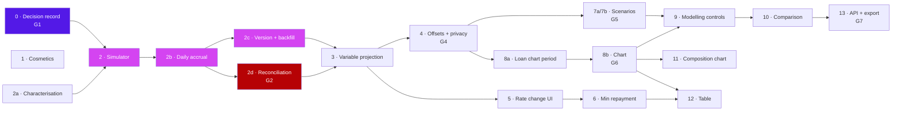

**Parallelisation:** PR-1 and PR-2a run alongside PR-0. After PR-3, `{4, 5}` are independent; after
PR-4, `{7, 8a}` are independent; PR-11 and PR-12 are independent of the PR-9→10→13 spine. Two
engineers converge at PR-9.

## 18.4 The three oversized PRs

PRs 2, 7 and 8 exceed the 400-line target. Each is justified, and each has a stated split option if
review stalls:

- **PR-2 (~700).** The simulator and the refactor of its first caller **must land together** — a
  simulator with no caller is untested abstraction, and a half-refactored `AmortizationSchedule` is
  worse than either end state. Splitting would create a reviewable-but-meaningless intermediate.
  *Mitigation:* land the characterisation tests as their own **PR-2a** first, so reviewers can see
  the safety net before the change it protects.
- **PR-7 (~600).** Three migrations plus CRUD. *Split option:* 7a = migrations + models + tests,
  7b = controllers + views.
- **PR-8 (~600).** The chart, the account-scoped period, and the payload rewrite are interlocked —
  each alone leaves the chart broken. *Split option:* 8a = account-scoped all-time period (a
  standalone improvement affecting all account types, worth its own review and its own before/after
  screenshots), 8b = the chart itself.

## 18.5 Review approach

| PR | Reviewers | Focus |
|---|---|---|
| 1 | 1 engineer | Locale keys; that the tab-order change updates its tests |
| **0** | Eng lead + product | Is every ambiguity in §6.1 resolved, or has one been deferred silently? |
| **2, 2b, 2c, 3** | **2 engineers, one with financial-modelling background** | **Correctness.** Does the characterisation test pin the old behaviour? `BigDecimal` throughout? Convergence guard intact? On 2b: segment-equivalence test present, re-baseline diff justified line by line? On 2c: dual-calculation variance reviewed, rollback demonstrated |
| **2d** | Eng + finance reviewer | Gate **G2** — does the model reconcile to a real statement, and is every mismatch explained rather than tolerated? |
| 4 | 1 engineer + 1 security-aware reviewer | **Sign handling (R4)** and the **shared-input policy across every surface** — link, grant, revoke, chart, scenario, API, CSV, jobs (G4, R22) |
| 5, 6 | 1 engineer | Strong params must not permit free-form jsonb (R13); bank-letter test present |
| 7 | 1 engineer | Cascades, the scenario cap enforced at both layers |
| 8 | 1 engineer + 1 designer | Chart legibility (R5), a11y equivalents, token usage |
| 9, 10 | 1 engineer + 1 designer | Does P1 (Priya) understand this without configuring anything? |
| 11, 12 | 1 engineer + 1 designer | Composition chart legibility; table rate-change highlighting |
| 13 | 1 engineer | OpenAPI regenerated; rswag has no assertions; CSV injection escaped; `no-store` and `Referrer-Policy` verified by test (G7) |

**Extended definition of done (F12).** Green tests and clean linters do not prove a safe financial
rollout. Beyond the per-PR gate below, a PR touching `area:calculation` additionally requires: the
relevant §6.1 contract rows cited in its tests; for the release train, G2 and G3 evidence linked;
for offset surfaces, G4 evidence linked; and a post-deploy review scheduled with the monitoring
dashboards named (queue depth, failed rebuilds, stale schedules, calculation variance).

**Per-PR gate (CLAUDE.md, non-negotiable):** `bin/rails test` · `bin/rubocop -f github -a` ·
`bundle exec erb_lint ./app/**/*.erb -a` · `bin/brakeman --no-pager` · `npm run lint` ·
`RAILS_ENV=test bundle exec rake rswag:specs:swaggerize` (PR-11).

**Upstream contribution:** PRs 0, 1, 2, 3 and 5 are general improvements to Sure, not fork-specific.
Offer them upstream as they land — it keeps the fork rebaseable (R11) and builds the credibility
that makes the later, more opinionated PRs (offsets, scenarios) easier to land.

---

# 19. Future Enhancements

Ordered by value-to-effort. Items 1–3 are the natural next quarter.

| # | Enhancement | Value | Effort | Notes |
|---|---|---|---|---|
| **1** | **Interest-only periods** | **High** | Medium | The top gap. Common in AU investment loans (P2 Marcus) and in US construction loans. **No engine change** — `payment_strategy: :interest_only` (§11.4). The proof that the abstraction is right |
| **2** | **Refinance modelling** | **High** | Medium | Compare the current loan against a user-entered offer: new rate, new term, switching costs. P3's whole job. Mostly a scenario with a `rate_override` plus a fee input — the engine is already there |
| **3** | **True sub-monthly repayment cycles** | **High** | Medium | Daily accrual (now in v1, §6.2) already makes a fortnightly *extra* repayment exact. What remains is a loan whose **contracted** cycle is fortnightly or weekly rather than monthly — a change to `scheduled_payment_dates` and the level-payment formula's period, not to accrual |
| 4 | Fees (establishment, ongoing, discharge, break costs, LMI) | High | Medium | Needed for honest refinance comparison. Extends `SimulationResult` with a fee schedule |
| 5 | Scheduled offset changes | Medium | Low | Removes assumption A3's rigidity. `offset_for(date)` already accepts it — a UI-only change |
| 6 | Rate-change simulation ("what if rates rise 1%?") | Medium | Low | A `rate_for` lambda with a shock applied. Very cheap given §11; high perceived value in a rising-rate environment |
| 7 | Detect extra repayments from transactions | Medium | Medium | The data is already there. Needs a confirmation UX — a silent misclassification corrupts the projection (§4.2) |
| 8 | Cross-loan strategies (avalanche / snowball) | Medium | Medium | Engine already supports multiple loans; this is optimisation + UI |
| 9 | Goal integration | Medium | Low | "Redirect $500/mo from this paid-off loan into the house-deposit Goal." `Goal` and its projection already exist |
| 10 | Redraw facilities | Medium | Medium | Reversible extra repayments; a different balance semantic |
| 11 | Provider-sourced rate changes | Medium | High | Removes assumption A9's manual entry. Depends on provider capability |
| 12 | Investment-property scenarios | Medium | Medium | Tax-deductible interest splits, negative gearing. `SimulationResult` extension for P2 |
| 13 | **Monte Carlo rate forecasting** | Medium | High | For variable loans: distribution of payoff dates rather than a point estimate. `rate_for` accepts a stochastic path with no engine change; **the hard part is communicating uncertainty in the UI without either terrifying or falsely reassuring the user** |
| 14 | AI repayment recommendations | Medium | High | Sure has an assistant with a function-calling architecture (`app/models/assistant/function/`). ⚠️ **Regulatory care required** — §13.4's advice boundary applies with full force. Frame as "here are the arithmetic consequences of options you named", never "you should" |
| 15 | Amortising credit cards / BNPL | Low | Medium | Revolving credit; different structure but the same engine with a different date generator |
| 16 | Print/PDF amortisation schedule | Low | Low | Requested in #3295; CSV (FR-506) covers most of the need |
| 17 | Loan comparison across loans | Low | Low | "Which of my three loans should I attack first?" — a reporting view over existing data |

---

## Appendix A — Traceability

| Source requirement | Where addressed |
|---|---|
| Issue #3295 — amortisation schedules, variable rates, API, UI, CSV export | §2.2 (delivered by #3296), FR-203, FR-506, §12.1 |
| Issue #3332 — projection from actual balance, extra payments | FR-401, FR-302/303, §6.7 |
| Brief 1 — standard amortisation schedules | §6.2, FR-301 |
| Brief 2 — extra repayments | FR-302, §6.6 |
| Brief 3 — one-off repayment events | FR-303, §6.6 |
| Brief 4 — recurring extra repayments | FR-302 (reuses `RecurringTransaction::Schedule`) |
| Brief 5 — loan payoff forecasting | FR-401, §11 |
| Brief 6 — interest savings calculations | FR-402, FR-406, §6.7 |
| Brief 7 — comparison of repayment scenarios | FR-409, §8.3, §7.2 Flow E |
| Brief 8 — variable / fixed / variable + offset | FR-103, §6.4–6.5 |
| Daily accrual on offset balances (user correction) | FR-309, FR-310, FR-311, §6.2, §6.6, R16–R19 |
| Brief 9 — future extensibility | §11.4, §19 |
| Ask "chart starts at loan value on all time" | FR-501, §6 / D5 |
| Ask "chart reflects payments to date incl. offsets" | FR-502, FR-306, §6.5 / D3 |
| Ask "modelling on the top chart, third line" | FR-503, §8.1 |
| Ask "rename Principal Balance" | FR-510 / D7 |
| Ask "Overview first tab" | FR-511 |
| Ask "rate changes for variable loans" | FR-203 / D4 |
| Ask "offset selection for variable + offset" | FR-105, FR-103, §10.2 |
| Ask "Overview shows original payoff date" | FR-404 |
| Ask "Schedule shows projected payoff date" | FR-401 / D2 |
| Ask "variable monthly payment from current rate" | FR-405, FR-204, §6.3 worked example |

## Appendix B — Key codebase references

| Finding | Location |
|---|---|
| Loan model, signature invalidation, double-checked locking | `app/models/loan.rb` |
| Rate segmentation, `next_month` clamping | `app/models/loan/amortization_schedule.rb` |
| Per-period step (to gain `interest_bearing_balance:`) | `app/models/loan/amortization_math.rb` |
| Fixed-rate gate (D2) | `app/models/loan/payoff_projection.rb` — `applicable?` |
| Contracted-not-actual history (D3) | `app/models/loan.rb` — `payoff_chart_payload` |
| Family-scoped all-time (D5) | `app/models/period.rb` — `PERIODS["all_time"]` |
| Account-scoped start date to reuse | `app/models/balance/base_calculator.rb` — `calculation_start_date` |
| Multi-account series builder (offset history) | `app/models/balance/chart_series_builder.rb` |
| Join-table precedent for offsets | `app/models/goal.rb`, `goal_accounts` table |
| Recurrence engine to reuse | `app/models/recurring_transaction/schedule.rb`, `app/models/recurrence_rule.rb` |
| Chart component to branch | `app/components/UI/account/chart.{rb,html.erb}` |
| Tab order (FR-511) | `app/components/UI/account_page.rb` — `loan_tabs` |
| D3 controller to extend | `app/javascript/controllers/loan_payoff_chart_controller.js` |
| Look-and-feel reference | `app/javascript/controllers/goal_projection_chart_controller.js` |
| Server-computed payload precedent | `app/models/goal.rb` — `projection_payload` |
| Strong params gap (D4) | `app/controllers/loans_controller.rb` |
| Chart title label (FR-510) | `UI.account.chart.title.remaining_principal_balance` |
| Analytics infra (no server call sites yet) | `config/initializers/posthog.rb`, `app/views/layouts/shared/_head.html.erb` |
| Design token contract | `design/tokens/README.md`, `design/tokens/sure.tokens.json` |
| Conventions | `CLAUDE.md` |
