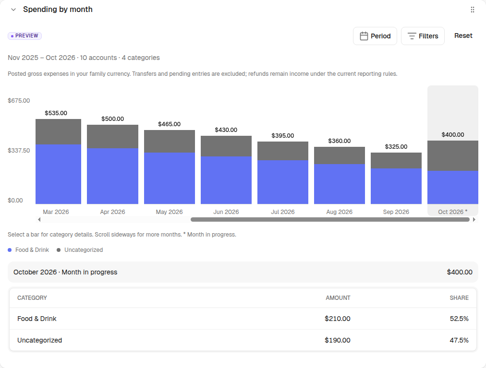
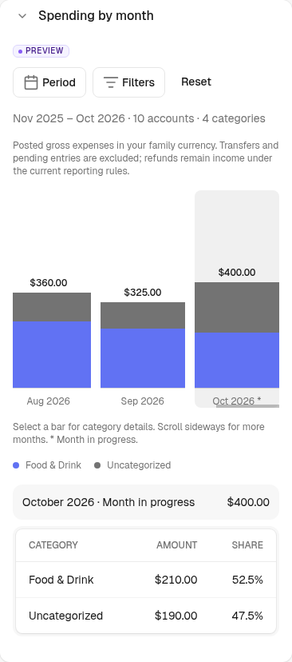
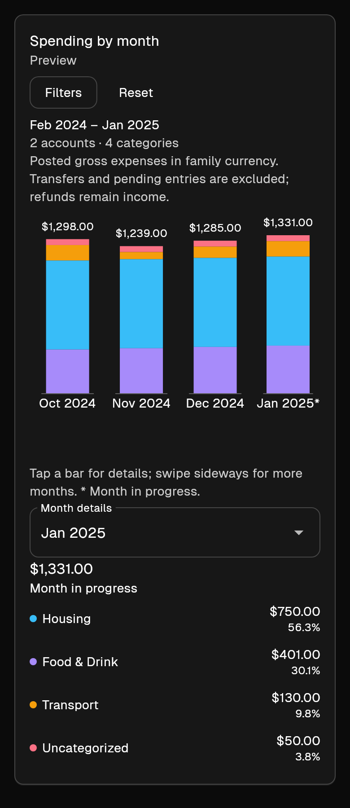
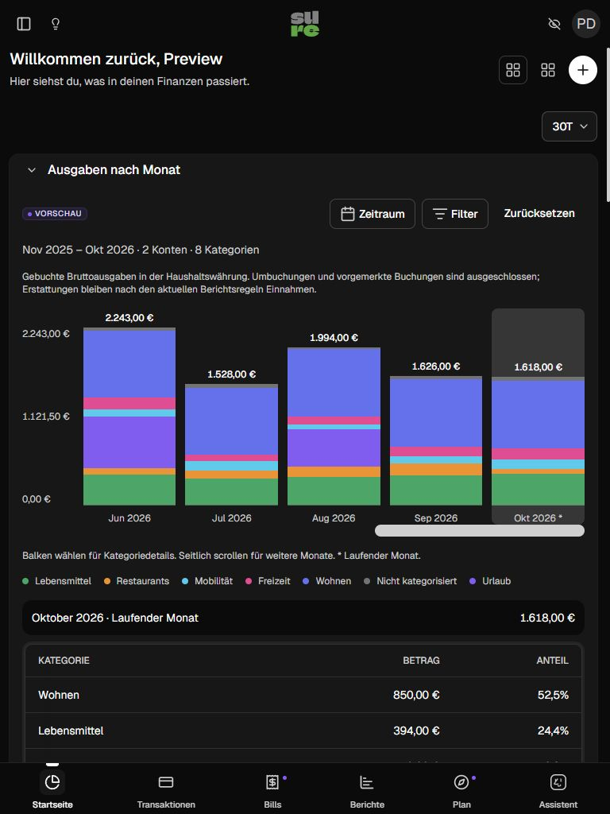

# feat(dashboard): add monthly spending for web and Flutter

## Summary

Adds a **Spending by month** Home block behind the existing personal preview toggle. Users can compare category spending across months, read exact totals above the stacked bars, and select a month to see category amounts and percentage shares. The same server aggregation powers responsive web and the Flutter Home card.

- Account and root-category filters, including uncategorized expenses and explicit empty selections.
- Last twelve months by default; rolling presets, calendar years and custom ranges up to 36 months. The current partial month is marked, and empty months remain visible.
- Month/year selectors with validation; invalid selections preserve the draft and never silently broaden access or reset to all accounts.
- Validated web filters saved per user in existing database preferences; Flutter filters saved locally per server/user. Reset restores defaults. These preferences are not synchronized between clients.
- Keyboard/touch selection, internal chart scrolling, privacy masking and localized category shares. Web EN/DE; existing Flutter EN/SV locales.

## Screenshots

Synthetic data only. Web images are actual rendered components captured by the browser tests and local preview. The Flutter image is rendered from the current widget with fixture data; it is **not a physical-device capture**. The two clients use different fixtures, so their amounts are illustrative.

Desktop web, light theme:

| Mobile web (390 px) | Flutter card (390 px) |
| --- | --- |
|  |  |

Tablet Home context, dark theme (768 px)

## Accounting and compatibility

`IncomeStatement::MonthlySpending` uses the existing user-scoped reporting predicates and family currency. It reports **gross expenses**: refunds remain income; pending/excluded entries, funds movement and credit-card transfers are omitted. Investment contributions and loan payments retain the current reporting classification. Missing FX rates preserve the existing fallback and explicitly mark affected results as provisional.

The additive `GET /api/v1/monthly_spending` endpoint requires read scope and the authenticated user's personal preview access, returns decimal strings, validates eligible account/category IDs, and uses `private, no-store`. It has Minitest behavioral coverage, documentation-only rswag specs and generated OpenAPI. Flutter hides the card for disabled preview access or older servers (403/404), handles retry/reset and prevents stale responses from replacing newer selections. Rolling native year presets use the freshly returned server date to recover from a month/year rollover or a device calendar ahead of the family. Any bounded correction preserves filter IDs and the original server/authentication context; the normal case uses one request.

No migration or new dependency. Hidden or disabled web blocks skip aggregation. The shared popover receives viewport positioning; its existing consumers passed the full browser suite. The existing Property test's bounded retry now also handles its reproduced Turbo menu-refresh race, retaining the final expected-value assertion.

## Validation

Checked on `main` base `aa22875d1`:

- [x] Full Rails: 11,093 tests, 47,108 assertions, no failures/errors; 34 existing skips.
- [x] Full browser suite: 240 tests, 1,194 assertions, no failures/errors/skips.
- [x] Full RuboCop, ERB (758 files) and Biome lint; changed DS controllers explicitly checked.
- [x] Brakeman: no errors/security warnings; nine existing ignored findings.
- [x] OpenAPI regenerated unchanged: 439 documentation examples, no failures, 89 documentation-only pending.
- [x] Format comparison: the same 73 existing files as pristine main, no new formatting failures.

- [x] Flutter: 204 tests; Web release build; analyze with CI's `--no-fatal-infos` (three existing infos).
- [x] Responsive preview at 320/390 px and 768 px, with no page overflow and reachable filter footer.
- [x] Synthetic screenshots inspected; no credentials or personal financial data.
- [ ] GitHub CI, including Android APK and unsigned iOS release build, before requesting review.
- [ ] Real-device/screenreader and large-dataset performance acceptance before broad rollout.

## Related work and follow-ups

Related to [#4002](https://github.com/we-promise/sure/pull/4002), which adds a net-spending comparison against normal on Reports. This PR provides a monthly Home timeline, shared API and Flutter card. Refund treatment is explicitly different. [#3609](https://github.com/we-promise/sure/pull/3609) proposes changes to investment/loan reporting semantics; those changes belong in the shared reporting layer.

Exact transaction drilldowns, year/month overlays, offline caching and synchronization of web/native filter preferences remain follow-ups. None is claimed as delivered here.
